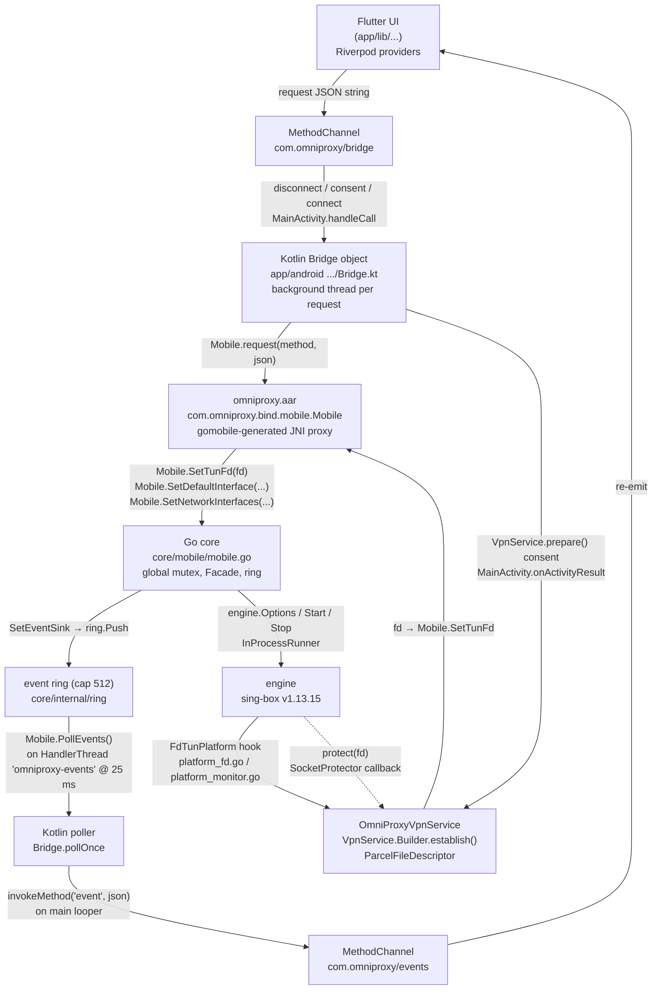

# Android Platform Layer

Status: Phase 1 (MVP) · Companion to `docs/ARCHITECTURE.md`, `docs/FLUTTER_GO_FFI.md`, `docs/VPN_INTERNALS.md`, `docs/platform-notes.md` (§Android).

This document covers the Android platform layer of OmniProxy in depth: the `VpnService`, the gomobile AAR binding, the Kotlin bridge glue, foreground services and notifications, the Keystore-backed secret store, lifecycle/rotation, and the manifest/permission model. Every claim is cited to source; where the code makes a design decision that is easy to miss, the *why* is explained.

## 1. Purpose & scope

Android is the reference mobile platform for OmniProxy (PRD lists Android first, `PRD.md:56`). The Go core is compiled with `gomobile bind` into `omniproxy.aar`, linked by Gradle, and invoked from Kotlin; Kotlin exposes the core to Dart over Flutter platform channels; and an `android.net.VpnService` lives entirely in the native layer — it establishes the TUN, hands the file descriptor to Go, and holds the connection until disconnect (`app/android/app/src/main/kotlin/com/omniproxy/omniproxy/OmniProxyVpnService.kt:15`).

Scope decisions that shape everything below (all verified against source):

- **Pure-transport bridges.** Kotlin `Bridge` and Dart `AndroidBridge` implement exactly the contract in `docs/api-contract.md` §5.1 and nothing else (`Bridge.kt:19-28`, `bridge_android.dart:8-16`). No platform business logic in the bridge.
- **Native service hosts the engine.** VPN mode runs the engine inside `OmniProxyVpnService`; proxy mode runs it in-process and uses `VpnProxyService` purely as the foreground notification host (`platform-notes.md:14-16`).
- **Polled, not pushed, events.** The core buffers events in a bounded ring; Kotlin drains it on a 25 ms timer and forwards each event to Dart (`api-contract.md:180`, `Bridge.kt:31`).
- **A passive interface monitor.** Because Android forbids netlink and the VpnService owns the TUN, the physical default interface is *fed into* Go from `ConnectivityManager` instead of being discovered by sing-box (`engine/platform_monitor.go:19-24`, `Bridge.kt:76-81`).
- **OS-native secrets.** Credentials and the at-rest data key live in Android Keystore (AES-256-GCM), never plaintext (`KeystoreSecretStore.kt:14-23`, `PRD.md:255`).

This doc does not re-derive the core state machine or engine internals; see §11 for the other docs.

## 2. Android architecture overview

The Android stack is a chain of four hops, each adding exactly one concern:

1. **Flutter (Dart)** — UI + `AndroidBridge` transport. Sends one JSON request per method; re-emits core events onto a broadcast stream.
2. **Kotlin `Bridge`/`MainActivity`** — channel host. Spawns a background thread per request (the Go call blocks), owns the event poller, and orchestrates the VpnService consent + TUN hand-off during `connect`.
3. **gomobile AAR (`com.omniproxy.bind`)** — the generated JNI proxy. Exposes `Mobile` (init/request/setTunFd/setDefaultInterface/setNetworkInterfaces/setSocketProtector/pollEvents/shutdown) plus two callback interfaces (`SecretStore`, `SocketProtector`) that Kotlin implements.
4. **Go core (`core/mobile`)** — transport entry point with a global mutex; owns the `Facade`, the tunnel runner, and the `FdTunPlatform` that adapts the VpnService fd + interface pushes into sing-box.



Two platform hooks are the interesting part of the Go side:

- `FdTunPlatform` (`engine/platform_fd.go:19`) — `UsePlatformInterface() = true` so sing-box opens the VpnService's fd instead of creating a TUN itself; `UsePlatformAutoDetectInterfaceControl()` only once a `protect` func is registered so the tunnel's own sockets (DNS bootstrap, outbound server) bypass the TUN; `UsePlatformDefaultInterfaceMonitor()` / `UsePlatformNetworkInterfaces()` force the passive monitor + pushed interface list because netlink is banned.
- `platformInterfaceMonitor` (`engine/platform_monitor.go:16`) — modeled after `libbox.platformDefaultInterfaceMonitor`, kept alive by `Bridge.refreshNetworkState` pushes from `ConnectivityManager`.

The key design invariant: **the native layer owns anything only Android can do** (TUN via `VpnService`, consent, socket `protect`, Keystore), and **the Go core owns everything else**. Kotlin never interprets a bridge method (`Bridge.kt:19-27`); it only transports.

## 3. VpnService deep-dive

`OmniProxyVpnService` extends `VpnService` (`OmniProxyVpnService.kt:15`) and declares `android:permission="android.permission.BIND_VPN_SERVICE"` with the `android.net.VpnService` intent filter (`AndroidManifest.xml:37-45`) — the standard way to make a system-registered VpnService that only the system may bind to.

### 3.1 Builder configuration

The TUN is configured inside `onStartCommand` on a background thread (`OmniProxyVpnService.kt:46-71`):

```kotlin
Builder()
    .setSession("omniproxy")
    .setMtu(1500)
    .addAddress("10.0.0.1", 24)
    .addRoute("0.0.0.0", 0)
    .addAddress("fd00::1", 64)
    .addRoute("::", 0)
// -> establish()
```
(`OmniProxyVpnService.kt:53-60`)

Why each knob:

- **`setSession("omniproxy")`** — names the TUN interface the system creates (the `tun`/`omni*` name is later filtered out of the dial candidates in `Bridge.kt:127` and `platform_fd.go`'s `RegisterMyInterface`).
- **`setMtu(1500)`** — the tunnel MTU. Matches the engine's TUN inbound defaults so the stack does not rely on path-MTU discovery over the tunnel; both sides agree on 1500 (`platform-notes.md:38-42`).
- **`addAddress("10.0.0.1", 24)` + `addRoute("0.0.0.0", 0)`** — gives the TUN a private IPv4 address and captures **all** IPv4 traffic. A full-`0.0.0.0/0` capture is required for the system-wide VPN model (PRD) and guarantees nothing can leak onto the physical interface while the VPN is up. The engine's TUN inbound defaults to `10.0.0.1/24` (`platform-notes.md:38-42`), so the address and the engine agree.
- **`addAddress("fd00::1", 64)` + `addRoute("::", 0)`** — gives the TUN a ULA IPv6 address and captures all IPv6. The route is deliberately **always** present: per `platform-notes.md:38-42`, IPv6 must never fall out onto the physical network even when `disable_ipv6` is selected — "disabling" IPv6 only stops it being *used* (the engine answers AAAA with an empty NOERROR and blocks IPv6 packets), it never *leaks*.
- **No `setBlocking(true)`, no application blocking, no `setUnderlyingNetworks()`.** The service relies on per-socket `protect()` (below) for the tunnel's own sockets rather than whole-app blocklists, and it deliberately does **not** tell the system which network underlies the VPN — that information is instead pushed into Go (§3.5). `setBlocking` was not needed because `protect()` already keeps the tunnel's traffic on the physical network.

### 3.2 `prepare()` consent flow

Starting a VPN requires an explicit user grant. `MainActivity.handleConnect` (`MainActivity.kt:48-67`):

1. Parses `mode` from the request JSON.
2. **Proxy mode** (`mode != "vpn"`) → `startProxyHost` directly; no consent needed, no VpnService (`MainActivity.kt:54-57`).
3. **VPN mode** → `VpnService.prepare(this)` (`MainActivity.kt:59`). If it returns a non-null intent, the grant is missing:
   - the request JSON and the pending `MethodChannel.Result` are stashed (`MainActivity.kt:61-62`, `Bridge.pendingConnect` at `Bridge.kt:47-48`);
   - the consent dialog is launched via `startActivityForResult(consentIntent, vpnRequestCode)` (`MainActivity.kt:63`).
4. `onActivityResult` (`MainActivity.kt:103-115`): on `RESULT_OK` it resumes by calling `startVpnHost(requestJson, result)`; on denial it fails the pending Dart `connect` Future with `vpn_consent` (`MainActivity.kt:113`).

The consent result is `RESULT_OK` for **any** result (the system VPN-grant dialog only has "Allow", and `prepare()` returning null on retry means granted). Once granted, `VpnService.prepare` keeps returning null for this package until the user revokes from the system UI — so future connects skip the dialog entirely.

### 3.3 fd lifecycle

1. `MainActivity.startVpnHost` (`MainActivity.kt:69-78`) starts the service via `startForegroundService` (API ≥ O; `startService` below O) and stashes the `MethodChannel.Result` in `Bridge.pendingConnect`.
2. `OmniProxyVpnService.onStartCommand` (`OmniProxyVpnService.kt:20-73`) claims that pending result, then on a background thread: `Bridge.syncDefaultInterface()` (captures the physical network *before* `establish()` changes the app's default network — `OmniProxyVpnService.kt:48-52`), builds the `Builder`, and `establish()` returns a `ParcelFileDescriptor`.
3. `Bridge.setSocketProtector(this)` registers the `VpnService.protect` callback in Go (`Bridge.kt:205-209` → `mobile.SetSocketProtector` → `FdTunPlatform.SetProtectFunc`).
4. `Bridge.setTunFd(pfd.fd)` (`Bridge.kt:198-200` → `mobile.SetTunFd` → `FdTunPlatform.SetFd`, `platform_fd.go:58-62`).
5. The core is started with `Bridge.executeRequest("connect", requestJson) { response -> result?.success(response) }` (`OmniProxyVpnService.kt:66`).
6. In `FdTunPlatform.OpenInterface` (`platform_fd.go:169-190`) the engine: reads the cached fd, resolves the TUN interface name via a `TUNGETIFF` ioctl (`engine/tun_name.go:14-26`), registers that name with the interface monitor (`RegisterMyInterface`, `platform_fd.go:181-183`), `unix.Dup`s the fd (`platform_fd.go:184-187`) and hands the duplicate to sing-tun (`tun.New(*options)` with `options.FileDescriptor`).

Why the `dup`? sing-tun closes the fd it is given when the tunnel is torn down. The VpnService keeps its own descriptor (the `ParcelFileDescriptor` returned by `establish()`), so the duplicate lets the Go side own its copy independently of the service's. On `onDestroy` the system tears the TUN down with the service; the Kotlin side does not separately close `pfd` (the service is the owner; see §10 for the note).

### 3.4 `onRevoke` handling

`onRevoke` fires when the user removes the VPN grant from system settings while connected (`OmniProxyVpnService.kt:93-101`). The TUN is already dead at this point, so the core must be told to disconnect or it would keep reporting `connected` with no working tunnel. The handler issues a `disconnect` round-trip (`Bridge.executeRequest("disconnect", "{}")`) and then `stopSelf()`. This keeps the app's state consistent with the system's — a disconnect event flows to Dart, and the UI flips to `Disconnected` rather than silently hanging on `Connected`.

### 3.5 Socket `Protect` and the default-interface workaround

Two problems are solved at the engine seam (`FdTunPlatform`):

**Protect.** Once `establish()` succeeds, the VpnService routes *every* app socket into the TUN — including the tunnel's own sockets (DNS bootstrap, the proxy-server connection). Without `protect()`, those sockets re-enter the TUN and loop: a DNS query for the outbound server's domain resolves via dns-local, whose direct socket is captured by the TUN, hijacked into the proxy, which needs the same domain… (`platform_fd.go:64-70`). `VpnService.protect(fd)` marks a socket so the system sends its traffic over the physical network instead (`platform_fd.go:87-96`). The Kotlin callback is registered **before** `establish()` hands over the fd (see §3.3 step 3), and Go's `UsePlatformAutoDetectInterfaceControl()` returns true only once a protect func is registered — so sing-box routes direct dials through `AutoDetectInterfaceControl` instead of binding to an auto-detected interface (which our passive monitor cannot provide, `platform_fd.go:77-85`).

**Default interface + interface list.** The VpnService owns the TUN device and its routing, and Android forbids watching the physical network through netlink (`platform-monitor.go:19-24`; sing-tun rejects it with `netlink is banned by google`). So the "default interface" must be pushed in:

- `Bridge.startDefaultNetworkMonitor` registers a `ConnectivityManager.NetworkCallback` for any `INTERNET` network over WiFi or cellular (`Bridge.kt:81-102`); `onAvailable`/`onCapabilitiesChanged`/`onLinkPropertiesChanged`/`onLost`/`onUnavailable` all funnel to `refreshNetworkState` (`Bridge.kt:89-97`).
- `refreshDefaultInterface` (`Bridge.kt:156-192`) picks the best physical network: skips `TRANSPORT_VPN` (the app's own TUN is the default once connected, `Bridge.kt:166`), skips networks without `NET_CAPABILITY_INTERNET`, prefers WiFi, falls back to cellular, and pushes `(name, index)` into Go via `Mobile.setDefaultInterface` (`Bridge.kt:188-189`). Note it deliberately does **not** require `NET_CAPABILITY_VALIDATED` — some devices never flag the network validated while the VPN is establishing (`Bridge.kt:161-162`).
- `enumerateNetworkInterfaces` (`Bridge.kt:122-147`) walks `java.net.NetworkInterface` (never netlink — the app sandbox forbids it) into the JSON array `[{name,index,mtu,up,addresses:[ip/prefix]}]` that Go expects, skipping the `tun*`/`omni*` interface, and pushes it via `Mobile.setNetworkInterfaces`.
- In Go, `SetDefaultInterface`/`SetNetworkInterfaces` cache the values on `FdTunPlatform` (`platform_fd.go:156-165`, `129-137`) which feeds `platformInterfaceMonitor.UpdateDefaultInterface` (`platform_monitor.go:95-119`). That in turn re-populates the network manager's interface list (`refreshInterfaces`, `platform_monitor.go:64-75`) and fires sing-box's default-interface callbacks so the tunnel re-evaluates routes on network change. Without this push, the default dialer fails with `no available network interface` (`platform_monitor.go:26-30`).

This is the "setDefaultInterface/setNetworkInterfaces workaround": instead of `VpnService.Builder.setUnderlyingNetworks(...)` (which only tells *Android* the physical network, not sing-box) plus sing-box's own netlink-based auto-detection, the app funnels `ConnectivityManager` truth directly into the engine, because on Android the engine has no other legitimate way to see the physical network while the TUN is the default.

### 3.6 `onBind`

`onBind` just calls `super.onBind(intent)` (`OmniProxyVpnService.kt:88-91`) — the service is started with `startService`/`startForegroundService`, never bound (`MainActivity.kt:69-78`). The VpnService API requires `onBind` to exist (the system binds to it to enforce `BIND_VPN_SERVICE`); returning the super implementation keeps the default behavior.

## 4. The gomobile bridge

### 4.1 Building the AAR

The Android library is produced by `make aar` (`Makefile:89-101`):

```
gomobile bind \
  -androidapi=$(ANDROID_API) \        # ANDROID_API := 24   (Makefile:23)
  -javapkg $(JAVAPKG) \                # JAVAPKG := com.omniproxy.bind  (Makefile:24)
  -tags $(GOMOD_TAGS) \                # GOMOD_TAGS := with_gvisor  (Makefile:25)
  -target=android \
  -o core/out/omniproxy.aar omniproxy/core/mobile
```

- **`-javapkg com.omniproxy.bind`** — the generated Java package (`mobile.go:11-14`, must match the import in `Bridge.kt:12-13`). Gomobile emits `com.omniproxy.bind.mobile.Mobile` plus per-interface proxy classes for Go interfaces implemented in Java (`SecretStore`, `SocketProtector`).
- **`-tags with_gvisor`** — sing-box's user-space TUN stack, chosen per `platform-notes.md:15`; the TUN fd is handed to sing-tun and the gVisor stack processes packets in userspace (no kernel TUN module needed — important on devices/OEM kernels).
- **`-androidapi=24`** — matches the Flutter default `minSdk` (24; verified in the installed SDK's `FlutterExtension.kt`).
- The built AAR is copied to `app/android/app/libs/omniproxy.aar` (`Makefile:101`) and consumed by Gradle as a plain file dependency: `implementation(files("libs/omniproxy.aar"))` (`app/android/app/build.gradle.kts:45`).
- `make apk` / `appbundle` run `flutter build apk|appbundle --release` after rebuilding the AAR (`Makefile:104-107`). The AAR must be rebuilt on every core change — it is checked in as a build artifact, not built by Gradle.
- End-to-end: `make e2e-android` runs `integration_test/bridge_e2e_test.dart` on a connected device (`Makefile:82-84`); the proxy-mode case needs no consent, the VPN case is gated behind `--dart-define=OMNIPROXY_VPN_E2E=true` and needs an external adb watcher to accept the consent dialog (`bridge_e2e_test.dart:18-19, 98-103`).

### 4.2 Generated binding usage in Kotlin

Kotlin calls four shapes of generated API:

- `Mobile.request(method, requestJson)` → `String` (`Bridge.kt:217`). The workhorse: all 20+ contract methods go through this one entry.
- `Mobile.setTunFd(int)` / `setDefaultInterface(String, int)` / `setNetworkInterfaces(String)` / `setSocketProtector(...)` / `setSecretStore(...)` / `init(...)` / `pollEvents()` / `shutdown()` — the platform seam functions.
- **Go-interface-implemented-in-Java:** `Mobile.setSecretStore(SecretStore)` where `KeystoreSecretStore` implements the generated `com.omniproxy.bind.mobile.SecretStore` (`KeystoreSecretStore.kt:24`), and `Mobile.setSocketProtector(SocketProtector)` where `Bridge` implements `protect(fd): Boolean` by delegating to `vpnService.protect(fd)` (`Bridge.kt:205-209`). Gomobile turns these into C function-pointer bridges; Kotlin objects are handed to Go as opaque handles.

All calls go through the **generated proxy's global mutex**: `mobile.go` guards every entry with `mu` (`mobile.go:46-51`, taken in `Request`, `SetTunFd`, `Init`, `SetSocketProtector`, `SetDefaultInterface`, `SetNetworkInterfaces`, `Shutdown`). So requests are serialized even though multiple Kotlin threads call in — two `connect`s can't interleave inside the facade.

### 4.3 Passing the TUN fd

`Mobile.setTunFd(fd)` takes the raw integer fd from `ParcelFileDescriptor.fd` (`Bridge.kt:198-200`, `OmniProxyVpnService.kt:65`). `gomobile` passes it as an `int32` (`mobile.go:171-179`). The engine then `unix.Dup`s it before handing it to sing-tun (`platform_fd.go:184-188`) — important because gomobile itself holds no reference: if the VpnService were destroyed before the engine opens the TUN, the fd would already be invalid. Dup-ing at open time keeps the engine independent of the service's lifetime for the descriptor.

### 4.4 Thread constraints

- **`Mobile.request` blocks its caller.** The Kotlin `Bridge` therefore dispatches every request on a fresh background `Thread` (`Bridge.kt:215-222`) and only touches the `MethodChannel.Result` from the main looper (`postToMain`, `Bridge.kt:287-290`). Running `request` on the platform (main) thread would block the Flutter UI.
- **Events are polled, not pushed.** A native callback into the Dart isolate would deadlock while the isolate is blocked inside a synchronous channel request (`api-contract.md:180`). So Go buffers events in a bounded ring (`core/internal/ring/ring.go:12-36`, cap 512, drop-oldest) and Kotlin drains it on a dedicated `HandlerThread("omniproxy-events")` every 25 ms (`Bridge.kt:251-285`).
- **gomobile imposes no single-thread rule.** The generated proxies are thread-safe wrappers over C; the global mutex in `mobile.go` is what actually serializes. The design still funnels all heavy work onto the dedicated threads (request threads + poller) so the core's goroutines (engine, VPN service run loop at `core/vpn/service.go:268-321`) never compete with the UI thread.

### 4.5 Memory / string handling across gomobile

All payloads are UTF-8 JSON strings. Gomobile converts Go strings ↔ Java `String` by copying (there is no caller-owned buffer to free — unlike the FFI transports' `omniproxy_free_string`, `api-contract.md:191-196`). Responses are built in Go and marshaled once in `Request` (`mobile.go:183-190`) / `PollEvents` (`mobile.go:292-302`), so a single Java `String` crosses per call. The ring drains into one JSON array per poll tick (`mobile.go:292-302`), which also bounds per-message size on the events channel (see §5.3).

One subtle Go-side adaptation: gomobile proxies a Java `null` return as `("", nil)` — so the `androidSecretStore` wrapper remaps an empty value onto `secret.ErrNotFound` for the core's sentinel checks (`mobile.go:71-95`).

## 5. Kotlin Bridge & MethodChannel

### 5.1 Channel wiring

- **Request channel:** `MethodChannel("com.omniproxy/bridge")` (`MainActivity.kt:16, 27`). Dart sends `invokeMethod(method, requestJson)` and receives the response JSON string back.
- **Event channel:** `MethodChannel("com.omniproxy/events")` (`MainActivity.kt:17, 28`). Kotlin calls `invokeMethod("event", eventJson)` on the main looper (`Bridge.kt:282`); Dart's handler re-emits it onto a broadcast stream (`bridge_android.dart:76-83`).
- **Registration:** channels are bound to the activity's `FlutterEngine` in `configureFlutterEngine` (`MainActivity.kt:23-35`). The Dart side registers the events handler in `AndroidBridge.start()` (`bridge_android.dart:28-32`) and calls `request` through `bridge_android.dart:42-74`.

### 5.2 Method dispatch & the connect special-case

`MainActivity.handleCall` (`MainActivity.kt:37-46`) is the only place any method is special-cased, and only for orchestration:

- **`connect`** → `handleConnect` (consent + service start, §3.2/§3.3).
- **`disconnect`** → runs the Go `disconnect` request *and* stops whichever foreground component holds the connection (`stopConnectionHosts`, `MainActivity.kt:92-101`), driven by `Bridge.vpnServiceActive`/`proxyServiceActive` flags.
- **everything else** → `Bridge.executeRequest(method, requestJson, result)` straight into Go.

The `MethodChannel.Result` for a VPN-mode `connect` is held across the consent dialog (`Bridge.pendingConnect`, `Bridge.kt:45-48`) and across the service startup, and is completed only after the TUN is established and Go has processed `connect` (`OmniProxyVpnService.kt:43-66`). So Dart's `await client.connect(...)` resolves only once the tunnel is actually up — this is what lets the E2E test wait deterministically on the `Connected` chip (`bridge_e2e_test.dart:59-63`).

### 5.3 Event polling (25 ms) & size limits

`Bridge.startPolling` (`Bridge.kt:251-264`) posts a runnable to a `HandlerThread` that calls `Mobile.pollEvents()` then re-posts itself 25 ms later. `pollOnce` (`Bridge.kt:266-285`) parses the returned JSON array and forwards each event with `postToMain { channel.invokeMethod("event", eventJson) }`.

Why 25 ms: short enough that `stateChanged`/`logAppended` feel live in the UI while batching events into one round-trip per tick; long enough to avoid hammering the Go boundary with empty polls. The batch (≤ 512 events) also caps the per-message size on the events channel — one tick's worth of events is one message, so a log burst can't produce an unbounded `invokeMethod` payload. There is no explicit byte cap in the code; payload growth is bounded structurally by the ring cap (`ring.go:21-36`) and the batch boundary. Request/response JSON strings are small (contract payloads are single objects; `api-contract.md:8-16`).

```mermaid
sequenceDiagram
    participant D as Dart<br/>AndroidBridge<br/>(bridge_android.dart)
    participant A as MainActivity<br/>(MainActivity.kt)
    participant B as Kotlin Bridge<br/>(Bridge.kt)
    participant V as OmniProxyVpnService
    participant M as gomobile Mobile<br/>(core/mobile/mobile.go)
    participant C as Go core / engine

    D->>A: invokeMethod("connect", '{"serverId":..,"mode":"vpn"}')
    A->>A: handleConnect: VpnService.prepare()
    alt consent needed
        A->>A: startActivityForResult(consent)
        A-->>D: (connect Future pending)
        Note over A: Bridge.pendingConnect = result<br/>MainActivity.pendingConnectRequest = json
        A->>A: onActivityResult(RESULT_OK)
    end
    A->>V: startForegroundService(EXTRA_REQUEST=json)
    V->>V: startForeground(NOTIFICATION_ID)<br/>read Bridge.pendingConnect
    V->>B: Bridge.syncDefaultInterface()  (physical net before TUN)
    V->>V: Builder().addAddress(10.0.0.1/24).addRoute(0.0.0.0/0)<br/>addAddress(fd00::1/64).addRoute(::/0).establish()
    V->>B: setSocketProtector(this); setTunFd(pfd.fd)
    V->>B: executeRequest("connect", json, onDone)
    B->>M: Thread { Mobile.request("connect", json) }
    M->>C: Facade.Dispatch → vpn.Connect<br/>(state=Connecting, runLoop goroutine)
    C->>C: tunnel.Start → FdTunPlatform.OpenInterface<br/>dup(fd) → sing-tun
    M-->>B: '{"ok":true,"data":{"state":"connecting"}}'
    B-->>V: postToMain { onDone(resp) }
    V-->>D: result.success(resp)  → connect Future resolves
    C->>M: event ring.Push(stateChanged: connected)
    M-->>B: Mobile.pollEvents() @25ms
    B-->>D: invokeMethod("event", stateChanged)
    D->>D: eventsController.add → ConnectionNotifier<br/>UI shows "Connected"
```

### 5.4 Threading model summary

| Thread | Responsibility |
|---|---|
| Main / platform looper | `MethodChannel` handlers (`MainActivity.kt:31-34`), `Result.success`, event `invokeMethod` (`Bridge.kt:282, 287-290`), consent `startActivityForResult` |
| Per-request background `Thread` | blocking `Mobile.request` call (`Bridge.kt:215-222`) |
| `HandlerThread("omniproxy-events")` | 25 ms poll of `Mobile.pollEvents()` (`Bridge.kt:251-285`) |
| Service worker `Thread` | TUN `establish()` + fd hand-off before connect (`OmniProxyVpnService.kt:46-71`) |
| Go goroutines | engine run loop, VPN service run loop, tunnel (`core/vpn/service.go:268-321`) |

## 6. Foreground services & notifications

### 6.1 Why a foreground service

Android kills background services; a VPN that dies with the process would silently drop the tunnel. Both connection modes therefore run the process in the foreground while connected (PRD §3.1, `platform-notes.md:14`), which also grants battery/doze exemptions by virtue of being a visible foreground service (`startForeground` keeps the process alive through idle/doze while it holds a partial wakelock).

- **VPN mode:** `OmniProxyVpnService` (a `VpnService`, hence inherently a foreground service) hosts the core.
- **Proxy mode:** no VpnService is involved, so `VpnProxyService` (a plain `Service`) exists *only* to hold the persistent notification while the core runs in-process (`VpnProxyService.kt:9-12`, `MainActivity.kt:80-89`). `onBind` returns null (`VpnProxyService.kt:44`) — it is never bound, only started.

### 6.2 The persistent, non-dismissible notification

`Notifications.build` (`Notifications.kt:29-43`):

- `.setOngoing(true)` — the system disables swipe-to-dismiss and offers a persistent notification with no actions. This is the standard pattern for an active VPN and matches PRD's "persistent non-dismissible" requirement (`PRD.md:59`).
- `NotificationChannel` `omniproxy.connection`, `IMPORTANCE_LOW`, `setShowBadge(false)` (`Notifications.kt:11, 18-24`) — low importance avoids heads-up/sound intrusion while still being visible in the shade; no badge keeps it from polluting the launcher.
- `.setOnlyAlertOnce(true)` — repeated `startForeground` calls (e.g. on reconnect) update the text without re-alerting.
- `.setCategory(Notification.CATEGORY_SERVICE)` — correct category for service notifications.
- `.setSmallIcon(R.mipmap.ic_launcher)` (`Notifications.kt:38`) — the app icon doubles as the status-bar glyph (no dedicated VPN icon exists yet; see §10).
- The system additionally renders its own **non-dismissible VPN banner** once `establish()` succeeds — so in VPN mode the user always sees the OS-level "VPN is active" banner plus this app notification.

The notification is created with `"Connecting…"` at service start (`OmniProxyVpnService.kt:30`, `VpnProxyService.kt:25`). Text is not yet updated to `Connected`/server name on `stateChanged` (a Phase 2 gap; see §10).

### 6.3 `startForegroundService` vs `startForeground`, and the FGS type

- **Start:** `MainActivity` uses `startForegroundService(intent)` on API ≥ O (`MainActivity.kt:73-78, 83-87`); the service must then call `startForeground()` within ~5 seconds or the system throws `ForegroundServiceDidNotStartInTimeException` and crashes the app (`OmniProxyVpnService.kt:26-29`). Both services call `startForeground` as the first thing in `onStartCommand`.
- **Type:** on Android 14+ (API 34, `UPSIDE_DOWN_CAKE`) a foreground service must declare its type — here `ServiceInfo.FOREGROUND_SERVICE_TYPE_DATA_SYNC` (`OmniProxyVpnService.kt:31-36`, `VpnProxyService.kt:26-31`) — and the manifest declares `android:foregroundServiceType="dataSync"` for both services (`AndroidManifest.xml:36, 40`). `dataSync` is the closest type for a tunnel moving data; the alternative `connectedDevice`/`location` types don't apply. (See §10 for the Android 15+ `dataSync` timeout caveat.)
- **Start mode:** both services return `START_STICKY` (`OmniProxyVpnService.kt:72`, `VpnProxyService.kt:36`) so the system restarts them if the process is killed. Note that a restarted `OmniProxyVpnService` with a null `intent` (no `EXTRA_REQUEST`) calls `stopSelf()` and returns `START_NOT_STICKY` (`OmniProxyVpnService.kt:22-25`) — so a process-death restart does **not** silently resume a VPN session; it tears down cleanly rather than running an orphaned tunnel (§8, §10).

### 6.4 Auto-reconnect on network change/drop

Auto-reconnect on Android is a two-layer mechanism:

1. **In-core:** the VPN service state machine retries failed tunnel starts with exponential backoff (1s→2s→…capped 30s, 5 attempts) through `StateReconnecting` (`core/vpn/service.go:43-55, 268-321`).
2. **Platform-fed:** `ConnectivityManager` network-change callbacks (`Bridge.kt:81-102`) push the new physical default interface into Go (`Mobile.setDefaultInterface` → `platformInterfaceMonitor.UpdateDefaultInterface`), which fires sing-box's default-interface callbacks so the live tunnel re-evaluates its routes against the new network (`platform_monitor.go:95-119`). This is what makes a WiFi→cellular handoff keep working without a session restart.

The network monitor registration happens once in `ensureInit` (`Bridge.kt:72`), independent of connection state, so interface truth is always current.

### 6.5 Battery / doze

The foreground service keeps the process alive and sing-box's sockets stay active through doze as long as the service runs. There is **no** `ACTION_REQUEST_IGNORE_BATTERY_OPTIMIZATIONS` request, **no** wakelock management code, and **no** `BatteryOptimization` guidance UI anywhere in the tree today (verified by search; `settings_screen.dart` has no battery handling). PRD calls for battery-optimization guidance/exemption flow (`PRD.md:61`); this is an unshipped gap — see §10.

## 7. Keystore-backed secret store

### 7.1 Why Android Keystore

PRD mandates OS-native secure storage (`PRD.md:255`); on Android that is the Android Keystore (`platform-notes.md:20`). The design splits duties:

- **`KeystoreSecretStore` (Kotlin)** — implements the generated `com.omniproxy.bind.mobile.SecretStore` (`KeystoreSecretStore.kt:24`) and is registered *before* `Mobile.init` because Init rebuilds the facade with the registered store (`Bridge.kt:66-70`).
- **Go core** — uses it as a `secret.Store` for (a) the at-rest data key (`secret.crypto.go:13`, `GetOrCreateDataKey` seals the persisted config with AES-256-GCM) and (b) credential refs for server profiles.

The historical bug this fixes is documented in the code: secrets previously lived in a throwaway in-memory store and were regenerated on restart, which corrupted the stored config with `secret: data corrupt or key mismatch` (`KeystoreSecretStore.kt:20-22`, `mobile.go:140-148`). Because the Keystore key survives process death and the ciphertext lives in SharedPreferences, stored credentials survive a kill/reopen.

### 7.2 Mechanics

- **Key creation (lazy):** `getOrCreateKey` (`KeystoreSecretStore.kt:28-42`) looks up `KeyStore.getInstance("AndroidKeyStore")` for alias `omniproxy_secret_key`; if absent it generates an AES-256 key via `KeyGenerator` with `KeyGenParameterSpec`:
  - `PURPOSE_ENCRYPT or PURPOSE_DECRYPT`, `BLOCK_MODE_GCM`, `ENCRYPTION_PADDING_NONE` — AES-GCM only, no padding oracle (`KeystoreSecretStore.kt:33-36`);
  - `setKeySize(256)` (`KeystoreSecretStore.kt:37`);
  - `setRandomizedEncryptionRequired(true)` — every encryption gets a fresh random IV, enforced by the Keystore (`KeystoreSecretStore.kt:38`);
  - `setUserAuthenticationRequired(false)` — the key is usable across screen locks and process restarts, which is exactly what the background core needs (`KeystoreSecretStore.kt:39`). The tradeoff: no biometric gate on the secrets (acceptable for MVP; the alternative would block the headless VPN service every time the screen locks).
  - The key is **non-exportable**: the key material never leaves secure hardware / the TEE-backed Keystore (`KeystoreSecretStore.kt:15-20`).
- **Ciphertext layout:** `encrypt` (`KeystoreSecretStore.kt:61-67`) produces `base64(iv || ciphertext)` with a 12-byte IV (`IV_LEN`), 128-bit GCM tag (`TAG_LEN_BITS`); `decrypt` (`KeystoreSecretStore.kt:69-76`) splits them and uses `GCMParameterSpec`. 
- **AAD note:** the implementation does **not** bind authenticated data (no `cipher.updateAAD`), and the Go-side at-rest crypto also seals with a null AAD (`secret/crypto.go:56-83`). Authenticated metadata binding is a possible hardening, not currently done.
- **Storage:** each value goes into private SharedPreferences `omniproxy_keystore` under key prefix `enc:` (`KeystoreSecretStore.kt:25-26, 78-86`). `get` returns null on any decrypt failure (corruption surfaces as `ErrNotFound` on the Go side via the `("", nil)` remap, `mobile.go:74-95`).
- **Keys:** `omniproxy.atrest.key` (`secret/crypto.go:13`) holds the base64 at-rest data key; credential refs use per-profile keys managed by `core/store/server_repository.go` (which routes through the same `Store`). Go never sees key material in plaintext — only the Keystore-backed store round-trips it.

## 8. Lifecycle & rotation

### 8.1 Configuration changes

`MainActivity` declares an extensive `configChanges` list (`AndroidManifest.xml:17`): `orientation|keyboardHidden|keyboard|screenSize|smallestScreenSize|locale|layoutDirection|fontScale|screenLayout|density|uiMode`. The activity is therefore **not recreated** on rotation/density/UI-mode changes — the Flutter engine and the two `MethodChannel` instances stay live, and there is no channel re-registration window during rotation.

### 8.2 Activity recreation (process-level)

`Bridge` is a process-level singleton (`object Bridge`, `Bridge.kt:29`) with `@Volatile` state (`initialized`, channels, `pendingConnect`, active flags). `configureFlutterEngine` runs per activity instance and calls `Bridge.ensureInit` which is idempotent (`Bridge.kt:58-74`) — a recreated activity simply re-binds the events channel (`Bridge.setEventsChannel`, `MainActivity.kt:29`) and re-registers the request handler. If the process survived (normal rotation), the core and its secrets are untouched.

### 8.3 `pendingConnect` across consent

The consent path deliberately stores the *request JSON* (`pendingConnectRequest`) **and** the *channel result* (`Bridge.pendingConnect`) (`MainActivity.kt:61-63`). If the activity is torn down between `startActivityForResult` and `onActivityResult` the process-local `Bridge.pendingConnect` (a Kotlin object field, not an activity field) still holds the result; activity-level state is only used for routing back into `startVpnHost`. The result is always cleared in `onActivityResult` before resuming (`MainActivity.kt:108-109`).

### 8.4 Process death & service restart

- The services are `START_STICKY`; if the system kills the process (memory pressure) it restarts them, which re-runs `startForeground` and re-`ensureInit`s the core (`OmniProxyVpnService.kt:40`). But with no `EXTRA_REQUEST`, the VPN service immediately `stopSelf()` (`OmniProxyVpnService.kt:22-25`) — so a killed session does **not** silently reconnect (the reconnect state machine in `core/vpn/service.go` is per-process). The UI reconciles via `getConnectionState` on startup (`providers.dart:141-148`).
- **Keystore persistence is the enabling property here:** on restart, `SetSecretStore` + `Init` reload the same Keystore-backed store, so the at-rest data key still decrypts the stored config and credential refs resolve (`Bridge.kt:66-70`, §7). Without it, a restart would corrupt the config.

### 8.5 Boot / start-with-system

There is **no** `BroadcastReceiver`, no `RECEIVE_BOOT_COMPLETED`, and no boot-reconnect logic anywhere (verified by search; `AndroidManifest.xml` has no receiver). `AppSettings.autoConnect`/`startWithSystem` are stored in MVP but not implemented (`api-contract.md:104-105`). So after a reboot the app is simply not running until the user opens it — a documented MVP scope decision, not a regression.

## 9. Permissions & manifest

### 9.1 Permissions

| Permission | Where | Why |
|---|---|---|
| `android.permission.INTERNET` | `AndroidManifest.xml:2` | Required to create sockets (the tunnel, DNS, HTTP checks). |
| `android.permission.ACCESS_NETWORK_STATE` | `AndroidManifest.xml:3` | The `ConnectivityManager` default-network monitor that feeds sing-box (`Bridge.kt:81-102, 156-192`). |
| `android.permission.FOREGROUND_SERVICE` | `AndroidManifest.xml:4` | Required (API 28+) to run any foreground service. |
| `android.permission.FOREGROUND_SERVICE_DATA_SYNC` | `AndroidManifest.xml:5` | Required (API 34+) for a `dataSync`-typed foreground service — the actual declared/started type for both services. |
| `android.permission.POST_NOTIFICATIONS` | `AndroidManifest.xml:6` | Required (API 33+) to show the connection notification. **Declared but never runtime-requested** — a gap (§10); on 13+ the notification silently won't appear unless the user enables it manually. |
| *(implicit)* `BIND_VPN_SERVICE` | `AndroidManifest.xml:41` | Declared as the service's `android:permission` — the system holds this permission, so only the system can bind to `OmniProxyVpnService`. |

The VpnService permission itself is not a `<uses-permission>`; it is granted through the `VpnService.prepare()` consent flow (§3.2).

### 9.2 Services

- `VpnProxyService` — `exported=false`, `foregroundServiceType=dataSync` (`AndroidManifest.xml:33-36`).
- `OmniProxyVpnService` — `exported=false` (only the system binds it), `foregroundServiceType=dataSync`, guarded by `BIND_VPN_SERVICE`, with the `android.net.VpnService` intent-filter (`AndroidManifest.xml:37-45`).

Both are `exported=false` so no other app can start them — connect/disconnect are always app-initiated.

### 9.3 SDK levels, Java, and the activity

- `minSdk = flutter.minSdkVersion` = **24** (Android 7.0; the Flutter default, verified in `FlutterExtension.kt`), matching `gomobile -androidapi=24` (`Makefile:23`). This is why `Build.VERSION.SDK_INT >= O` / `>= UPSIDE_DOWN_CAKE` branches exist in the code (`MainActivity.kt:73-77, 83-87`, `OmniProxyVpnService.kt:31-38`).
- `targetSdk`/`compileSdk`/`ndkVersion` follow the installed Flutter SDK (`build.gradle.kts:9-10, 22-23`); on the current SDK (Flutter 3.44.6, AGP 9.0.1, Kotlin 2.3.20) `targetSdk = 36`.
- Java and Kotlin are both pinned to **Java 17** (`build.gradle.kts:12-15, 37-41`), as required by current AGP; the Kotlin Android plugin is applied by the Flutter Gradle plugin and the module only tunes `jvmTarget`.
- `MainActivity` — `exported=true` + `LAUNCHER` intent-filter (`AndroidManifest.xml:12-31`), `launchMode="singleTop"`, empty `taskAffinity` (keeps the activity out of a task-recording group), the `configChanges` list from §8.1, and the Flutter launch/normal themes (`values/styles.xml`, `values-night/styles.xml`). The debug build adds `INTERNET` again in `src/debug/AndroidManifest.xml` (for hot reload/devtools).
- **Edge-to-edge:** no `enableEdgeToEdge`/`SystemChrome` opt-in exists anywhere (verified by search); the app renders within the default window inset behavior of the current Flutter template. No custom status-bar handling.

## 10. Known gaps & limitations

Honest inventory of what exists vs. what is stubbed or deferred:

1. **Notification text is static.** Always `"Connecting…"`; never updated to `Connected`/server name on `stateChanged` (`OmniProxyVpnService.kt:30`, `VpnProxyService.kt:25`). Cosmetic Phase 2 gap.
2. **Notification icon is the launcher icon.** No dedicated monochrome VPN status icon (`Notifications.kt:38`); on 13+ launcher-style icons are rendered as gray silhouettes. Minor.
3. **`POST_NOTIFICATIONS` never runtime-requested.** Declared (`AndroidManifest.xml:6`) but no `requestPermissions` call exists (verified by search). On Android 13+ the connection notification may be invisible until the user manually enables it — the "persistent notification" PRD guarantee (§6.2) is therefore **not** enforced on 13+.
4. **No battery-optimization exemption flow.** PRD asks for battery/doze guidance (`PRD.md:61`, `platform-notes.md:21`); nothing requests `REQUEST_IGNORE_BATTERY_OPTIMIZATIONS` or explains doze to the user. The foreground service mitigates, but aggressive OEM doze policies can still delay traffic.
5. **No boot receiver / auto-connect.** `startWithSystem`/`autoConnect` are stored in settings but never acted on (§8.5). By design for MVP.
6. **Android 15+ `dataSync` timeout.** `FOREGROUND_SERVICE_TYPE_DATA_SYNC` (used here, §6.3) carries a ~6-hour system-enforced timeout on Android 15+ — a long-running VPN session will be stopped by the system at that point. A robust fix (e.g. `serviceControl`-based exemption or restart) is not yet implemented. The code compiles/behaves on API 34 (`UPSIDE_DOWN_CAKE` is the current branch), so this is a forward-compatibility caveat.
7. **The Kotlin `pfd` is not explicitly closed.** `OmniProxyVpnService` relies on system teardown on `stopSelf`/`onRevoke` (§3.3); the Go side already `dup`s and closes its own copy.
8. **Interface list fidelity.** `enumerateNetworkInterfaces` marks every interface `Type: other` because `java.net.NetworkInterface` doesn't classify transport (`platform_fd.go:139-144`); with the default-network strategy the type is unused, but any future interface-type-aware routing in sing-box would need richer data.
9. **Multiple VPN apps coexistence.** Nothing here handles the case where another VPN app is already running: `establish()` would succeed but route conflict semantics are delegated entirely to the OS (the system shows its own warning UI). Not a bug, but untested.
10. **IPv6.** The TUN always carries `::/0` and a ULA; IPv6 *usage* is controlled purely by the engine's DNS strategy/rules (`platform-notes.md:24-60`, `engine/config.go`). `disable_ipv6` never leaks, but IPv6-only upstreams are unusable in that mode by design.
11. **gomobile dependency on Go toolchain.** The AAR is built outside Gradle (`make aar`, §4.1) and committed to `app/android/app/libs/`; any core change requires a rebuild or the APK ships stale Go code.
12. **`START_STICKY` does not reconnect.** Restart without `EXTRA_REQUEST` stops cleanly (§8.4). A session-resume feature (PRD's auto-reconnect on *drop*) is implemented only in-process (backoff + interface updates), not across process death.

## 11. Related documents

- [`docs/ARCHITECTURE.md`](ARCHITECTURE.md) — overall three-layer architecture and module boundaries.
- [`docs/FLUTTER_GO_FFI.md`](FLUTTER_GO_FFI.md) — the bridge contract, FFI transports, and event ring design shared with the desktop transports.
- [`docs/FLUTTER.md`](FLUTTER.md) — Flutter UI architecture (Riverpod providers, routing, theme).
- [`docs/VPN_INTERNALS.md`](VPN_INTERNALS.md) — engine/TUN internals, routing, DNS, and the platform-interface hooks.
- [`docs/platform-notes.md`](platform-notes.md) — the canonical per-platform notes (Android section is the terse version of this doc; also the permission matrix and IPv6 table).
- [`docs/api-contract.md`](api-contract.md) — the canonical bridge contract (§5.1 is the Android transport).
- [`docs/SECURITY.md`](SECURITY.md) — planned security deep-dive (secret store, redaction, key management).
- [`docs/LINUX.md`](LINUX.md) — planned Linux platform doc (privileged helper model, libsecret).
