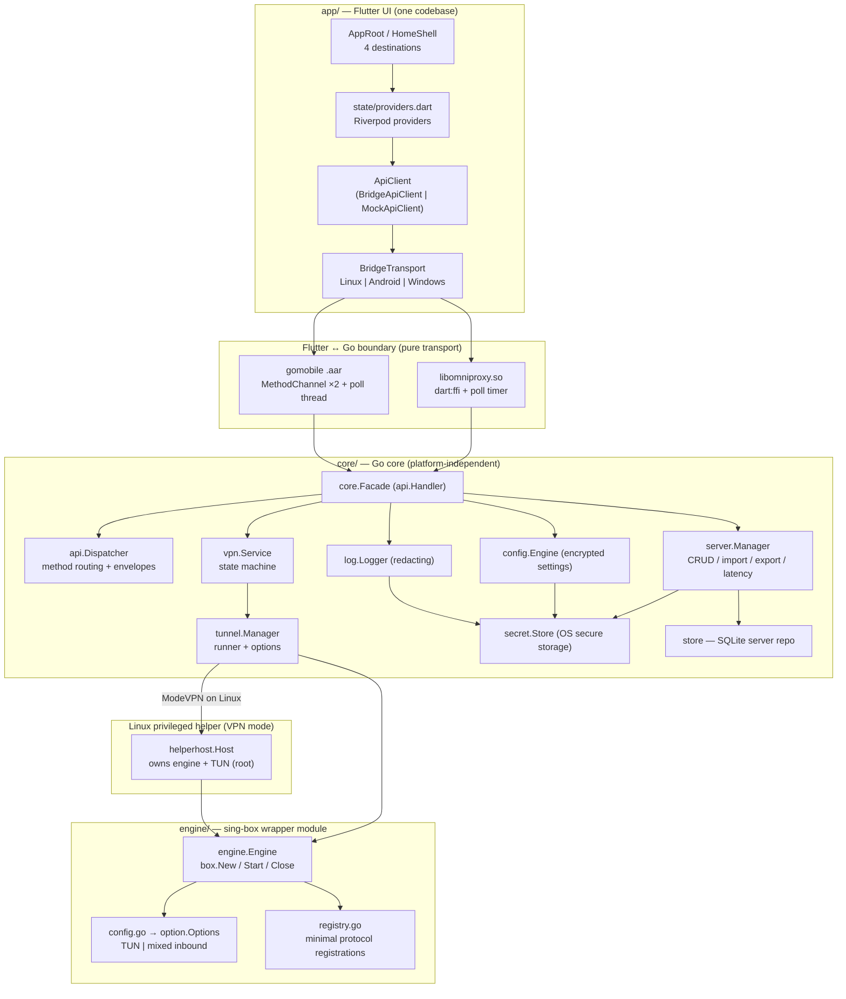
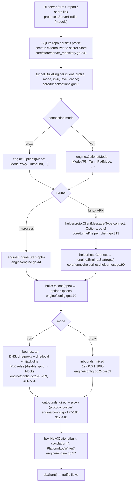

# OmniProxy Architecture

**Source of truth:** `PRD.md` · **Scope:** Phase 1 MVP (Milestone 6 of 9, in progress) · **Companion:** `docs/implementation-plan.md`, `docs/api-contract.md`, `docs/platform-notes.md`

This document explains **why** OmniProxy is shaped the way it is: the three-layer split (Flutter UI / Go core / pinned sing-box engine), the pure-transport bridge boundary, the polled-event model, and the per-platform privilege model. Every component is cited to its source (`file:line`). It describes the architecture as-built at M6; later milestones update it in the same commit that changes the code.

## Terminology

| Term | Meaning |
|---|---|
| **Core** | The Go package tree under `core/` — controller, logic, persistence, state machine. Platform-independent. |
| **Engine** | The Go module under `engine/` — a thin wrapper around **sing-box**. |
| **sing-box** | The upstream engine library, `github.com/sagernet/sing-box v1.13.15`, linked as a Go module (never shelled out). |
| **Bridge** | The boundary across which Flutter and the Go core talk: the canonical JSON contract in `docs/api-contract.md`. |
| **Bridge transport** | A Dart class implementing `BridgeTransport` (`app/lib/core/bridge/bridge_transport.dart`) that carries one transport of the bridge contract. Pure transport — no business logic. |
| **Modes** | `vpn` (TUN) or `proxy` (loopback SOCKS5/HTTP mixed inbound). |
| **States** | `disconnected`, `connecting`, `connected`, `reconnecting`, `error`. |
| **Secrets** | Credential values (passwords, UUIDs, SSH private keys). Never plaintext on disk, never in logs. |

---

## 1. Purpose

This document records the OmniProxy architecture for anyone working on the codebase: how the pieces fit together, why each boundary exists, and where platform-specific behavior is allowed (and where it is not). It is the map for the rules that appear repeatedly in the code:

1. **Protocols are delegated, never reimplemented.** OmniProxy never implements VLESS/VMess/SS/SOCKS/HTTP/SSH/TLS/DNS itself — sing-box provides all of it (AGENTS.md "Networking & VPN rules"; `engine/registry.go` registers only the protocols we need).
2. **The bridge is pure transport.** The contract in `docs/api-contract.md` is implemented identically over every transport. No transport adds, removes, or reinterprets a method (`core/api/contract.go:8-28`), and no platform business logic lives in a transport (`app/lib/core/bridge/bridge_transport.dart:1-11`).
3. **Security boundaries are structural, not incidental.** Secrets live in OS-native secure storage and are externalized from rows and logs (`core/store/server_repository.go:18-25`, `core/log/logger.go:1-4`).
4. **Privilege boundaries are per-platform and enforced at the process level** (Linux privileged helper vs. Android VpnService vs. Windows in-process DLL; §8).

The document does **not** restate the API contract (that is `docs/api-contract.md`) or the per-platform platform notes (`docs/platform-notes.md`). It shows how the code realizes both.

---

## 2. High-level overview



Flow summary: the Flutter shell talks only to the `ApiClient` interface; the `ApiClient` is backed by a `BridgeTransport`; every transport frames one JSON request and delivers it to the Go core, which routes it through the single `Dispatcher` onto the `Facade`. The facade fans out to the Config Engine (settings), Server Manager (profiles), and VPN Service (state machine). The VPN Service drives the Tunnel Manager, which turns a validated profile into `engine.Options` and starts the engine (in-process everywhere, or in the privileged helper on Linux VPN mode). The engine builds sing-box `option.Options` and starts a sing-box box.

---

## 3. Repo / package layout

```
OmniProxy/
├── go.work                      # workspace: core + engine
├── Makefile                     # build/test gates + release targets (see §5/§9)
├── core/                        # Go core — platform-independent logic
│   ├── core.go                  # Facade: wires config/server/tunnel/vpn/log/bus
│   ├── api/                     # contract.go (methods/events/errors/schemas),
│   │                            # dispatch.go (Dispatcher), events.go (EventBus)
│   ├── models/                  # ServerProfile, VPNSession, AppSettings, LogEntry
│   ├── config/                  # Config Engine: encrypted settings blob (+ legacy migration)
│   ├── store/                   # SQLite open/migrations + server repository
│   ├── server/                  # Server Manager: CRUD, import/export, links, latency
│   ├── tunnel/                  # Tunnel Manager, Runner, options, latency, helper client
│   │   ├── helperhost/          # privileged helper server (Linux VPN mode)
│   │   └── helperproto/         # shared JSON wire protocol (client + server)
│   ├── vpn/                     # VPN Service: connection state machine
│   ├── log/                     # leveled structured logger + redactor + ring
│   ├── secret/                  # Store interface + AES-256-GCM crypto
│   ├── glue/                    # c-shared ABI (Linux/Windows FFI entry point)
│   ├── mobile/                  # gomobile bind entry point (Android; //go:build android)
│   ├── internal/ring/           # bounded event ring (polled transports)
│   └── cmd/omniproxy-helper/    # pkexec entry point for the Linux helper
├── engine/                      # sing-box wrapper module (pinned v1.13.15)
│   ├── engine.go                # Engine: New/Start/Close around box.Box
│   ├── config.go                # typed Options → sing-box option.Options (single builder)
│   ├── registry.go              # minimal protocol registrations
│   ├── platform.go              # noopPlatform (default) + Platform re-export
│   ├── platform_fd.go           # FdTunPlatform: Android VpnService fd (linux|android)
│   ├── platform_monitor.go      # passive default-interface monitor (linux|android)
│   ├── tun_name.go              # TUN interface name from fd (linux|android)
│   ├── log.go                   # Level + LogSink → sing-box PlatformWriter
│   └── errors.go                # typed validation errors
├── app/                         # Flutter UI (single codebase)
│   ├── lib/
│   │   ├── main.dart            # runApp(ProviderScope(OmniProxyApp))
│   │   ├── app/                 # app_root.dart (shell), router.dart, theme.dart
│   │   ├── core/                # models.dart, api_client.dart, bridge_api_client.dart,
│   │   │                        #   client_factory.dart, mock_api_client.dart, share_links.dart
│   │   │   └── bridge/          # bridge_transport.dart + linux/android/windows
│   │   ├── state/               # providers.dart (Riverpod)
│   │   └── features/            # dashboard/, servers/, logs/, settings/
│   └── android/                 # Kotlin: Bridge.kt (MethodChannel host),
│                                #   KeystoreSecretStore, OmniProxyVpnService,
│                                #   VpnProxyService, Notifications
├── docs/                        # implementation-plan, api-contract, platform-notes, ARCHITECTURE
└── tools/                       # build_linux.sh (c-shared + helper)
```

---

## 4. Component responsibilities & relationships

### 4.1 Facade — `core/core.go`

`core.Facade` is the single object behind the bridge. It implements `api.Handler` (`core/core.go:54-69`) and composes the Config Engine, Server Manager, Tunnel Manager, VPN Service, and EventBus in `New` (`core/core.go:74-149`). Wiring order matters:

1. Logger is created first (`core/core.go:78-81`); it is a seam (`cfg.Logger`).
2. SecretStore defaults to go-keyring (`core/core.go:83-86`) — injectable for tests.
3. The **legacy server migration** runs before the settings engine loads: `config.LoadLegacyServers` imports profiles embedded in pre-migration encrypted blobs into the repository (`core/core.go:92-120`, `core/config/engine.go:124-163`).
4. SQLite opens, repository wraps it with secrets + redactor (`core/core.go:107-112`).
5. The runner defaults to in-process; Linux glue overrides it with the helper-aware runner (`core/core.go:132-138`, `core/glue/glue.go:92-99`).
6. The latency tester is the core's TCP-dialer, injected behind an interface (`core/core.go:140`, `core/server/manager.go:24-27`).
7. The VPN service resolves profiles through the facade itself (`core/core.go:142`, `core/core.go:201-210`) — connecting to a disabled profile is rejected.
8. Logs fan into the event bus so every redacted entry becomes a `logAppended` event (`core/core.go:144`, `core/core.go:422-426`).

`Facade.MapError` translates domain errors onto the contract's error codes (`core/core.go:178-197`), which is the seam the `Dispatcher` uses to emit the canonical envelope. Edit/delete guards reject mutations while connected to that server (`core/core.go:256-272`). `Connect` defaults the mode from persisted settings when empty (`core/core.go:330-337`).

### 4.2 Bridge contract & dispatch — `core/api/`

`core/api/contract.go` is the canonical contract, in Go: method names (`:9-28`), event types (`:31-35`), error codes (`:38-47`), request/response structs, and the `{ok, data|error}` envelope (`:56-60`). `api.Dispatcher` routes a method string to the handler and JSON-marshals the envelope; unknown methods and decode failures become `invalid_argument` (`core/api/dispatch.go:18-136`). `api.EventBus` fans events out to subscribed sinks on the publisher's goroutine (`core/api/events.go:22-76`) — the design assumption is that sinks are cheap and non-blocking (they are ring pushes).

The facade registers two event paths at init: the `logSink` writes redacted log entries into the bus, and `facadeSink` gates delivery on the `subscribe`/`unsubscribe` state before handing events to the transport's sink (`core/core.go:405-426`, `core/core.go:381-402`).

### 4.3 Config Engine — `core/config/engine.go`

Settings persistence only — it is **not** the sing-box config generator (that is `engine/config.go`). The on-disk document is `{version, settings}`, encrypted at rest with AES-256-GCM under a data key held by the SecretStore (`core/config/engine.go:104-108`, `core/secret/crypto.go:55-66`). `FileStore` writes atomically with mode 0600 (`core/config/engine.go:42-90`). A corrupt/tampered store is backed up and reset to defaults rather than failing startup (`core/config/engine.go:165-181`, `:231-246`). `LoadLegacyServers` (`:124-163`) is the one-time migration from the old embedded-servers blob.

### 4.4 Secret storage — `core/secret/` and `core/store/server_repository.go`

`secret.Store` is the OS secure-storage boundary (`core/secret/store.go:15-24`): Android Keystore (via Kotlin), Linux/Windows go-keyring, `InMemory` for tests. The at-rest data key is a random 32-byte AES-256 key stored under `omniproxy.atrest.key` (`core/secret/crypto.go:12-53`).

Server profiles are persisted in SQLite, but **credential values never appear in rows**: only a secret *reference* is stored, and the value lives in the SecretStore under `omniproxy.server.<id>.<ref>` (`core/store/server_repository.go:18-30`). `persist` sanitizes the row and stores the refs (`:241-264`); `restoreSecrets` refills them on read (`:269-281`); `Delete` purges the refs too (`:164-184`). Restored values are registered with the logger redactor (`:283-287`, `core/log/logger.go:115`). This is the "never plaintext on disk, never in logs" rule made structural (AGENTS.md product rules).

### 4.5 Server Manager — `core/server/`

`server.Manager` is the profile domain layer over the repository: CRUD, favorites, enable/disable, duplicate, import/export (`core/server/manager.go:36-135`). Latency testing is delegated to an injectable `LatencyTester` (`core/server/manager.go:24-27`, `:137-157`); the production implementation is `tunnel.LatencyTester`, a plain TCP dial with a 3 s timeout (`core/tunnel/latency.go:13-48`). Import accepts the OmniProxy envelope JSON **and** native share links (`core/server/links.go:27-64`, `core/server/exchange.go:79-98`); per-line errors are surfaced, nothing imports partially (`core/server/links.go:41-63`). Export emits either envelopes (`core/server/exchange.go:32-56`) or share links, where SSH profiles are rejected because they have no link representation (`core/server/linkgen.go:19-42`).

### 4.6 Tunnel Manager — `core/tunnel/`

`tunnel.Manager` owns the engine lifecycle for the active profile — strictly single-server in Phase 1, with the chain seam noted in the package doc (`core/tunnel/manager.go:1-18`). `Start` clones the profile, builds `engine.Options`, and calls the runner; a second Start fails with `ErrAlreadyRunning` (`core/tunnel/manager.go:62-78`). `Stop` is written so the runner is **always** stopped, even when no profile is tracked — a failed Start can leave a half-started engine, and stopping guarantees a Disconnected/Error session can never keep routing traffic (`core/tunnel/manager.go:80-92`).

`BuildEngineOptions` is the profile→engine mapping (`core/tunnel/options.go:16-30`): mode maps to `engine.ModeVPN`/`ModeProxy`, IPv6 mode maps to the engine enum (`:32-43`), and the per-protocol outbound carries over TLS/transport/SSH settings (`:45-113`).

**Runners** — `tunnel.Runner` abstracts where the engine runs (`core/tunnel/runner.go:11-15`):
- `InProcessRunner` runs the engine in this process (`:25-49`) and adapts engine log lines into the core's redacting logger (`:53-60`).
- `HelperRunner` (Linux) routes by mode: proxy in-process, VPN through the privileged helper over a Unix socket (`core/tunnel/helper_client.go:63-124`).

### 4.7 Linux privileged helper — `core/tunnel/helperhost/` + `cmd/omniproxy-helper`

The helper is the answer to "TUN creation **and** routing/DNS configuration need `CAP_NET_ADMIN` in the engine's process" (`docs/platform-notes.md §Linux:63-64`). It embeds the same `engine` module and owns the engine + TUN lifecycle for VPN mode (`core/tunnel/helperhost/helperhost.go:1-24`). The wire protocol is newline-delimited JSON over a Unix socket (`core/tunnel/helperproto/helperproto.go:1-29`); the helper never re-derives engine config because the full `engine.Options` is serialized in the `connect` message (`core/tunnel/helperproto/helperproto.go:12-19`). `pkexec` is the default spawner, with `OMNIPROXY_HELPER` for unprivileged tests (`core/tunnel/helper_client.go:41-58`); the helper binary is a thin `--socket` entry point (`core/cmd/omniproxy-helper/main.go:17-27`).

### 4.8 VPN Service — `core/vpn/service.go`

The state machine lives here: `disconnected|connecting|connected|reconnecting|error` (`core/models/session.go:12-16`). `Service` exposes `ProfileResolver` and `Tunneler` seams (`core/vpn/service.go:26-34`) and drives a per-connect **run loop** (`core/vpn/service.go:70-76`). Key behaviors:

- `Connect` resolves the profile, rejects when busy, reaps a stale loop, creates a session, sets `connecting`, and spawns the loop (`:156-210`).
- `runLoop` starts the tunnel; on failure it stops the tunnel before retrying (so a retry can never hit "already running" and no traffic routes while the UI says `reconnecting`) and backs off up to the retry policy cap (`:268-321`). Default backoff is 1s,2s,4s… capped at 30s, max 5 attempts (`:43-58`).
- Every transition publishes a `stateChanged` event through the bus (`:370-385`, `:482-493`).
- `forceDisconnect` is the safety net when a loop ignores commands (Start blocked): it marks the run dead, stops the tunnel, and emits `disconnected` (`:453-473`). `disconnectTimeout` is a test-shrinkable var (`:23`).
- Errors are classified onto contract codes (`:513-526`), mapping permission failures to `unauthorized` (e.g. cancelled pkexec, per PRD §3.3).

### 4.9 Logging & redaction — `core/log/`

`log.Logger` is leveled, structured, redacted, and ring-buffered (`core/log/logger.go:59-81`). Every message is redacted **before** it reaches any sink or subscriber (`:130-162`), including context values (`:164-181`). The ring feeds `getLogs` (`:126-128`); `logAppended` events flow through the facade's `logSink` (`core/core.go:422-426`). `log.NewLogger` defaults to stderr via `ConsoleSink` (`core/log/logger.go:69-81`).

### 4.10 Engine module — `engine/`

`engine.Engine` wraps one sing-box box per run (`engine/engine.go:12-25`). `Start` builds the config, injects the platform interface into the context, creates the box with a platform log writer, and starts it (`engine/engine.go:44-73`); `Close` stops it idempotently (`:76-88`).

`engine/config.go` is the **single builder** of sing-box `option.Options` from the core's typed `Options` (`engine/config.go:156-262`). Highlights:

- ModeVPN → a `tun` inbound; ModeProxy → a loopback `mixed` (SOCKS5+HTTP) inbound (`:226-260`).
- VPN mode adds a DNS module with two servers: `dns-proxy` (client queries through the tunnel) and `dns-local` (outbound-dial bootstrap over the real network, to avoid a resolution loop), plus a `hijack-dns` route rule (`:195-217`, `:436-496`, `:540-554`).
- IPv6 handling is decided here so behavior is identical on every platform (`engine/config.go:111-137`, `platform-notes.md §IPv6`). `disable_ipv6` additionally installs an IPv6→`block` rule while the TUN keeps its IPv6 route, so IPv6 can be disabled but never leaks (`:203-209`, `:517-538`).
- Outbound builders cover VLESS/VMess/Trojan/SS/SOCKS/HTTP/SSH with TLS + WebSocket transport (`:312-434`, `:556-578`).

`registry.go` registers exactly the inbounds/outbounds/DNS transports OmniProxy needs instead of the `sing-box/include` full set — keeps the module lean and the surface auditable (`engine/registry.go:29-56`).

### 4.11 Platform interface — `engine/platform.go`, `platform_fd.go`, `platform_monitor.go`

sing-box supports a `PlatformInterface` hook. Default is `noopPlatform` (engine creates its own TUN) (`engine/platform.go:18-52`). Android supplies `FdTunPlatform`, which duplicates the VpnService's TUN fd into sing-tun (`engine/platform_fd.go:16-33`, `:167-190`), protects the tunnel's own sockets from the TUN via `VpnService.protect` (`:64-96`), and serves interface/network data that the app sandbox forbids netlink from providing (`:100-150`, `platform_monitor.go`). The `//go:build linux || android` tags on `platform_fd.go`, `platform_monitor.go`, and `tun_name.go` are deliberate — these files use Linux-only syscalls, so the Windows cross-build excludes them (Makefile §8/M8 note).

### 4.12 Bridge transports (Dart) — `app/lib/core/bridge/`

`BridgeTransport` is the pure-transport contract: `request`, `events`, `start`, `stop` (`app/lib/core/bridge/bridge_transport.dart:24-37`). `BridgeApiClient` implements the full contract `ApiClient` on top of any transport, one method = one transport request (`app/lib/core/bridge_api_client.dart:9-152`). `client_factory.buildApiClient` picks the transport per platform and **falls back to the mock on Windows** until the M8 transport lands (`app/lib/core/client_factory.dart:20-28`).

- **Linux** — `dart:ffi` into `libomniproxy.so`, draining the C event ring on a 15 ms timer (`app/lib/core/bridge/bridge_linux.dart:27-70`, `:122-138`). Polled, not pushed, because a native callback into the Dart isolate deadlocks when the isolate is blocked inside a synchronous request that itself publishes an event (`:23-26`, mirrored in `core/glue/glue.go:7-11`).
- **Android** — MethodChannel `com.omniproxy/bridge` for requests and `com.omniproxy/events` for events (`app/lib/core/bridge/bridge_android.dart:17-83`). The Kotlin host runs requests on a background thread and drains the Go ring on a 25 ms HandlerThread timer (`app/android/.../Bridge.kt:213-237`, `:251-285`).
- **Windows** — M8 placeholder; `request`/`events` throw `UnsupportedError` (`app/lib/core/bridge/bridge_windows.dart:7-22`).

### 4.13 Flutter state & UI — `app/lib/state/` + `app/lib/features/`

Riverpod providers sit between the UI and `ApiClient` (`app/lib/state/providers.dart`): settings (`:22-40`), servers (`:44-117`), connection state driven by `stateChanged` events (`:127-170`), and the logs buffer driven by `logAppended` with `getLogs` backfill deduped by sequence number (`:174-229`). The shell is `OmniProxyApp` → `HomeShell`, responsive (NavigationRail ≥700 px wide, NavigationBar otherwise), Dashboard is the landing tab (`app/lib/app/app_root.dart:14-118`, `app/lib/app/router.dart:6-10`). The dashboard itself is scoped to status/server/duration/connect (`app/lib/features/dashboard/dashboard_screen.dart:9-10`).

---

## 5. Startup / shutdown sequence

The sequence below is **Linux** (the reference flow at M6). Android differs in the transport steps; the differences are noted inline.

```mermaid
sequenceDiagram
    autonumber
    participant Dart as Dart isolate (app)
    participant Transport as LinuxBridge (dart:ffi)
    participant Glue as libomniproxy.so (core/glue)
    participant Facade as core.Facade
    participant Config as config.Engine + secret.Store
    participant Store as SQLite repo
    participant Tunnel as tunnel.Manager
    participant Runner as HelperRunner
    participant Helper as omniproxy-helper (pkexec, root)
    participant Engine as engine.Engine (sing-box)

    rect rgb(240,247,255)
    note over Dart,Facade: Startup
    Dart->>Transport: start() — open lib, omniproxy_init(configJson)
    Transport->>Glue: omniproxy_init({dataDir, logLevel, helperPath})
    Glue->>Facade: core.New(Config{Platform:"linux", Runner:HelperRunner})
    Facade->>Config: LoadLegacyServers + config.New (data key via secret.Store)
    Facade->>Store: storepkg.Open + NewSQLiteServerRepository
    Facade->>Facade: wire latency tester, VPN service, bus sinks
    Glue-->>Transport: 0 (ok)
    Transport->>Dart: started; poll timer 15ms started
    Dart->>Transport: subscribe(["stateChanged","logAppended"]) (via request)
    end

    rect rgb(245,248,240)
    note over Dart,Engine: Connect (VPN mode, Linux)
    Dart->>Transport: request("connect", {serverId, mode:"vpn"})
    Transport->>Glue: omniproxy_request("connect", …)
    Glue->>Facade: Dispatcher.Dispatch("connect", …)
    Facade->>Facade: vpn.Connect → resolve profile, state=connecting
    Facade->>Tunnel: Manager.Start(profile, vpn)
    Tunnel->>Runner: HelperRunner.Start(engine.Options)
    Runner->>Helper: spawn via pkexec --socket <sock>
    Helper->>Engine: helperhost.Connect → engine.Start(opts) (root: TUN+route)
    Helper-->>Runner: {"type":"response","ok":true,"state":"connected"}
    Runner-->>Tunnel: nil
    Tunnel-->>Facade: nil
    Facade->>Facade: state=connected; emit stateChanged(connected)
    Glue-->>Transport: {"ok":true,"data":{"state":"connecting"}}
    Transport->>Dart: BridgeResponse.ok
    Note over Transport,Dart: async: poll timer drains ring; stateChanged(connected)<br/>and logAppended events arrive on next polls
    end

    rect rgb(255,247,240)
    note over Dart,Helper: Disconnect / shutdown
    Dart->>Transport: request("disconnect", {})
    Glue->>Facade: vpn.Disconnect → tunnel.Stop
    Tunnel->>Runner: HelperRunner.Stop → client.disconnect
    Runner->>Helper: {"type":"disconnect"}
    Helper->>Engine: eng.Close()
    Helper-->>Runner: ok
    Facade->>Facade: state=disconnected; emit stateChanged
    Dart->>Transport: stop() — omniproxy_shutdown → facade.Close()
    end
```

Notes:

- **Linux proxy mode** replaces the helper leg with an in-process `InProcessRunner.Start` (`core/tunnel/helper_client.go:83-96`); the rest is unchanged.
- **Android** differs only in the transport: `MainActivity`/`VpnProxyService` call `Mobile.init` from Kotlin (`app/android/.../Bridge.kt:59-74`), and VPN-mode connect first establishes the VpnService and hands the TUN fd to Go via `setTunFd` before the bridge `connect` (`app/android/.../OmniProxyVpnService.kt`; `core/mobile/mobile.go:171-179`). Events are drained on the Kotlin poll thread instead of a Dart timer (`app/android/.../Bridge.kt:251-285`).
- `omniproxy_shutdown`/`Mobile.shutdown` call `Facade.Close`, which disconnects, stops the tunnel, closes the runner (reaping the helper), and closes the DB (`core/core.go:157-167`, `core/glue/glue.go:146-154`, `core/mobile/mobile.go:305-314`).

---

## 6. Config generation flow

The engine configuration is generated in one place and never hand-authored: the visual builders in the UI produce a `ServerProfile`; the profile is validated, mapped to `engine.Options`, then built into sing-box `option.Options` by the shared engine module. The same path runs in-process and inside the privileged helper — the helper receives the finished `engine.Options` over the socket and never re-derives config (`core/tunnel/helperproto/helperproto.go:12-19`).



Notes:

- Users never edit sing-box JSON; the visual builders and importers are the only source of profiles (AGENTS.md product rules).
- TLS is on by default (`engine/config.go:420-434`); bypass requires Advanced Mode and an explicit confirmation dialog per PRD §9 (`server_edit_screen.dart:333-354`).
- `engine/config.go` validates the essentials (mode/address/port, `engine/config.go:264-275`); profile-level validation lives in `models` (`core/store/server_repository.go:105`).

---

## 7. Event & state flow

Events are **polled, not pushed** across the bridge on every transport. The core publishes onto an in-process bus; two delivery paths converge on a bounded ring (cap 512) that the transport drains on a timer:

1. **In-process fan-out.** `api.EventBus` fans `Publish` to subscribed sinks on the publisher's goroutine (`core/api/events.go:66-76`). The facade subscribes `facadeSink`, which gates on `subscribe`/`unsubscribe` state and hands events to the transport sink (`core/core.go:381-419`). The glue/mobile sinks are `FuncEventSink` wrappers that push into the ring (`core/glue/glue.go:110`, `:143`; `core/mobile/mobile.go:165`).
2. **Ring buffering.** The ring is bounded (512) and drops oldest first (`core/glue/glue.go:44-47`, `core/mobile/mobile.go:42-44`; `core/internal/ring/ring.go`). `stateChanged` is frequently superseded, so dropping old state events is safe — the newest always survives.
3. **Drain.** `omniproxy_poll_events` / `Mobile.pollEvents` return the batch as JSON (`core/glue/glue.go:133-139`, `core/mobile/mobile.go:292-302`); the Dart/Kotlin drains forward each event onto the Dart stream (`app/lib/core/bridge/bridge_linux.dart:122-138`, `app/android/.../Bridge.kt:266-285`).

State flow (states as in `core/models/session.go:12-16`):

```
Disconnected → Connecting → Connected ⇄ Reconnecting → (retries exhausted) → Error
                                   │
                                   └── Disconnect from any state → Disconnected
```

The VPN service is the only writer of `stateChanged`; the tunnel manager reports `Active`/`Server`/`Mode` snapshots under a mutex (`core/tunnel/manager.go:94-113`). The Dart side mirrors every state change through `connectionProvider` and dedupes log entries by sequence number (`app/lib/state/providers.dart:127-170`, `:174-229`).

---

## 8. Platform differences

| Concern | Android | Linux | Windows |
|---|---|---|---|
| Go packaging | gomobile bind `.aar` (`Makefile:89-101`) | c-shared `libomniproxy.so` (`Makefile:115-116`, `tools/build_linux.sh`) | c-shared `omniproxy.dll`, cross-compiled from Linux (`Makefile:128-138`) |
| Bridge transport | MethodChannel ×2, Kotlin poll thread (`app/lib/core/bridge/bridge_android.dart:17-83`; `Bridge.kt:213-285`) | dart:ffi + 15 ms Dart poll timer (`app/lib/core/bridge/bridge_linux.dart:27-70,122-138`) | dart:ffi — **M8 stub, throws UnsupportedError** (`app/lib/core/bridge/bridge_windows.dart:7-22`); client falls back to `MockApiClient` (`app/lib/core/client_factory.dart:26-27`) |
| VPN/TUN ownership | `VpnService` establishes TUN, fd handed to engine (`OmniProxyVpnService.kt:60-65`; `core/mobile/mobile.go:171-179`; `engine/platform_fd.go:167-190`) | privileged pkexec helper hosts engine + TUN (`core/tunnel/helper_client.go:41-58`; `helperhost/helperhost.go:24-65`) | Wintun driver, in-process DLL (`Makefile:140-153`; `docs/platform-notes.md §Windows`) |
| Engine platform hook | `FdTunPlatform` (protect + passive monitor) (`engine/platform_fd.go:64-150`) | none — `noopPlatform` (`engine/platform.go:18-52`) | none — `noopPlatform` |
| Default interface / netlink | forbidden; Kotlin pushes via `Mobile.setDefaultInterface`/`setNetworkInterfaces` (`core/mobile/mobile.go:226-289`; `Bridge.kt:81-154`) | netlink available in helper | Wintun model |
| Secure storage | Android Keystore (`KeystoreSecretStore.kt:24-42`; `core/mobile/mobile.go:102-110`) | libsecret via go-keyring (`core/secret/store.go:1-4`; `core/core.go:83-86`) | Credential Manager/DPAPI via go-keyring |
| Service model | foreground `VpnProxyService` + persistent notification (`VpnProxyService.kt:14-42`) | none (desktop app process + helper) | in-process (Windows service deferred to Phase 1.5+) (`docs/platform-notes.md §Windows:77`) |
| Test status | device E2E green (integration_test, `Makefile:82-84`) | E2E through local SOCKS5 test server green (`docs/implementation-plan.md:96`) | code-complete, **untested on Linux host** (`docs/implementation-plan.md:98`) |

Platform **limitations** are surfaced in the UI rather than silently degraded (AGENTS.md product rules); the mock fallback on Windows is the explicit M8 placeholder rather than a silent half-transport (`app/lib/core/client_factory.dart:20-28`).

---

## 9. Design decisions & tradeoffs

### Confirmed in `docs/implementation-plan.md` (decision table, §2)

| Decision | Choice & rationale |
|---|---|
| Platform order | Linux E2E → Android E2E → Windows (code-complete) — Linux is the fastest to validate; Windows is untestable on the dev host (`implementation-plan.md:25`) |
| Linux TUN privileges | **Privileged helper hosts the engine**; not fd-passing — TUN setup + auto-route need `CAP_NET_ADMIN` in the engine's process (`implementation-plan.md:26`, `platform-notes.md:63-64`; embodied in `core/tunnel/helper_client.go:83-96`, `helperhost/helperhost.go`) |
| Engine pin | `sing-box v1.13.15` (stable) (`implementation-plan.md:30`; `core/core.go:30`) |
| Latency test | Core TCP dial, not sing-box url-test — `adapter.Outbound` has no `Delay()` in v1.13.15 (`implementation-plan.md:33`; `core/tunnel/latency.go:13-48`) |
| Bridge flavor | Android: MethodChannel over gomobile; Linux/Windows: dart:ffi into c-shared lib (`implementation-plan.md:34`) |
| Events | Polled, not pushed — a native callback into a Dart isolate blocked in a synchronous request deadlocks (`api-contract.md:180,199`; `core/glue/glue.go:7-11`; `bridge_linux.dart:23-26`) |
| Secrets | OS-native secure storage, externalized from rows; encrypted at rest (`implementation-plan.md:85-87`; `core/store/server_repository.go:18-30`; `core/secret/crypto.go:55-66`) |

### Discovered during implementation (beyond the plan table)

- **Single run-loop VPN service.** The per-connect `runState` threads its own session and context through the loop rather than reading shared state, so a new connect can cleanly replace a stale one that is blocked inside `Start` (`core/vpn/service.go:67-76`, `:170-209`, `:453-473`). This is the mechanism that makes force-disconnect reliable when a helper's engine comes up slowly.
- **Always-stop runner.** `Manager.Stop` stops the runner even with no tracked profile so a half-started engine can never keep routing traffic under a Disconnected/Error session (`core/tunnel/manager.go:80-92`).
- **DNS split for VPN mode.** `dns-proxy` (client queries through the tunnel) vs `dns-local` (bootstrap dials over the real network) prevents a chicken-and-egg resolution loop while keeping client DNS leak-free (`engine/config.go:146-153`, `:436-496`).
- **Socket protect on Android.** The VpnService routes every app socket into the TUN including the tunnel's own; `VpnService.protect` marks the tunnel's sockets to break the loop (`engine/platform_fd.go:64-96`; `mobile.go:192-218`).
- **Passive interface monitor on Android.** netlink monitors are banned; sing-box nil-derefs without a monitor when a platform interface exists — so the Kotlin host feeds interface/default-network data through `Mobile` APIs (`engine/platform_fd.go:100-150`; `platform-monitor.go`; `Bridge.kt:81-154`).
- **Minimal protocol registry.** Registering only the needed protocols keeps the module lean and auditable versus `sing-box/include` (`engine/registry.go:29-56`).
- **Ring cap 512.** Small enough to stay fresh; large enough to carry a connect burst (`core/glue/glue.go:44-47`).
- **Windows portability via build tags.** `platform_fd.go`/`platform_monitor.go`/`tun_name.go` carry `//go:build linux || android` so the Windows cross-build excludes Linux-only syscalls (`Makefile:128-138`).

---

## 10. Limitations & gaps

- **Windows is not runnable yet.** `WindowsBridge` throws `UnsupportedError` and the client factory falls back to the mock (`app/lib/core/bridge/bridge_windows.dart:7-22`, `app/lib/core/client_factory.dart:26-27`). The core DLL cross-compiles from Linux, but the app bundle requires a Windows host/CI (`Makefile:156-160`).
- **Single server, no chaining.** `tunnel.Manager` is explicitly single-server; chains are a Phase 2 seam (`core/tunnel/manager.go:16-18`, `implementation-plan.md:111-113`).
- **No stats.** `VPNSession.bytesUp/bytesDown` exist but are never populated in MVP (`api-contract.md:89-90`); monitoring is Phase 2.
- **Transport support is WS-only.** gRPC/HTTPUpgrade and Reality are parser-level seams rejected at import and not wired (`engine/config.go:44-52`, `core/server/links.go`).
- **`autoConnect`/`startWithSystem`/`notificationsEnabled`** are stored but not acted on in MVP (`api-contract.md:104-107`).
- **Desktop DNS integration** (NetworkManager/systemd-resolved) is explicitly deferred; Phase 1 keeps sing-box defaults (`platform-notes.md:71`).
- **Windows service** background model deferred to Phase 1.5+ (`platform-notes.md:77`).
- **Doc set note.** The docs in `docs/` form a cross-linked set: `ARCHITECTURE.md` (this file) is the structural map; `GO_RUNTIME.md`, `FLUTTER.md`, `FLUTTER_GO_FFI.md`, `PROXY_ARCHITECTURE.md`, `VPN_INTERNALS.md`, `SINGBOX.md`, `NETWORK_FLOW.md`, `ANDROID.md`, `LINUX.md`, `WINDOWS.md`, `LOW_LEVEL.md`, `SECURITY.md`, `PERFORMANCE.md`, `DEBUGGING.md`, and the `SEQUENCE_DIAGRAMS.md` / `FLOWCHARTS.md` / `CLASS_DIAGRAMS.md` atlas provide the per-subsystem depth. `implementation-plan.md`, `api-contract.md`, and `platform-notes.md` remain the living contract documents.

---

## 11. Related docs

- `PRD.md` — product source of truth (state machine §7.1, security §9, session §8).
- `docs/api-contract.md` — the canonical Flutter↔Go contract: methods, schemas, events, transports, error codes.
- `docs/implementation-plan.md` — Phase 1 plan, decision table, milestones, build/test/lint commands.
- `docs/platform-notes.md` — per-platform notes: TUN/privileges, Android service model, IPv6 behavior, permission matrix.
- `AGENTS.md` — working rules: docs-before-code, library policy, product rules that are easy to miss.
