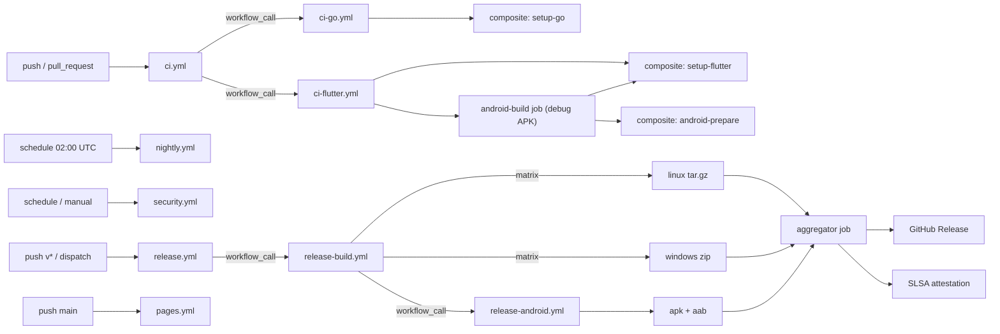

# CI — Continuous Integration & Release Pipeline

**Applies to:** `mrdevmohamed/OmniProxy` (default branch `main`) · app version `1.0.0+1` · platforms Android, Linux, Windows (macOS/web excluded — §9).
**Read alongside:** `README.md:32-56` (local commands), `docs/implementation-plan.md:115-133` (build/test/lint), `docs/ANDROID.md` (gomobile/AAR), `docs/WINDOWS.md` (cross-compiled DLL), `docs/LINUX.md:426-449` (bundling).

This document is the authoritative explanation of the GitHub Actions pipeline: why the workflows are structured the way they are, what each one gates, and how to run releases. When a workflow changes, update this document in the same change.

## 1. Overview

A small set of workflows built on a reuse model (composite actions + reusable workflows) covers three concerns: **pull-request gating**, **daily regression**, and **releases**. A fourth workflow publishes the MkDocs site, and Dependabot keeps pinned dependencies fresh.

| Workflow | Trigger | Purpose |
|---|---|---|
| `ci.yml` | `push` to `main`, `pull_request` | Go + Flutter quality gates, Linux bridge E2E, Android debug APK |
| `nightly.yml` | `schedule` 02:00 UTC | Full Go + Flutter suite with artifacts; optional nightly pre-release |
| `security.yml` | `schedule` (weekly) + `workflow_dispatch` | CodeQL, govulncheck, `dart pub audit`, gitleaks secret scan |
| `release.yml` | `push` of `v*` tag, `workflow_dispatch` | Platform matrix → GitHub Release (checksums, changelog, provenance) |
| `pages.yml` | `push` to `main` | Build `docs/` with MkDocs, deploy to GitHub Pages |
| Dependabot | weekly schedule (config, not a workflow) | Grouped update PRs for GitHub Actions, Go modules, Dart packages |

Every workflow except the release one is **read-only** at the `contents` level; releases need `contents: write`; security needs `security-events: write`; Pages needs `pages: write` + `id-token: write` (§5). All credentials are injected as secrets — never committed, never logged.

## 2. Architecture

### 2.1 Workflow dependency graph

### 2.2 The reuse model

CI logic that is shared between workflows lives in exactly two places:

- **Composite actions** (`.github/actions/`), for local, idempotent setup steps:
  - `setup-go` — installs Go `1.26.4` (the workspace `go.work` pins `core/` + `engine/`), populates the Go module cache.
  - `setup-flutter` — installs Flutter `3.44.6` stable (per `app/pubspec.yaml`) and logs the resolved SDK; it does not run `pub get`.
  - `android-prepare` — installs JDK 17 + Android SDK, then **regenerates the Gradle wrapper deterministically** (§3.1, §8). The wrapper is gitignored by design, so this is what makes Gradle builds reproducible in CI.
- **Reusable workflows** (`.github/workflows/ci-go.yml`, `ci-flutter.yml`, `release-build.yml`, `release-android.yml`), for multi-job pipelines invoked with `workflow_call`. PR CI (`ci.yml`), nightly, and release all call the same Go and Flutter gate definitions — there is no third copy of "what green means".

Rationale: one definition of a quality gate, one place to bump toolchains (§10), and small workflows that are cheap to review.

### 2.3 Artifact flow

- **PR CI** runs every gate but uploads **no artifacts** — the reusable workflows are called with `upload_artifacts: false`, so the Android debug APK is built and discarded, never retained or published.
- **Nightly** uploads the Go test results, coverage, and the Flutter/Android artifacts so a regression can be diagnosed without rerunning the suite.
- **Release** is the only flow that produces distributables. The platform jobs each upload a single archive; the aggregator downloads them, writes `SHA256SUMS`, generates the changelog, creates the release, and attaches provenance (§6). The Linux host cross-compiles the Windows core DLL (`make windows-core`, `docs/WINDOWS.md:70-88`), so the Linux and Android artifacts are built on `ubuntu-*` runners; the Windows zip is built on a `windows-latest` runner so it can include the Flutter Windows bundle (`Makefile:156-160`).

## 3. Workflows

### 3.1 `ci.yml` — pull-request gate

**Triggers:** `push` to `main`, `pull_request`. **Concurrency:** group `ci-${{ github.workflow }}-${{ github.ref }}`, keyed per ref, `cancel-in-progress: true` — a force-push cancels the stale run. **Permissions:** `contents: read`.

Jobs:

1. **Go gates** — calls `ci-go.yml`, which runs four jobs:
   - `check`: `make go-check` (gofmt + `go vet` + `go build` for both modules, `Makefile:54-59`). **gofmt via `make go-check` is gating** (unlike `dart format`, see below).
   - `test`: `go test -count=1 -coverprofile=... ./...` per module (`core/`, then `engine/`), with a line-coverage summary. It does **not** call `make go-test` — the coverprofile run replaces it so the suite executes once.
   - `race`: `go test -race` on the concurrency-heavy `core/tunnel` and `core/vpn` packages.
   - `windows-core`: cross-compiles the Windows core DLL with MinGW on a Linux runner (`make windows-core`).
2. **Flutter gates** — calls `ci-flutter.yml`:
   - **Static analysis**: `flutter analyze` (gating).
   - **Tests**: `flutter test --coverage` on a `[linux, windows]` matrix. On Linux this **requires `make linux-core` first** — the bridge E2E test drives the real `libomniproxy.so` and skips (silently, by design) when the `.so` is absent (`docs/FLUTTER.md:380-389`). CI runs `linux-core` before the Flutter test job so the E2E never silently skips on CI; see `docs/LINUX.md:426-449` for what the script produces.
   - A **format-drift job** runs `dart format --output=none --set-exit-if-changed` with `continue-on-error: true`. It is currently **non-gating** because the codebase carries 21 files of formatting drift; the job reports the drift in its log without blocking the PR. **Re-enable gating by flipping `continue-on-error` to `false`** once the tree is formatted — see §10.
3. **Android debug APK** (a job inside `ci-flutter.yml`) — `android-prepare` (JDK 17, SDK, deterministic Gradle-wrapper regeneration), then `make aar` (gomobile; the AAR is cached keyed on a hash of the Go sources) and `flutter build apk --debug`. Debug builds need **no signing config**, so this job runs on every PR without secrets. The AAR cache is the fast path; on a source change the cache misses and gomobile rebuilds (staleness handling in §8).

**What it gates:** merging to `main`. Green here is the working definition of "the PR did not break the build" — Go, Flutter, Linux bridge E2E, and the Android debug build.

### 3.2 `nightly.yml` — daily regression

**Trigger:** `schedule` 02:00 UTC + `workflow_dispatch`. **Concurrency:** group `nightly`, single instance, **no** cancel-in-progress — nightly runs never supersede each other. **Permissions:** `contents: read`; the optional `create-nightly-release` job opts up to `contents: write` + `actions: read` at the job level (§5).

Runs the same Go + Flutter gates as PR CI plus artifact upload (test results, coverage, debug APK), covering `main` at the start of every day. When the nightly prerelease is enabled it also runs `release-build.yml` against `main` and publishes the day's artifacts. Without the approval path the workflow cannot mutate the repo.

An **optional nightly prerelease** is available: set the repository variable `ENABLE_NIGHTLY_RELEASE=true` (§7) and the workflow also assembles a `prerelease` nightly release from the day's artifacts. Off by default so the repository does not accumulate noisy releases.

### 3.3 `security.yml` — weekly security sweep

**Trigger:** `schedule` (weekly) + `workflow_dispatch`. **Concurrency:** group `security`, single, no cancel. **Permissions:** `contents: read`, `security-events: write` (SARIF uploads to Code Scanning).

Jobs:

- **CodeQL** (Go only). Kotlin analysis is **deferred**: CodeQL's Java/Kotlin build tracing requires a committed Gradle wrapper, which this repo intentionally does not keep (§3.1). When the wrapper is re-added or tracing changes, re-enable Kotlin coverage — until then, Android code is covered by `flutter analyze` (Dart) and `go vet` (the Go that ships in the AAR).
- **govulncheck** over `core/` and `engine/` — the two workspace modules (`go.work`).
- **`dart pub audit`** in `app/`.
- **gitleaks** — full-history secret scan, results as SARIF into Code Scanning.

Nothing here blocks PRs; it is a monitoring sweep whose findings land in the Security tab and the Actions log.

### 3.4 `release.yml` — tagged releases

**Trigger:** `push` of a `v*` tag, or `workflow_dispatch` with a tag input. **Concurrency:** group `release`, keyed per tag, **no** cancel — a release run for a tag must complete. **Permissions:** `contents: write` (create the Release) plus `attestations: write` and `id-token: write` on the attestation job; the build job stays read-only.

Job flow and behavior are described in §6. It calls `release-build.yml` (Linux tar.gz, Windows zip), whose Android job in turn calls `release-android.yml` (APK + AAB), then the aggregator finishes. The aggregator runs in `environment: release`, so an **optional manual approval gate** can be attached by giving that environment required reviewers (§7).

### 3.5 `pages.yml` — documentation site

**Trigger:** `push` to `main` (only when `docs/**`, `mkdocs.yml`, or `docs/requirements.txt` change). **Permissions:** `contents: read`, `pages: write`, `id-token: write`.

Builds `docs/` with **MkDocs + mkdocs-material** (`mkdocs build`), then deploys with the official `actions/configure-pages` → `upload-pages-artifact` → `deploy-pages` sequence. Requires the Pages source to be set to **"GitHub Actions"** (§7). The site is docs-only; it never ships app code.

### 3.6 Dependabot

Configured in `.github/dependabot.yml` (not a workflow). Weekly, **grouped** update PRs:

| Ecosystem | Scope |
|---|---|
| `github-actions` | action pins (bumped by full SHA, see §10) |
| `gomod` | `core/` and `engine/` modules |
| `pub` | `app/` Dart packages |

Grouping keeps the PR count at a handful per week. Dependabot uses the automatic `GITHUB_TOKEN`; no additional secrets. **sing-box bumps need deliberate human review** — the engine is pinned to a known-good version per the engine-pin policy (§10, `docs/SINGBOX.md:488-510`); do not auto-merge gomod PRs that touch `engine/go.mod`'s sing-box family.

## 4. Triggers

| Event | Workflow | Effect |
|---|---|---|
| `push` to `main` | `ci.yml`, `pages.yml` | Full gates on the merged commit; docs site rebuild |
| `pull_request` | `ci.yml` | Gates on the PR head — required before merge (§7) |
| `schedule` 02:00 UTC | `nightly.yml` | Full suite + artifacts; optional pre-release if `ENABLE_NIGHTLY_RELEASE=true` |
| `schedule` weekly | `security.yml` | CodeQL, govulncheck, `dart pub audit`, gitleaks |
| `workflow_dispatch` | `security.yml`, `release.yml` | Manual sweep / manual release (tag input) |
| `push` of `v*` tag | `release.yml` | Platform matrix → GitHub Release with checksums + provenance |
| Dependabot weekly | — | Grouped dependency PRs against `main` |

## 5. Secrets & variables

Everything else in the pipeline uses the automatic `GITHUB_TOKEN` scoped to the workflow's declared permissions (§1). The only stored secrets are the four Android signing secrets; the only variable toggles the nightly pre-release.

| Name | Type | Required | Used by | Purpose |
|---|---|---|---|---|
| `ANDROID_KEYSTORE_BASE64` | secret | for signed releases | `release-android.yml` | Base64-encoded Android release keystore (JKS), decoded to the keystore file at build time |
| `ANDROID_KEYSTORE_PASSWORD` | secret | for signed releases | `release-android.yml` | Keystore password (decrypt + open the store) |
| `ANDROID_KEY_ALIAS` | secret | for signed releases | `release-android.yml` | Signing key alias inside the keystore |
| `ANDROID_KEY_PASSWORD` | secret | for signed releases | `release-android.yml` | Private-key password for the alias |
| `ENABLE_NIGHTLY_RELEASE` | variable | optional | `nightly.yml` | Set to `true` to publish the nightly pre-release |
| `GITHUB_TOKEN` | automatic | always | all | Scoped by each workflow's `permissions:` block |

The four signing secrets are injected into a `key.properties` file (`app/android/key.properties`) only inside `release-android.yml`. **If `ANDROID_KEYSTORE_BASE64` is absent, the release build falls back to the debug keystore** — the pipeline must not hard-fail because of a missing optional secret, and the unsigned fallback is acceptable for internal testing but is not suitable for Play/Store distribution. **If the base64 IS set but any of the three password/alias secrets is missing, the signing step fails loudly** (fail-closed, so a half-configured signing setup never ships). PR CI never sees these secrets (debug builds need none).

## 6. Release flow

1. **Create the tag.** Push a tag matching `v*` (e.g. `v1.0.0`, `v1.1.0-rc1`). Tags **must not** be moved after release; the release concurrency group is keyed per tag with no cancellation. Alternatively run `workflow_dispatch` and enter the tag name in the `tag` input — the tag **must already exist** in the repository (the workflow only releases it, it does not create it).
2. **Platform matrix.** `release.yml` calls `release-build.yml`, which builds:
   - **Linux** → `omniproxy-<version>-linux-x64.tar.gz` (`make linux-core` + `make flutter-linux`, `Makefile:114-123`).
   - **Windows** → `omniproxy-<version>-windows-x64.zip` on a `windows-latest` runner (`flutter build windows --release`). The core DLL it ships is **cross-compiled on the Linux host** (`make windows-core`, `docs/WINDOWS.md:70-88`) and copied next to the exe.
   - **Android** → delegated to `release-android.yml` → `omniproxy-<version>.apk` + `omniproxy-<version>.aab` (`make aar` once, then direct `flutter build appbundle`/`flutter build apk`). Runs with JDK 17 + regenerated Gradle wrapper, injects `key.properties` from the four secrets, signs the release build, and falls back to the debug key if the base64 secret is absent (§5).
3. **Aggregator.** The final job (`environment: release`) downloads all archives, writes **`SHA256SUMS`** for every artifact, and generates the **changelog** by comparing against the previous release (`gh release` / `gh api` diff of the tag range). Artifact names carry the tag and platform so multiple releases never collide.
4. **Publish.** Creates the GitHub Release: `draft: false`; the `prerelease` flag follows the `workflow_dispatch` input. Because the run is in `environment: release`, an approval gate can pause it here if reviewers are configured (§7).
5. **Provenance.** SLSA provenance attestation (`actions/attest-build-provenance`) is attached to `SHA256SUMS` with an `id-token: write` job, giving a verifiable chain from build to artifact.

**Expected artifacts:** `SHA256SUMS`, the Linux tarball, the Windows zip, `omniproxy-<version>.apk` + `omniproxy-<version>.aab`, the attestation bundle. The App Store/iOS equivalents do not exist (no `app/macos`); §9 covers adding them.

## 7. Required repo settings

One-time, repository-level configuration (Settings → the relevant section). Nothing in `.github/` can set these.

| Setting | Value | Effect |
|---|---|---|
| Branch protection on `main` | Require PR reviews; require status checks for the `ci.yml` jobs | PR CI is the merge gate (§3.1) |
| Actions → General → permissions | Read repository contents by default (default) | Workflows opt up per run (§5) |
| Pages → Source | **"GitHub Actions"** (not a branch) | `pages.yml` owns deployment (§3.5) |
| Secrets and variables → Actions | The four Android secrets (repo-level), optional `ENABLE_NIGHTLY_RELEASE` variable | §5 |
| Environments → `release` | Optional required reviewers / deployment branch `main` | Manual approval gate on the release aggregator (§3.4) |
| Code scanning / Advanced Security | Enabled (`security-events: write` scope) | Receives CodeQL + gitleaks SARIF (§3.3) |

## 8. Troubleshooting

| Symptom | Cause & fix |
|---|---|
| AAR build uses stale native symbols | The gomobile AAR is cached keyed on a Go-source hash; a cache hit with changed `core/mobile` or engine sources yields stale bindings. Fix: delete the cache entry (or bump the key) and rerun — `make aar` rebuilds from scratch (`Makefile:89-101`). |
| `error: gomobile not found` / NDK errors | gomobile must be on `PATH` (`Makefile:90-93`) and the NDK must satisfy gomobile's expectations. `android-prepare` installs both; locally run `go install golang.org/x/mobile/cmd/gomobile@latest`. |
| Linux Flutter build fails on GTK/CMake | Missing host deps for `flutter build linux` (GTK3 dev headers, ninja, clang, CMake). Install the desktop toolchain; `linux-core` artifacts are independent (`docs/LINUX.md:90-98`). |
| `flutter test` on Linux is green but the E2E "did nothing" | The bridge E2E **silently skips** when `libomniproxy.so` is absent (`docs/FLUTTER.md:380-389`). Run `make linux-core` before `flutter test` — CI does this by construction (§3.1). |
| Windows "release" artifact behaves like the mock | The Windows core is code-complete but its runtime glue is unverified; on Windows hosts the app falls back to the mock (`docs/FLUTTER.md:389-392`). This is a documented platform gap, not a CI regression (`docs/platform-notes.md:80`). |
| Dependabot proposes a sing-box bump | Expected, and **not** auto-mergeable: the engine pin policy requires deliberate human review (`docs/SINGBOX.md:488-510`). Review against the pinned version, run the full suite, and only then merge. |
| Format-drift job "fails" but the PR is green | By design — `dart format` is `continue-on-error: true` and reports 21 drifted files without blocking (§3.1). Format the tree, then flip the flag to `false`. |
| Gradle build fails with a missing/unexpected wrapper | The wrapper is gitignored and regenerated by `android-prepare`; a mismatch usually means the regeneration step failed (bad Gradle distribution URL or no network). Regeneration is deterministic — rerun the job. |
| Local build fails with `unauthorized` / pkexec prompt | A **runtime** pkexec cancellation mapped to the `unauthorized` connection state (`docs/platform-notes.md:66`); unrelated to CI. CI tests run proxy mode and never invoke the helper. |
| `gh release` in the aggregator fails | With `workflow_dispatch`, the tag must already exist in the repository (the workflow only releases it, it does not create it) and must be reachable for the tag-range diff. Push the tag, then re-run. |

## 9. Adding new platforms

The pipeline intentionally supports only the MVP trio. To add a platform, extend the release matrix and the docs in one change — the workflow files are the only places that know about artifacts.

### macOS (future)

Not supported today: there is **no `app/macos`** (and no iOS), so the macOS release is excluded from the matrix and this document is the record of *why*. When macOS support lands:

1. Add `app/macos` via `flutter create .` in `app/` and its native glue (an FFI transport mirrors `bridge_linux.dart`, `docs/FLUTTER_GO_FFI.md:189-227`).
2. Add a macOS entry to the `release-build.yml` matrix that runs on `macos-latest`: `make linux-core`-style core build (`go build -buildmode=c-shared` → `.dylib`) plus `make flutter-macos`, producing `omniproxy-macos-<arch>.dmg`/`.zip`.
3. Name artifacts with the platform+arch convention from §6 so `SHA256SUMS` stays unambiguous, and update the overview table (§1) and the expected-artifacts list (§6).
4. Note that a macOS runner cannot build the Android or Linux artifacts — those stay on their own matrix entries.

### Web

Out of scope for the product (a VPN client needs native TUN/FFI; there is no web engine binding). If ever reconsidered, it would be a separate `pages`-style deploy, not a release artifact — there is no `sing-box` web target, so a web build would not ship the engine.

## 10. Maintenance & policies

- **Toolchain bumps.** Go `1.26.4`, Flutter `3.44.6`, JDK 17, AGP `9.0.1`, Kotlin `2.3.20`, Gradle `9.1.0` are pins. Bump the workflow (in `setup-go`, `setup-flutter`, `android-prepare`), **and** the repo-local source of truth in the same change: `go.work`, `app/pubspec.yaml`, `Makefile` where it carries a version, and any doc that cites the pins. One commit per bump, per the repo convention (`README.md:58-62`).
- **Action pinning.** Every third-party action is pinned to a **full commit SHA** with a `# owner/name@tag` comment for readability. Dependabot (grouped weekly) proposes the SHA moves; merge its PRs for Actions deliberately. This is supply-chain hardening: a moving tag is an invisible dependency change.
- **Engine pin discipline.** `sing-box` stays pinned to a known-good version (`docs/SINGBOX.md:488-510`, `docs/implementation-plan.md:30`). No dependabot auto-merge, no "latest" upgrades; a deliberate human review with the full suite run is the rule (§8).
- **Dependency hygiene.** Keep dependencies minimal per `AGENTS.md`; every added Go/Dart module is justified and lands with its audit coverage in `security.yml`.
- **`dart format` gating.** The format-drift job is the agreed debt-tracking mechanism: fix the 21 drifted files, flip `continue-on-error` to `false`, and `dart format` becomes a real gate like `gofmt`.
- **Docs stay in lockstep.** Any workflow change updates `docs/CI.md`; the repo convention is that docs and code land together.

## 11. Local equivalents

Contributors can reproduce every CI job locally; CI only adds the runner, the matrix, and the release plumbing.

| CI job / workflow | Local command |
|---|---|
| `ci-go.yml` check / test / race | `make go-check`, then `go test -count=1 ./...` per module (`Makefile:54-64`); race: `go test -race ./tunnel/... ./vpn/...`; DLL: `make windows-core` |
| `ci-flutter.yml` analyze | `cd app && flutter analyze` (equivalently `make flutter-check`) |
| `ci-flutter.yml` tests (incl. Linux E2E) | `make linux-core && cd app && flutter test --coverage` — order matters (§3.1) |
| `ci.yml` Android debug APK | `make aar && cd app && flutter build apk --debug` |
| `nightly.yml` | `make check && make test` then `make build-native` + `make windows-core` |
| `release.yml` Linux | `make flutter-linux` → tar the `app/build/linux/x64/release/bundle` |
| `release.yml` Windows | on a Windows host: `cd app && flutter build windows --release` (core DLL from `make windows-core` on any host, `Makefile:156-163`) |
| `release.yml` Android (signed) | put the 4 values in `app/android/key.properties`, `make aar`, then `cd app && flutter build apk --release && flutter build appbundle --release`; without the base64 secret you get the debug-key fallback |
| `security.yml` | `gofmt -l core engine`; `go vet ./...` (both modules); `govulncheck ./...`; `cd app && dart pub audit`; `gitleaks detect --log-opts=--all` |
| `pages.yml` | `mkdocs serve` / `mkdocs build` from the repo root |
| `dart format` job | `cd app && dart format --output=none --set-exit-if-changed lib test integration_test` |

The canonical local command set remains `README.md:32-56`; the Makefile drives everything in the table (`make help`).
