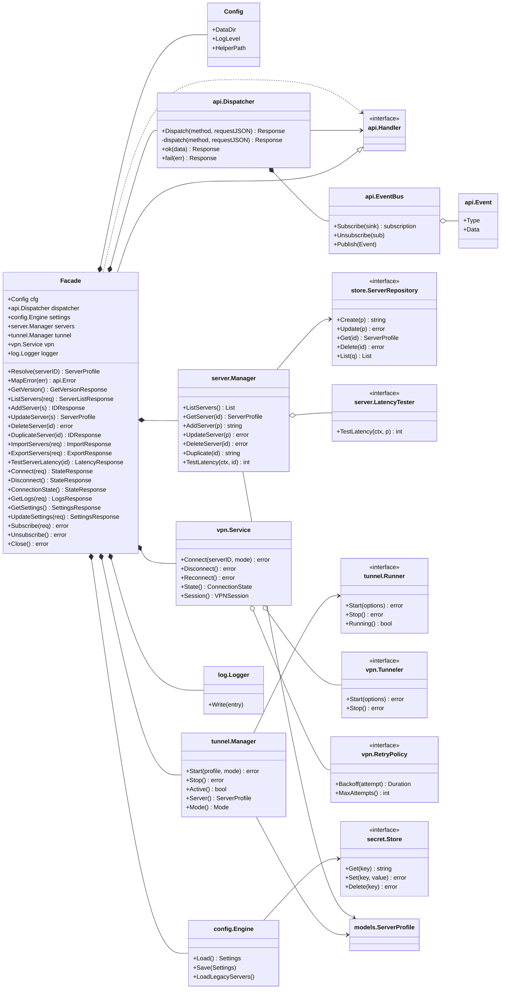
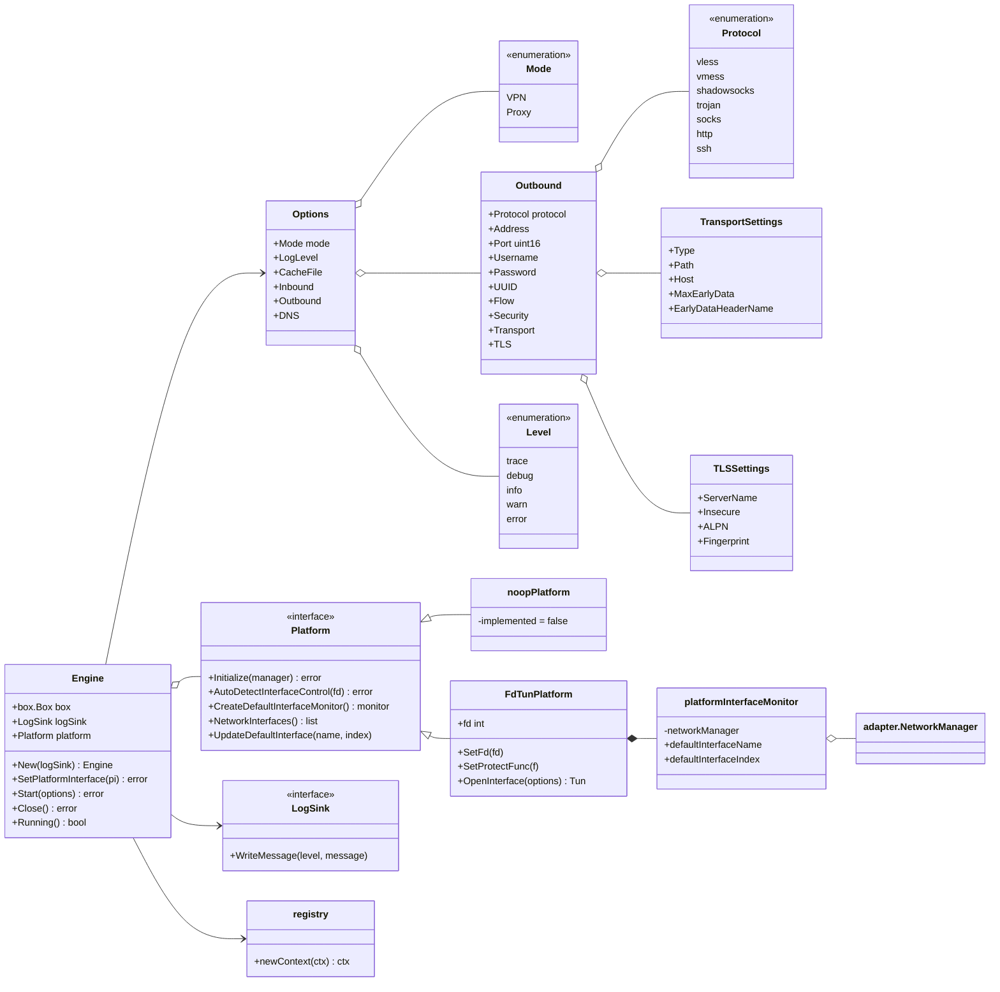
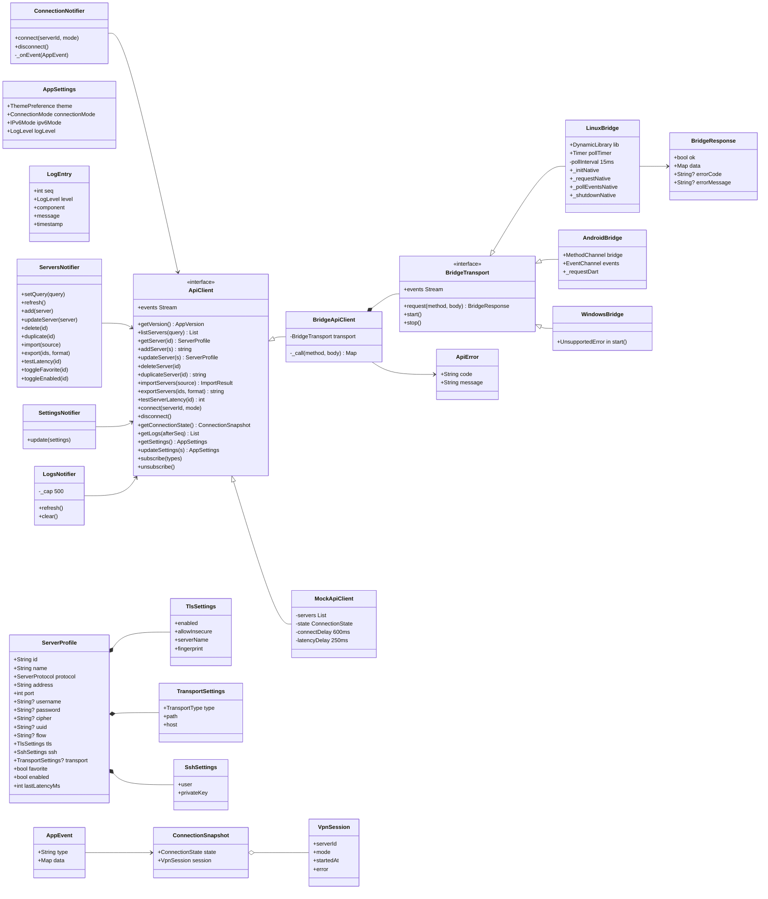
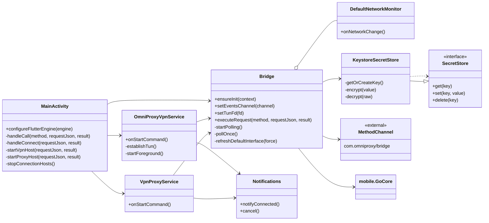
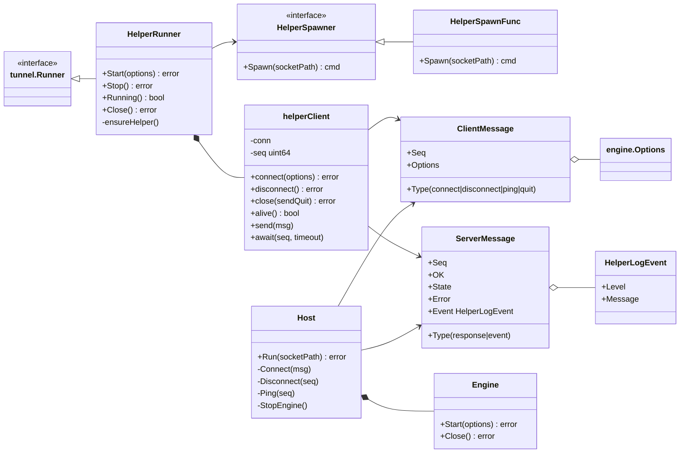

# Class Diagrams — OmniProxy Atlas

Static structure of the three codebases (Go core, Flutter/Dart app, Android host) and the
helper protocol, consolidated from source. This is the third of three *atlas* docs:

- `docs/SEQUENCE_DIAGRAMS.md` — dynamic flows between these types.
- `docs/FLOWCHARTS.md` — decisions and state machines that drive them.
- `docs/api-contract.md` — the wire contract the Dart `ApiClient` and Go `api.Handler`
  implement.

Reading conventions:

- `«interface»` marks an interface/abstract type; a dashed line to it (`<|--`) is an
  implementation.
- Solid diamond (`*--`) = composition (owner creates/destroys), hollow diamond (`o--`) =
  aggregation, plain arrow (`-->`) = usage dependency.
- Each class is anchored with `path:line`; only the primary location is listed.
- After each diagram, "Relationship notes" call out the non-obvious choices and the reason.

---

## 1. Core layer — Facade and collaborators

**Relationship notes.**

- `Facade` is a composition root: it owns every service (`*--`) and exposes them all
  through the `api.Handler` interface (`core/core.go:74`). `api.Dispatcher` talks only to
  the interface, so the two sides of the bridge are decoupled — that is what lets the same
  contract run over FFI, MethodChannel, and the mock.
- `server.LatencyTester`, `vpn.Tunneler`, `vpn.RetryPolicy`, and `store.ServerRepository`
  are interfaces so tests can substitute them (mock latency, in-memory repo, fixed retry
  policy). The core itself never depends on a concrete network prober.
- `config.Engine` → `secret.Store`: the settings blob is encrypted at rest with the
  OS-backed data key (`core/secret/crypto.go:56`); the repo itself never sees the plaintext
  settings.

---

## 2. Engine layer — sing-box wrapper

**Relationship notes.**

- `Engine` is deliberately thin: it holds one `box.Box`, adapts sing-box logs to
  `LogSink`, and wires the `Platform` (Linux: `engine/platform_fd.go:19`; Android overrides
  via the mobile bridge). `noopPlatform` (`engine/platform.go:22`) opts out of every
  platform hook so the same engine builds on hosts that create TUN themselves.
- `FdTunPlatform` composes a passive `platformInterfaceMonitor`
  (`engine/platform_monitor.go:31`): on Android the host reports the default interface
  through `Bridge.DefaultNetworkMonitor` instead of the engine watching netlink, because
  Android forbids an app from subscribing to physical-interface events. The monitor keeps
  `NetworkManager`'s interface list populated so `AutoDetectInterface` dialing doesn't fail
  with "no available network interface" (`platform_fd.go:145`).
- `registry.newContext` (`engine/registry.go:31`) is a package-level factory, shown as a
  static class, that registers exactly the MVP's protocol registries.

---

## 3. Dart app layer — contract, transport, state

**Relationship notes.**

- `ApiClient` is the app's only view of the core (`app/lib/core/api_client.dart:9`).
  `BridgeApiClient` (`bridge_api_client.dart:9`) is pure transport plumbing — it calls
  `BridgeTransport.request`, unwraps `BridgeResponse`, and throws `ApiError` with the
  contract error code; `MockApiClient` implements the same interface in memory for dev/test
  and any platform without a bridge (`mock_api_client.dart:17`, seeds three servers — "Tokyo
  Relay" vless, "Frankfurt Shadowsocks", "Local HTTP", `mock_api_client.dart:41-83`).
- `BridgeTransport` is the seam (`bridge_transport.dart:24`): Linux (FFI), Android
  (MethodChannel), Windows (FFI). Each transport owns the poller/timer that drains the
  event ring, so the poll cadence is a per-platform concern (15 ms Linux, 15 ms Windows, 25 ms Android).
- `ServerProfile` composes its TLS/transport/SSH settings; credential fields are plain
  strings on the wire and are stored as *refs* by the core (see FLOWCHARTS § 9/10 in the
  sequence doc) — never as plaintext.
- Notifiers (`ConnectionNotifier`, `ServersNotifier`, …) depend on `ApiClient` and react
  to `AppEvent`s; the UI never calls the transport directly.

---

## 4. Android host (Kotlin)

**Relationship notes.**

- `Bridge` is a singleton (`object`, `Bridge.kt:29`) holding the app context, the events
  channel, and the poll thread — one instance per process. `MainActivity` only wires it in
  `configureFlutterEngine` (`MainActivity.kt:23`) and routes the `connect` method specially
  (`handleConnect`) because of the `VpnService` consent flow; every other method goes
  straight to `executeRequest`.
- `OmniProxyVpnService` (VPN mode) and `VpnProxyService` (proxy mode) both depend on
  `Bridge` to hand the core the TUN fd and to run the `connect` command; `MainActivity`
  starts whichever matches the requested mode and calls `stopConnectionHosts` on
  disconnect (`MainActivity.kt:92`).
- `KeystoreSecretStore` implements `SecretStore` (`KeystoreSecretStore.kt:28`) with a
  non-exportable Keystore AES-256 key and ciphertext in private SharedPreferences. It is
  the OS-native secure store that the core's `secret.Store` interface abstracts over.

---

## 5. Helper protocol (Linux privileged path)

**Relationship notes.**

- `HelperRunner` (the `tunnel.Runner` implementation used for VPN mode on Linux,
  `helper_client.go:83`) composes one `helperClient` per session and a `HelperSpawner`.
  `NewHelperSpawner` (`helper_client.go:41`) is a `HelperSpawnFunc` that runs
  `pkexec omniproxy-helper`; the `OMNIPROXY_HELPER` env override swaps in a direct spawn
  for tests — a seam identical in shape to the core's other injected interfaces.
- Messages are `seq`-matched: `ClientMessage` carries the caller's sequence and
  `ServerMessage` echoes it (`helperproto.go`), so `await(seq, timeout)` can't be confused
  by a stale reply.
- `Host` (`helperhost.go`) owns the `Engine` lifecycle and serves exactly one control
  connection: closing the connection or a `quit` message triggers `StopEngine()`, which is
  how the design guarantees no orphaned root TUN on crash.
