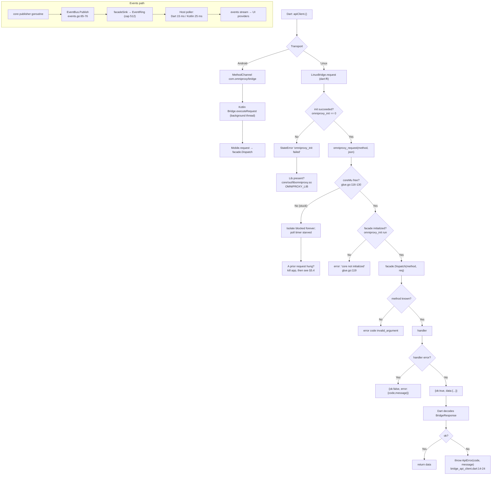

# OmniProxy — Debugging Guide

**Scope:** troubleshooting the OmniProxy stack end to end — Flutter UI, Dart↔Go bridge
(MethodChannel on Android, `dart:ffi` into a c-shared lib on Linux), the Go core,
the embedded sing-box engine, the privileged Linux helper, the TUN/VPN path, and the
Android native layer.
**Companions:** `docs/implementation-plan.md` (plan/milestones), `docs/api-contract.md`
(bridge contract), `docs/platform-notes.md` (per-platform notes), `docs/GO_RUNTIME.md`
(goroutine/lock model), `docs/FLUTTER_GO_FFI.md` (FFI internals), `docs/LOW_LEVEL.md`
(allocations/ownership/gaps), `docs/SECURITY.md` (trust boundaries), `docs/NETWORK_FLOW.md`
and `docs/VPN_INTERNALS.md` (traffic path). See §11 for the full map.

Every claim below carries a `file:line` pointer so you can jump straight at the code.
"Engines" in this document always means the pinned sing-box module (`core/core.go:30`),
never the sing-box CLI.

---

## 1. Purpose & scope

This guide answers three questions, in increasing depth:

1. **What do I run, and what do I look at first?** (§2–§3)
2. **Where in the stack did my call fail?** (§4–§8)
3. **What broke, and how do I fix it?** (§9–§10)

The stack has four runtimes and two process models:

| Layer | Tech | Lives in | Process(es) |
|---|---|---|---|
| UI | Flutter/Dart | `app/lib/` | App process |
| Bridge | MethodChannel / `dart:ffi` | `app/lib/core/bridge/` + `core/glue` / `core/mobile` | App process |
| Core | Go | `core/` | App process; **VPN-mode engine runs in the helper process on Linux** |
| Engine | sing-box (embedded module) | `engine/` | App process (proxy mode) or helper process (Linux VPN mode) |

Rules that shape every debug session (from `AGENTS.md` / `PRD.md`):

- Logs must never contain credentials, private keys, or raw traffic. If you see a
  real secret in a log line, that is a bug (§2.4, §10).
- Users never hand-edit JSON; the visual builders generate the sing-box config. If a
  debug repro needs raw config, build it from `engine/config.go` instead of by hand.
- Bridges are **pure transport** — if a platform behaves differently, the difference
  is in the native layer, not in `core/` (`docs/implementation-plan.md:83`).
- Never reimplement VPN/tunnel/crypto/parsing; all networking goes through the engine
  (`AGENTS.md`).

When in doubt about behavior vs. plan, `PRD.md` wins; if plan and PRD disagree, ask.

---

## 2. Logging & observability

### 2.1 What is logged and where

The Go core produces structured logs through `core/log`:

- **Console sink** — one line per entry, format
  `RFC3339-UTC LEVEL COMPONENT message {json-context}` (`core/log/logger.go:39-56`).
  Example:

  ```
  2026-08-06T14:23:01Z INFO vpn connecting to "Tokyo Relay" (vpn) {}
  ```

- **In-memory ring** — the last N entries with a monotonic `seq`, served to the UI via
  the `getLogs` bridge method (`core/log/ring.go:28-62`). The Flutter Logs screen caps
  at 500 entries and dedupes by `seq` (`docs/FLUTTER.md:188`; `app/lib/features/logs/`).

- **Engine logs** — sing-box writes through `platformLogWriter` into the core's sink
  (`engine/log.go:44-58`; wired in `engine/engine.go:60`). In Linux VPN mode the engine
  lives in the helper, so its log lines cross the control socket as `HelperLogEvent`
  (`core/tunnel/helperproto/helperproto.go:31-34`) and are re-emitted by the client as
  component `engine` (`core/tunnel/helper_client.go:249-253`).

Where the console sink lands depends on the host process:

- **Linux, proxy mode** — the app process's stdout/stderr (run `flutter run -d linux`
  or the release binary from a terminal).
- **Linux, VPN mode** — core logs to the app process; **engine** logs come from the
  helper process and are forwarded over the socket, so they appear in the app's stderr
  and in `getLogs` (socket carries only control messages + log lines, never traffic
  bytes — `docs/LINUX.md:323`). The helper also prints its own fatal errors to stderr
  (`core/cmd/omniproxy-helper/main.go:24-27`).
- **Android** — process stdout is captured by logcat under the app's pid; the Kotlin
  bridge logs with tag `OmniProxyBridge` (`app/android/.../Bridge.kt:30`).

### 2.2 Raising the log level

- **Contract:** `updateSettings {logLevel}`; valid values `trace|debug|info|warn|error`
  (`docs/api-contract.md:108`, `core/models/settings.go:15-47`). Settings are re-applied
  on the next engine start; the setting write path never touches the running tunnel
  (`docs/platform-notes.md`).
- **Linux bridge init:** `omniproxy_init` takes `logLevel` in its JSON config
  (`core/glue/glue.go:73`); the Dart transport defaults it to `info`
  (`app/lib/core/bridge/bridge_linux.dart:56`).
- **Android init:** the Kotlin host hard-codes `"logLevel": "info"` at init
  (`app/android/.../Bridge.kt:65`); change the Settings screen value afterward via
  `updateSettings`.
- **Engine level:** `engine.Options.LogLevel` maps into sing-box's `Log.Level`
  (`engine/config.go:186-189`), fed from `tunnel.BuildEngineOptions`
  (`core/tunnel/options.go:16-30`). At `trace`/`debug` the engine log volume dominates
  (`docs/GO_RUNTIME.md:279`).

### 2.3 Events (the async channel)

State changes and log lines reach the UI asynchronously:

`EventBus.Publish` (publisher's goroutine, non-blocking sinks — `core/api/events.go:65-76`)
→ subscription-gated `facadeSink` (`core/core.go:381-419`) → transport `EventRing`
(cap 512, drop-oldest on overflow — `core/internal/ring/ring.go`) → polled by the host
(Dart `Timer.periodic` 15 ms — `bridge_linux.dart:41,68`; Kotlin `HandlerThread` 25 ms —
`Bridge.kt:31,251-264`).

**Event types:** `stateChanged`, `logAppended`, `latencyTested` (`core/api/contract.go:31-35`).

### 2.4 Redaction — what you should and should not see

- Registered secrets are replaced with `[REDACTED]` before any sink
  (`core/log/redactor.go:9,49-54`).
- Registration is **case-insensitive** and **additive**: each `Redactor.Add` folds its
  secrets into a master pattern (`core/log/redactor.go:25-47`, `compile` at `:60-70`), so
  `SQLiteServerRepository.registerRedact` re-adding credentials per `Get`/`List`
  (`core/store/server_repository.go:283-287`) is harmless — every registered secret stays
  masked. Covered by `TestRedactorIsAdditive`.
- Secrets **shorter than 3 characters are ignored** (`core/log/redactor.go:31-35`) to
  avoid mangling words.

**Debug rule:** if you see a raw UUID/password/SSH key in any log output, treat it as a
redaction bug and file it; do not work around it.

### 2.5 Fast observability commands

```bash
# Linux: run the app in a terminal and watch both processes
flutter run -d linux 2>&1 | tee /tmp/omniproxy-run.log

# Watch helper spawn (pkexec prompt + helper stderr)
journalctl --user -f | grep -i omniproxy        # if polkit logs to journal

# Android: logcat, bridge tag only
adb logcat -s OmniProxyBridge:*                 # Bridge.kt:30

# Android: everything omniproxy-ish (process + engine lines)
adb logcat | grep -iE 'omniproxy|sing-box|omniproxy-helper'

# Android: core writes to process stdout; tag by pid if you know it
adb logcat --pid=$(adb shell pidof com.omniproxy.omniproxy)
```

---

## 3. Running the tests

Everything is driven from the repo-root `Makefile`; recipes live at
`Makefile:51-84` (quality gates/tests) and `Makefile:86-163` (builds).

### 3.1 Command table

| What | Command | Where it runs | Notes |
|---|---|---|---|
| Static + format gates | `make check` | `Makefile:54-75` | `go build`+`go vet`+`gofmt -l` on `core/` and `engine/`, then `flutter analyze` |
| Unit/widget tests | `make test` | `Makefile:62-78` | `go test -count=1 ./...` in `core/` and `engine/`, then `flutter test` |
| Linux bridge E2E | `cd app && flutter test test/e2e_linux_bridge_test.dart` | part of `make test` | **skips silently** unless `core/out/libomniproxy.so` exists (`app/test/e2e_linux_bridge_test.dart:19-28`) — run `tools/build_linux.sh` first |
| Android device E2E | `make e2e-android` (or `make e2e-android DEVICE=<id>`) | `Makefile:82-84` | proxy mode needs no consent; VPN case needs `--dart-define=OMNIPROXY_VPN_E2E=true` + an external adb watcher to accept the consent dialog (`app/integration_test/bridge_e2e_test.dart:16-22,78-110`; `docs/ANDROID.md:154`) |
| One Go package | `(cd core && go test -count=1 -run TestName ./tunnel/...)` | — | `-run` for a single test |
| One engine test | `(cd engine && go test -count=1 -run TestBuildTrojanOutbound ./...)` | — | config-builder coverage lives in `engine/engine_test.go` |
| Race detector | `(cd core && go test -race ./...)` | — | whole core is goroutine-based; race regressions have burned real time (§5.5) |
| Linux artifacts | `tools/build_linux.sh` | `Makefile:115-116` | builds `libomniproxy.so` + `omniproxy-helper` into `core/out/` |
| Android AAR | `make aar` | `Makefile:89-101` | gomobile bind; **must rerun after every core change** — the `.aar` is a checked-in artifact, not built by Gradle (`docs/ANDROID.md:153`) |
| Windows core | `make windows-core` | `Makefile:128-137` | mingw cross-compile; app bundle needs a Windows host (`Makefile:156-160`) |

Raw commands (from `README.md:34-56`, `docs/implementation-plan.md:115-133`):

```bash
(cd core && go build ./... && go vet ./... && go test -count=1 ./...)
(cd engine && go build ./... && go vet ./...)
(cd app && flutter analyze && flutter test)
(cd app && flutter build linux --release)
(cd app && flutter build apk --release)
```

### 3.2 The Linux E2E skip trap

`flutter test` only exercises the real bridge if the c-shared lib is present; otherwise
`e2e_linux_bridge_test.dart` skips and **the suite still reports green**
(`app/test/e2e_linux_bridge_test.dart:19-28`). If you changed anything in
`core/glue` or `engine/`, rebuild first:

```bash
tools/build_linux.sh && cd app && flutter test test/e2e_linux_bridge_test.dart
```

The Dart side locates the lib via `OMNIPROXY_LIB` (env or `--dart-define`), else
`<cwd>/../core/out/libomniproxy.so`, else plain `libomniproxy.so`
(`bridge_linux.dart:148-156`).

### 3.3 What each engine test covers

- `engine/engine_test.go` — config builder: mixed inbound on port 9080, route `final:
  "proxy"`, two outbounds (`direct` + the selected protocol) for proxy mode
  (`TestBuildProxyConfig`), plus per-protocol outbound builders such as
  `TestBuildTrojanOutbound` (`engine_test.go:376-396`).
- `engine/e2e_test.go` — a real loop: local SOCKS5 test server + echo server, engine
  start, traffic through it (`startEchoServer`/`startSocks5Server` at
  `engine/e2e_test.go:1-80`). This is the fastest way to repro an engine-level routing
  bug without any Flutter layer.
- `core/tunnel/helperhost_test.go:16-20` — helper control protocol, but
  **unprivileged-to-unprivileged**; it does not reproduce the root socket-ownership
  scenario (§6.4, §10.1).

---

## 4. Debugging the FFI boundary

### 4.1 The two transports, one contract

- **Linux/Windows:** `dart:ffi` into `libomniproxy.so` (c-shared, built from
  `core/glue`). Five exported symbols (`core/glue/glue.go:71-161`):
  `omniproxy_init`, `omniproxy_request`, `omniproxy_poll_events`,
  `omniproxy_shutdown`, `omniproxy_free_string`. Events are **polled**, not pushed —
  the push design was dropped because a native event callback deadlocks while the
  isolate is blocked in a synchronous FFI request (`core/glue/glue.go:6-11`;
  `docs/implementation-plan.md:96`).
- **Android:** MethodChannel `com.omniproxy/bridge` for requests, `com.omniproxy/events`
  for events (`app/lib/core/bridge/bridge_android.dart:18-19`; Kotlin host in
  `app/android/.../Bridge.kt`). Same JSON contract.
- **Contract:** every transport returns `{ok:true,data}|{ok:false,error:{code,message}}`
  (`core/api/contract.go:56-60`). Method names are the canonical list in
  `core/api/contract.go:9-28`; unknown methods → `invalid_argument`
  (`core/api/dispatch.go`).

### 4.2 Triage: "where did my call fail?"

Follow the diagram, then the checklist below it.



### 4.3 Checklist

1. **Is the lib loaded at all?** Linux: `flutter test`/`flutter run` from the repo root
   so the `../core/out` relative path resolves (`bridge_linux.dart:152-154`), or set
   `OMNIPROXY_LIB`. Android: the `.aar` in `app/android/app/libs/` must exist — rebuild
   with `make aar` after core changes (`docs/ANDROID.md:153`).
2. **Init failed?** `omniproxy_init` returns `-1` on JSON or `core.New` errors
   (`core/glue/glue.go:72-112`); Dart throws `StateError('omniproxy_init failed …')`
   (`bridge_linux.dart:63-66`). Re-run with `dataDir`/`logLevel`/`helperPath` printed —
   that JSON is the first thing that can be wrong (`bridge_linux.dart:52-58`).
3. **Response is `ok:false` with a code?** That is the core telling you the method ran
   and failed — see the error-code list in `core/api/contract.go:38-47`. `busy` means a
   connect raced an existing session (`core/vpn/service.go:165-169`); `connected`
   means an update/delete was rejected while that server is live; `not_found` is a
   stale id.
4. **Dart throws instead of returning?** `ApiError` is thrown from `bridge_api_client.dart`
   only when `ok == false` (`bridge_api_client.dart:14-24`). A `StateError`/`TypeError`
   means malformed JSON crossed the boundary — check the transport's decoding
   (`bridge_linux.dart:99-119`), and consider a `ffi/` mismatch (ABI drift) if you rebuilt
   the `.so` under a different Go version.
5. **Events never arrive but requests work?** Poller not started or starved: on Linux the
   `Timer.periodic` (15 ms) only fires when the isolate is not blocked in a request
   (`bridge_linux.dart:68,122-138`); on Android the poller is a dedicated `HandlerThread`
   (`Bridge.kt:251-264`) and the events channel must be registered with
   `setEventsChannel` before use. Also check ring overflow — events older than 512 get
   dropped (§10.2).
6. **Hang (no response, no throw)?** A synchronous FFI request has **no Dart-side
   timeout** (`bridge_linux.dart:85-120`). The call is stuck inside Go — see §5.4. On
   Android the Kotlin side runs requests on a `Thread` (`Bridge.kt:215-222`) so the UI
   stays alive; a wedged core still wedges that thread.
7. **Isolate deadlocks / poll starved?** Only ever call one request at a time from Dart
   (they are synchronous and serialized by the transport), and never call from inside an
   event callback.

### 4.4 FFI memory rules (rarely the bug, always the suspect)

- Every `char*` returned by core must be freed via `omniproxy_free_string`
  (`bridge_linux.dart:140-144`); every `toNativeUtf8()` buffer via `malloc.free`
  (`bridge_linux.dart:90-97`). The full allocation/ownership table is canonical in
  `docs/FLUTTER_GO_FFI.md:555-572`.
- The string is fully materialized by `toDartString()` before C memory is freed, so no
  dangling reads (`docs/FLUTTER_GO_FFI.md:611`).
- **No panic recovery:** the glue has no `recover()`, so a Go panic inside an exported
  function crashes the whole app (`core/glue/glue.go` — verified by grep in
  `docs/FLUTTER_GO_FFI.md:706-713,753-754`). Known gap, §10.4.

---

## 5. Debugging the Go core

### 5.1 Startup and wiring

`core.New` builds the facade (config → store → server manager → tunnel manager → vpn
service), the dispatcher, and the event bus (`core/core.go`; component wiring table in
`docs/ARCHITECTURE.md:106-172`). On Linux the runner is helper-aware: proxy mode runs
in-process, VPN mode spawns the helper (`core/tunnel/helper_client.go:60-96`).

### 5.2 The state machine (most bugs live here)

Connection states: `disconnected | connecting | connected | reconnecting | error`
(`core/api/contract.go`, `core/vpn/service.go`). The one goroutine that owns all
transitions is `runLoop` (`core/vpn/service.go:268-321`):

- `Connect` resolves the profile, reaps any stale loop, creates a `VPNSession`, then
  returns immediately — the loop goroutine does the work (`service.go:156-210`). The
  UI learns the result only via `stateChanged` events, never from the `connect` return.
- Failed starts are retried with exponential backoff (1 s doubling, cap 30 s, max 5
  attempts; `DefaultRetryPolicy` at `service.go:42-58`) only when auto-reconnect is on
  (`service.go:323-333`).
- **`ErrBusy`** is returned if a connect races an active `connecting|connected|reconnecting`
  state (`service.go:165-169`) — the UI surfaces this; a spurious "already connecting"
  after a failed connect usually means a stale `Error` state wasn't reset (see
  `Reconnect` at `service.go:242-263`).

Debug entry point for "connect isn't going Connected": read the `vpn`-component log
lines and the latest `stateChanged` event in order — the loop always emits one per
transition (`service.go:370-385,482-493`).

### 5.3 Error classification

`classify` maps tunnel errors onto contract codes by substring:
`permission denied`/`not permitted`/`privileged helper` → `unauthorized`;
`already running` → `busy`; everything else → `engine` (`service.go:513-526`). A helper
auth failure therefore surfaces as `unauthorized` — do not expect a distinct code.

### 5.4 The hang report (request returns nothing)

The one structural hang source is documented in `docs/GO_RUNTIME.md:265,372`:
`engine.Start` uses `context.Background()` (`engine/engine.go:54`), so a hung
`box.Start` cannot be cancelled by `runLoop`'s context. Consequences and mitigation:

- `runLoop` stays blocked holding `Manager.mu`; a later `Disconnect`'s
  `forceDisconnect → tunnel.Stop` can stall on the FFI thread past its 5 s bound
  (`service.go:231-237,453-473`).
- **Repro:** wrap `box.New`/`sb.Start` — the only place a `connect` can block
  indefinitely is `engine/engine.go:57-66`.
- **Observe:** `GODEBUG` won't help mid-hang; attach with a profiler or check for the
  helper process still being alive (`pgrep -af omniproxy-helper`). If the helper is
  hung, the socket won't answer → client `connect` times out at 30 s
  (`helper_client.go` timeouts; see §6).

### 5.5 Concurrency gotchas (what the race detector catches)

- **Lock order** is fixed: `coreMu`/`mobile.mu` → `subMu` → `bus.mu` → `ring.mu`, ring
  always leaf (`docs/GO_RUNTIME.md:98,350`). `facadeSink` releases `subMu` before the
  sink call (`core/core.go:407-419`); `Publish` releases `bus.mu` before delivery
  (`core/api/events.go:65-76`).
- **Command drops:** `sendCmd` is non-blocking with a 1-cap buffer (`service.go:475-480`);
  a racing `Disconnect`+`Reconnect` can drop a command. Safe by design, but if you see
  a session that "ignored" a reconnect, this is why (`docs/GO_RUNTIME.md:366-370`).
- **Log map reuse:** the logger recurses into context maps and redacts copies; do not
  reuse one map across goroutines (`docs/GO_RUNTIME.md:384`).

### 5.6 Storage / secret failures

- SQLite: `busy_timeout(5000)` + WAL (`core/store/store.go:26-27`); pure-Go driver
  (no cgo). `SQLITE_BUSY` should self-resolve within 5 s; a persistent one means a
  transaction is held open.
- Secrets: OS keyring under service `"omniproxy"` (`core/secret/keyring.go:16-20`);
  if the keyring is unavailable the store falls back to **in-memory** — the at-rest
  data key then does not survive restart, settings are resealed under a fresh key, and
  old data becomes unreadable (behavior in `core/secret/store.go` and
  `core/secret/crypto.go`; "config corrupted" reports on Linux/headless are the classic
  symptom). Windows uses Credential Manager/DPAPI, Android the Keystore
  (`docs/implementation-plan.md:104`).

---

## 6. Debugging the Linux helper

### 6.1 Architecture in one paragraph

VPN mode needs `CAP_NET_ADMIN`; the app must not hold it. A tiny privileged process
(`omniproxy-helper`, root via pkexec) hosts the **whole engine** and the TUN; the
unprivileged core is a JSON-over-Unix-socket client that sends `connect`/`disconnect`/
`ping`/`quit` and streams engine log lines back (`docs/platform-notes.md:63`;
`core/tunnel/helperproto/helperproto.go:15-34`; `docs/implementation-plan.md:26`).
This is **not** fd-passing — TUN setup + auto-route need the engine's own process
credentials. (The `tools/README.md` wording "helper created via sing-tun; fd passed
over Unix socket" is stale — fd-passing is Android-only; see §8.)

### 6.2 Control socket

- Path: `$XDG_RUNTIME_DIR/omniproxy/helper.sock`, falling back to
  `/tmp/omniproxy/helper.sock` (`core/tunnel/helper_proto.go:25-35`). Created 0700 dir,
  socket `chmod 0600`, stale socket removed, **single client accepted**
  (`core/tunnel/helperhost/helperhost.go:24-42`).
- Wire: newline-delimited JSON, requests correlated by `seq`, `pending` map + `await`
  timeouts (`core/tunnel/helper_client.go:206-311`).
- Client lifecycle: `connect` (30 s), `disconnect` (5 s), `Close` sends `quit` then
  reaps the process with a 2 s grace before `Kill` (`helper_client.go:126-159`).

### 6.3 Reproducing without the app

```bash
# 1. Build the helper
tools/build_linux.sh                      # -> core/out/omniproxy-helper

# 2. Run it directly (needs root; pick a throwaway runtime dir)
XDG_RUNTIME_DIR=/tmp/omni-debug ./core/out/omniproxy-helper --socket /tmp/omni-debug/omniproxy/helper.sock

# 3. Drive it from a test instead (best): the helper host is exercised directly
(cd core && go test -count=1 -run TestHelper ./tunnel/...)
```

`--socket` is required (`core/cmd/omniproxy-helper/main.go:18-22`). For a fully manual
repro, set `OMNIPROXY_HELPER` to a wrapper so the core spawns your binary instead of
`pkexec` (spawner override in `core/tunnel/helper_client.go:31-58`) — avoids the polkit
prompt in tests.

### 6.4 Socket ownership (fixed)

The helper runs as root via pkexec; it now `chown`s the socket (and its parent dir) to
the invoking user (`PKEXEC_UID`) and verifies the connecting peer via `SO_PEERCRED`
before serving (`core/tunnel/helperhost/helperhost.go:30-52`). The `0600` mode then
correctly means "only the invoking user's core can connect". Historical symptom (pre-fix):

- `dial unix ... permission denied` from the core when connecting in VPN mode.

Still **verify on a real pkexec run before release** — the unit tests exercise
unprivileged↔unprivileged (`core/tunnel/helperhost_test.go:16-20`) and set no
`PKEXEC_UID`, so they cover the default (direct-spawn) path, not the chown/peer path.

### 6.5 Helper gotchas

- **Single accept:** a second helper instance or a leftover connection blocks the
  socket — after a crash, remove the stale socket (`helperhost.go:28` removes on start).
- **Orphaned root TUN:** quit/EOF triggers `StopEngine`, so a dead client should not
  leave a TUN behind (`helperhost.go:58-63`). If an `omniproxy` interface lingers after
  a crash, delete it manually with `sudo ip link del omniproxy`.
- **Engine log lines** arrive as `HelperLogEvent` and are re-logged under component
  `engine` — a helper-side error (e.g. "outbound type not found") shows up in the app's
  logs and `getLogs`, not only in the helper's stderr.
- **Keepalive ping:** the client pings every 15 s (5 s timeout) and drops the
  connection when the helper stops answering (`core/tunnel/helper_client.go:36-42,
  335-378`), so a wedged helper is detected within ~20 s instead of at the next request.
- **Helper death / wedged drop:** an unexpected connection close fires a per-connection
  `lost` signal that `vpn.Service` selects on — the session drops to `Reconnecting` and
  re-spawns the helper, or to `Error` after the retry limit (`core/tunnel/helper_client.go:315-321`;
  `core/vpn/service.go:315,331-352` `Lost()`). Deliberate teardowns (`close(true)`) never fire it. §10.5.

---

## 7. Debugging Android

### 7.1 Boot order (get this wrong and nothing works)

1. `MainActivity` wires the two channels (`app/android/.../MainActivity.kt:16-17`).
2. `Bridge.ensureInit` registers the **Keystore SecretStore before** `Mobile.init` —
   the at-rest data key and credential refs must survive process restarts
   (`Bridge.kt:58-74`).
3. `Mobile.init` builds the core; the Kotlin host then starts the default-network
   monitor and the 25 ms event poller (`Bridge.kt:72-74,251-264`).

### 7.2 Proxy mode vs VPN mode

- **Proxy mode:** `VpnProxyService` hosts a mixed loopback inbound; `START_STICKY`
  foreground service with a persistent notification (`VpnProxyService.kt:36`;
  `Notifications.kt:11-12`, channel `omniproxy.connection`, id 1001). No consent.
- **VPN mode:** `OmniProxyVpnService` runs the VpnService; foreground type
  `FOREGROUND_SERVICE_TYPE_DATA_SYNC` on API ≥ 34 (`OmniProxyVpnService.kt:31-39`).
  `setTunFd` hands the TUN fd into the core (`Bridge.kt:198-200`) and the socket
  protector is registered so the engine's own sockets bypass the TUN
  (`Bridge.kt:202-209`; `engine/platform_fd.go:71-75,87-96`).

### 7.3 The consent dialog dance

`MainActivity` holds the pending `connect` `MethodChannel.Result` while the consent
dialog is up (`Bridge.kt:45-48`). Debugging hooks:

- **VPN mode connect hangs at "Connecting"** → consent not granted, or the activity
  result was never delivered. On API 36 `VpnService.setSession` was removed — code
  using it must be updated (`docs/implementation-plan.md:97`).
- **E2E automation:** `make e2e-android` with `--dart-define=OMNIPROXY_VPN_E2E=true`
  needs an external adb watcher to tap "Allow" (`app/integration_test/bridge_e2e_test.dart:16-22`).
  A reliable manual alternative: watch the `OmniProxyBridge` tag and tap once.
- **`connect` fails after consent with "engine: android tun fd not set"**
  (`engine/platform_fd.go:173-175`) → `setTunFd` ran before the fd was valid, or the
  VpnService was torn down. `Bridge.syncDefaultInterface()` must be called before
  `establish()` so the default network is cached before engine start
  (`Bridge.kt:107-110`).

### 7.4 The netlink ban (why Android looks special)

Android forbids netlink monitors and raw `net.Interfaces()` in the app sandbox, so the
core never touches netlink on Android:

- Kotlin enumerates interfaces via `java.net.NetworkInterface`, excluding `tun*`/`omni*`
  (`Bridge.kt:122-147`) and pushes the physical default network via `Mobile.setDefaultInterface`
  (`Bridge.kt:81-102,156-192`).
- `engine/platform_fd.go` returns the platform monitor + platform network interfaces
  (`platform_fd.go:100-121,145-150`) instead of the netlink-based ones. If sing-box
  nil-derefs at engine start on Android, it is almost always because the passive monitor
  wasn't fed before `Start` (`docs/implementation-plan.md:97`).

### 7.5 Logcat quick reference

```bash
adb logcat -s OmniProxyBridge:*                                   # bridge host (Bridge.kt:30)
adb logcat --pid=$(adb shell pidof com.omniproxy.omniproxy)       # app process incl. core stdout
adb shell dumpsys activity services com.omniproxy | grep -i vpn   # is the VpnService alive?
adb shell dumpsys connectivity | grep -i omniproxy                # TUN route + protect() status
adb shell run-as com.omniproxy.omniproxy ls -la files/            # dataDir: omniproxy.conf, omniproxy.db
```

---

## 8. Debugging TUN / network

### 8.1 What the engine actually builds

`engine/config.go` is the single place the sing-box config is produced (`buildOptions`,
`config.go:170-262`):

- **Proxy mode:** mixed inbound on `127.0.0.1:1080` by default (`config.go:139-141,240-259`),
  no TUN, no routes, no DNS changes (`docs/PROXY_ARCHITECTURE.md:227`).
- **VPN mode:** TUN inbound, defaults `omniproxy` / MTU 1500 / stack `mixed` /
  addresses `10.0.0.1/24` + `fd00::1/64` (`config.go:142-145,226-239,277-310`).
  `AutoRoute` defaults on unless `StrictRoute` is set (`config.go:298-300`).
- **DNS:** client queries go through `dns-proxy` (no leak); outbound dials use
  `dns-local` (no loop); TUN DNS is hijacked at the router (`config.go:146-153,195-217`).
  IPv6 mode defaults to `prefer_ipv4`; `disable_ipv6` adds a block rule + block outbound
  (`config.go:117-137,203-209`).
- **`with_gvisor`:** the userspace stack is compiled in via the `with_gvisor` build tag
  (`Makefile:26`); without it TUN packets fail in the `mixed` stack on platforms where
  the system stack can't be used.

### 8.2 Traffic-path triage

Reference packet-path diagrams: `docs/NETWORK_FLOW.md:340` (packets) and
`docs/VPN_INTERNALS.md:240` (sing-tun read/write loop). Quick questions in order:

1. **Is traffic entering the engine at all?** Proxy mode: `curl -x 127.0.0.1:1080 http://example.com`.
   VPN mode: `ip addr show omniproxy`; ping through the TUN; check `dumpsys connectivity`
   on Android. A missing TUN or address ⇒ helper didn't start or fd wasn't valid (§6/§7).
2. **Is routing dropping it?** Route `final: "proxy"` (`config.go:191-193`); IPv6 in
   `disable_ipv6` mode is *dropped by design* at the router, not leaked
   (`config.go:203-209`).
3. **Is the engine looping into itself?** The tunnel's own sockets must bypass the TUN:
   Linux via `AutoDetectInterface` (`config.go:216-217`); Android via `protect()`
   (`platform_fd.go:64-96`; `Bridge.kt:202-209`). Classic symptom of a broken protector:
   DNS for the outbound domain resolves via `dns-local`, whose direct socket re-enters
   the TUN, is hijacked, needs the same domain… → DNS timeout, "address not resolved".
4. **fd leak / dup:** on Android `OpenInterface` dups the VpnService fd before handing
   it to sing-tun (`platform_fd.go:167-190`); a leak shows as exhaustion of
   `LimitNOFILE`/`ulimit -n` after repeated connects.

### 8.3 Latency checks

`testServerLatency` is a **core TCP dial**, not a sing-box url-test
(`docs/implementation-plan.md:33`; `core/tunnel/latency.go`). If latency "succeeds" but
connect fails, the TCP dial path and the engine path differ (protocol/crypto/TLS) — the
TCP dial proves reachability only.

---

## 9. Common failure modes & resolutions

Symptom → cause → proof (`file:line`) → fix. Severity legend: **P0** blocks the
platform's core feature, **P1** major, **P2** minor/UX.

| # | Symptom | Cause | Evidence | Fix |
|---|---|---|---|---|
| 1 | ~~Connecting to a trojan server: engine error~~ | **RESOLVED** — trojan outbound was not registered in the engine registry (M9 added the model + builder, not the registration); now registered | Model + builder + tests: `core/models/server.go:22,30-38`, `engine/config.go:29,352-361`, `engine/engine_test.go:376-396`; registration at `engine/registry.go:49`; regression test `TestEngineStartTrojan` (`engine/engine_test.go:497-516`) reproduces the old `outbound type not found: trojan` failure without the registration | Fixed in `engine/registry.go` (import `protocol/trojan` + `outbound.Register` for `C.TypeTrojan`) |
| 2 | Windows app never actually connects; UI behaves but no VPN | Windows bridge is a stub that throws, and the factory silently falls back to `MockApiClient` | `app/lib/core/bridge/bridge_windows.dart:10,15` `UnsupportedError('WindowsBridge lands in M8')`; `app/lib/core/client_factory.dart:20-28` (Android→Linux→Mock); mock seeds fake servers (`mock_api_client.dart:41-51`) | **P0.** Implement the FFI transport (or wire `dart:ffi` into `omniproxy.dll`); do not ship the mock fallback. Cross-compile via `make windows-core` (`Makefile:128-137`) |
| 3 | ~~Linux VPN: `permission denied` dialing the helper socket~~ | **RESOLVED** — helper now `chown`s the socket to the pkexec caller and checks `SO_PEERCRED` | `helperhost.go:30-52` (`chownSocket`/`peerUID`, `PKEXEC_UID`); `core/tunnel/helperhost/helperhost_internal_test.go` | Fixed; still verify on a real pkexec run (§6.4) |
| 4 | VPN connect fails with `unauthorized` | Helper spawn/auth issue — `classify` maps helper errors to `unauthorized` | `core/vpn/service.go:513-526`; pkexec spawn at `helper_client.go:31-58` | **P1.** Check pkexec prompt; run helper directly (§6.3); verify socket perms (§6.4) |
| 5 | `connect` returns ok but state stays Reconnecting and flips to Error repeatedly | Failed start retried with backoff until cap (max 5) | `service.go:42-58,268-321,323-333` | Inspect the last `stateChanged`/`vpn` log for the underlying engine error; fix that; if transient, it self-recovers |
| 6 | A credential/UUID appears in logs | Redaction missed it: secrets <3 chars are ignored (carve-out for common words) | `redactor.go:31-35`; `server_repository.go:283-295` | **DONE** — every credential-bearing field is registered (password/UUID/SSH private key + SSH host key, Reality public key/shortId/spiderX, WS host/path) and covered by `TestRedactorCoversCredentialFields` (full-profile round-trip). If a secret still leaks, check the registerRedact call site and the <3-char carve-out. |
| 7 | App crash instead of an error from the bridge | No panic recovery across FFI | `core/glue/glue.go` (no `recover`); `docs/FLUTTER_GO_FFI.md:706-713,753-754` | **P2.** Wrap exported functions in `defer recover()` returning an `internal` error envelope |
| 8 | Events missing after a burst (UI briefly stale) | Ring cap 512 drops oldest silently | `core/internal/ring/ring.go` (drop-oldest on overflow); `docs/GO_RUNTIME.md:282` | **P2.** By design; consider raising the cap or draining on subscription |
| 9 | After restart, settings appear reset / "config corrupted" | OS keyring unavailable → in-memory fallback → at-rest key regenerated, old blob unreadable | `core/secret/keyring.go:16-20`, `core/secret/store.go`, `crypto.go` key regen path | **P2.** Verify keyring service availability (`secret-tool` on Linux); report not as data loss but as fallback behavior |
| 10 | Android VPN: connect stuck "Connecting" after granting consent | Consent flow pending result never completed, or fd not yet valid | `Bridge.kt:45-48` (pendingConnect), `OmniProxyVpnService.kt:31-39`; `engine/platform_fd.go:173-175` (`tun fd not set`) | **P1.** Ensure `setTunFd`/`syncDefaultInterface` run before `establish()`; check `adb shell dumpsys activity services` |
| 11 | Android: engine nil-derefs at Start | Passive default-interface monitor not fed before engine start (netlink banned) | `platform_fd.go:100-121`; `Bridge.kt:81-110`; `docs/implementation-plan.md:97` | **P1.** `Bridge.syncDefaultInterface()` before `establish()`; keep the monitor fed on network change |
| 12 | TLS: certificate errors despite "Allow insecure certificates" | `Insecure` is only wired when TLS is enabled and profile has TLS configured; bypass now gated behind Advanced Mode (locked toggle + warning dialog) | `core/tunnel/options.go:103-113` (`tlsIfEnabled`), `engine/config.go:420-434`; UI toggle `app/lib/features/servers/server_edit_screen.dart:333-354,458-466`; gating done per `docs/SECURITY.md:146-147` | **P2.** Confirm TLS.Enabled on the profile; the toggle only takes effect for TLS-capable protocols. The Advanced-Mode gate is now built |
| 13 | Proxy mode works, VPN mode doesn't (Linux) | Engine running in the wrong process — proxy runs in-process, VPN must use the helper | `core/tunnel/helper_client.go:60-96` (mode-aware runner) | **P2.** Mode mismatch surfaces as helper/privilege errors; verify the runner is `NewHelperAwareRunner` (`glue.go:92`) |
| 14 | Repeated connects leak fds | TUN fd dup per `OpenInterface` not balanced | `engine/platform_fd.go:167-190` (`unix.Dup`); helper single-accept reaping at `helper_client.go:126-159` | **P2.** Watch `ulimit -n`/`ls /proc/<pid>/fd`; ensure each Start is paired with Close |
| 15 | Linux helper left a TUN behind | Crash between engine start and teardown | `helperhost.go:58-63` (EOF/quit → StopEngine) | **P2.** `sudo ip link del omniproxy`; root-cause the crash in the helper's stderr |
| 16 | `SQLITE_BUSY` errors | Long transaction; WAL + busy_timeout(5000) should absorb it | `core/store/store.go:26-27` | **P2.** Look for a held transaction; bump the pragma only as a last resort |
| 17 | Engine version drift breaks config (`sniff` field etc.) | sing-box is actively developed; pinned to v1.13.15 | `core/core.go:30` (`EngineVersion`); `docs/implementation-plan.md:30,97` (M7 dropped `sniff`) | **P2.** Never bump the engine mid-release; upgrade deliberately and re-run `engine/` tests |

---

## 10. Known bugs & gaps registry

Prioritized; each is cross-referenced to its full analysis elsewhere. **P0** = blocks the
platform's core feature today.

| Sev | Gap | Evidence | Tracked in |
|---|---|---|---|
| ~~**P0**~~ | ~~**Trojan outbound not registered**~~ — **RESOLVED**: registration added to `engine/registry.go`; guarded by `TestEngineStartTrojan` | `engine/registry.go:49`; `engine_test.go:497-516`; config builder `engine/config.go:352-361`; model `core/models/server.go:22,30-38` | §9 row 1 (resolved) |
| **P0** | **Windows is a stub** with silent `MockApiClient` fallback | `bridge_windows.dart:10,15`; `client_factory.dart:20-28` | §9 row 2; `docs/WINDOWS.md` |
| ~~**P1**~~ | ~~**Helper socket ownership wrinkle**~~ — **RESOLVED**: helper `chown`s the socket to the pkexec caller + `SO_PEERCRED` check; verify on a real pkexec run | `helperhost.go:30-52`; `docs/LINUX.md:452`; `docs/SECURITY.md:160,198` | §6.4; §9 row 3 (resolved) |
| ~~**P1**~~ | ~~**Redaction not additive**~~ — **RESOLVED**: `Redactor.Add` folds into a master union pattern | `redactor.go:25-70`; `TestRedactorIsAdditive`; `server_repository.go:283-287`; `docs/GO_RUNTIME.md:380` | §2.4; §9 row 6 (resolved) |
| ~~**P1**~~ | ~~**No client keepalive**~~ — **RESOLVED**: client pings every 15 s (5 s timeout) and drops a hung helper's connection; the unexpected drop (helper death/wedge) now also drives the state machine to `Reconnecting`/`Error` | `helper_client.go:36-42,315-321,335-378`; `TestHelperClientSendsKeepalivePing`, `TestHelperClientDetectsWedgedHelper`, `TestHelperClientNotifiesLostOnDeath`; `vpn/service.go:315,331-352` `Lost()` | §6.5 |
| **P1** | **Credential plaintext over the helper socket** — `ClientMessage.Options` carries full engine options incl. password/UUID/SSH key; root-level trust boundary, nothing redacts the wire | `helperproto.go:15-19`; `engine/config.go` outbound fields; `docs/SECURITY.md:161,43-44` | §6.5; `docs/LOW_LEVEL.md:572` |
| **P2** | **No panic recovery across FFI** — a Go panic in an exported function crashes the app | `core/glue/glue.go`; `docs/FLUTTER_GO_FFI.md:706-713,753-754` | §4.4; §9 row 7 |
| **P2** | **No Dart-side request timeout** — a hung FFI request stalls the isolate indefinitely | `bridge_linux.dart:85-120` | §4.3 item 6; `docs/GO_RUNTIME.md:265,372` |
| **P2** | **`engine.Start` not cancellable** — `context.Background()` (no ctx from `runLoop`), hung `box.Start` blocks teardown past 5 s | `engine/engine.go:54`; `docs/GO_RUNTIME.md:372` | §5.4 |
| **P2** | **Ring overflow drops oldest events silently** (cap 512) | `core/internal/ring/ring.go`; `docs/GO_RUNTIME.md:282` | §5.4 → §9 row 8 |
| **P2** | **Command-drop races in the state machine** — non-blocking `sendCmd` can drop a racing disconnect/reconnect (safe, but "ignored" commands) | `service.go:475-480`; `docs/GO_RUNTIME.md:366-370` | §5.5 |
| **P2** | **Stale socket / TOCTOU** — `Remove`-then-`Listen` + `Chmod` after `Listen`; stale `Remove` could unlink a live socket | `helperhost.go:24-34`; `docs/LOW_LEVEL.md:309-314,580` | §6.5 |
| **P2** | **Keyring-unavailable fallback is silent** — in-memory SecretStore loses the at-rest key across restarts | `core/secret/store.go`; `keyring.go:16-20` | §5.6; §9 row 9 |
| **P2** | **`tools/README.md` stale helper description** — says helper is "created via sing-tun; fd passed over Unix socket"; actually the helper hosts the engine and creates the TUN in-process; fd-passing is Android-only | `tools/README.md` vs `helperhost.go:90-115`, `docs/platform-notes.md:63` | §6.1 |
| ~~**P2**~~ | ~~**Allow-insecure not gated by Advanced Mode**~~ — **RESOLVED**: toggle locked outside Advanced Mode; warning dialog on enable | `server_edit_screen.dart:333-354,458-466`; `docs/SECURITY.md:146-147`; `docs/PROXY_ARCHITECTURE.md:271` | §9 row 12 (resolved) |
| **P2** | **`EngineVersion` bump discipline** — engine pinned v1.13.15; upgrades break config (e.g. `sniff` dropped in 1.13.0) | `core/core.go:30`; `docs/implementation-plan.md:97` | §9 row 17 |

---

## 11. Related documents

| Doc | What it is / when to reach for it |
|---|---|
| `docs/ARCHITECTURE.md` | System architecture, component wiring, facade, event bus (§ `core/api`), the `coreMu→subMu→bus.mu→ring.mu` lock order |
| `docs/implementation-plan.md` | Milestones 1–9, confirmed decisions, build/test/lint commands (`:115-133`); the "what was decided and why" source |
| `docs/api-contract.md` | Canonical bridge contract — method names, envelope, error codes, states; implement/debug every transport against this |
| `docs/platform-notes.md` | Per-platform TUN/privileges/limitations; Linux helper architecture (`:63`), Android VpnProxyService model, logging rules |
| `docs/LINUX.md` | Linux deep dive: helper process, socket protocol, §10 known gaps (socket-ownership item resolved; `:448`) |
| `docs/ANDROID.md` | Android deep dive: gomobile bind, MethodChannel host, consent flow, netlink ban, logcat usage |
| `docs/WINDOWS.md` | Windows (code-complete, untested on Linux host); cross-compile + Wintun |
| `docs/FLUTTER_GO_FFI.md` | FFI internals: ABI, allocation/ownership table (`:555-572`), polled-events rationale, no-recover finding (`:753-754`) |
| `docs/GO_RUNTIME.md` | Goroutine model, lock inventory, allocation/GC pressure, hang analysis (§9), redaction non-additivity finding (`:380`) |
| `docs/LOW_LEVEL.md` | Allocations, ownership, socket-security analysis (§6), gap table incl. socket wrinkle (`:567`) |
| `docs/SECURITY.md` | Trust boundaries (app process, helper socket, storage), threat model, priority gaps |
| `docs/SINGBOX.md` | sing-box integration notes, pinning policy, licensing open item |
| `docs/PROXY_ARCHITECTURE.md` | Proxy-mode behavior: loopback listener, no routes/DNS, protocol→outbound table, `allowInsecure` wiring |
| `docs/NETWORK_FLOW.md` | Byte-level traffic path + control plane (tap→UI→core→engine); TUN ownership table (`:383`) |
| `docs/VPN_INTERNALS.md` | VPN-mode internals: TUN read/write loop, DNS modules, IPv6 handling |
| `docs/FLUTTER.md` | UI architecture: providers, navigation, Logs screen seq-dedupe, bridge transport ownership |
| `PRD.md` | Product source of truth; final arbiter when plan/doc and behavior disagree |
