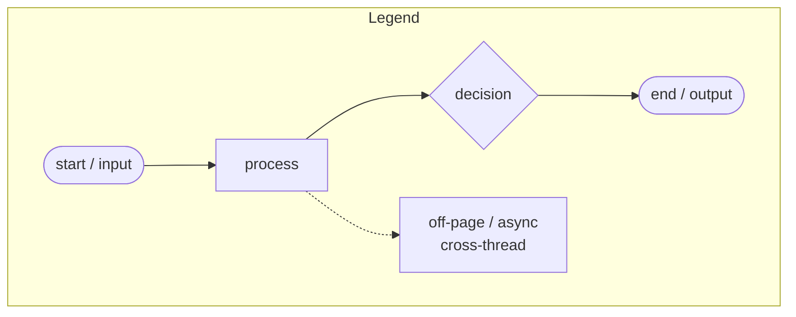
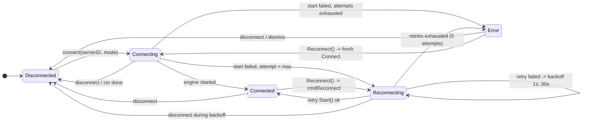
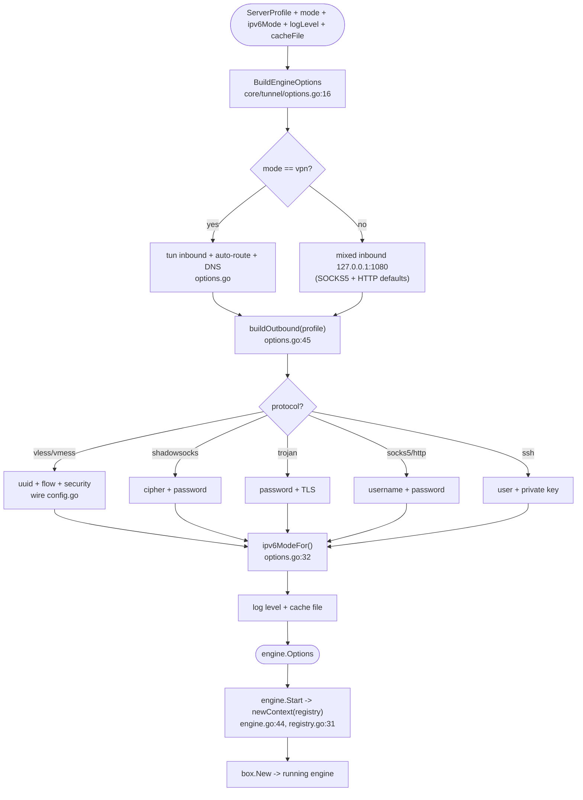
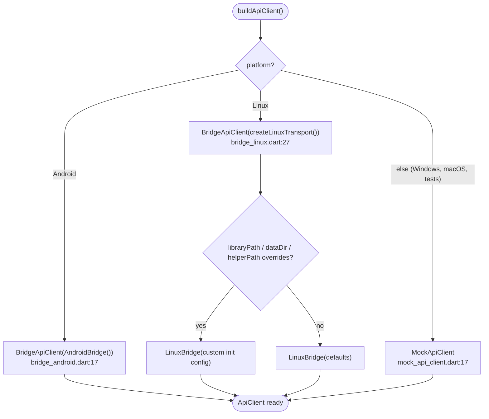
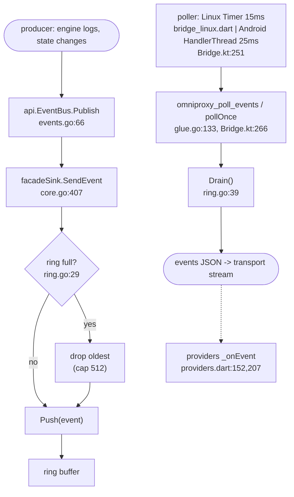
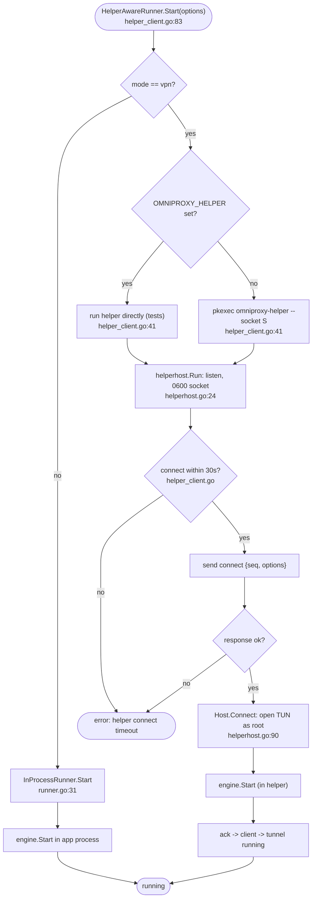
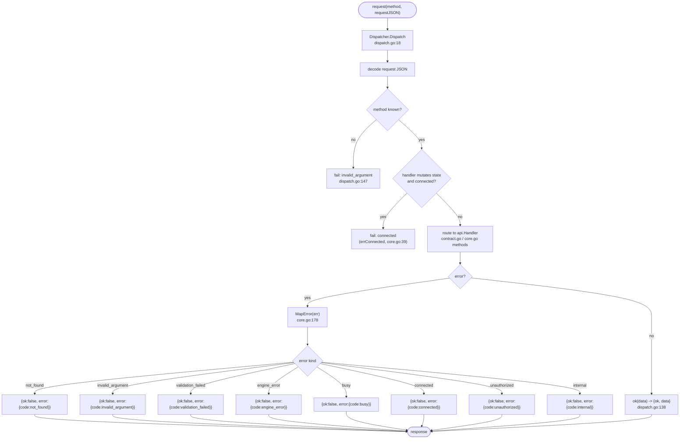
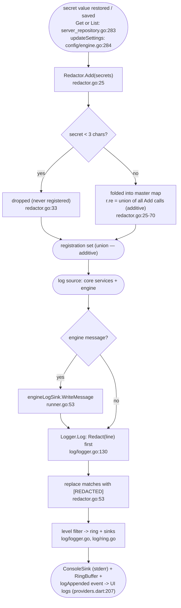
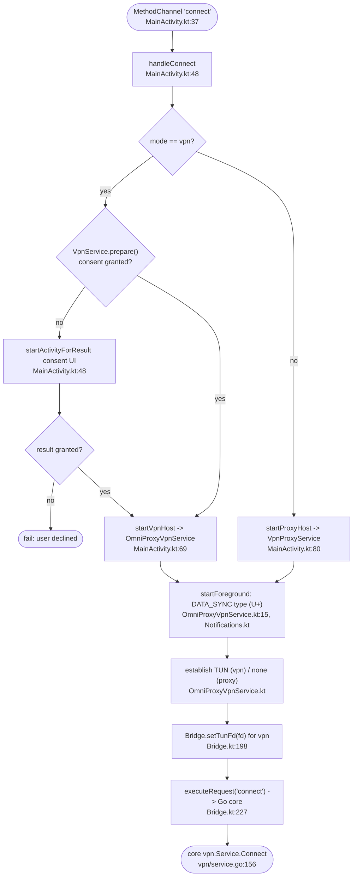

# Flowcharts — OmniProxy Atlas

Decision flows and state transitions that cut across the whole system, consolidated from
the implementation. This is the second of three *atlas* docs:

- `docs/SEQUENCE_DIAGRAMS.md` — who calls whom, in order (the flows below are the decisions
  those sequences pass through).
- `docs/CLASS_DIAGRAMS.md` — the static structure of every node named here.
- `docs/api-contract.md` — the exact method names and schemas referenced in § 5, 6.

## Legend (applies to every flowchart below)

- Rounded rectangle = entry/exit point or data source.
- Rectangle = process step (anchored to source).
- Diamond = decision.
- Dashed arrow = asynchronous / cross-thread hop.
- Each diagram is anchored with `path:line` on its entry step.

---

## 1. Connection state machine

Implemented in the VPN service run loop (`core/vpn/service.go:268`); every transition is
broadcast to subscribers as a `stateChanged` event (`service.go:482`), which is the only
thing the UI reacts to (`app/lib/state/providers.dart:152`).

**Why.** Reconnect is a *command into the loop*, not a second goroutine:
`Reconnect()` sends `cmdReconnect` (`service.go:261`), which the loop consumes by
transitioning to `Reconnecting`, stopping the tunnel, and re-`Start`ing in the same
goroutine (`service.go:310-314`). Failed starts retry **from Reconnecting** — the loop
transitions straight to `Reconnecting` (`service.go:297`), backs off, and on the next
successful `Start` goes directly to `Connected` (`service.go:282`); it never re-enters
`Connecting`. `wait` (during backoff) accepts `cmdDisconnect` → teardown, or `cmdReconnect`
→ retry now (`service.go:347-366`). Backoff is exponential `1s, 2s, 4s, …` capped at 30s
with `MaxAttempts() = 5` (`DefaultRetryPolicy`, `service.go:46`); `transitionError`
(`service.go:387`) lands in `Error` when attempts are exhausted. `Reconnect()` from `Error`
is not a command — it starts a fresh session via `Connect` (`service.go:251-254`).

---

## 2. Engine configuration generation

`BuildEngineOptions` (`core/tunnel/options.go:16`) maps a stored profile + runtime settings
into a sing-box `engine.Options`; the engine later builds the actual JSON options and starts
(`engine/engine.go:44`). The visual builders never emit JSON by hand — they produce this
typed structure (PRD rule).

**Why.** Protocol support is entirely delegated to sing-box: the engine only *registers*
the subset of inbound/outbound registries needed by the MVP
(`engine/registry.go:31`, comment at `registry.go`), so the module stays lean compared with
the full `sing-box/include` and keeps unrelated listeners disabled (e.g. clash API has no
external controller).

---

## 3. Client factory / bridge transport selection

`buildApiClient` in `app/lib/core/client_factory.dart:20`. The choice is purely
platform-driven; transports are interchangeable pure-Dart wrappers over the same contract
(`docs/api-contract.md`).

**Why.** `createLinuxTransport` accepts optional overrides for tests and packaged app
directories; production Linux loads `libomniproxy.so` and passes the real data dir plus the
bundled `omniproxy-helper` path. Windows has no transport yet — `WindowsBridge` throws
`UnsupportedError('WindowsBridge lands in M8')` (`bridge_windows.dart:7`) — so the desktop
shell continues to run on the mock until Milestone 8.

---

## 4. Event ring — publish, poll, overflow

Producers never block. `enqueueEvent` (`core/glue/glue.go:143`) pushes into a bounded ring
of 512 (`eventRingCap`, `glue.go:47`); the UI-side poller drains it on a timer.

**Why.** A callback (push) model deadlocks: a native callback into the Flutter isolate
cannot run while the isolate is blocked inside a synchronous FFI call that publishes an
event. Polling sidesteps the re-entrancy entirely and gives both transports identical
behavior. The ring drops the oldest event rather than growing — log floods must not starve
state-change events forever, and 512 is a small, bounded latency budget for the pollers.

---

## 5. Helper protocol decision (Linux VPN vs in-process)

`HelperAwareRunner.Start` (`core/tunnel/helper_client.go:83`) chooses between running the
engine in this process (proxy mode) and running it inside the root helper (VPN mode).
Protocol messages are newline-delimited JSON over a Unix stream socket
(`core/tunnel/helperproto/helperproto.go`); the helper serves exactly one control
connection per lifetime (`helperhost.go:24`).

**Why.** Only VPN mode needs root (`CAP_NET_ADMIN` for TUN + auto-route), so the helper is
spawned lazily per VPN session and torn down on disconnect/quit — no long-lived daemon, no
orphaned TUN (`helperhost.go:146`). `OMNIPROXY_HELPER` bypasses `pkexec` so the helper can
be spawned by the test harness directly. Every request/response is `seq`-matched
(`helper_client.go:291`) so a slow helper can't scramble a later disconnect.

---

## 6. Request dispatch and error mapping

Every bridge call funnels through `Dispatcher.Dispatch` (`core/api/dispatch.go:18`), which
decodes the request JSON, routes by method name to the `api.Handler`, and envelopes the
result. Errors are normalized to contract error codes by `Facade.MapError`
(`core/core.go:178`).

**Why.** The `busy` / `connected` distinction keeps the UI honest: operations that mutate
servers are rejected with `connected` while a tunnel is up (you must disconnect first,
`core.go:39`), and VPN service operations reject with `busy` when a tunnel is mid-command.
`MapError` is the single place error → code translation happens, so every transport returns
exactly the codes in `docs/api-contract.md`.

---

## 7. Log redaction pipeline

All log lines are redacted *before* they reach any sink — console, event ring, or file.
Secrets are registered with `Redactor.Add` (`core/log/redactor.go:25-70`): each call trims,
drops secrets shorter than 3 characters, and folds them into a master map that is compiled
into ONE case-insensitive union regex. Registration is **additive** — later `Add`s extend,
never replace, the pattern (`redactor.go:25-70`, `TestRedactorIsAdditive`). `Redact` then
substitutes every match with `[REDACTED]` (`redactor.go:50-54`).

**Why.** Credentials must never appear in logs (PRD), so redaction sits at the source
boundary — `Logger.Log` redacts before any sink or subscriber sees the message, and the
engine log adapter routes *every* sing-box message through it. The `< 3`-char carve-out
keeps common words (a `p` flag, a port) from being mangled. The *replace-instead-of-
accumulate* bug is fixed — registration is now a master union pattern
(`GO_RUNTIME.md:378-380`, `DEBUGGING.md:118-130`, `TestRedactorIsAdditive`) — and
*coverage* is complete: every credential-bearing field is registered (password/UUID/SSH
private key, SSH host key, Reality public key/shortId/spiderX, WS host/path;
`server_repository.go:283-295`), verified by `TestRedactorCoversCredentialFields`.

---

## 8. Android connect decision (host side)

`MainActivity.handleConnect` (`MainActivity.kt:48`) decides the foreground host before any
core work. Both paths produce a persistent non-dismissible notification and both end by
executing `connect` against the core.

**Why.** Android's `VpnService` must be consented and its TUN created by the system-facing
service, so the bridge defers `connect` until the service is fully up — the service hands
Go the fd (`setTunFd`) before the core starts the engine. Proxy mode skips consent entirely
and hosts the engine in a plain foreground service (`VpnProxyService.kt:14`), keeping the
identical core path on both modes. `DATA_SYNC` is used on API 34+ to avoid the
`ForegroundServiceDidNotStartInTimeException` on slower devices.
