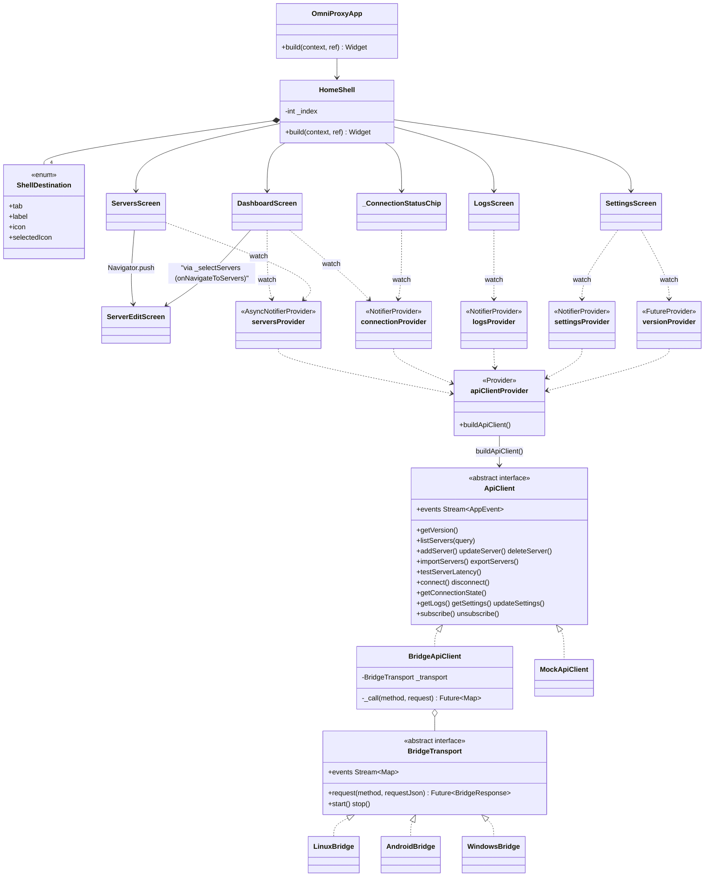
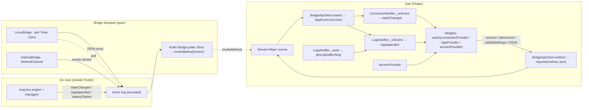

# OmniProxy Flutter App — Architecture & Design Notes

Status: matches the tree at M9 (Linux E2E + Android E2E done, Windows M8 code-complete/untested).
Scope: everything under `app/` — the Flutter UI, its state layer, the `ApiClient` abstraction, the bridge transports, the Android native glue, and the tests.

## 1. Purpose & scope

The `app/` tree is the single Flutter codebase that ships on Android, Linux and Windows. It owns exactly two jobs:

1. **Rendering the product UX** — dashboard, server CRUD/import/export, logs, settings.
2. **Talking to the Go core** through one UI-facing interface (`ApiClient`) and one pure-transport abstraction (`BridgeTransport`). It never implements VPN/tunnel logic, crypto, or parsing itself (AGENTS.md networking rules).

Everything the UI needs from "the product" is a method on `ApiClient` or an event on its `events` stream (`app/lib/core/api_client.dart:9`). Every concrete transport implements the same contract (`docs/api-contract.md`) — "pure transport, no business logic" is enforced by construction: `BridgeApiClient` is the *only* place that maps `ApiClient` calls onto wire strings, and the transports only frame/decode JSON.

Dependencies are deliberately minimal (`app/pubspec.yaml:30-40`): `flutter_riverpod ^3.4.2` (state), `ffi ^2.1.3` (dart:ffi `malloc`/`Utf8` helpers for the desktop transports), `cupertino_icons`. **There is no `go_router`, no codegen, no localizations package** — the `lib/l10n/generated/` directory is empty, and navigation is a hand-rolled enum shell plus one imperative `Navigator.push` (see §3).

The mock exists because M5 (shell) landed before the real transports (M6–M8). That ordering decision is why the `ApiClient` interface is abstracted in the first place: the shell was built and tested against an in-memory implementation of the contract, then the Linux/Android transports were dropped in behind the same interface with zero UI changes.

## 2. App architecture

```
main()                          ProviderScope(apiClientProvider, settings, servers, connection, logs)
  └─ OmniProxyApp (ConsumerWidget)         watches settingsProvider → themeMode
       └─ MaterialApp(theme/darkTheme/themeMode, home: HomeShell)
            └─ HomeShell (ConsumerStatefulWidget)   _index: ShellDestination
                 ├─ AppBar(title = destination.label, actions: [_ConnectionStatusChip])
                 └─ LayoutBuilder (maxWidth >= 700)
                      ├─ wide:   Scaffold(NavigationRail … VerticalDivider … screens[_index])
                      └─ narrow: Scaffold(body: screens[_index], NavigationBar)
                           └─ screens = [DashboardScreen, ServersScreen, LogsScreen, SettingsScreen]
                                ├─ DashboardScreen ──(Navigator.push)──▶ ServerEditScreen (add/edit)
                                └─ ServersScreen ──(Navigator.push)──▶ ServerEditScreen
```

Widget tree facts worth knowing:

- `main.dart:7` wraps everything in `ProviderScope` — Riverpod 3, manual providers (no codegen), as decided in M5 (`docs/implementation-plan.md:95`).
- `app_root.dart:14-29` — `OmniProxyApp` is a `ConsumerWidget` that watches `settingsProvider` and derives `themeMode` from `settings.theme` via `AppTheme.modeFor`. The whole shell rebuilds on theme change, which is exactly what makes the theme feel instant and why settings live in a Riverpod notifier rather than local state.
- `app_root.dart:33-118` — `HomeShell` holds a single `int _index` and builds *all four* screens in a list but shows only `screens[_index]`. Screens are **not** kept alive with `IndexedStack`: switching tabs disposes the previous screen's state. This is a deliberate MVP tradeoff (state lives in providers, so nothing important is lost) that trades a tiny rebuild cost for simplicity. Each screen re-derives everything from providers on rebuild.
- Shared UI is small and mostly private per feature; there is **no `lib/widgets/` directory**. The one cross-feature widget, `ConnectionDuration`, lives in `dashboard_screen.dart:397` (public) because the dashboard is its only consumer.



## 3. Navigation & routing

There is no router package. Navigation is two mechanisms:

1. **Shell tabs** — `ShellDestination` (`app/lib/app/router.dart:6`) is a plain enum carrying `tab`, `label`, `icon`, `selectedIcon` for four destinations: Dashboard (0), Servers (1), Logs (2), Settings (3). `HomeShell` maps `_index` → the destination and renders the matching screen.
2. **Detail push** — `ServersScreen` and `DashboardScreen` open `ServerEditScreen` with `Navigator.of(context).push(MaterialPageRoute(...))` (`servers_screen.dart:284-290`). The edit screen is a full-screen route with its own `AppBar` + back button, so it works identically on mobile and desktop with no shell changes.

Why no `go_router`/deep links: MVP has no URL/deep-link surface, no auth gate, and no named-route hierarchy — the shell tab model plus one push is the minimum that satisfies "responsive, dashboard default" without a dependency. The file is called `router.dart` and is documented as "top-level destinations for the responsive shell", which signals where a real router would slot in later.

**Responsive behavior** — `app_root.dart:68-114`: a `LayoutBuilder` picks `maxWidth >= 700` → `NavigationRail` (left, with a `_Logo` leading, `VerticalDivider`, full labels) or `NavigationBar` (bottom). The `AppBar` and its `_ConnectionStatusChip` are shared between both modes, so the status pill is always visible.

**Default landing screen** — `_HomeShellState` initializes `_index = ShellDestination.dashboard.index` (`app_root.dart:41`). The dashboard is also the *only* screen with a programmatic cross-tab path: `DashboardScreen(onNavigateToServers: _selectServers)` (`app_root.dart:49`) shows an "Add server" affordance when there are zero servers.

**Guarding** — there is no navigation guard. Tabs are always reachable regardless of connection state. The reason is deliberate: providers hold truth, and screens are read-only views, so navigating while connected is safe. The *actions* are guarded instead: `ServersScreen` disables "Export all" with no servers (`servers_screen.dart:73`), the dashboard's connect button is disabled when no target exists (`dashboard_screen.dart:382`), and the core itself rejects `deleteServer`/`updateServer` on the active server with `connected` (`docs/api-contract.md:161`) — the mock mirrors that (`mock_api_client.dart:228,244`). The UI surfaces those `ApiError`s in snackbars rather than blocking navigation.

## 4. State management

All state is Riverpod 3 manual providers (`app/lib/state/providers.dart`). The layering: providers depend only on `apiClientProvider` (the `ApiClient`), never on a concrete transport, so the entire state layer is transport-agnostic and testable by overriding `apiClientProvider` with a `MockApiClient`.

| Provider | Type | Owns | Build behavior |
|---|---|---|---|
| `apiClientProvider` (`:12`) | `Provider<ApiClient>` | the client itself | `buildApiClient()` per platform (§5) |
| `versionProvider` (`:16`) | `FutureProvider<AppVersion>` | version tuple | `getVersion()` once |
| `settingsProvider` (`:22`) | `NotifierProvider<SettingsNotifier, AppSettings>` | persisted settings | returns `const AppSettings()` immediately, then `_load()`s from `getSettings` (`:27-35`) |
| `serversProvider` (`:44`) | `AsyncNotifierProvider<ServersNotifier, List<ServerProfile>>` | server list + active query | `listServers(query: _query)` |
| `selectedServerProvider` (`:242`) | `NotifierProvider<SelectedServerNotifier, String?>` | connect target | favorite, else first; re-anchors on catalog changes |
| `connectionProvider` (`:127`) | `NotifierProvider<ConnectionNotifier, ConnectionUiState>` | live connection state + session | subscribes + listens; snapshots initial state (§6) |
| `logsProvider` (`:174`) | `NotifierProvider<LogsNotifier, List<LogEntry>>` | capped log buffer | event stream + `getLogs` backfill (§6) |

Design notes per provider:

- **`SettingsNotifier`** — returns a default and *unawaited*-loads, rather than holding an `AsyncValue`. Rationale: a settings page showing a spinner on every launch is worse than rendering sensible defaults for 50ms. `update()` (providers.dart:37) writes through `updateSettings` and adopts the *server-returned* settings, so the server's normalization wins (contract §3: "validated"). This is the single source of truth for theme → `app_root.dart:25`.

- **`ServersNotifier`** — an `AsyncNotifier` because server listing is genuinely async. `_query` is captured at `build()` (`:52`), so `listServers` is server-side filtered/sorted (contract §3) — the UI sends the query and never re-implements search/filter in Dart. Every mutation (`add`/`updateServer`/`delete`/`duplicate`/`import`/`testLatency`) calls through the contract and then `_reload()` (`:61-104`): set `AsyncLoading`, re-`listServers` under `AsyncValue.guard`. This "mutate → re-fetch from core" pattern is the reason the list can never drift from core state, at the cost of a full refetch per mutation (fine at MVP scale). `setQuery` (`:56`) invalidates self; `toggleFavorite`/`toggleEnabled` (`:106-116`) are convenience wrappers that load the current value, flip it, and `updateServer`.

- **`SelectedServerNotifier`** (`:245-274`) — the user-chosen connect target. It is a `Notifier<String?>` (an id) rather than a derived provider because it is *settable* from both the dashboard selector and the servers list. `build()` defaults to the favorite server (else the first) and uses `ref.listen(serversProvider, …)` to re-anchor when the catalog changes — without `watch`, which would rebuild (and wipe) the user's choice. A still-present selection is kept; a deleted one falls back to the default; an empty catalog yields `null` (disabling Connect). The dashboard defensively resolves the id against the live list so a filter-hiding the selection can never crash the `DropdownButton` (`dashboard_screen.dart:21-24`).

- **`ConnectionNotifier`** — a plain `Notifier` over `ConnectionUiState(state, session)` (`:120`). Its `build()` (`:135-150`) is where the core→UI event pipeline is wired:
  1. `subscribe(['stateChanged', 'logAppended'])` — tells core to start emitting.
  2. `client.events.listen(_onEvent)` — one live subscription.
  3. `client.getConnectionState()` — initial snapshot, applied *only if `session != null`* so a disconnected launch doesn't flicker past an intermediate state.
  4. `ref.onDispose(() => _subscription?.cancel())` — Riverpod owns teardown when the provider is disposed (e.g. test containers).
  
  `connect()` reads `settingsProvider.connectionMode` as the default mode when none is passed (`:161-165`) — the UI-level decision "VPN by default" lives here, while per-call overrides come from tests or the E2E harness. The *target* id is passed by the caller (the dashboard passes the selected server, §7).

- **`LogsNotifier`** — capping at 500 entries (`:178`) so a long session can't grow the list unboundedly. Dedupe is by monotonic `seq`: backfill drops entries `<= _lastSeq` (`:197`) and the event path skips events that `_seed` already covered (`:210`). This matters because the core ring can re-emit or the viewer can race `getLogs` vs `logAppended`. `_lastSeq` is a **monotonic watermark**: it only ever advances, so `refresh()` re-seeds from the watermark and recovers missed events without duplicating anything, and `clear()` (`:229-236`) advances the watermark past the last shown entry so cleared logs stay gone — a later refresh or late `logAppended` delivery only surfaces genuinely new entries (regression: a clear that reset the watermark to 0 made the next refresh resurrect every cleared entry).



## 5. The ApiClient abstraction

Three layers, kept strictly separate (this is the "read the source, not the filename" heart of the bridge design):

1. **`ApiClient`** (`app/lib/core/api_client.dart:9`) — the *UI-facing contract*. An abstract class with one method per contract method and `Stream<AppEvent> get events`. Its doc comment states the rule: "Bridges are **pure transport** — no platform business logic lives here." Errors are always `ApiError` (models.dart:688) carrying the contract error code.
2. **`BridgeApiClient`** (`app/lib/core/bridge_api_client.dart:9`) — *the* implementation of `ApiClient` over any `BridgeTransport`. `_call` (`:14-24`) does the universal envelope dance: `request(method, json)` → if `!ok` throw `ApiError(code: response.errorCode, message: response.errorMessage)`, else return `data`. Every public method is one transport request plus a typed parse (`AppVersion.fromJson`, `ServerProfile.fromJson`, …). `events` (`:147-148`) maps raw transport maps through `AppEvent.fromJson`.
3. **`BridgeTransport`** (`app/lib/core/bridge/bridge_transport.dart:24`) — the *pure-transport* abstraction: `request(method, requestJson) → BridgeResponse`, `events`, `start`, `stop`. `BridgeResponse` (`:15`) is `{ok, data?, errorCode?, errorMessage?}`. Concrete transports: `LinuxBridge`, `AndroidBridge`, `WindowsBridge`.

**Why the UI never talks to the bridge directly:**

- **Testability** — widget tests override `apiClientProvider` with `MockApiClient` (`widget_test.dart:12-19`) and exercise the full UI with zero native code.
- **Platform swap** — `ClientFactory.buildApiClient()` (`app/lib/core/client_factory.dart:20-28`) is the *only* place platform selection happens:
  - `Platform.isAndroid` → `BridgeApiClient(AndroidBridge())`
  - `Platform.isLinux` → `BridgeApiClient(createLinuxTransport())`
  - `Platform.isWindows` → `BridgeApiClient(createWindowsTransport())`
  - everything else → `MockApiClient()`
  
  A new platform (or a mocked host) is a three-line change to one function; screens and providers don't know it happened.
- **Contract discipline** — the interface *is* the contract (methods + schemas in `docs/api-contract.md` §3). Because `BridgeApiClient` is shared, Linux and Android cannot drift: any new method is added once, in one file, and both transports inherit it.

**`MockApiClient`** (`app/lib/core/mock_api_client.dart:17`) is not a test double that fakes happy paths — it is a *faithful in-memory implementation of the contract*: same method names, same response shapes, same error codes (`not_found`, `connected`, `busy`, `validation_failed`), and it *emits the same async events* (`stateChanged`, `logAppended`, `latencyTested`) with simulated delays (`connectDelay` 600ms, `latencyDelay` 250ms). It even seeds three servers (VLESS/Tokyo, Shadowsocks/Frankfurt, HTTP/localhost — `:41-83`) and implements filter/sort/favorite/import/export semantics. Its stated purpose (doc comment `:9-16`) is wiring the M5 shell *before* the real transports landed; it remains the fallback for platforms with no bridge (see §10). It has a `dispose()` that closes the controller (`:489`) — the one method not on the interface.

**`share_links.dart`** mirrors `core/server/linkgen.go` in Dart (`:5-6`) solely so the mock's `exportServers(format: 'links')` output round-trips identically to the real core. The bridge path delegates link export to core; the mock path needs the same format to keep import/export testing honest.

**`createLinuxTransport`** (`client_factory.dart:32-44`) is the one seam for the Linux transport's init config (`dataDir`, `helperPath`), kept overridable for tests (`e2e_linux_bridge_test.dart:35` passes its own `dataDir`).

## 6. Models & event mapping

`app/lib/core/models.dart` is the mirror of `docs/api-contract.md` §2. Every enum carries a `wire` string identical to the contract value and a `fromWire` that falls back to a safe default on unknown input (`ConnectionState.fromWire` → `disconnected`, `models.dart:21-27`). Every class has `fromJson`/`toJson` hand-written (no codegen), with tolerant reads (missing → default) and, on write, **field omission for non-default values** — e.g. `TransportSettings.toJson` omits `type` when TCP (`:167-174`), `ServerListQuery.toJson` omits unset filters (`:503-510`). This keeps wire payloads minimal and matches contract "missing/optional fields omitted" (§1).

Notable mappings to the contract:

- `ServerProfile` (`:264`) — all of §2.1 including `TlsSettings` (`:178`), `TransportSettings` (`:143`, WS only in Phase 1), `SshSettings` (`:213`), and the reserved `RealitySettings` (`:234`, Phase 2). `fromJson` defaults `enabled` to true (`json['enabled'] != false`, `:403`) and parse-errors null-protected.
- `VpnSession` / `SessionStatus` (`:514`/`:570`) — §2.2, including `statusHistory` (the state machine trail) and the optional `error` envelope (fed by `ApiError.fromJson`).
- `AppSettings` (`:585`) — §2.3. `advancedModeEnabled` exists on the model and is stored, but is always false in MVP (contract §2.3) and has no UI toggle (see §12).
- `LogEntry` (`:651`) — §2.4 with `seq` used by `LogsNotifier` for dedupe.
- `AppEvent` (`:780`) — §4. `{type, data}` plus `encode()` (used by the mock's event emission).
- `ConnectionSnapshot` (`:725`) — `{state, session}` used both by `getConnectionState` and by translating `stateChanged` event data (§4).
- `ImportSource`/`ImportResult`/`ImportError` (`:741`/`:751`/`:767`) — §3 `importServers`, per-line errors for the result dialog.

**Event consumption path** (the exact translation the task asks about):

- `stateChanged` → `ConnectionNotifier._onEvent` (`providers.dart:152-159`): ignores non-`stateChanged` types, then `ConnectionSnapshot.fromJson(event.data)` and assigns `ConnectionUiState(state, session)`. Because the *same* code path parses `getConnectionState` snapshots (`:141-148`), push (event) and pull (poll) are guaranteed to produce identical UI state.
- `logAppended` → `LogsNotifier._onEvent` (`providers.dart:207-214`): `LogEntry.fromJson(event.data)`, `seq`-deduped, appended, trimmed.
- `latencyTested` → **not subscribed** by the UI. The mock emits it (`mock_api_client.dart:362`) and the contract defines it (§4), but `connect` subscribes only to `['stateChanged', 'logAppended']` (`providers.dart:137`) and `LogsNotifier` filters it out. Latency results reach the UI through the `testLatency` → `ServersNotifier._reload` round-trip instead. This is a known seam: `latencyTested` is defined for future live latency without a refetch but is currently unused.

**Bridge transport framing:** `LinuxBridge.request` JSON-encodes `{method, request}` across FFI and decodes `{ok, data?, error?}` (`bridge_linux.dart:86-120`); `AndroidBridge.request` does the identical dance over the MethodChannel (`bridge_android.dart:42-74`). Both normalize malformed payloads to `ok:false`/`internal` or throw `StateError`. `BridgeApiClient` sits above both and converts to typed results/`ApiError` — so the "JSON contract → Dart model" translation happens in exactly two places: `models.dart` (shapes) and `bridge_api_client.dart` (envelope).

## 7. Screens & UX

### Dashboard — `features/dashboard/dashboard_screen.dart`

Default landing screen; MVP scope is explicitly status / current server / live duration / connect-disconnect (`:9-10`). Layout: centered `ConstrainedBox(maxWidth: 560)` → `ListView`.

- `_StatusHero` (`:88`) — big circle icon + state label/subtitle, color-coded: green connected, amber connecting/reconnecting, error color, outline when disconnected.
- Content slot below (`:34-71`) is state-driven: `error` → `_ErrorBanner` showing `session.error.message`; connected/connecting with a known server → `_ServerCard`; catalog still loading → a neutral "Choose a server to connect." placeholder; zero servers → `_PlaceholderCard` ("No servers yet. Add a server to get started." with an "Add server" button that jumps to the Servers tab via `onNavigateToServers`); otherwise → `_ServerSelectorCard` (`:303`) — "Choose a server to connect." with a `DropdownButton<String>` over the catalog bound to `selectedServerProvider` (§4), so picking a server here re-targets Connect.
- `_ServerCard` (`:156`) — name (+ star if favorite), `PROTOCOL · address:port`, VPN/Proxy mode chip, latency chip (if tested), and `ConnectionDuration` (`:397`) — a 1-second `Timer.periodic` that repaints an HH:MM:SS elapsed clock based on `session.startedAt`. The timer is disposed with the widget, so it never leaks when navigating away.
- `_ConnectButton` (`:328`) — a per-state switch: `connected` → red-tonal **Disconnect**; `connecting/reconnecting` → disabled button with spinner (**Connecting…**); `error` → tonal **Dismiss** (disconnects, clearing the error); `disconnected` → **Connect**, disabled when no target server exists.
- Target selection (`:20-24,84-90`) — the session's `serverId` if one exists, else `selectedServerProvider` (default: favorite, then first). `_connect` re-reads providers rather than trusting build-scope values (guard against stale closes). The `_ConnectButton`'s `targetServerId` is the same resolved id, so the button enables/disables with target availability.

### Servers — `features/servers/servers_screen.dart`

- Header row: "Servers" title, **Add server** (opens edit screen), Import (`_showImportDialog`, `:365`), Export all (`_export`, `:321`). Search field + sort popup (`ServerSort`: name/updated/latency) + filter popup (protocol/group/enabled, or "Clear filters") — all funnel into `ServerListQuery` and `_applyQuery` (`:29-37`) → `serversProvider.notifier.setQuery`, so filtering is **server-side** per contract.
- Body `servers.when` (`:233-281`): loading spinner / error card with **Retry** (`notifier.refresh`) / data — empty → `_EmptyState`, else `ListView.separated` of `_ServerCard`s.
- `_ServerCard` (`:481`) — protocol abbreviation tile (with a primary border when this server is the selected target), name (+ selected check + favorite star), `protocol · address:port` (+ ` · ws` transport label), latency pill ("—" if untested), and a popup menu: **Select server** / Test latency / Mark favorite / Disable / Duplicate / Export / Delete. Selecting sets `selectedServerProvider` (§4), shown on the dashboard selector too. Disabled servers render at 55% opacity (`:507`). Delete needs a confirm dialog (`:337`).
- Error surfacing is consistent: every async action catches `ApiError` and shows `e.message` in a `SnackBar` (`:300,314,331,359,390`). Import failures instead open `_ImportResultDialog` with per-line `ImportError`s.
- Import dialog (`:684`) — a paste box accepting the `.onnproxy` envelope **or** share links (`vmess://`, `vless://`, `ss://`, `trojan://`); the input is classified as `link` when it starts with `http(s)://`, else `clipboard` (`:371-372`).
- Export dialog (`:737`) — `SelectableText` blob with a warning that credentials are included ("share it securely"), plus a Copy-to-clipboard button (`Clipboard.setData`, `:780`).

### Server edit — `features/servers/server_edit_screen.dart`

Add (`server == null`) or edit. The form is **protocol-aware**: `_credentialFields` (`:206`) shows exactly the fields the selected protocol uses (UUID for VLESS/VMess, username for socks5/http/ssh, password for socks5/http/ss/trojan, cipher for Shadowsocks, SSH user + PEM key for ssh), and `_protocolFields` (`:282`) adds VLESS flow, VMess security/global-padding, and packet-encoding (xudp). `_TlsSection` (`:411`) has TLS enable, SNI, fingerprint, and — explicitly — **Allow insecure certificates** with the warning "Disables certificate validation — use only for testing." (`:462-464`). `_TransportSection` (`:475`) offers TCP vs WebSocket (path + host) for the three encrypted protocols.

Notable decisions:

- Default cipher is `aes-128-gcm` (`:56`); VMess security defaults to `auto`.
- The save button shows a spinner and is disabled while saving (`:185-193`); on `ApiError` it re-enables and shows a snackbar (the form is *not* popped, so edits are preserved).
- This is the closest the MVP comes to a "visual builder": the form's structured fields are the anti-hand-edit-JSON UX (PRD: users never hand-edit JSON). The generated `ServerProfile` is what `addServer`/`updateServer` persist.

### Logs — `features/logs/logs_screen.dart`

`LogsNotifier` buffer rendered with `ListView(reverse: true)` (`:95-104`) so the newest entry stays pinned to the bottom — the standard live-terminal pattern. The viewer is *live*: because `LogsNotifier.build` listens to `client.events`, new `logAppended` events append to the buffer while the tab is on screen (`:211` flow) — the Refresh button is only needed to re-seed after the app missed events (e.g. before the tab was ever opened). Level filter is a `DropdownButton<LogLevel?>` (null = all) filtering by a `rank` extension (`:198-221`); color coding per level. Toolbar has Refresh (`notifier.refresh`, re-seeds from the watermark) and Clear (`notifier.clear`, which advances the seq watermark so post-clear entries repopulate *without* resurrecting the cleared ones — `providers.dart:229-236`). Empty state explains how to produce output ("Connect to a server or adjust the filter"). Entries render local-time HH:MM:SS, level label, component (primary-colored), and message in monospace (`:120-160`), with a defensive `_stripAnsi` (`:226`) so no escape garbage ever reaches the text — the core already strips ANSI at `core/log/logger.go`, this is a belt-and-braces fallback for older buffered entries. The doc comment (`:7-8`) restates the security invariant: entries come from core's *redacted* stream and never contain credentials.

### Settings — `features/settings/settings_screen.dart`

Four `_Section` cards:

- **Appearance** — Theme `SegmentedButton` (System/Light/Dark) → `notifier.update(settings.copyWith(theme: …))`; the app rebuilds its theme instantly via `app_root.dart:25`.
- **Connection** — Default mode `SegmentedButton` (VPN/Proxy), subtitle explains the difference (`:66-69`); used by `ConnectionNotifier.connect` when no mode is passed.
- **Network** — IPv6 `DropdownButton` over `IPv6Mode` with a carefully-worded subtitle (`:98-107`) explaining `prefer_ipv4` ("keeps IPv6 captured but uses IPv4 first — avoids stalled connections on broken IPv6 paths … without blocking IPv6-only sites") and `disable_ipv6` ("blocks all IPv6 traffic"). This is UI surfacing of a real platform/networking decision made at the engine layer (`docs/platform-notes.md` §IPv6).
- **Diagnostics** — Log level dropdown (`:145-160`), "Minimum level shown in the Logs screen and written to core logs."
- **About** — `version.when` (loading spinner / "Version unavailable" / app+engine+platform ListTiles).

Every control writes through `updateSettings`; nothing is saved locally in the UI (single source of truth = core, §4).

**Advanced Mode gating:** `advancedModeEnabled` lives in `AppSettings` and the contract, and is now surfaced as a Settings → **Advanced** "Enable Advanced Mode" toggle (`settings_screen.dart:129-158`). Its one enforced effect today is gating the allow-insecure certificate bypass on the server form: the toggle is locked with a "Requires Advanced Mode" subtitle unless the mode is on, and enabling it shows an explicit "Disable certificate validation?" confirmation dialog (`server_edit_screen.dart:333-354`). The Phase 2 surfaces it will also gate (routing, chaining) are still hidden (`docs/implementation-plan.md:19`).

**Platform-limitation surfacing:** the shared log screen and error banners are how limitations are *not* silently degraded. E.g. Windows helper/service model limitations are documented to surface in the UI when applicable (`docs/platform-notes.md:77`) — currently Windows runs the mock (§10), so nothing to surface yet.

## 8. Theming & responsiveness

`AppTheme` (`app/lib/app/theme.dart`):

- Material 3 with `ColorScheme.fromSeed(seedColor: 0xFF0057B8)` (`:8`, `:26`) — dark and light palettes derive from one seed, so brand consistency across themes is structural. `ThemeData(useMaterial3: true)` then a `copyWith` that customizes:
  - `textTheme` body/display colors → `onSurface` (`:29-32`)
  - `InputDecorationTheme` — filled outlined fields (`:33-37`)
  - `CardThemeData` — elevation 0, `surfaceContainerLow`, 16px radius, subtle outline border (`:38-45`)
  - `FilledButtonThemeData` — 52px min height, rounded 14 (`:46-52`)
  - `NavigationRailThemeData` / `NavigationBarThemeData` — container + indicator colors (`:53-64`)
- `modeFor` (`:14-23`) maps `ThemePreference` → `ThemeMode`; `app_root.dart:23-25` wires `light`/`dark`/`system`.
- **Responsiveness** is two-layered: the shell switches navigation chrome at `maxWidth >= 700` (`app_root.dart:68`), and each screen additionally centers content in a `ConstrainedBox` (dashboard 560, servers/settings 720, logs 760) — so on desktop the content is a readable column instead of stretching edge-to-edge, and on mobile it's a natural full-width single column. There is no multi-pane/split-view; "desktop multi-pane" from the PRD is intentionally not built in MVP.

## 9. Async & error handling

- **The only error surface is `ApiError`.** `BridgeApiClient._call` converts every non-`ok` response into one (`bridge_api_client.dart:17-23`); screens catch `ApiError` around every async action and show the message. `ApiError.toString()` = `ApiError(code): message` (`models.dart:701`).
- **No explicit timeouts on `ApiClient` calls.** Requests rely on the transport/core to return or fail (a hung core means a hung request — a known limitation, mitigated in practice because the core is same-process; the Android E2E test adds `.timeout(...)` at the test boundary, `integration_test/bridge_e2e_test.dart:103`). The Linux FFI request is a blocking call into the shared library — the Dart isolate is blocked for its duration, which is why events are *polled* rather than callback-based (see §10).
- **`AsyncValue` states** — `serversProvider` surfaces loading/error/data via `servers.when` (`servers_screen.dart:233-281`); the error branch includes a Retry button that calls `notifier.refresh`. `SettingsNotifier` deliberately avoids `AsyncValue` (§4).
- **Mock fidelity** — the mock's connect transitions simulate the real state machine with delays and honor the `busy`/`connected` error codes, so the UI's loading/error handling is exercised in widget tests exactly as it will be against core.
- **Reconnection UX** — `reconnecting` renders like `connecting` everywhere (amber, sync icon, "Restoring connection", disabled button with spinner) because the MVP state machine includes the state but the reconnect logic lives in core (`docs/implementation-plan.md:94`). The dashboard's `_ErrorBanner` gives the error state an explicit, dismissible surface.
- **Subscription lifecycle** — both event-stream consumers cancel via `ref.onDispose` (`providers.dart:140,187`); `ConnectionDuration` cancels its timer in `dispose` (`dashboard_screen.dart:417`). `MockApiClient.dispose()` closes its controller; `BridgeApiClient` has no dispose because the transports' `stop()` is the teardown (invoked by tests, not by the app — the app relies on process exit).

## 10. Platform-specifics in Flutter

Selection is centralized in `ClientFactory.buildApiClient()` (`client_factory.dart:20-28`); there are **no conditional imports** anywhere — `dart:io` `Platform.is*` checks are the only branching (the app targets mobile+desktop, never web).

**Linux (`bridge_linux.dart`)** — `dart:ffi` into the c-shared `libomniproxy.so`:
- ABI: `omniproxy_init(config_json)`, `omniproxy_request(method, request)`, `omniproxy_poll_events()`, `omniproxy_shutdown()`, `omniproxy_free_string()` (`:16-21`), bound via `DynamicLibrary.lookupFunction` typedefs (`:178-193`).
- `start()` opens the library, JSON-encodes the init config (`dataDir`, `logLevel`, `helperPath`), calls `omniproxy_init`, and on nonzero exit calls `stop()` and throws `StateError` (`:47-70`). Config dir defaults to `$XDG_CONFIG_HOME/omniproxy` (`:158-163`); helper path defaults to the executable's sibling `omniproxy-helper` via `Platform.resolvedExecutable` (guarded against `UnsupportedError` in test runners, `:165-175`).
- Library resolution order (`:148-156`): `--dart-define=OMNIPROXY_LIB` → env `OMNIPROXY_LIB` → `<cwd>/../core/out/libomniproxy.so` (dev tree) → `libomniproxy.so` (installed bundle, `$ORIGIN/lib` rpath per `linux/CMakeLists.txt:115-128`).
- **Events are polled, not pushed** (`:23-26`, `:41`): a 15ms `Timer.periodic` drains the core ring via `omniproxy_poll_events` and re-emits each map on the broadcast controller. The doc comment explains the *why* precisely: a native callback into the Dart isolate would deadlock when a synchronous request (e.g. `connect`) publishes an event while the isolate is blocked inside the FFI call (`:23-26`). Same rationale as Android's poller.
- String ownership: every `char*` returned by core is freed through `omniproxy_free_string` (`_freeString`, `:140-144`); `malloc.free` releases the method/request UTF-8 buffers (`:90-97`).

**Android (`bridge_android.dart`)** — MethodChannel over the gomobile bind:
- Request channel `com.omniproxy/bridge`, event channel `com.omniproxy/events` (`:18-19`). `request` invokes `invokeMethod<String>(method, jsonEncode(requestJson))` (`:46`); Kotlin returns the canonical response JSON string. `start()`/`stop()` (`:28-39`) install/clear the event handler on the events channel.
- The Kotlin host, `Bridge.kt` (`android/.../Bridge.kt:29`), is the other half: `ensureInit` (files-dir data dir, `Mobile.setSecretStore(KeystoreSecretStore(...))` **before** `Mobile.init`, `:59-74`), requests run on a background `Thread` because the Go call blocks (`:213-223`), and a `HandlerThread` poller drains the ring every 25ms and forwards each event as `invokeMethod("event", eventJson)` (`:251-285`). Events are *polled for the same deadlock reason* as Linux (`docs/api-contract.md` §5.1).
- The bridge is registered in `MainActivity.configureFlutterEngine` (`MainActivity.kt:23-35`). `handleCall` special-cases `connect` (VPN-mode consent flow + service host, `:48-89`) and `disconnect` (stop whichever foreground host held the connection, `:40-45`); everything else is generic `Bridge.executeRequest`.
- VPN-mode TUN plumbing lives entirely in native: `Bridge.setTunFd`/`setSocketProtector` (`Bridge.kt:198-209`) feed the VpnService fd and socket protection into the core before `connect`; the persistent notification is a foreground service (`VpnProxyService.kt`, `Notifications.kt`). Dart never sees any of it — from Flutter's perspective `connect(serverId, mode: vpn)` is just another request. This is the cleanest proof of the "pure transport" rule.
- The core `.aar` is linked in `android/app/build.gradle.kts` (`implementation(files("libs/omniproxy.aar"))`).

**Windows (`bridge_windows.dart`)** — **implemented, unverified on a host.** A full `dart:ffi` transport into `omniproxy.dll` (same 5-symbol ABI and 15 ms poll timer as Linux, `%APPDATA%\OmniProxy` default, no `helperPath`). `client_factory.dart` routes `Platform.isWindows` → `BridgeApiClient(createWindowsTransport())`; the DLL is bundled next to the exe by `app/windows/CMakeLists.txt` and built (with `wintun.dll`) by `.github/workflows/windows.yml` on `windows-latest`. Runtime behavior on a real Windows host is still unverified (`docs/platform-notes.md` §Windows).

**Bundling:** the Linux CMake install step copies `libomniproxy.so` into `lib/` and `omniproxy-helper` next to the executable, both guarded by `if(EXISTS ...)` so a plain `flutter build linux` still works without the core artifacts (`linux/CMakeLists.txt:120-128`).

## 11. Testing

Three test layers, each with a distinct role:

**Widget tests — `app/test/widget_test.dart`** (7 tests, all green per M9 note `docs/implementation-plan.md:99`):
- Override `apiClientProvider` with `MockApiClient` (`:12-19`) — the app boots with zero native code.
- Dashboard: shows disconnected status, seeded server, Connect button (`:21`); full connect→connected→disconnect transition using a 500ms `connectDelay` (`:32`).
- Servers: lists the three seeded servers (`:52`); add-form flow fills name/address/port/UUID, scrolls to the submit button (the form grew taller in M9), saves, and asserts the new row appears (`:65`).
- Settings: switching mode persists into `settingsProvider` (`:102`); IPv6 dropdown change verified through the provider container (`:119`).
- Logs: connect, then the Logs tab shows the "Connected to …" entry streamed via `logAppended` (`:150`).

**Linux E2E — `app/test/e2e_linux_bridge_test.dart`**: drives the *real* `libomniproxy.so` through `BridgeApiClient(LinuxBridge(...))` (`:35-39`). Full chain: version handshake → `addServer` (SOCKS5 to a local test server) → subscribe → `connect` in proxy mode → assert `stateChanged` reaches the event stream → **push traffic**: a Dart SOCKS5 client → engine mixed inbound → engine SOCKS5 outbound → local SOCKS5 CONNECT server → echo target, and assert the echoed payload returns (`:87-103`) → disconnect. It includes a minimal SOCKS5 server/client implementation in-test (`:129-271`). Skips with instructions if the `.so` is absent (`:23-27`), so `flutter test` stays green on a fresh checkout — a deliberate "not a hard dependency on native artifacts" choice.

**Android device E2E — `app/integration_test/bridge_e2e_test.dart`**: boots the real app (so `MainActivity` wires the channels), reads `apiClientProvider` from the ProviderScope container, and drives version/CRUD/proxy-mode connect (waiting for the **UI** "Connected" chip, proving the full native→event→provider→widget path, `:60-62`), Logs-tab streaming, and disconnect. The VPN-mode case (`:78-110`) requires the system consent dialog accepted by an external adb watcher and runs only under `--dart-define=OMNIPROXY_VPN_E2E=true`.

**Commands** (from `docs/implementation-plan.md:115-133`): `flutter analyze`, `flutter test`, `flutter build linux --release`, `flutter build apk --release`; `make check`/`make test` cover Go + Flutter together.

## 12. Known gaps & limitations

- **Windows runs the mock.** `WindowsBridge` throws `UnsupportedError` and `buildApiClient` falls back to `MockApiClient` (`client_factory.dart:27`) until M8's DLL+Wintun path is verified on a Windows host/CI. Nothing on Windows is silently degraded to a stub — it's degraded *to the mock*, which is arguably worse for demo purposes but keeps the shell functional.
- **No navigation guard / no state retention across tabs.** Tabs swap screens (not `IndexedStack`), so scroll position and form state are lost on tab switch; acceptable because provider state survives.
- **`latencyTested` event unused** — defined and emitted but not subscribed; latency reaches the UI via full `_reload` refetch instead of the event. Phase 2 seam for live latency.
- **No timeouts on `ApiClient` calls** (§9) — a hung core request hangs the UI (the FFI call blocks the isolate on Linux).
- **`bytesUp`/`bytesDown` always 0**, `statusHistory`/`error` fields are populated but stats are Phase 2 (`docs/api-contract.md` §2.2).
- **Advanced Mode / Phase 2 surfaces absent**: routing manager, tunnel chaining, Reality (reserved on the model, rejected by core until the engine supports it), QR import, stats — all out of MVP scope (`docs/implementation-plan.md:19`). `advancedModeEnabled` now has a Settings toggle, and it gates the allow-insecure bypass (§7).
- **`autoConnect` / `startWithSystem` / `notificationsEnabled`** are stored on `AppSettings` but have no behavior or UI (contract §2.3: "stored in MVP; behavior in later phase").
- **No localization** (`lib/l10n/generated/` is empty) — all strings are hard-coded English.
- **Mock is not a perfect contract oracle** — its validation covers a subset (name/address/port/SSH-user, `mock_api_client.dart:128-147`) and its persistence is in-memory (reset each launch).
- **`share_links.dart` duplicates `core/server/linkgen.go`** in Dart — the two must stay in sync manually, or mock `links` export silently diverges from core.

## 13. Related documents

- `docs/api-contract.md` — the canonical bridge contract (models §2, methods §3, events §4, transport framing §5, error codes). `FLUTTER.md`'s `models.dart`/`bridge_api_client.dart` sections mirror it exactly.
- `docs/implementation-plan.md` — repo layout (incl. the `app/` structure), milestone history (M5 shell → M6 Linux → M7 Android → M8 Windows → M9 links/WS/logs), build/lint/test commands.
- `docs/platform-notes.md` — per-platform TUN/privileges, the Linux pkexec-helper engine-hosting model, Android foreground-service + notification model, the IPv6 mode → sing-box mapping that `settings_screen.dart`'s IPv6 control surfaces.
- `docs/ANDROID.md` — Android platform layer: VpnService, MethodChannel/gomobile bridge, notifications, keystore.
- `docs/LINUX.md` — Linux platform layer: `libomniproxy.so`, the pkexec helper, Unix socket protocol.
- `docs/WINDOWS.md` — Windows platform layer: DLL bridge, wintun (M8, planned); why the app falls back to `MockApiClient` there.
- `docs/FLUTTER_GO_FFI.md` — the transport boundary deep dive (polling vs push, memory/lifetime, threading) for the Dart side of every bridge.
- `docs/ARCHITECTURE.md` — the three-layer architecture and per-platform differences map this file's shell against.
