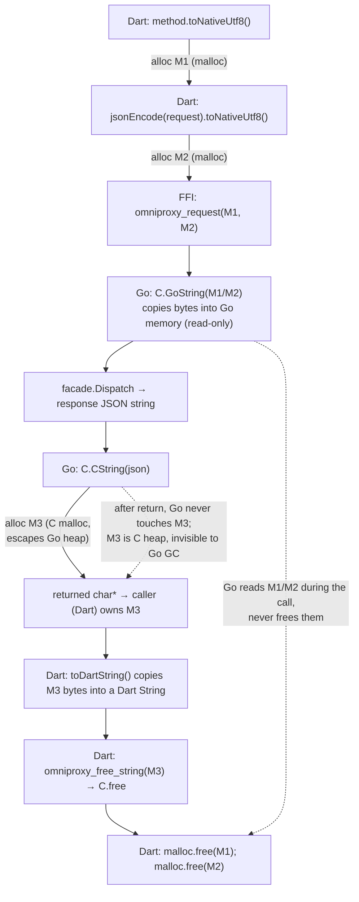

# Flutter ↔ Go FFI — the transport boundary, deep dive

**Scope:** the Flutter ↔ Go bridge in OmniProxy: what crosses the boundary, in
what shape, who owns each byte, and why every design decision is what it is.
This is the deepest-dive doc for the boundary — read `docs/api-contract.md` first.

Everything below is verified against source; every claim cites `file:line`.
The transports are **pure transport**: they frame JSON, cross the ABI, and
forward events. All contract semantics live in the Go core.

---

## 1. Purpose & scope

OmniProxy ships one Flutter UI (`app/`) and one Go core (`core/`) plus a pinned
sing-box engine (`engine/`). The core runs natively per platform; the UI talks
to it through one canonical JSON method-call contract. There are exactly two
transport families, plus a mock:

| Transport | File | Mechanism | Status |
|---|---|---|---|
| Linux FFI | `app/lib/core/bridge/bridge_linux.dart` + `core/glue/glue.go` | `dart:ffi` into `libomniproxy.so` (c-shared) | live (M6) |
| Android MethodChannel | `app/lib/core/bridge/bridge_android.dart` + `core/mobile/mobile.go` + `Bridge.kt` | gomobile bind `.aar`, Kotlin MethodChannel host | live (M7) |
| Windows FFI | `app/lib/core/bridge/bridge_windows.dart` | `dart:ffi` into `omniproxy.dll` (same ABI as Linux) | placeholder (M8) |
| Mock | `app/lib/core/mock_api_client.dart` | in-Dart, in-memory | dev/shell fallback |

Selection happens once in `app/lib/core/client_factory.dart:20-28`:
Android → `AndroidBridge`, Linux → `LinuxBridge`, everything else (including
Windows today) → `MockApiClient` so the shell keeps running until M8
(`client_factory.dart:18-27`).

**What this doc covers:** the contract envelope (§3), the Linux FFI transport
(§4), the Android MethodChannel transport (§5), the Windows placeholder (§6),
the poll-vs-push event design (§7), the memory & lifetime protocol (§8 — the
riskiest part), error/lifecycle handling (§9), serialization performance (§10),
known gaps (§11), and pointers to sibling docs (§12).

**What this doc does *not* cover:** VPN/tunnel protocol logic, the privileged
helper's JSON-over-Unix-socket protocol, sing-box internals, or the config
engine. Those live in their own docs and source.

---

## 2. Why a pure-transport bridge

### The architectural decision

The bridge contract (`docs/api-contract.md`) is one document, and every
transport implements *exactly* it. The rule is stated twice — in the contract
(`api-contract.md:4`: "No transport may add, remove, or reinterpret a method")
and in the code (`app/lib/core/bridge/bridge_transport.dart:1-11`,
`core/api/contract.go:3-4`). The `BridgeTransport` interface is only four
members — `request`, `events`, `start`, `stop`
(`bridge_transport.dart:24-37`) — because that is all a transport is allowed to
be: *"Sends one method request… and returns the decoded response"*.

Three layers keep this honest:

- **`BridgeApiClient`** (`app/lib/core/bridge_api_client.dart`) maps typed
  `ApiClient` calls → method strings + request maps, and response maps → typed
  models. It is platform-agnostic; it has never seen an FFI pointer or a
  `MethodChannel`.
- **`BridgeTransport` implementations** (Linux/Android/Windows) only: encode
  JSON, cross the ABI, decode the envelope, forward events. They must not know
  what `connect` *does*.
- **`core/api.Dispatcher`** (`core/api/dispatch.go`) is the single switch on
  method names; **`core.Facade`** (`core/core.go`) is the single implementation
  of `api.Handler` (`core/api/handler.go:7-26`). The core is where "what a
  method means" lives.

### What happens if business logic leaks into a transport

The failure mode is a silent per-platform fork of behavior. Concretely:

- **Contract drift.** If the Linux transport started special-casing `connect`
  (say, appending a mode default before forwarding), the Android transport
  would have to replicate it, and the Windows one too. Each drift point is a
  place where the three platforms disagree about the *same product feature* —
  which violates the rule that identical features behave identically
  everywhere (`AGENTS.md`: "Identical feature set across platforms").
- **Bugs get triplicated.** Logic that belongs in one Go handler is
  re-implemented three times in three languages (Dart, Kotlin, Dart-again),
  each with different memory and threading rules.
- **The deadlock/timing surface grows.** The one thing transports *must* own is
  crossing the ABI safely (threads, memory, lifetimes). Add business logic and
  you interleave product semantics with pointer lifetimes, making §8's hazards
  much harder to reason about.

The enforcement mechanism is the `Dispatcher`: `dispatch` switches on the
method string and *only* hands the facade a decoded request
(`dispatch.go:38-136`). A transport cannot inject behavior; its only lever is
`facade.Dispatch(method, req)` (`glue.go:129`, `mobile.go:189`). The one
concession to platform reality — Android's `VpnService` TUN-fd hand-off — is
exposed as *explicit seams* (`SetTunFd`, `SetSocketProtector`,
`SetDefaultInterface`, `SetNetworkInterfaces` in `core/mobile/mobile.go`), not
as hidden logic inside a request. That keeps the seam observable and the
request path identical across platforms.

---

## 3. The shared contract

### Envelope shape

Everything crossing the boundary is **UTF-8 JSON, one object per request, one
object per response** (`api-contract.md:8-9`).

- **Request:** the method name travels as a separate string (FFI: a separate
  C-string argument; Android: the `MethodChannel` method name), and the payload
  is one JSON object (possibly `{}`).
- **Response envelope:** `{"ok":true,"data":{...}}` or
  `{"ok":false,"error":{"code":string,"message":string}}` (`api-contract.md:10`).
  Go models this as `api.Response` (`core/api/contract.go:56-60`).
- **Error codes:** `not_found · invalid_argument · validation_failed ·
  engine_error · busy · connected · unauthorized · internal`
  (`api-contract.md:161`, `contract.go:38-47`). The facade maps domain errors
  onto these in one place (`core.go:178-197`).
- **Events:** `{"type":...,"data":...}` one per event (`api-contract.md:165-171`,
  `core/api/events.go:6-9`), types `stateChanged · logAppended ·
  latencyTested` (`contract.go:31-35`).

There are **no ids/correlations** on the wire. Requests are strictly
request→response (synchronous method call), and events are fire-and-forget into
a bounded ring. The design makes no attempt at multiplexed async RPC — because
it doesn't need to: every call is answered inline, and events carry their own
state.

### How a "method call" maps onto the boundary

`BridgeApiClient._call(method, request)` (`bridge_api_client.dart:14-24`) is
the one-line abstraction: send request → unwrap envelope → `ApiError` on
`ok:false`. Each `ApiClient` method is exactly one `_call` (e.g.
`connect` at `bridge_api_client.dart:94-99`, `getLogs` at
`113-122`). On the Go side, `omniproxy_request` → `facade.Dispatch` →
`Dispatcher.dispatch` picks the handler by method name and produces the
envelope (`glue.go:115-130`, `dispatch.go:18-136`). Unknown methods get
`invalid_argument` (`dispatch.go:134`).

### The boundary, end to end

Full sequence for one `connect` (Linux, proxy mode) across the whole boundary.
Note the two halves: the synchronous request chain (UI → core → response), and
the asynchronous event drain (core ring → poll timer → UI stream).

```mermaid
sequenceDiagram
    autonumber
    participant UI as Flutter UI (Riverpod)
    participant BA as BridgeApiClient
    participant TB as LinuxBridge (dart:ffi)
    participant GL as glue: libomniproxy.so
    participant FA as core.Facade
    participant VPN as vpn.Service / Tunnel
    participant RING as EventRing (512)
    participant TM as Poll Timer (15 ms)

    UI->>BA: connect(serverId, mode)
    BA->>TB: request("connect", {serverId, mode})
    TB->>TB: method.toNativeUtf8(); jsonEncode(req).toNativeUtf8()
    TB->>GL: FFI omniproxy_request(method*, request*)
    Note over GL: coreMu.Lock() — serializes vs other requests/shutdown
    GL->>FA: facade.Dispatch("connect", []byte)
    FA->>VPN: vpn.Connect(serverId, mode)
    Note over VPN: proxy mode → engine starts in-process
    VPN-->>RING: stateChanged / logAppended events (event sink)
    Note over GL: omniproxy_poll_events does NOT take coreMu,<br/>so the ring stays drainable mid-request
    FA-->>GL: Response envelope JSON
    GL->>GL: C.CString(json) → malloc'd char*
    GL-->>TB: char* (caller owns; free via omniproxy_free_string)
    Note over GL: coreMu.Unlock()
    TB->>TB: toDartString() copies bytes into Dart String
    TB->>GL: omniproxy_free_string(responsePtr)  (C.free)
    TB->>TB: malloc.free(methodPtr); malloc.free(requestPtr)
    TB-->>BA: BridgeResponse{ok, data:{state, session}}
    BA-->>UI: ConnectionSnapshot (drives dashboard)

    Note over TM,UI: async event path — independent of the request
    loop every 15 ms
        TM->>TB: _poll()
        TB->>GL: FFI omniproxy_poll_events()
        GL-->>TB: char* "[]" or JSON array (caller frees)
        TB->>TB: toDartString(); omniproxy_free_string(ptr)
        TB-->>UI: events.stream → stateChanged / logAppended
    end
```

---

## 4. Linux bridge — `dart:ffi`

File: `app/lib/core/bridge/bridge_linux.dart`. C ABI: `core/glue/glue.go`
(built by `tools/build_linux.sh:13` → `core/out/libomniproxy.so`).
Generated header: `core/out/omniproxy.h:90-94` (`omniproxy_init`,
`omniproxy_request`, `omniproxy_poll_events`, `omniproxy_shutdown`,
`omniproxy_free_string`).

### Loading the library

`start()` does `DynamicLibrary.open(path)` (`bridge_linux.dart:49`). The path
resolution order (`bridge_linux.dart:148-156`) is: compile-time
`--dart-define=OMNIPROXY_LIB` → runtime env `OMNIPROXY_LIB` → the repo-relative
`$cwd/../core/out/libomniproxy.so` (the M6 dev/test path) → plain
`libomniproxy.so` (a real app bundle, where `linux/CMakeLists.txt` bundles it —
`docs/implementation-plan.md:96`). Env-driven overrides are there so the E2E
test and CI can point at a freshly built artifact without recompiling the app
(`app/test/e2e_linux_bridge_test.dart:19`).

`DynamicLibrary.open` uses the OS loader (`dlopen`), which resolves the cgo
`libc` symbols against the *same* libc the Dart process uses — this matters for
§8: `C.CString`/`C.free` inside the `.so` and `malloc.free` on the Dart side
all resolve to one allocator.

### Symbol resolution

Every call site re-resolves the symbol with `lib.lookupFunction<Native, Dart>`
rather than caching a function pointer (e.g. `bridge_linux.dart:59`, `93`,
`126-127`, `141-143`). The Dart-side typedefs declare the C calling convention
explicitly — e.g. `_RequestNative = Pointer<Utf8> Function(Pointer<Utf8>,
Pointer<Utf8>)` with the *Dart* view in `_RequestDart` (`bridge_linux.dart:181-184`).
`dart:ffi` then generates an ABI-stable trampoline: Go's `omniproxy_request`
takes `char*` (`omniproxy.h:91`), which is exactly what `Pointer<Utf8>` is on
Linux (both are `uint8_t*`). No struct layouts are needed anywhere on this
boundary — everything is pointer-to-C-string and ints — which is why the ABI is
so cheap to keep in sync across Linux/Windows (identical signatures,
`api-contract.md:188-196`).

### `start()` / `stop()`

- `start()` (`bridge_linux.dart:47-70`): idempotent (`_started` guard). Builds
  the init config JSON (`dataDir`, `logLevel`, optional `helperPath`),
  marshals it, calls `omniproxy_init`, frees the config pointer immediately
  (`60-62`), checks the `int` return code (0 ok / -1 error, `glue.go:72`),
  then starts the 15 ms poll timer (`68`).
- `stop()` (`73-83`): cancels the timer *first*, then calls
  `omniproxy_shutdown`, then drops the library reference. Cancelling before
  shutdown means no `_poll` can observe a half-shut core (§9).

### The request path

`request()` (`bridge_linux.dart:86-120`) is deliberately boring:
`await start()`, marshal both strings to native, call, copy, free, decode.
It is `async` but the FFI call itself is **synchronous on the Dart isolate**
(`93`). Everything about the threading model flows from that one fact (§7, §9).

### The poll loop

`Timer.periodic(15ms)` (`bridge_linux.dart:41,68`) → `_poll()`
(`122-138`): call `omniproxy_poll_events`, null-check the pointer
(defensive — Go never actually returns null, `glue.go:133-139`), copy,
free, decode as a JSON array, and re-emit each entry onto a broadcast
`StreamController` (`35`). `BridgeApiClient` maps the stream to typed
`AppEvent`s (`bridge_api_client.dart:147-148`); the UI listens in
`app/lib/state/providers.dart:139,186`.

Why a **broadcast** controller: multiple notifiers (connection +
logs) subscribe to the same event stream
(`providers.dart:137-140`, `184-187`); a single-subscription controller
would throw on the second listener.

### Thread-safety

- **All native calls come from the single Dart isolate thread.** Dart isolates
  have one mutator; Timers, the request path, and `start/stop` all run on it.
  `coreMu` in glue (`glue.go:39-41`, acquired in `omniproxy_init` `104-111`,
  `omniproxy_request` `116-118`, `omniproxy_shutdown` `147-149`) therefore
  serializes what is already mostly sequential — but it is not dead weight: it
  is the contract that keeps the *Go* side correct even if a future build adds
  a second isolate or a native caller enters from another OS thread, and it
  coordinates shutdown against an in-flight request.
- **`omniproxy_poll_events` deliberately does *not* take `coreMu`**
  (`glue.go:133-139`) — it touches only the ring, which has its own mutex
  (`core/internal/ring/ring.go:13-17`). This is what lets events keep draining
  while a long request (e.g. VPN-mode `connect` blocking on the helper socket,
  up to 30 s — `core/tunnel/helper_client.go:32-35`) holds `coreMu`. The Dart
  side, however, *cannot* run the poll timer while the isolate is blocked in a
  synchronous FFI call — so during a long request events buffer in the ring and
  are drained in one burst after it returns (§7).
- **No `runtime.LockOSThread` anywhere** in `core/glue`. It is not needed: the
  glue keeps no thread-local state, cgo pins OS threads for the duration of a
  C→Go call automatically, and `coreMu` provides the serialization. (The only
  `runtime.` matches in `core/` are unrelated — `runtimeDir` in
  `core/tunnel/helper_proto.go:26-30`.)
- **No `NativeCallable`/ports.** Verified by grep across `app/lib`: no
  `NativeCallable`, no `NativeFinalizer`, no `ReceivePort` in any bridge file.
  This is the whole point of the poll design — there is deliberately no Dart
  callback registered into the native library, so no callback can ever fire
  into a blocked isolate (§7).

## 5. Android bridge — MethodChannel over gomobile bind

Files: `app/lib/core/bridge/bridge_android.dart` (Dart side),
`core/mobile/mobile.go` (gomobile-bound Go), and the Kotlin host
`app/android/app/src/main/kotlin/com/omniproxy/omniproxy/Bridge.kt` +
`MainActivity.kt` + `OmniProxyVpnService.kt`.

### Two channels

- `MethodChannel("com.omniproxy/bridge")` — Dart→native requests
  (`bridge_android.dart:18`). Dart does
  `invokeMethod<String>(method, jsonEncode(requestJson))` (`46`).
- `MethodChannel("com.omniproxy/events")` — native→Dart events
  (`bridge_android.dart:19`). Dart registers a *method-call handler*:
  `_events.setMethodCallHandler(_handleEvent)` (`bridge_android.dart:30`,
  handler at `76-83`), and Kotlin calls `invokeMethod("event", eventJson)`
  on that channel (`Bridge.kt:282`).

Note the asymmetry: the events channel is a `MethodChannel`, not an
`EventChannel`. An `EventChannel` would force Dart to own a streaming
subscription lifecycle; a `MethodChannel` used in the reverse direction is
exactly "one JSON object per event" and matches the contract
(`api-contract.md:178`). The handler receives each event as a string argument
and re-emits it onto the same broadcast `StreamController` pattern as Linux
(`bridge_android.dart:76-83`).

### The Kotlin host

`MainActivity.configureFlutterEngine` registers both channels and
`Bridge.setEventsChannel(events)` (`MainActivity.kt:27-34`). All request
handling funnels through `Bridge`:

- `ensureInit` (`Bridge.kt:59-74`): idempotent, `@Synchronized`; builds
  `{dataDir: filesDir, logLevel: "info"}`, registers the Keystore `SecretStore`
  **before** `Mobile.init` (ordering matters — see below), then starts the
  network monitor and the poller.
- `executeRequest` (`Bridge.kt:213-223`) dispatches to Go on a **fresh
  background `Thread` per request** and completes the `MethodChannel.Result` on
  the main looper via `postToMain`. The Go call must never run on the UI
  thread: `connect` can block for seconds (helper/VpnService path), and any
  UI-thread stall is an ANR. This is the documented rule
  (`Bridge.kt:21-23`).
- A second `executeRequest(method, requestJson, onDone)` overload
  (`Bridge.kt:227-237`) is used by the VpnService hand-off, which completes a
  raw callback instead of a channel result.
- `startPolling` (`Bridge.kt:251-264`) runs a `HandlerThread("omniproxy-events")`
  self-rescheduling every `EVENT_POLL_MS = 25` (`Bridge.kt:31`). `pollOnce`
  (`266-285`) calls `Mobile.pollEvents()`, parses the JSON array, and forwards
  each event to Dart *on the main thread* (`postToMain`).

### The Go side (`core/mobile/mobile.go`)

`gomobile bind` wraps exported Go functions as Java methods on the class
`com.omniproxy.bind.mobile.Mobile` (used in `Bridge.kt:12`). The surface:

- `Init(configJSON)` — same shape as `omniproxy_init`, but it also registers
  the `SecretStore` seam and builds the platform objects (`runner`,
  `FdTunPlatform`) the Android `VpnService` path needs (`mobile.go:114-167`).
  **Re-init is supported**: a second `Init` closes the previous facade
  (`161-164`).
- `Request(method, requestJSON)` — identical envelope semantics to the FFI
  glue, protected by `mu` (`mobile.go:183-190`).
- `PollEvents()` — drains the ring, returns a JSON array string
  (`mobile.go:292-302`). Note it does *not* take `mu` (like the FFI poll), so
  the poller thread and request threads run concurrently — the ring's own
  mutex is the only shared state.
- Platform seams — `SetTunFd` (`171-179`), `SetSocketProtector` (`202-218`),
  `SetDefaultInterface` (`226-233`), `SetNetworkInterfaces` (`253-289`). These
  exist because **netlink is banned on Android**: Go's `net.Interfaces()`
  opens a `NETLINK_ROUTE` socket the app sandbox denies, so the Kotlin host
  enumerates interfaces through `java.net.NetworkInterface` and *pushes* them
  in (`mobile.go:246-252`, `Bridge.kt:118-147`). This is the platform seam
  staying out of the request path (§2).

### `SecretStore` ordering

`Bridge.ensureInit` calls `Mobile.setSecretStore(...)` *before* `Mobile.init`
(`Bridge.kt:66-70`) because `Init` rebuilds the facade with the registered
store and the at-rest data key must survive a process restart
(`mobile.go:99-110`, `140-148`; `KeystoreSecretStore.kt:14-23`). If the store
is absent, `Init` silently falls back to in-memory — which regenerates the key
on every restart and breaks decryption of the stored config
(`mobile.go:145-148`).

### The VPN-mode connect hand-off

`MainActivity.handleCall` special-cases `connect`/`disconnect`
(`MainActivity.kt:37-46`). For VPN mode (`handleConnect`, `48-67`):
`VpnService.prepare()` consent → `startForegroundService(OmniProxyVpnService)`.
The service then, on its own thread (`OmniProxyVpnService.kt:46-71`):
`syncDefaultInterface()` (capture the physical network *before* the VPN
becomes the default), `Builder().establish()` for the TUN fd, `protect()` the
tunnel's own sockets, `setTunFd(pfd.fd)`, and finally `executeRequest("connect",
requestJson)`. The `MethodChannel.Result` from the original Dart call is held
in `Bridge.pendingConnect` and completed when the core responds
(`MainActivity.kt:61-62`, `OmniProxyVpnService.kt:43-44,66`). So the Dart await
on `invokeMethod` covers consent + TUN setup + core connect — the whole thing
is one request from the UI's perspective.

```mermaid
sequenceDiagram
    autonumber
    participant UI as Flutter UI
    participant AB as AndroidBridge
    participant MH as MainActivity (channel host)
    participant V as OmniProxyVpnService
    participant BK as Bridge.kt
    participant MOB as gomobile Mobile
    participant FA as core.Facade
    participant PT as HandlerThread poller (25 ms)
    participant EC as events channel

    UI->>AB: connect(serverId, mode: vpn)
    AB->>MH: invokeMethod("connect", requestJson)  [bridge channel]
    MH->>MH: VpnService.prepare() → consent intent
    MH-->>MH: onActivityResult OK (user grants)
    MH->>V: startForegroundService(OmniProxyVpnService)
    V->>V: startForeground + syncDefaultInterface()
    V->>V: Builder.establish() → TUN fd
    V->>BK: setSocketProtector(this); setTunFd(fd)
    V->>BK: executeRequest("connect", req) on background Thread
    BK->>MOB: Mobile.request("connect", req)   [mu serializes]
    MOB->>FA: Dispatch("connect", req)
    FA-->>MOB: response envelope JSON
    BK-->>MH: postToMain → result.success(response)
    MH-->>AB: invokeMethod Future completes
    AB-->>UI: BridgeResponse / snapshot

    loop every 25 ms on HandlerThread
        PT->>MOB: Mobile.pollEvents()
        MOB-->>PT: JSON array (or "[]")
        PT->>EC: invokeMethod("event", eventJson) [main thread]
        EC->>AB: _handleEvent → broadcast events stream
        AB-->>UI: stateChanged / logAppended
    end
```

### Message size limits

Both channels carry JSON **strings** through Flutter's `StandardMethodCodec`
over the platform binary messenger. On Android the hard ceiling is the Binder
transaction size (device-dependent, roughly 1 MB total) plus Flutter's channel
overhead — so a single request/response should stay well under ~100 KB in
practice. The largest payloads are `listServers` (a full profile list) and
`exportServers` (`{ids:[...], format:"links"}` → a share-link blob,
`api-contract.md:150`). A very large export could approach the limit on some
devices; the FFI transport has no such fixed ceiling (§10, §11).

---

## 6. Windows bridge — current placeholder

`app/lib/core/bridge/bridge_windows.dart` is a four-method stub:
`request` and `events` `throw UnsupportedError('WindowsBridge lands in M8')`;
`start`/`stop` are no-ops (`bridge_windows.dart:7-21`). It is marked
"Code-complete in M8; documented untested" (`bridge_windows.dart:5-6`).

**Why deferred:** Windows cannot be validated on the Linux dev host. M8
already produced the missing *Go* side — `omniproxy.dll` + `wintun.dll` now
cross-compile from Linux via mingw-w64 (`docs/implementation-plan.md:98`), and
the engine gained `//go:build linux || android` guards so Linux-only
ioctls/syscalls don't break the Windows build. The remaining work is the Dart
side, which is a near-copy of `LinuxBridge` (same ABI —
`api-contract.md:184-201`, `omniproxy.h:90-94`): load `omniproxy.dll`, resolve
the same five symbols, same memory protocol, same poll cadence. In the meantime
`client_factory.dart:27` falls back to `MockApiClient` so the shell runs.

The Windows-specific wrinkles are config, not ABI: `helperPath` is meaningless
(`platform-notes.md:73-80` — no pkexec helper; Wintun is in-process), and the
data dir is `%APPDATA%\OmniProxy`. The ABI itself does not change.

---

## 7. Polling vs push — the event delivery design

### The decision

Events are **polled, not pushed**, on both transports. The Go core never calls
into Dart; Dart (or the Kotlin poller) repeatedly drains a bounded ring.

- Linux: Dart `Timer` every 15 ms calls `omniproxy_poll_events`
  (`bridge_linux.dart:41,68,122-138`).
- Android: Kotlin `HandlerThread` every 25 ms calls `Mobile.pollEvents()`
  (`Bridge.kt:31,251-264`), then *pushes* the events to Dart over the events
  channel (`Bridge.kt:282`).

### Why

**1. The FFI deadlock is real and is the primary driver.** A native callback
into the Dart isolate requires the isolate to run Dart code. But a synchronous
FFI call (`omniproxy_request`, `bridge_linux.dart:93`) blocks the isolate
completely — and the call that blocks it (e.g. `connect`) is exactly the call
that *publishes* events. The callback would sit forever behind the blocked
isolate while the isolate waits for the call to return: deadlock. This is
stated in both the contract (`api-contract.md:199`) and the glue
(`glue.go:7-11`): "a native callback into the Dart isolate deadlocks when the
isolate is blocked inside a synchronous request call that itself publishes an
event." Polling sidesteps the entire class: the poller never needs the isolate
to be free to *enter* native code — and if it happens to run while the isolate
is blocked, it simply runs later.

**2. It removes reentrancy entirely.** With push, an event handler could
re-enter the native library while the original call is still on the stack —
recursive native calls, re-entrant `coreMu` acquisition, ordering ambiguity.
Polling means the ring is the *only* producer→consumer boundary, drained in
the same direction on a fixed tick.

**3. It is the cheapest correct design.** An `EventChannel`/port push path
would require `NativeCallable`/`ReceivePort` bookkeeping, finalizer
discipline, and a delivery thread on the Go side. Polling is a timer plus a
mutex-guarded slice (`ring.go:29-45`).

**4. Android follows the same model for symmetry.** A Java-initiated channel
push while Dart awaits a request is not a hard deadlock on Android
(`invokeMethod` from Dart is genuinely async, not a blocking FFI call), but a
push callback would still interleave with request results on the UI isolate in
unspecified order, and keeping one model means one mental model and one
test suite. The Kotlin poller on a `HandlerThread` (`Bridge.kt:251-264`) is
the Android mirror of the Dart timer.

### The ring interplay

Producers are Go goroutines — the VPN service, the log sink — publishing via
the `EventBus` (`core/api/events.go:25-76`) into `facadeSink`, which **gates
delivery on subscription state and event type** (`core/core.go:405-419`,
subscribed via `subscribe`, `core.go:381-393`). The gated events land in the
ring via `events.Push` (`glue.go:143`, `mobile.go:165`). Consumers drain with
`Drain`, which swaps the batch out atomically under the ring mutex
(`ring.go:39-45`) — producers and consumers never contend beyond that slice
swap, so a slow consumer cannot block the publisher goroutine.

The ring is bounded (`eventRingCap = 512`, `glue.go:47`, `mobile.go:44`) and
**drop-oldest** when full (`ring.go:32-36`). That is a deliberate freshness
choice: `stateChanged` is frequently superseded, so a small cap keeps delivery
fresh without losing context (`glue.go:44-47`).

### Timing, and the Linux stall

- **15 ms Linux, 25 ms Android** — an order of magnitude below the event
  consumers' needs (dashboard state updates, log line delivery), cheap because
  an empty poll returns `"[]"` and the timer callbacks are lightweight
  (`glue.go:135-137`). The Android poll is slower because each drained event is
  marshalled through a channel round-trip on the main thread (`Bridge.kt:282`).
- **The Linux poll timer stalls during a blocking FFI request.** Because the
  timer runs on the same isolate as the request, a `connect` that blocks for
  seconds (VPN mode: helper spawn + socket, up to 30 s —
  `helper_client.go:32-35`) freezes the poll loop. Events accumulate in the
  ring (subject to drop-oldest) and are delivered in one burst on the next tick
  after the request returns. The UI does not miss *state* here because the
  `connect` response itself carries the snapshot
  (`api-contract.md:152`, `core.go:337`); the burst only delays log lines. This
  is the honest tradeoff of putting the poll on the same isolate as the FFI
  calls — the alternative (a second isolate owning the poll) is possible
  (`coreMu` + the ring mutex already make cross-thread entry safe) but adds
  isolate/port plumbing for a marginal gain in MVP, where VPN-mode connects
  are user-initiated and the UI already shows a connecting state.
- **Android does not have this stall.** The Kotlin poller is a `HandlerThread`
  (`Bridge.kt:251-264`), separate from the Dart isolate and from the per-request
  `Thread`s, so events flow to Dart even while `connect` blocks Go's `mu`.

**Latency budget summary:** steady-state event delivery is ~15 ms (Linux) /
~25 ms (Android) worst-case between core-publish and UI callback, plus one
channel hop (Android) or one `jsonDecode` of a batch (Linux).

---

## 8. Memory & lifetime protocol (the riskiest part)

### Who allocates, who frees

The rule, exactly as implemented in `bridge_linux.dart` and `glue.go`:

| Allocation | Allocator | Owner after the call | Freed by |
|---|---|---|---|
| method string | Dart `toNativeUtf8()` (`bridge_linux.dart:90`) | Dart | `malloc.free` (`96`) |
| request JSON | Dart `toNativeUtf8()` (`91`) | Dart | `malloc.free` (`97`) |
| init config JSON | Dart `toNativeUtf8()` (`60`) | Dart | `malloc.free` (`62`) |
| response / events string | Go `C.CString` (`glue.go:163`) | **caller (Dart)** | `omniproxy_free_string` (`95,130`) → `C.free` (`glue.go:157-161`) |

The ownership transfer is explicit in the ABI: `omniproxy_request` and
`omniproxy_poll_events` return `char*` with the comment "caller frees"
(`api-contract.md:191-194`, `omniproxy.h:91-92`), and `omniproxy_free_string`
exists *specifically* so the caller's free goes through the same runtime that
allocated (`glue.go:156-161`).

### The exact order of operations (request path)



Why the copies are safe (each `M1..M3` is one contiguous byte buffer):

1. **Inputs are caller-owned and copied by Go.** `C.GoString` copies the
   C string into a Go `string` (`glue.go:76,123-127`) before any dispatch, so
   the Dart pointers only need to stay valid *for the duration of the call*,
   which they do (`malloc.free` runs after the call returns, `96-97`). Go's GC
   then owns the copies; Dart's original buffers are independent.
2. **Outputs are C-heap, not Go-heap.** `C.CString` (`glue.go:163`) allocates
   with `malloc` on the C side; the returned pointer does not point into the Go
   heap, so the Go GC neither tracks nor moves it. It remains valid until
   explicitly freed — even after the Go call frame is gone. This is why the
   pointer can safely live past the FFI call back into Dart. (Returning a
   pointer into a Go `string`/`[]byte` would be the classic cgo footgun:
   the object could be collected or the pointer dangle.)
3. **Free is symmetric by construction.** The response is freed via
   `omniproxy_free_string`, which calls `C.free` (`glue.go:159`) on a pointer
   created by `C.CString` — matching `malloc`/`free` within one process and one
   libc. `toNativeUtf8`'s default allocator is `package:ffi`'s `malloc`, and
   Dart frees those with `malloc.free` (`96-97`) — again one allocator.
4. **`toDartString()` copies before the free** (`94-95`): the Dart `String` is
   fully materialized before the C memory is released, so there is no
   use-after-free even though the native buffer dies on the next line.
5. **NUL-termination is guaranteed on both sides.** `C.CString` NUL-terminates;
   `toDartString()` reads to the first NUL. JSON produced by `json.Marshal` and
   `jsonEncode` escapes control characters (including `\u0000`), so no embedded
   NUL can truncate a payload.

### Pointer validity across calls

- Returned `char*` values from *different* calls are independent buffers; no
  pointer from one call is valid in another, and the code never caches them.
  `_lib` (the `DynamicLibrary`) is the only long-lived native handle.
- `omniproxy_init` receives a Dart-owned config pointer; Dart frees it right
  after the call (`60-62`). The config was already copied into a Go struct by
  `json.Unmarshal(C.GoString(...))` (`glue.go:75-80`), so nothing outlives the
  call.
- The event poll is identical to the request path: Go returns a fresh batch
  string, Dart copies and frees (`129-130`).

### Risks and mitigations

| Risk | Where it would show up | Mitigation in place |
|---|---|---|
| **Use-after-free** | Freeing a response pointer before reading it, or reading after free | Order is always copy-then-free (`94-95`, `129-130`); pointer never stored |
| **Leak (missed free)** | An exception between allocation and free (e.g. `toDartString` OOM, `lookupFunction` failure) | Inputs are freed immediately after the call; outputs after copy. If `toDartString()` throws, `omniproxy_free_string` is skipped — a bounded per-call leak. No finalizer guards this (§11) |
| **Double-free** | Freeing the same pointer twice | Each call allocates exactly one response buffer; `_freeString` is invoked exactly once per returned pointer; Dart never frees Go-allocated pointers except via `omniproxy_free_string` |
| **Mismatched allocator** | Dart `malloc.free` on a Go-`C.CString` buffer (or vice versa) | Outputs only via `omniproxy_free_string` → `C.free`; inputs only via `malloc.free`; both resolve to one libc in-process |
| **GC/movement hazard** | Returning a pointer into Go heap | Never done — `C.CString` escapes to C heap (`glue.go:163`) |
| **Null deref** | `omniproxy_request` returning null | Cannot happen: it returns `mustJSON(...)` on every path (`glue.go:118-129`). `_poll` still null-checks defensively (`bridge_linux.dart:128`); `request()` does not (§11) |
| **Crash on bad ABI** | Signature mismatch between Dart typedefs and the C header | Typedefs mirror the header exactly (`bridge_linux.dart:178-193` vs `omniproxy.h:90-94`); no structs to drift |

### The Android side of memory

The Android transport never crosses C memory at all. Go returns a Go `string`
through gomobile's Java wrapper; Kotlin receives a `String`, and
MethodChannel's `StandardMethodCodec` copies it into the Dart isolate
(`Bridge.kt:217`, `mobile.go:189`). There is no manual free and no pointer
escape — the whole §8 hazard surface is Linux/Windows-FI-specific. The one
shared principle: **every string crossing the FFI ABI is a fresh copy** (Go
`C.CString` on output, Dart `toNativeUtf8` on input), never a borrowed view.

---

## 9. Error & lifecycle handling

### init/shutdown sequencing

- **Linux:** `LinuxBridge.start()` opens the library, calls `omniproxy_init`
  (which is safe to call again — it closes any previous facade and replaces it,
  `glue.go:104-111`), and only then starts the poll timer (`bridge_linux.dart:68`).
  `stop()` cancels the timer first, then `omniproxy_shutdown`
  (`bridge_linux.dart:73-83`); shutdown closes the facade (disconnect VPN, stop
  tunnel, release helper — `core/core.go:157-167`) and drains the ring
  (`glue.go:145-154`).
- **Android:** `Bridge.ensureInit` is `@Synchronized` + `initialized`-guarded
  (`Bridge.kt:33,58-74`); `shutdown` (`Bridge.kt:239-249`) calls
  `Mobile.shutdown()`, stops the poller, and resets `initialized` so the next
  `ensureInit` can rebuild (gomobile `Init` also replaces an existing facade,
  `mobile.go:161-164`).
- **Re-initialization is supported on both** — a fresh `init` after `shutdown`
  builds a new facade and re-registers the event sink
  (`glue.go:104-111`, `mobile.go:114-167`).

### Events during shutdown

- The Linux order (cancel timer → shutdown → null the library) guarantees no
  `_poll` runs against a half-closed core (`bridge_linux.dart:73-83`). The
  remaining ring contents are dropped by `omniproxy_shutdown`'s `events.Drain()`
  (`glue.go:153`) — deliberate: nothing is listening anymore.
- Android's `shutdown` removes pending poller callbacks and quits the
  `HandlerThread` (`Bridge.kt:244-247`), so in-flight `pollOnce` runs finish or
  are dropped; `Mobile.pollEvents` on a drained/closed facade is safe because
  it only touches the ring (`mobile.go:292-302`).
- A request racing shutdown: on Linux it cannot race (single isolate, sequential
  calls). On Android, request threads run independently of `shutdown`; if a
  thread acquires `mu` after `Shutdown` set `facade = nil`, `Request` returns
  the `{"ok":false,"error":{...,"code":"internal","message":"core not initialized"}}`
  envelope instead of crashing (`mobile.go:186-188`). The FFI glue has the same
  guard (`glue.go:118-120`).

### Errors across the boundary

- Domain errors never reach the transport as exceptions: `Dispatcher.dispatch`
  folds them into the error envelope (`dispatch.go:140-153`), `MapError` maps
  them onto contract codes (`core.go:178-197`), and Dart's `BridgeApiClient`
  converts `ok:false` into a typed `ApiError` (`bridge_api_client.dart:17-23`).
- Transport-level failures are distinct: malformed JSON response → `StateError`
  (`bridge_linux.dart:100-102`, `bridge_android.dart:55-57`); null Android
  response → `ok:false` "Empty bridge response" (`bridge_android.dart:47-53`);
  Go init failure → `StateError('omniproxy_init failed …')`
  (`bridge_linux.dart:63-66`); Kotlin exceptions during `Mobile.request` →
  `result.error("mobile", …)` (`Bridge.kt:219-221`).

### Panics across FFI

`glue.go` has **no `recover()`** — an unexpected Go panic inside
`omniproxy_request`/`omniproxy_poll_events` (e.g. a nil deref in a handler)
would propagate as a fatal runtime error and take the whole Flutter process
down. There is no Dart-side catch that can intercept it (a synchronous FFI
call that aborts kills the process). Mitigations today: the core is
defensive (facade nil-guards, `mustJSON` for encode failures), and `Dart`
catches Dart-side throws, but not native aborts. **Known gap** (§11) — a
`defer recover()` around the exported functions would convert panics into
`{"ok":false,...}` envelopes.

---

## 10. Serialization performance notes

**Allocation count per Linux `request()` call:**

1. `jsonEncode(request)` → Dart string
2. `toNativeUtf8()` → M1 (method) + M2 (request)
3. Go `C.GoString` → 2 Go strings
4. Go `json.Marshal(response)` → Go `[]byte` → `string` → `C.CString` (M3)
5. Dart `toDartString()` → Dart string
6. 3 frees

So ~4 copies of the payload exist transiently (Dart String → C buffer → Go
string → response C buffer → Dart String). This is the price of a
byte-string ABI with no shared buffers, and it is acceptable: payloads are
small (`ServerProfile`, settings, logs) except `listServers`/`exportServers`.

- **JSON is the contract, not an optimization.** It is chosen for debuggability
  and language-agnosticism (`api-contract.md:8`); every method marshals/unmarshals
  twice (once per side). Hot paths that could someday care (e.g. streaming
  stats, Phase 2) would add a dedicated binary channel *alongside* the JSON
  contract — never a replacement, per the pure-transport rule.
- **The poll is the hot path and it is already cheap:** empty polls return the
  2-byte `"[]"` (`glue.go:135-137`), so the steady-state cost is one cgo call +
  one `jsonDecode("[]")` every 15/25 ms.
- **`jsonDecode` per event** happens once on the Dart side for the whole batch
  (`bridge_linux.dart:131`), then each event is re-emitted as a decoded `Map` —
  no per-event re-parse on the transport.
- **Credentials note:** responses can carry credential fields by design (the
  bridge is trusted, same-process — `api-contract.md:15`); transports must
  never log payloads, and they don't (`bridge_transport.dart` has no logging).

---

## 11. Known gaps & limitations

1. **No panic recovery in the FFI glue.** A Go panic in an exported function
   crashes the whole app (§9). A `recover` converting panics to error
   envelopes is the obvious hardening.
2. **`request()` does not null-check the response pointer** (`bridge_linux.dart:93`),
   while `_poll` does (`128`). Today Go never returns null; the asymmetry is a
   latent crash if the ABI ever changes.
3. **No `NativeFinalizer` on native strings.** Dart relies on the disciplined
   copy-then-free order; if `toDartString()` throws, the C buffer leaks (§8).
   A `NativeFinalizer` attached to a wrapper would make the free GC-safe but
   adds a heap object per call — the current code judged the tradeoff not
   worth it for short-lived, always-freed buffers.
4. **The Linux poll freezes during a blocking request** (single-isolate
   design, §7). Events buffer in the ring with drop-oldest; long VPN connects
   can drop `logAppended` frames. A dedicated poll isolate would fix this.
5. **Ring is drop-oldest, not coalescing.** Bursts of `stateChanged` events are
   delivered one by one even though only the last matters; the UI dedups by
   state (`providers.dart:152-159`). Coalescing per event type is a Phase 2
   refinement.
6. **Android request threads are unbounded.** Each `executeRequest` spawns a
   fresh `Thread` (`Bridge.kt:215-222`); a burst of UI calls creates a burst of
   threads, each blocking on Go's `mu`. A small executor would cap that.
7. **`StreamController`s are never closed** on `stop()` (`bridge_linux.dart:35`,
   `bridge_android.dart:21`). Harmless today (timers/handlers are removed first,
   so no post-close `add`), but not tidy for a long-lived app that
   start/stops repeatedly.
8. **Android channel message size ceiling** — large `exportServers` blobs may
   approach Binder limits (§5, message size limits).
9. **Windows transport is a stub** (§6) — the Dart side of the same ABI is
   untested, and M8 validation needs a Windows host/CI.
10. **Windows `defaultLibraryPath`-style resolution is absent** in the stub;
    the M8 implementation must mirror `bridge_linux.dart:148-156` with a
    `%APPDATA%` data dir.
11. **Event ordering across poll boundaries is FIFO within the ring**
    (`ring.go:29-45`), and Android re-posts each event to the main thread in
    array order (`Bridge.kt:279-284`); ordering is therefore preserved. Not a
    gap — stated so no one "fixes" it into a parallel dispatch.

---

## 12. Related documents

Existing, in-repo:

- `docs/api-contract.md` — the canonical contract every transport implements
  (method names, envelopes, events, error codes, transport sections §5).
- `docs/implementation-plan.md` — milestones: M6 Linux FFI (`:96`), M7 Android
  MethodChannel/gomobile (`:97`), M8 Windows cross-compile (`:98`).
- `docs/platform-notes.md` — per-platform TUN/privilege/seam notes: Android
  (`:12-22`), Linux helper model (`:62-71`), Windows (`:73-80`).

Companion docs (sibling doc-set members; each covers a different layer of the
boundary this file documents):

- `docs/FLUTTER.md` — Flutter app architecture (theme, router, Riverpod state).
- `docs/GO_RUNTIME.md` — Go core runtime: facade, event bus, goroutine model.
- `docs/LOW_LEVEL.md` — FFI/memory low-level notes (superseded in detail by
  this file's §8, but kept as the entry point).
- `docs/ARCHITECTURE.md`, `docs/ANDROID.md`, `docs/LINUX.md`, `docs/WINDOWS.md` — the platform-specific bridge hosts and their lifecycle.
- `docs/ARCHITECTURE.md` — overall system architecture diagram and layering.
- `docs/ANDROID.md`, `docs/LINUX.md`, `docs/WINDOWS.md` — per-platform deep
  dives (build, packaging, services, privileges).

