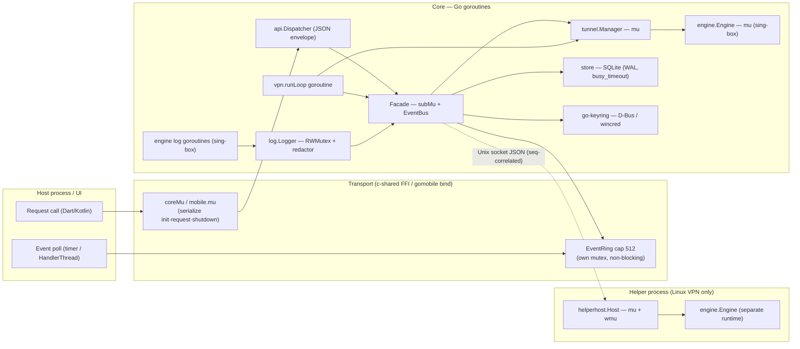

# GO_RUNTIME — How the OmniProxy Go Core Actually Runs

**Audience:** engineers working on the Go core (`core/`), the engine wrapper (`engine/`), or the bridges (`core/glue`, `core/mobile`).
**What this is:** a runtime-behavior document — concurrency model, goroutine lifecycle, memory behavior, synchronization, CGO/FFI mechanics, and blocking I/O. It explains *why* the code is shaped the way it is, with `file:line` citations. Where Go-runtime behavior is inferred rather than stated in the code, it is explicitly marked *(speculation/observed)*.
**Source of truth for behavior:** `PRD.md`; for bridge semantics: `docs/api-contract.md`; for platform constraints: `docs/platform-notes.md`.

---

## 1. Purpose & scope

The OmniProxy Go core is a Go 1.26.4 module (`omniproxy/core`, `core/go.mod:1-3`) that orchestrates the Config Engine, Server Manager, Tunnel Manager, VPN Service, an event bus, a SQLite store, and a SecretStore. It delegates all tunnel protocol work to a pinned `sing-box v1.13.15` through the `omniproxy/engine` wrapper module. Two other Go binaries exist:

- `core/cmd/omniproxy-helper` — the privileged Linux helper that hosts its *own* engine instance in a separate process (`core/cmd/omniproxy-helper/main.go:17-27`).
- `core/glue` — a `c-shared` library (`libomniproxy.so` / `omniproxy.dll`) exporting the FFI ABI (`docs/api-contract.md` §5.2).
- `core/mobile` — the gomobile bind package for the Android `.aar` (`docs/api-contract.md` §5.1).

This document covers **runtime-relevant** concerns only:

- Concurrency model and the process/goroutine boundaries (`§2`).
- The polled event bus — why a bounded ring instead of push callbacks (`§3`).
- Every synchronization primitive and what it protects (`§4`).
- Every long-lived goroutine, how it starts and how it stops (`§5`).
- Allocation and GC behavior on the hot paths (`§6`).
- CGO / FFI threading and memory-ownership rules (`§7`).
- SQLite (modernc) and other blocking I/O (`§8`).
- Known runtime risks and their mitigations (`§9`).

It deliberately does **not** cover sing-box internals beyond what the wrapper touches, and it does not re-describe the bridge contract (see `docs/api-contract.md`).

---

## 2. Concurrency model

### 2.1 Owners and boundaries

There are three kinds of execution contexts:

1. **The host UI context.** On Linux/Windows this is the Dart isolate; on Android it is Kotlin threads (the `VpnProxyService` foreground service and the main activity). All host→Go calls are **synchronous FFI/bind calls**. The host never touches Go memory directly; it exchanges JSON strings and drains events.
2. **Core goroutines (the app process).** The request path runs on the calling thread (goroutine); background work runs on explicitly spawned goroutines (see `§5`). Sing-box itself spawns an unbounded number of internal goroutines for connections and packet handling.
3. **The helper process (Linux VPN mode only).** A separate OS process with its own Go runtime and its own sing-box instance, reached over a Unix stream socket (`$XDG_RUNTIME_DIR/omniproxy/helper.sock`, `core/tunnel/helper_proto.go:25-35`). The process boundary is also a concurrency boundary: everything crossing it is serialized by the JSON-over-socket protocol, not by shared locks.

There is **exactly one long-lived goroutine per VPN session** (`vpn.runLoop`), **one per helper control connection** (`helperClient.readLoop`), plus transient reaper goroutines. Everything else in the core is request-driven and synchronous on the calling goroutine.

### 2.2 The two synchronization spine layers

The core uses two independent "spines" that are carefully kept **disjoint**:

- **Spine A — request serialization:** `coreMu` in glue (`core/glue/glue.go:39`) or `mu` in mobile (`core/mobile/mobile.go:47`) serializes `init` / `request` / `shutdown`. This makes the whole bridge single-threaded from the host's point of view, which in turn makes SQLite access effectively single-threaded (see `§8`).
- **Spine B — event delivery:** publishers (VPN state machine, logger, latency test) → `EventBus.Publish` → the subscription-gated `facadeSink` → the transport's `EventRing`. The ring is polled by the host, **not** by a Go goroutine.

The two spines only meet at `EventRing.Push`, which never takes `coreMu`/`mobile.mu`, and `omniproxy_poll_events`/`PollEvents` deliberately **do not take the transport mutex** (`core/glue/glue.go:133-139`, `core/mobile/mobile.go:292-302`). So:

- A long-running request (e.g. `connect` → engine start) holds Spine A but cannot block event producers, because `Push` is non-blocking and ring-local.
- A poll can never be blocked behind a request, because it takes only the ring's own lock.



Lock-order rule (see `§9.1`): `coreMu`/`mobile.mu` → `subMu` → `bus.mu` → `ring.mu`. The ring lock is always the leaf; it is never held while any other lock is taken. `facadeSink.SendEvent` releases `subMu` **before** invoking the sink (`core/core.go:407-419`), and `EventBus.Publish` releases `bus.mu` before delivering (`core/api/events.go:66-75`), so a sink can never re-enter the bus while it is locked.

### 2.3 What happens on each bridge call

All `api.Handler` methods (`core/api/handler.go:7-26`) are dispatched by `api.Dispatcher` (`core/api/dispatch.go:18-25`), which is pure: decode JSON → call handler → map errors → encode envelope. The transport mutex is held for the **whole** call, which is why handler methods must not block indefinitely (see `§8` for the exceptions and their bounds).

---

## 3. The event bus & poll loop

### 3.1 Why bounded ring + poll instead of push callback

Events flow: publisher → `EventBus` → `facadeSink` (subscription gate) → `EventRing` → host poll. The definitive rationale is written into the glue header (`core/glue/glue.go:7-11`):

> Events are polled, not pushed: a native callback into the Dart isolate deadlocks when the isolate is blocked inside a synchronous request call that itself publishes an event (the cgo thread cannot hand the callback off while the isolate is inside the FFI call).

Concretely: `dart:ffi` calls are synchronous — the isolate blocks on its event loop while native code runs. A native callback that must execute Dart code (e.g. `MethodChannel` or a Dart `Port`) cannot be serviced until the isolate returns to the loop, which it cannot do until the FFI call returns. If a request like `connect` publishes a `stateChanged` event *synchronously on the calling thread* (which it does — `vpn.Service.Connect` calls `emitState` before returning, `core/vpn/service.go:206`), a push-style callback would deadlock exactly at that point. The ring breaks the cycle: the event is dropped into a bounded buffer with no synchronization against the host, and the host collects it on a later, independent call.

The same reasoning applies on Android: the Kotlin host drains on a `HandlerThread` timer (25 ms poll, per `docs/implementation-plan.md` M7) and re-emits over `MethodChannel("com.omniproxy/events")` (`core/mobile/mobile.go:1-8`).

```mermaid
sequenceDiagram
    participant Dart as Dart isolate
    participant Glue as core/glue (cgo)
    participant Facade as Facade + EventBus
    participant Loop as vpn.runLoop goroutine
    participant Ring as EventRing (cap 512)

    Dart->>Glue: omniproxy_request("connect", {...})
    Glue->>Facade: Dispatch("connect")
    Facade->>Loop: go runLoop(...)   (returns immediately)
    Note over Loop,Facade: Connect emits "connecting" synchronously
    Loop->>Facade: emitState(connecting) → bus.Publish
    Facade->>Ring: facadeSink → Push  (never blocks)
    Glue-->>Dart: response JSON (call returns)
    Loop->>Facade: emitState(connected) → bus.Publish
    Facade->>Ring: Push(connected)
    Note over Dart,Ring: host poll timer fires later
    Dart->>Glue: omniproxy_poll_events()
    Glue->>Ring: Drain()
    Ring-->>Glue: [connecting, connected]
    Glue-->>Dart: events JSON batch
```

Contrast with the rejected design:

```mermaid
sequenceDiagram
    participant Dart as Dart isolate (blocked inside FFI request)
    participant C as cgo thread
    participant Loop as runLoop goroutine
    participant Bus as EventBus
    participant CB as native→Dart callback

    Loop->>Bus: Publish(stateChanged)
    Bus->>CB: SendEvent (on publisher goroutine)
    Note over CB,Dart: callback needs the isolate's event loop to run Dart code
    Note over Dart,CB: DEADLOCK — isolate is blocked in the FFI request,<br/>callback cannot be delivered, request cannot return
```

### 3.2 The EventRing design

`core/internal/ring/ring.go:12-45`:

- `EventRing` is a **bounded FIFO** (`mu sync.Mutex`, `events []api.Event`, `cap int`). Despite the name it is not a circular-indexed ring; it is a slice with drop-oldest semantics (`ring.go:29-36`).
- Capacity defaults to **512** when `cap <= 0` (`ring.go:22-24`). Both transports instantiate `ring.New(eventRingCap)` with `eventRingCap = 512` (`core/glue/glue.go:41,47`; `core/mobile/mobile.go:44,51`).
- **`Push`** (`ring.go:29-36`): append, then if `len > cap`, reallocate the tail (`append([]api.Event(nil), r.events[len(r.events)-r.cap:]...)`). It **never blocks** — no condition variable, no channel, no waiting. This is the guarantee that keeps the publisher goroutine (and the FFI thread that publishes synchronously during `connect`) safe.
- **`Drain`** (`ring.go:39-44`): `batch := r.events; r.events = nil; return batch`. O(1) swap — the host thread takes the whole buffer and resets it. `poll_events` therefore returns immediately and can be called as often as the host likes.
- **Why drop-oldest:** the dominant event types are `stateChanged` and `logAppended` (`core/glue/glue.go:44-47`). A `stateChanged` is frequently superseded by a newer one, so on overflow it is better to lose an *old* state and keep the *latest* state fresh than to preserve stale ordering. Log continuity is preserved across gaps by `getLogs` with `afterSeq` backfill (`core/core.go:355-360`, contract §3) — the `LogEntry.seq` is monotonic per process (`core/log/ring.go:28-42`), so the UI can dedup.
- **Why 512:** small enough to stay fresh and bound memory (~tens of KB at most — each event is a JSON-marshalable struct), large enough to carry a connect burst (a `connect` produces `connecting`/`connected` + a handful of `logAppended` lines). `core/mobile/mobile.go:42-44` states this explicitly.
- **How events survive across FFI calls:** events live in Go heap memory (the ring), not on any call stack. A poll copies them out into JSON; anything pushed between two polls persists until the next `Drain` or until overflow. On host/process restart the ring is gone — the UI is expected to reconcile via `getConnectionState` (contract §3) on startup.

### 3.3 The subscription gate

Event delivery is not unconditional:

- `Facade.SetEventSink` registers the transport sink (`core/core.go:171-175`, under `subMu`).
- `Subscribe`/`Unsubscribe` set `subscribed` and a whitelist `eventSet` for the three contract types (`core/core.go:381-402`).
- `facadeSink.SendEvent` (`core/core.go:407-419`) snapshots `deliver = subscribed && sink != nil && eventSet[type]` under `subMu`, then calls `sink.SendEvent` **outside** the lock. The sink in glue is `enqueueEvent` → `events.Push` (`core/glue/glue.go:110,143`); in mobile it is `events.Push` directly (`core/mobile/mobile.go:165`).

Two producers bypass the gate by writing directly to the bus rather than the sink, but they still reach the ring through `facadeSink`: the VPN service publishes `stateChanged` via its injected bus (`core/vpn/service.go:482-493`), and `TestServerLatency` publishes `latencyTested` via `f.bus.Publish` (`core/core.go:325`). The logger is wired as a sink (`logSink` at `core/core.go:144,422-426`), so every redacted log line becomes a `logAppended` event.

### 3.4 Blocking guarantees (summary)

| Concern | Guarantee | Where |
|---|---|---|
| Poll never blocks | `Drain` is an O(1) swap under a short critical section | `core/internal/ring/ring.go:39-44` |
| Push never blocks producers | no waiting primitives in `Push` | `core/internal/ring/ring.go:29-36` |
| Poll never blocked by requests | poll skips the transport mutex | `core/glue/glue.go:133-139`, `core/mobile/mobile.go:292-302` |
| No ring↔core lock coupling | ring lock is always the leaf lock | `§2.2`, `§9.1` |
| No Dart-isolate deadlock | no native→host callbacks at all | `core/glue/glue.go:7-11`; `docs/api-contract.md` §5 |

---

## 4. Synchronization primitives inventory

There are **no `sync/atomic` uses anywhere** in `core/` or `engine/` (verified by grep). All shared state is mutex- or channel-protected. Every long-lived mutex:

| Primitive | Location | Protects | Why / notes |
|---|---|---|---|
| `coreMu sync.Mutex` | `core/glue/glue.go:39` | facade lifecycle (`init`, `request`, `shutdown`) | Serializes the whole FFI request path; `poll_events` deliberately bypasses it (`glue.go:133`). |
| `mu sync.Mutex` | `core/mobile/mobile.go:47` | `facade`, `runner`, `tunPlat`, `secretStore` | Same role for gomobile bind. |
| `EventRing.mu` | `core/internal/ring/ring.go:14` | ring buffer | Leaf lock; `Push`/`Drain`. |
| `EventBus.mu` | `core/api/events.go:26` | subscriptions map | `Publish` snapshots sinks under lock, delivers outside (`events.go:66-75`). |
| `subMu sync.Mutex` | `core/core.go:64` | `subscribed`, `eventSet`, `sink` | Subscription gate; released before sink call (`core.go:407-419`). |
| `tunnel.Manager.mu` | `core/tunnel/manager.go:22` | `profile`, `mode`, `logLevel`, `cacheFile`, `ipv6Mode` | Held across `runner.Start`/`Stop` (`manager.go:62-92`) — so engine start/stop blocks every Manager accessor. |
| `vpn.Service.mu` | `core/vpn/service.go:85` | `state`, `session`, `active`, `auto`, `retry` | State machine; every transition/query takes it; session mutation and cloning happen under it. |
| `runState.cmds chan command` (cap 1) | `core/vpn/service.go:73,202` | commands to the run loop | Non-blocking send with `default` (`service.go:475-480`); may drop under races (see `§9.5`). |
| `runState.done chan struct{}` | `core/vpn/service.go:74,202` | loop completion signal | Closed once by `finish` (`service.go:437-448`). |
| `helperClient.mu` | `core/tunnel/helper_client.go:214` | `seqCounter`, `pending`, `closed`, `running` | Request/response correlation table. |
| `pending map[uint64]chan ServerMessage` | `core/tunnel/helper_client.go:216` | in-flight helper requests | Written under `helperClient.mu`; read by `readLoop` (`helper_client.go:258-270`). |
| `HelperRunner.mu` | `core/tunnel/helper_client.go:68` | `client`, `cmd` | Spawn/reuse/lifetime of the helper process. |
| `Host.mu` | `core/tunnel/helperhost/helperhost.go:69` | engine state (`eng`) | Single-client helper server. |
| `Host.wmu` | `core/tunnel/helperhost/helperhost.go:70` | socket writes | `json.Encoder` is not safe for concurrent use; serializes responses + event stream (`helperhost.go:75-85,160-167`). |
| `engine.Engine.mu` | `engine/engine.go:14` | `box`, `ctx`, `cancel`, `platform` | Guarantees a single active sing-box instance per `Engine` (`engine.go:44-88`). |
| `FdTunPlatform.mu` | `engine/platform_fd.go:21` | `fd`, `protect`, `monitor`, `networkManager`, interfaces | Host-fed Android platform state (TUN fd, protect callback, pushed interfaces). |
| `platformInterfaceMonitor.access` | `engine/platform_monitor.go:32` | callbacks list, `networkManager`, `defaultInterface` | Passive Android default-interface monitor. |
| `Logger.mu sync.RWMutex` | `core/log/logger.go:62` | `level`, `sinks` | Read-locked on every `log()` for level check and sink snapshot (`logger.go:130-161`). |
| `ConsoleSink.mu` | `core/log/logger.go:26` | stderr writer | Prevents interleaved writes. |
| `RingBuffer.mu` | `core/log/ring.go:12` | `entries`, `seq` | In-memory log viewer buffer (cap 1000, `logger.go:78`). |
| `Redactor.mu sync.RWMutex` | `core/log/redactor.go:15` | compiled regexp | Redaction on the logging hot path. |
| `secret.InMemory.mu sync.RWMutex` | `core/secret/store.go:29` | map | Test/fallback store only. |
| `config.Engine.mu sync.RWMutex` | `core/config/engine.go:100` | in-memory settings doc | Settings read fast path; write path persists the encrypted blob under the write lock. |

Notable absences (deliberate):

- **No condition variables, no channels in the event path.** Push/poll are lock-only so neither side can block the other.
- **No `sync.Once`, no `sync.WaitGroup`** in production code (only tests use `WaitGroup`).
- **No atomics** — the hot counters (log `seq`) are inside mutex-protected structures, not atomic, because they are read/written through the same short critical sections.

---

## 5. Goroutine lifecycle

Only three goroutines are ever spawned by the core itself (all others are sing-box internals):

### 5.1 `vpn.runLoop` — the session state machine

- **Spawned:** `Service.Connect` → `go s.runLoop(rs, p, mode)` (`core/vpn/service.go:208`), with a `runState{ctx, cancel, cmds(1), done, session}` (`service.go:201-204`). It is spawned once per session; `Connect` reaps any *stale* prior loop before starting (`service.go:170-183`).
- **Loops on:** `for { err := tunnel.Start(...); ...; select { case cmd := <-rs.cmds: ... case <-rs.ctx.Done(): ... } }` (`service.go:268-321`). On a failed start it stops the tunnel, applies backoff (`wait`, `service.go:347-366`), and retries up to the policy cap (default 1s,2s,4s…≤30s, 5 attempts; `service.go:42-58`).
- **Stops via:** `cmdDisconnect` → `teardown` + return; `ctx.Done()` → `teardown` + return; a newer Connect (checked with `isActive` after every blocking call, `service.go:394-398`) → return without touching shared state; retry exhaustion → `transitionError` + return.
- **Always terminates:** `defer s.finish(rs)` (`service.go:269`) sets `active = nil` if this is still the live loop, finalizes `EndedAt`, and closes `rs.done` (`service.go:437-448`) so `Disconnect` can await it.
- **Cancellation is cooperative:** the loop only observes `ctx` at select points. If `tunnel.Start` blocks (engine start), cancellation cannot interrupt it — see `§9.6`.

### 5.2 `helperClient.readLoop` — helper responses & events

- **Spawned:** `dialHelper` → `go c.readLoop()` (`core/tunnel/helper_client.go:232`), once per control connection.
- **Loops on:** `bufio.Scanner(c.conn)` reading newline-delimited JSON (`helper_client.go:242-273`). `"event"` messages are forwarded to the logger (redaction applies, `helper_client.go:249-253`); `"response"` messages are correlated by `Seq` and delivered into the registered `pending` channel (`helper_client.go:258-270`).
- **Stops:** on scan error/EOF → `c.close(false)` (`helper_client.go:272`), which marks `closed`, closes the conn, and flushes an error response into every pending waiter (`helper_client.go:344-369`). So a dead helper unblocks all in-flight `await`s with an error rather than hanging them.
- **Lifecycle note:** it is idle-alive for the whole lifetime of the connection (that is the design — it is the event pump for engine logs). It is not a leak; it ends when the socket closes, which the app's `Close` guarantees (`HelperRunner.Close` → `client.close(true)`, `helper_client.go:127-139`).

### 5.3 Helper reaper — bounded `cmd.Wait`

- **Spawned:** inside `HelperRunner.Close` (`core/tunnel/helper_client.go:141-151`): `go func(){ _ = cmd.Wait(); close(done) }()`, then `select` on `done` or a 2 s `time.After`; on timeout the process is killed (`cmd.Process.Kill()`) and the code waits again on `done`. This bounds shutdown so `Close` cannot hang behind a stuck pkexec helper.

### 5.4 sing-box internal goroutines

The engine wrapper does not spawn these, but its lifecycle must be correct: `Engine.Start` builds a `box.Box` with a `context.WithCancel(context.Background())` (`engine/engine.go:54-71`) and `Engine.Close` cancels that context after `box.Close()` (`engine/engine.go:76-88`). This is the knob that tears down every sing-box goroutine. The helper host applies the same pattern (`helperhost.go:99-114`).

### 5.5 The event poll "loop" is not a Go goroutine

On both transports the poller lives on the host side (Dart timer / Kotlin `HandlerThread`), so Go has no timer goroutine dedicated to events. This keeps the core free of yet another lifecycle to clean up, and it means the host controls poll cadence.

### 5.6 Leak-risk audit

| Risk | Assessment |
|---|---|
| `runLoop` stuck in a hung `tunnel.Start` | Possible (no ctx plumbing into `engine.Start`); goroutine stays blocked until Start returns. Bounded in practice by sing-box's finite setup, but nothing enforces it (`§9.6`). |
| `readLoop` hung on a silent socket | `await` timeouts (`helper_client.go:291-311`) and `close` flush waiters; the loop itself only ends on socket close — guaranteed by `Close` paths. |
| `pending` map growth | Entries are inserted in `await` and removed in `await`'s deferred delete **and** in `readLoop` (`helper_client.go:265-267,300-304`); a late response after a timeout finds no channel and is dropped. Bounded. |
| `Disconnect` waiting forever | Bounded by `disconnectTimeout` (5 s, `service.go:23`), then `forceDisconnect` (`service.go:234-237`). |
| Timers | `wait` uses `time.NewTimer` with `defer t.Stop()` (`service.go:348-349`); no timer leaks. |

---

## 6. Memory model

### 6.1 Where the allocations are

The core's own data plane is not the network hot path — **per-packet forwarding happens inside sing-box** (gvisor/system stacks), not in the core. The core's hot allocation points are:

1. **Logging path.** Every `log()` line (`core/log/logger.go:130-162`): redaction regex replace (`Redact`, `redactor.go:50-54`) allocates a new string; a `models.LogEntry` (with `Context` map) is built; `ring.Append` may reallocate on overflow (`core/log/ring.go:35-40`); sinks are snapshotted into a fresh slice (`logger.go:156-157`); the console sink and the `logSink`→bus→ring path each allocate. At `trace`/`debug` levels, sing-box engine logs flow through `engineLogSink` (`core/tunnel/runner.go:53-60`), which is the main logging volume. The redactor regexp is the single most CPU-costly step per line.
2. **Event publishing.** `EventBus.Publish` allocates a fresh `[]EventSink` snapshot per event (`core/api/events.go:68-72`); each `api.Event.Data any` boxes a struct (`core/api/events.go:6-9`). Low absolute volume (state transitions, log lines), acceptable.
3. **FFI marshaling per request.** `C.GoString` → `[]byte` → `json.Marshal` → `string` → `C.CString` (`core/glue/glue.go:115-130,163`). A handful of heap allocations per call; requests are human-frequency, not packet-frequency.
4. **Ring overflow.** `EventRing.Push` on overflow does `append([]api.Event(nil), tail...)` (`core/internal/ring/ring.go:34`) — one allocation + copy of up to `cap` events, occurring at most once per 512 pushes. After `Drain` the backing array is released to the GC and the buffer regrows from empty.
5. **gvisor/engine buffers.** The TUN stack allocates packet buffers inside the engine module (`engine/go.mod:8` pulls `sagernet/gvisor`); build tag `with_gvisor` is used by gomobile (`Makefile:25`). This memory is invisible to the core's code but dominates the heap while a VPN session is active.

### 6.2 Escape-analysis notes

None of the code uses manual pooling or `runtime.SetFinalizer`; correctness relies on the GC. The compiler typically stack-allocates small request structs and the `api.Response` envelope, but any value that reaches an `any`/interface (event `Data`, `Response.Data`, `LogEntry.Context`) escapes to the heap. `cloneSession` returns heap values by design (`core/vpn/service.go:495-510`) to avoid sharing mutable session pointers across the bus.

### 6.3 String/[]byte conversions in the glue

- `C.GoString` copies C memory into a Go string; the C buffer supplied by Dart is only needed for the duration of the call because Go copies immediately — **Go never retains a pointer into Dart memory** (`core/glue/glue.go:122-128`).
- `cString` → `C.CString` allocates a **C-heap** buffer that the Go GC cannot see (`core/glue/glue.go:163`). It must be freed by `omniproxy_free_string` (`core/glue/glue.go:157-161`), which calls `C.free` — allocator pairing (malloc/free) stays inside the library. Every `omniproxy_request` and `omniproxy_poll_events` return value is one of these; a Dart side that forgets to free leaks a few KB per call (see `§9.7`).
- gomobile is different: `Request`/`PollEvents` return Go `string`s which gomobile converts to JVM strings with **no C-heap counterpart** (`core/mobile/mobile.go:183-190,292-302`) — there is no `free_string` on Android by design.

### 6.4 GC-pressure assessment

At UI scale the per-event and per-request allocations are trivial. The real GC pressure is the sing-box heap (buffers) plus, on Linux, the helper process having its *own* heap entirely separate from the app process. There is no `GOGC`/`GOMEMLIMIT` tuning anywhere in the repo — acceptable for MVP, worth revisiting if proxy-mode throughput at `trace` logging becomes an issue.

---

## 7. CGO / FFI runtime behavior

### 7.1 Threading model of a `c-shared` / gomobile build

- In a `c-shared` build the Go runtime is initialized at library load time (an ELF constructor registered by the toolchain). `package main` needs a `func main() {}` even though it never runs (`core/glue/glue.go:36`).
- Every exported function called from a foreign (host) thread runs as a goroutine on an OS thread. Two host threads calling `omniproxy_request` concurrently would execute on two OS threads, hence `coreMu` (`core/glue/glue.go:115-130`) is a real, not theoretical, guard. The Go scheduler otherwise multiplexes goroutines onto a pool of OS threads (`GOMAXPROCS` defaults to `NumCPU`); none of the core's goroutines are locked to a thread (`runtime.LockOSThread` appears nowhere in `core/` or `engine/` — verified by grep). gomobile bind follows the same model for JNI methods, serialized by `mobile.mu` (`core/mobile/mobile.go:183-190`).
- A goroutine that blocks on a mutex or a syscall simply parks and the scheduler runs another goroutine on that M; it does **not** pin an OS thread (no thread-per-goroutine). The one place an OS thread is legitimately occupied is inside a cgo call itself (crossing into C), and the FFI requests are short.

### 7.2 The glue serialization and reentrancy rule

All stateful entry points take `coreMu`; the two stateless ones (`poll_events`, `free_string`) do not (`core/glue/glue.go:115-161`). The reentrancy rule is absolute: **Go never calls back into the host.** All host-bound data travels through the ring and is pulled. This is what makes the "no Dart-isolate deadlock" guarantee hold (`docs/api-contract.md` §5) and also keeps the Android `MethodChannel("com.omniproxy/events")` direction one-way (Kotlin → Dart), avoiding channel-reentrancy hazards in the Android `VpnProxyService`.

### 7.3 Memory allocated in Go, freed in Go

`omniproxy_free_string` exists because the pointer returned to Dart was allocated with `C.CString` (which uses the C `malloc`), and only the library knows how to free it safely (`core/glue/glue.go:157-161`). If Dart freed it with its own allocator the pairing could mismatch across toolchains (especially Windows), corrupting the heap. The contract is: **the caller owns the returned pointer and must free it with `omniproxy_free_string`; the pointer is invalid after the next call unless copied** (`docs/api-contract.md` §5.2).

### 7.4 The Android TUN fd path

`SetTunFd` stores the `VpnService` fd in `FdTunPlatform` under its mutex and points the runner's platform at it (`core/mobile/mobile.go:171-179`). At engine start, `OpenInterface` **duplicates** the fd (`unix.Dup`, `engine/platform_fd.go:184`) and hands the dup to `sing-tun` (`tun.New(*options)`, `engine/platform_fd.go:189`) — so the tun device owns its own descriptor and the VpnService's `ParcelFileDescriptor` can be closed independently. The fd read happens under the platform mutex (`platform_fd.go:170-172`); the dup is a syscall, so the fd number remains valid for the duration (the VpnService keeps the fd open across `SetTunFd` → `connect`).

---

## 8. SQLite & blocking I/O

### 8.1 modernc.org/sqlite (pure-Go) and the connection pool

- The store opens SQLite with `_pragma=busy_timeout(5000)&_pragma=journal_mode(WAL)` (`core/store/store.go:26-27`). `database/sql` manages a **pool** of connections; `modernc.org/sqlite` is a pure-Go translation of SQLite (no cgo in the store), so each pool connection is a self-contained Go object with its own mutex. `MaxOpenConns` is not set (unlimited pool), but in practice all store calls happen on the FFI request thread under the transport mutex (`§2.2`), so concurrency is ~1 connection. If a background goroutine ever touches the store concurrently (e.g. a future background latency sweep), WAL allows concurrent readers and `busy_timeout(5000)` makes the writer wait up to 5 s instead of failing with `SQLITE_BUSY` — that is exactly what the pragma is for.
- Pure-Go SQLite means no C library dependency and no cgo thread interactions in the DB layer; a goroutine blocked inside SQLite just parks like any other goroutine (it does not pin an OS thread, unlike cgo calls).
- Migrations run in single transactions per version (`core/store/migrations.go:50-71`); `migrate()` runs at `Open` (`core/store/store.go:37`), i.e. on the init path.
- Repository methods document "safe for concurrent use (serialized by SQLite's internal locking)" (`core/store/server_repository.go:80-81`) — the real serialization, as explained, is the transport mutex plus SQLite's own lock.

### 8.2 Other blocking OS calls on the request path

| Call | Where | Blocking behavior | Bounds |
|---|---|---|---|
| go-keyring (Linux Secret Service via D-Bus) | `secret/keyring.go:24-43` | D-Bus round-trips; a desktop secret-service provider may **prompt the user** (gnome-keyring/kwallet), which can block for as long as the dialog is open | No timeout in the core; runs on the FFI thread under `coreMu`. On Windows, `wincred` (Credential Manager) is non-interactive. Android does not use go-keyring at all (Kotlin Keystore, `core/mobile/mobile.go:61-96`). |
| At-rest data key read/create | `config.Engine` init → `GetOrCreateDataKey` (`core/config/engine.go:172-175`; `core/secret/crypto.go:29-53`) | Same keyring calls, on the **init** path | Blocks app startup until the keyring answers. |
| Config blob save | `FileStore.Save` (`core/config/engine.go:63-90`) | `tmp.Sync()` (fsync) + atomic rename on every `updateSettings` | fsync latency, typically single-digit ms; write lock held (`config/engine.go:193-201`). |
| Latency TCP dial | `LatencyTester.TestLatency` (`core/tunnel/latency.go:33-47`) | bounded by `context.WithTimeout(10s)` from the handler (`core/core.go:319`) and the dialer's 3 s timeout (`latency.go:14,35`) | Yes, hard timeouts. |
| Helper spawn (Linux VPN) | `ensureHelper` (`core/tunnel/helper_client.go:162-204`) | pkexec may show a policy dialog; then a 15 s dial-retry loop (`helperSpawnTimeout`, `helper_client.go:32-35`) | Hard timeouts; surfaces as `unauthorized` on cancel (`docs/platform-notes.md` §Linux). |

The key design point: these blocking calls are **not** hidden behind background goroutines in the core. They run inline on the FFI request thread because Dart requests are synchronous anyway. The mitigation is bounding timeouts, and the fact that the long operations (connect, helper spawn) run on the `runLoop` goroutine rather than the request thread — `Connect` returns immediately after spawning (`core/vpn/service.go:206-208`), so only `testServerLatency`, `Disconnect`, and settings writes can stall the UI, and all have explicit bounds.

---

## 9. Known runtime risks & how they're mitigated

### 9.1 Deadlock avoidance

- Lock-order invariant `transport-mutex → subMu → bus.mu → ring.mu` with the ring always leaf; no code holds the ring while acquiring anything else. `facadeSink` releases `subMu` before the sink call (`core/core.go:415-419`); `EventBus.Publish` releases `bus.mu` before delivery (`core/api/events.go:73-75`); `poll_events` takes neither `coreMu` nor `subMu`.
- Publisher→ring is synchronous (on the FFI thread for `connect`) but non-blocking; the host drains later — the exact reason the ring exists.
- Helper protocol: the client's `readLoop` writes to waiter channels with no waiting (buffered chan cap 1, `helper_client.go:292`), and the host's single connection is served on one goroutine; no shared-lock cycle across the process boundary.

### 9.2 Ring overflow / dropped events

- Overflow drops the oldest event (`core/internal/ring/ring.go:33-35`). `stateChanged` is meant to be superseded (`core/glue/glue.go:44-47`); for logs, `getLogs(afterSeq)` backfills (`core/core.go:355-360`). Risk: an un-polled burst > 512 events loses old log lines permanently; mitigated by a fast poll cadence on the host (25 ms on Android) and the backfill seam.

### 9.3 FFI reentrancy

- Eliminated by construction: no Go→host callbacks exist. All outward communication is pull-based (`§7.2`).

### 9.4 sing-box thread-safety

- One `box.Box` per `Engine`, guarded by `Engine.mu` (`engine/engine.go:14,44-88`); `tunnel.Manager.mu` ensures at most one active run per manager (`core/tunnel/manager.go:62-78`); `helperhost.Host.mu` does the same inside the helper (`helperhost.go:69,90-115`). The helper serves a single connection for its whole lifetime (`helperhost.go:38-42`), so there is never more than one control client to serialize.

### 9.5 Command-drop races in the state machine

`sendCmd` is non-blocking with `default` (`core/vpn/service.go:475-480`) and `cmds` is buffered to 1. If `Disconnect` and `Reconnect` race, a command can be dropped. Consequence: a dropped `reconnect` just means the loop stays connected (UI can retry); a dropped `disconnect` is caught by `Disconnect`'s `rs.done` wait, which falls back to `forceDisconnect` after 5 s (`service.go:231-237`) — safe, never a deadlock.

### 9.6 A hung engine start is not cancellable

`runLoop`'s `ctx` only interrupts the loop at select points, and `engine.Start` builds its own `context.Background()` (`engine/engine.go:54`) — the loop's cancellation cannot abort `box.Start`. A hung start keeps the loop goroutine blocked and holds `Manager.mu`, which can stall `Disconnect`'s `forceDisconnect` → `tunnel.Stop` on the FFI thread past the nominal 5 s bound. Mitigated in practice by sing-box's finite startup; flagged here as the one place a guard (timeout/ctx into `engine.Start`) would harden the runtime.

### 9.7 C-string leaks

Every `omniproxy_request`/`omniproxy_poll_events` result must be freed via `omniproxy_free_string` (`core/glue/glue.go:157-161`). A buggy host leaks a few KB per call; because the allocation is invisible to the Go GC, it will not self-heal. Mitigation: contract documentation (`docs/api-contract.md` §5.2) and the one-owner (library) allocator rule.

### 9.8 Redactor `Add` accumulates (fixed)

`Redactor.Add` is **additive**: each call folds its secrets into a master map and recompiles a single case-insensitive union regex (`core/log/redactor.go:25-70`, `compile` at `:60-70`). Because `SQLiteServerRepository.registerRedact` re-adds each profile's credentials on every `Get`/`List` (`core/store/server_repository.go:283-295`), re-registration is harmless — the union of all registered secrets stays masked. Covered by `TestRedactorIsAdditive`. *(Historically `Add` replaced the compiled pattern with only that call's secrets; fixed in the hardening pass. Coverage is now also complete: `registerRedact` registers every credential-bearing field — password/UUID/SSH private key plus SSH host key, Reality public key/shortId/spiderX, WS host/path — verified by `TestRedactorCoversCredentialFields` (`server_repository_test.go`), a full-profile round-trip through a fresh repo+logger.)*

### 9.9 `redactValue` mutates caller context in place

`log()` recurses into the `ctx` map and replaces values with redacted copies (`core/log/logger.go:139-145,164-181`). Safe as long as callers don't reuse the same map across goroutines (all current callers pass fresh or nil maps). If a future caller reuses a shared map, this would race.

### 9.10 Stale Android TUN fd

`SetTunFd` stores the latest fd and the runner uses "whatever fd is current" at start (`core/mobile/mobile.go:169-179`; `engine/platform_fd.go:56-62`). A stale fd from a previous run could be handed to a new session if the host forgets to re-set it before each VPN-mode connect — a host-side sequencing requirement, documented in `core/mobile/mobile.go:169-172`.

---

## 10. Related documents

- `docs/api-contract.md` — the canonical bridge contract, including the polled-events design (§5) and error codes; this doc's event model is the runtime realization of §4/§5.
- `docs/implementation-plan.md` — phase plan, decisions table (engine pin, latency choice, pkexec helper), and the M6/M7/M9 check-in notes that record the poll-timer and ring decisions.
- `docs/platform-notes.md` — per-platform TUN/privilege/limitation notes (helper process boundary on Linux, Android `FdTunPlatform` and the passive monitor, Windows Wintun).
- `docs/ARCHITECTURE.md` *(planned companion)* — component-level architecture and data flow; GO_RUNTIME.md is the runtime-behavior view of the same components.
- `docs/FLUTTER_GO_FFI.md` *(planned)* — the host-side view of the FFI ABI and event polling from Dart/Kotlin.
- `docs/LOW_LEVEL.md` *(planned)* — sing-box/engine internals this doc deliberately delegates to the engine module.
- `docs/SECURITY.md` *(planned)* — keyring, at-rest sealing, redaction; cross-refers the blocking-I/O and redactor findings in §8–§9 here.
- `docs/PERFORMANCE.md` *(planned)* — benchmarks; cross-refers the allocation and GC notes in §6.
- `docs/DEBUGGING.md` *(planned)* — troubleshooting guide; cross-refers goroutine lifecycle (§5) and lock inventory (§4).

---

*Cross-referenced source: `core/core.go`, `core/api/{handler,dispatch,events,contract}.go`, `core/internal/ring/ring.go`, `core/tunnel/{manager,runner,options,helper_client,helper_proto,latency}.go`, `core/tunnel/helperhost/helperhost.go`, `core/tunnel/helperproto/helperproto.go`, `core/vpn/service.go`, `core/store/{store,rows,server_repository,migrations}.go`, `core/secret/{store,crypto,keyring}.go`, `core/log/{logger,ring,redactor}.go`, `core/glue/glue.go`, `core/mobile/mobile.go`, `core/config/engine.go`, `core/server/manager.go`, `core/models/*.go`, `core/cmd/omniproxy-helper/main.go`, `engine/{engine,config,platform,platform_fd,platform_monitor,tun_name,registry,log,errors}.go`, `docs/{api-contract,implementation-plan,platform-notes}.md`.*
