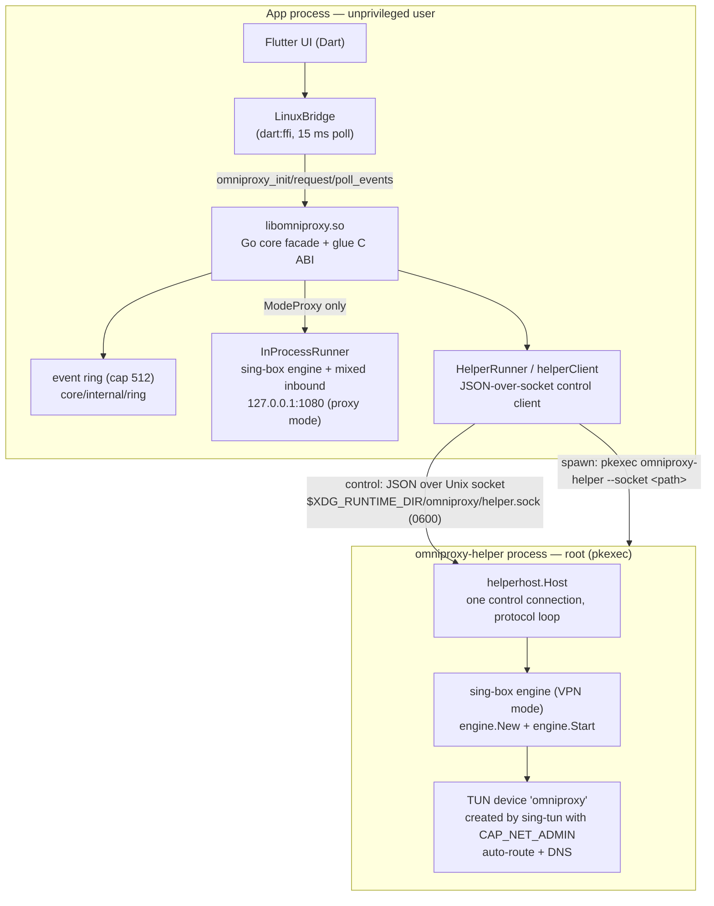

# LINUX.md — The Linux Platform Layer

**Scope:** the Linux build of OmniProxy: the `libomniproxy.so` FFI shared library, the privileged `omniproxy-helper` process, the Unix control socket between them, TUN creation, and the privilege model. This document explains *why* each piece exists and how the pieces cross process boundaries — it is not a tutorial and not a copy of the code.

Source of truth: `tools/build_linux.sh`, `core/glue/glue.go`, `core/cmd/omniproxy-helper/main.go`, `core/tunnel/{helper_client,helperhost,helperproto,helper_proto,options,runner}.go`, `engine/{engine,config,platform,platform_fd,tun_name}.go`, `core/internal/ring/ring.go`, `app/lib/core/bridge/bridge_linux.dart`, `app/linux/CMakeLists.txt`, `docs/platform-notes.md`, `docs/api-contract.md`, `Makefile`. Every claim below is cited as `file:line`.

---

## 1. Purpose & scope

Linux is the *reference* desktop platform for the project's Phase 1 MVP (Android, Windows, Linux). Its distinguishing feature inside the codebase is that it ships **two artifacts** (`tools/build_linux.sh:1-6`):

1. `libomniproxy.so` — a c-shared Go build of `core/glue` that the Flutter app loads with `dart:ffi`.
2. `omniproxy-helper` — a privileged, root-capable binary that exists for exactly one reason: **VPN mode needs `CAP_NET_ADMIN`**, and the app process must not have it.

Everything else about Linux is deliberately boring: the bridge is the same canonical JSON contract as every other transport (`docs/api-contract.md:3-4`), the engine is the same pinned sing-box module, and the config/profile/store layers are shared. The interesting engineering is the **two-process split for VPN mode** and the **JSON-over-Unix-socket protocol** that stitches the two Go runtimes together.

Per `docs/implementation-plan.md:26`, the Linux TUN-privileges decision is recorded as: *"Privileged helper (root via `pkexec`) hosts the engine for VPN mode (embedded sing-box module); core drives it over a Unix socket (JSON). Not fd-passing — TUN setup + auto-route need `CAP_NET_ADMIN` in the engine process."* This document expands that one line into its full rationale.

---

## 2. Linux architecture overview — two artifacts, two processes

Linux runs the app in **two OS processes** (plus `pkexec`, transient):

- **The app process** hosts the Flutter UI, the Dart `LinuxBridge`, the whole Go core (inside `libomniproxy.so`), and — for *proxy* mode — the sing-box engine itself.
- **The helper process** (`omniproxy-helper`, launched via `pkexec` as root) hosts the sing-box engine and the TUN device for *VPN* mode. The core never creates the TUN itself; it asks the helper to.

The switch happens at one seam: `HelperRunner.Start` (`core/tunnel/helper_client.go:83-96`):

```go
func (r *HelperRunner) Start(opts engine.Options) error {
	if opts.Mode == engine.ModeProxy {
		return r.inProc.Start(opts)          // proxy: engine in THIS process
	}
	client, err := r.ensureHelper()          // vpn: ensure privileged helper
	...
	if err := client.connect(opts); err != nil { ... }
	return nil
}
```

Mode is chosen by the caller of the bridge `connect` method (`core/vpn/service.go:156-210`, mode defaults to `settings.connectionMode`). The two modes correspond to two sing-box inbound types (`engine/config.go:14-20`):

- **Proxy mode** (`engine.ModeProxy`): a loopback **mixed** (SOCKS5+HTTP) inbound on `127.0.0.1:1080` (`engine/config.go:240-259`). Any process can open a loopback listener, so **no privilege is required** and the engine runs inside the app process (`docs/platform-notes.md:67`).
- **VPN mode** (`engine.ModeVPN`): a **TUN** inbound (`engine/config.go:226-239`). Creating a TUN device, assigning addresses, and installing routes/DNS requires root/`CAP_NET_ADMIN` **in the process that hosts the engine** — so the engine runs in the helper (`docs/platform-notes.md:63-64`).

The helper is spawned lazily on the first VPN-mode connect and **reused** for the rest of the app's life (`ensureHelper` returns the live client, `core/tunnel/helper_client.go:162-180`). Proxy mode never spawns it, and the helper never runs proxy-mode configs from the core — the core always runs proxy mode in-process (`core/tunnel/helper_client.go:84-86`), even though the helper is *capable* of serving proxy configs (proven by `core/tunnel/helperhost_test.go:35-40`).



Who owns what, precisely:

| Concern | Proxy mode | VPN mode |
|---|---|---|
| Engine process | app (`libomniproxy.so`) | helper (root) |
| TUN device | none | helper (sing-box/`sing-tun`, auto-route) |
| Event source (state) | in-app `vpn.Service` | in-app `vpn.Service`, driven by socket round-trips |
| Engine log source | in-app engine sink | helper engine sink → socket `event` messages → core logger |
| Privileges needed | none | root via pkexec |

---

## 3. The shared library (`libomniproxy.so`)

### 3.1 Build

`tools/build_linux.sh:13`:

```bash
go build -buildmode=c-shared -o "$OUT/libomniproxy.so" ./glue
```

The package is `core/glue`, a `package main` with an empty `main()` (`core/glue/glue.go:14,36`) so it can be built as a shared object. cgo is required for the C `char*` ABI (`core/glue/glue.go:16-19`). The engine module (`omniproxy/engine`) is a workspace member resolved via `replace omniproxy/engine => ../engine` (`core/go.mod:91`) and dragged into the same binary, so the `.so` contains **both** the core facade and a full copy of sing-box.

The helper is built in the same script from the same module graph (`tools/build_linux.sh:16`):

```bash
go build -o "$OUT/omniproxy-helper" ./cmd/omniproxy-helper
```

Both artifacts share the pinned sing-box version `v1.13.15` (`core/go.mod:7`, `engine/go.mod:6`, reported by `getVersion` via `core/core.go:29-30`).

### 3.2 The C ABI surface

Five exported symbols (canonical contract `docs/api-contract.md:186-201`; implementation `core/glue/glue.go`):

| Symbol | Signature | Role |
|---|---|---|
| `omniproxy_init` | `int (const char* config_json)` | one-time init; parses `{dataDir, logLevel, helperPath}` (`glue.go:52-56`), builds the facade, registers the event sink (`glue.go:71-112`) |
| `omniproxy_request` | `char* (const char* method, const char* request_json)` | dispatches one contract method through `facade.Dispatch`, returns response JSON (`glue.go:114-130`) |
| `omniproxy_poll_events` | `char* ()` | drains the event ring, returns a JSON array (possibly `[]`) (`glue.go:132-139`) |
| `omniproxy_shutdown` | `void ()` | closes the facade and clears the ring (`glue.go:145-154`) |
| `omniproxy_free_string` | `void (char*)` | frees strings the C side allocated with `C.CString` (`glue.go:156-163`) |

The Dart side binds these with `DynamicLibrary.lookupFunction` and matching `typedef`s (`app/lib/core/bridge/bridge_linux.dart:178-193`), marshals method/request JSON to C strings, calls, and always hands returned pointers back to `omniproxy_free_string` (`bridge_linux.dart:85-120`). `omniproxy_poll_events` returning `nullptr` is tolerated as "no events" (`bridge_linux.dart:127-128`).

### 3.3 Thread safety of the C API

- A single `coreMu sync.Mutex` serializes `omniproxy_init`, `omniproxy_request`, and `omniproxy_shutdown` (`core/glue/glue.go:39,104-111,116-117,147-148`). Init also closes any prior facade before replacing it (`glue.go:106-109`).
- `omniproxy_poll_events` deliberately does **not** take `coreMu`: it only drains the concurrency-safe `EventRing` (`core/internal/ring/ring.go:13-15,39-44`). Producers call `enqueueEvent`, which runs on the core's publisher goroutine and never blocks (`glue.go:143`; `core/api/events.go:22-24`).
- From Dart's perspective the isolate is single-threaded, so poll and request never *actually* race; the locking exists so the Go side is safe if a transport ever calls concurrently, and so the ring stays coherent across the cgo thread boundary.

### 3.4 Why events are polled, not pushed

This is the most consequential design decision in the bridge, and it is stated verbatim in the source:

> Events are polled, not pushed: a native callback into the Dart isolate deadlocks when the isolate is blocked inside a synchronous request call that itself publishes an event (the cgo thread cannot hand the callback off while the isolate is inside the FFI call). (`core/glue/glue.go:7-11`; mirrored in `bridge_linux.dart:23-26` and `docs/api-contract.md:199`)

Concretely: when Dart calls `omniproxy_request("connect", …)`, the isolate is blocked inside the FFI call. If the core tried to *push* an event (e.g. the `stateChanged` event `connect` itself publishes, `core/vpn/service.go:206`) by invoking a Dart callback from the cgo thread, the callback could not run because the isolate is still inside the synchronous call — deadlock. So the glue buffers events in a bounded ring (`eventRingCap = 512`, `core/glue/glue.go:47`) that Dart drains on a **15 ms `Timer.periodic`** (`bridge_linux.dart:41,68`).

The ring is FIFO and drops the *oldest* entry when full; `stateChanged` events are frequently superseded, so a small cap keeps delivery fresh without losing context (`glue.go:44-47`). The ring lives only in the app process — see §7 for how events from the helper's engine enter it.

### 3.5 How proxy mode runs entirely here

Proxy mode never leaves the app process:

1. Dart `request("connect", {"mode":"proxy", …})` → `omniproxy_request` → `facade.Dispatch` → `vpn.Service.Connect` (`core/core.go:330-338`, `core/vpn/service.go:156-210`).
2. `tunnel.Manager.Start` builds `engine.Options` via `BuildEngineOptions` (`core/tunnel/manager.go:62-78`, `core/tunnel/options.go:16-30`) and calls `runner.Start`.
3. `HelperRunner.Start` sees `ModeProxy` and hands the options to the embedded `InProcessRunner` (`core/tunnel/helper_client.go:84-86`), which starts a fresh `engine.Engine` in this process (`core/tunnel/runner.go:31-43`).
4. `engine.Start` builds sing-box `option.Options` (`engine/config.go:170-262`) and starts a `box.Box` (`engine/engine.go:44-73`). The proxy inbound listens on loopback (`engine/config.go:240-259`).

The M6 E2E test drives exactly this chain against the real `.so`: Dart contract client → FFI → Go core → in-process engine → SOCKS5 outbound → local test SOCKS5 server → echo (`app/test/e2e_linux_bridge_test.dart:11-109`).

---

## 4. Why a privileged helper

### 4.1 The capability problem

Creating a TUN interface and making it useful requires privileges that a normal desktop app should not have:

- Opening `/dev/net/tun` and issuing `TUNSETIFF` requires `CAP_NET_ADMIN` (or root).
- **Configuring the tunnel** — assigning addresses, installing the default route (`auto_route`), and touching DNS — does netlink and `ip rule` work that also needs `CAP_NET_ADMIN` **in the process that performs it** (`docs/platform-notes.md:63`).

The core runs unprivileged, so the sing-box engine cannot do any of this in the app process. Hence: a small privileged helper, written in the same Go workspace, linking the **same `engine` module**, launched by the desktop's standard privilege prompt, that **hosts the tunnel** for VPN mode (`docs/platform-notes.md:63-65`).

### 4.2 Why the helper hosts the engine, not just the TUN fd

An early design considered the helper *only* creating the TUN fd and passing it to the unprivileged core over `SCM_RIGHTS`. It was rejected because sing-box's TUN setup — addresses, `auto_route`, DNS — also needs `CAP_NET_ADMIN` **in the engine's own process**. If the engine ran unprivileged in the app, it could not configure the device handed to it. (Verified against sing-box v1.13.15; `docs/platform-notes.md:64`.) So the helper runs the full `engine.Engine` and keeps the TUN in its own process. **There is no fd handoff in the current code** — see the stale-note warning in §6.5.

### 4.3 Why `pkexec`, and the alternatives considered

`pkexec` (polkit) is the default spawner (`core/tunnel/helper_client.go:41-58`):

```go
if bin == "" {
    if env := os.Getenv("OMNIPROXY_HELPER"); env != "" {
        bin, direct = env, true     // tests: launch helper unprivileged, no pkexec
    } else {
        bin = "omniproxy-helper"    // pkexec omniproxy-helper --socket <path>
    }
}
...
return exec.Command("pkexec", append([]string{bin}, args...)...), nil
```

Alternatives and why they were not chosen:

| Alternative | Verdict |
|---|---|
| **`setuid` root binary on disk** | A filesystem-setuid helper grants root to *any* user who can execute it, with no per-user consent, and is a classic privilege-escalation surface. `pkexec` performs a polkit authorization prompt per invocation instead — consent is explicit and revocable, and the tool runs with the *caller's* session identity. |
| **Running the whole app as root** | Maximizes the attack surface: the UI, JSON/codec layer, storage, and network stack would all run privileged. The design keeps exactly one process root, and only during its engine-lifecycle scope (`docs/platform-notes.md:65`). |
| **A custom polkit rule/action** | `pkexec` *is* the polkit vehicle; a dedicated `.policy` action would let the app pre-authorize. **As-built there is no bundled policy file** — the default pkexec action is used, which prompts every time. A packaging-time action is a natural follow-up (see §10). |
| **Helper creating the fd and passing it via `SCM_RIGHTS`** | Rejected — §4.2. |

### 4.4 The security model

- The app process stays unprivileged; only the helper is root, and only for the duration of a session.
- The helper's scope is narrow: authenticate (via pkexec), own the engine lifecycle, configure TUN/routing. It contains **no tunnel-protocol logic** beyond what the shared `engine` module provides (`docs/platform-notes.md:65`; `core/tunnel/helperhost/helperhost.go:1-5`). It is "embedded sing-box, never shelled out" — it links the module; it is not the sing-box CLI.
- The helper never re-derives configuration. The full `engine.Options` (which includes the server profile, protocol settings, and SSH/TLS material) is serialized into the `connect` message (`core/tunnel/helperproto/helperproto.go:12-19`). The shared `engine` module is the single builder on both sides (`core/tunnel/helperhost/helperhost.go:87-89`).
- The control socket is created under the user's `$XDG_RUNTIME_DIR` in a `0700` directory and the socket file is `chmod`'d to `0600` (`core/tunnel/helper_proto.go:25-35`, `core/tunnel/helperhost/helperhost.go:25,34-36`). When spawned via pkexec, the helper `chown`s the socket (and its parent dir) to the caller identified by `PKEXEC_UID` and verifies connecting peers via `SO_PEERCRED` (§6.4).
- Engine log lines cross the socket as plaintext JSON but are redacted **before** they reach any log sink or the UI: the client feeds them into the core's redacting logger (`core/tunnel/helper_client.go:249-252`; `core/log/logger.go:138`; PRD-mandated "logs never contain credentials/keys/traffic").
- If the user **cancels the pkexec dialog**, no helper is spawned, the core's dial-retry loop exhausts the 15 s spawn timeout (`core/tunnel/helper_client.go:193-203`), and the failure is classified onto the contract code `unauthorized` (PRD §3.3; `core/vpn/service.go:513-526` — the classifier matches `"privileged helper"`), which the UI maps to actionable text.

---

## 5. Helper process deep-dive

### 5.1 Entry point

`omniproxy-helper` is deliberately a *thin* wrapper (`core/cmd/omniproxy-helper/main.go:1-7`): it parses one required flag, `--socket <path>`, and calls `helperhost.Run(socket)` (`main.go:17-27`). All behavior lives in `core/tunnel/helperhost`, which is exercised directly by tests (`core/tunnel/helperhost_test.go:12-15`) — the binary is ~20 lines of glue.

### 5.2 Startup and socket lifecycle

`helperhost.Run` (`core/tunnel/helperhost/helperhost.go:24-65`):

1. `os.MkdirAll(filepath.Dir(socketPath), 0o700)` — ensures the parent exists (`:25`). (The core has already created it too; `core/tunnel/helper_proto.go:25-35`.)
2. `os.Remove(socketPath)` — clears a stale socket from a previous crash (`:28`).
3. `net.Listen("unix", socketPath)` (`:29`).
4. `os.Chmod(socketPath, 0o600)` — restrict the socket file to its owner (`:34-36`).
5. `l.Accept()` exactly **once**, then serve that single connection (`:38-43`).
6. Protocol loop: read newline-delimited JSON, switch on `msg.Type` — `connect` / `disconnect` / `ping` / `quit` (`:46-62`).
7. When the connection closes — app exit, app crash, or explicit `quit` — `StopEngine()` runs and `Run` returns (`:58-64`). The comment states the intent: **no orphaned root-owned TUN survives the app** (`:20-23`). When the helper process exits, the kernel destroys the TUN device and drops its routes.

### 5.3 The control connection and per-message behavior

The `Host` struct (`helperhost.go:67-73`) owns the engine (`eng`), a `mu` guarding engine state, and a `wmu` serializing socket writes (the engine log sink and responses share the connection, so writes must not interleave).

- **`connect`** — if an engine is already running, respond error `"tunnel already running"` (`:91-95`). Otherwise build a fresh `engine.New(logSink{…})` and `eng.Start(msg.Options)` (`:99-100`). On success store the engine and respond `{"type":"response","ok":true,"state":"connected"}` (`:113-114`). A race guard re-checks `h.eng` after `Start` and closes the new engine if another connect won (`:108-111`).
- **`disconnect`** — take the engine, nil it, `eng.Close()`, respond `"disconnected"`; idempotent (`:118-132`).
- **`ping`** — report `"connected"` or `"disconnected"` based on engine presence (`:135-143`).
- **`quit`** — stop the engine and return from `Run`, ending the helper (`:58-61`).

`engine.Start` (`engine/engine.go:44-73`) builds sing-box options from `Options` (`engine/config.go:170-262`), creates a context with protocol registries registered (`engine/registry.go:29-56`), constructs `box.New`, and calls `sb.Start()`.

### 5.4 TUN device creation, routes, cleanup

The helper hosts the engine with **no platform interface injected** — `currentPlatform()` returns nil when `SetPlatformInterface` was never called (`engine/engine.go:35-40`), so sing-box falls back to `noopPlatform` (`engine/platform.go:18-34`). The defining behavior of `noopPlatform.OpenInterface` is that it returns `nil, nil` (`platform.go:32-34`): sing-box therefore **creates the TUN device itself** inside the helper, where it holds `CAP_NET_ADMIN` (`docs/platform-notes.md:63`; `docs/NETWORK_FLOW.md:290-291`).

The TUN inbound is configured by `engine/config.go:226-239` with `TunOptions` defaults (`config.go:139-153`):

- interface name `omniproxy` (`defaultTunName`),
- MTU 1500,
- addresses `10.0.0.1/24` (v4) + `fd00::1/64` (v6),
- `AutoRoute` true (route all traffic into the tunnel; `config.go:298-300`),
- `Stack` `"mixed"`.

Routing and DNS are handed to sing-box's auto-route machinery: `Route.AutoDetectInterface = true` so the tunnel's *own* sockets (the DNS bootstrap and the outbound server connection) bypass the TUN and don't loop back into it (`config.go:211-217`). A DNS module is added in VPN mode with the traffic-hijack rule, two resolvers (`dns-proxy` detoured through the proxy, `dns-local` direct — see §8.3), and reverse mapping (`config.go:195-217,442-496`).

Cleanup on exit is symmetric: client `quit` → helper stops the engine and returns; client socket closes unexpectedly → the same teardown runs (`helperhost.go:58-64`). The client side additionally reaps the helper process with a bounded wait: `HelperRunner.Close` sends `quit`, waits on `cmd.Wait()` with a 2 s grace, then `cmd.Process.Kill()` and waits again (`core/tunnel/helper_client.go:126-159`).

### 5.5 Full VPN connect sequence

```mermaid
sequenceDiagram
    participant A as Flutter app (Dart)
    participant G as libomniproxy.so (Go core)
    participant P as pkexec (polkit)
    participant H as omniproxy-helper (root)
    participant E as sing-box engine (in helper)

    A->>G: request("connect", {serverId, mode:"vpn"})
    G->>G: vpn.Service.Connect → StateConnecting (emit stateChanged)
    G->>G: HelperRunner.Start → BuildEngineOptions(profile, vpn, ...)
    G->>G: ensureHelper: HelperSocketPath() → $XDG_RUNTIME_DIR/omniproxy/helper.sock
    G->>H: dial socket (reuse live helper if present)
    alt first connect — no live socket
        G->>P: spawn "pkexec omniproxy-helper --socket <path>"
        P-->>P: polkit authorization prompt (user consents)
        P->>H: run omniproxy-helper as root
        H->>H: MkdirAll(dir,0700); listen; chown(sock+dir, PKEXEC_UID); chmod(sock,0600)
        loop retry dial every 200 ms, up to helperSpawnTimeout = 15 s
            G->>H: net.Dial("unix", socketPath)
        end
    end
    G->>H: {"type":"connect","seq":1,"options":{...full engine.Options...}}
    H->>E: eng.Start(opts) — sing-tun creates TUN "omniproxy", auto-route, DNS
    loop engine logs stream back during the run
        E-->>H: log lines via PlatformLogWriter → logSink
        H-->>G: {"type":"event","event":{level,message}}
    end
    H-->>G: {"type":"response","seq":1,"ok":true,"state":"connected"}
    G->>G: helperClient marks running; vpn.Service transitions StateConnected
    G-->>A: poll (≤15 ms): stateChanged(connected) + logAppended events
```

Timeouts enforced on the client: `helperSpawnTimeout = 15s`, `helperConnectTimeout = 30s`, `helperDisconnectTimeout = 5s` (`core/tunnel/helper_client.go:31-35`). During the connect call, the Dart poll timer is stalled (the isolate is inside the synchronous FFI request) — events queue in the ring and drain afterwards (`docs/NETWORK_FLOW.md:431-433`).

---

## 6. The Unix socket protocol (`helperproto`)

### 6.1 Wire format

Newline-delimited JSON over a Unix **stream** socket (`core/tunnel/helperproto/helperproto.go:1-7`). Both sides read with `bufio.Scanner` (`helperhost.go:45`, `helper_client.go:243`).

`ClientMessage` (`helperproto.go:15-19`):

```go
type ClientMessage struct {
	Type    string         `json:"type"` // connect | disconnect | ping | quit
	Seq     uint64         `json:"seq,omitempty"`
	Options engine.Options `json:"options,omitempty"`
}
```

`ServerMessage` (`helperproto.go:22-29`):

```go
type ServerMessage struct {
	Type  string          `json:"type"` // response | event
	Seq   uint64          `json:"seq,omitempty"`
	OK    bool            `json:"ok,omitempty"`
	State string          `json:"state,omitempty"` // connected | disconnected
	Error string          `json:"error,omitempty"`
	Event *HelperLogEvent `json:"event,omitempty"`
}
```

`HelperLogEvent{Level, Message}` carries one engine log line from the helper (`helperproto.go:32-34`).

The types live in their **own package** so the client (`core/tunnel`) and server (`core/tunnel/helperhost`) share them without an import cycle (`helperproto.go:5-7`); `core/tunnel/helper_proto.go:13-17` re-exports them for the client package's stable surface.

### 6.2 Why JSON over a Unix socket

- **Single, low-rate control connection.** The socket carries only commands, responses, and engine log lines — never traffic bytes. It is the control plane, not a data plane (`docs/NETWORK_FLOW.md:414`). JSON's overhead is irrelevant here; robustness and debuggability win.
- **One shared schema, no cgo.** Both sides are Go in the same workspace; `engine.Options` serializes naturally and is decoded identically on both ends (`encoding/json`).
- **The helper must not re-derive config.** Carrying the *full* `engine.Options` in the `connect` message means the shared `engine` module remains the single config builder (`helperproto.go:12-19`, `helperhost.go:87-89`); the helper is a dumb executor.
- **No extra dependencies** — consistent with the library-usage policy in `AGENTS.md`. protobuf/capnproto would add tooling for zero control-plane gain.

### 6.3 Request/response correlation and the one-client guarantee

Requests are correlated by a monotonically increasing `seq`; the client keeps a `pending map[uint64]chan ServerMessage` (`core/tunnel/helper_client.go:214-217`), a dedicated `readLoop` goroutine parses the stream and wakes the matching waiter (`:242-273`), and `await` applies the per-request timeout and cleans up on expiry (`:291-311`). `send` encodes under the same mutex that guards `closed`, so a torn-down client can never write a command (`:282-289`).

The **one-client guarantee** is structural: `helperhost.Run` calls `Accept` exactly once and serves that single connection for its whole life (`helperhost.go:38-43`). A second client has nowhere to be accepted. This is intentional: exactly one app owns the helper, and there is no multi-tenant protocol. The core reuses its one connection across sessions (`ensureHelper` returns the live `helperClient` while `alive()`, `helper_client.go:162-180`), and `quit` (or the connection closing) ends the helper (`helperhost.go:58-64`).

### 6.4 Authentication and access control

The socket lives at `$XDG_RUNTIME_DIR/omniproxy/helper.sock`, falling back to `/tmp/omniproxy/helper.sock` when `XDG_RUNTIME_DIR` is unset, with the parent directory `MkdirAll`'d to `0700` (`core/tunnel/helper_proto.go:25-35`). Authentication to root is delegated to pkexec; the socket then uses two layers of peer control:

- **Ownership hand-back.** A pkexec-spawned helper reads `PKEXEC_UID` (the real invoking uid) and `chown`s both the socket and its parent directory to that uid (`core/tunnel/helperhost/helperhost.go:26-40`). A direct spawn (tests/dev, no `PKEXEC_UID`) leaves ownership unchanged, so the default path is untouched.
- **Peer verification.** After `Accept`, the helper checks the peer via `SO_PEERCRED` (`GetsockoptUcred`, `helperhost.go:47-52`); a peer whose uid differs from the invoker is rejected. Combined with `chmod 0600` (and the `0700` parent), this means *only the invoking user's core can connect* — a same-uid user could still impersonate the core (the same trust boundary as the user's own profile store).

Covered by `TestPkexecInvoker` (`core/tunnel/helperhost/helperhost_internal_test.go`); the end-to-end root path still needs verification on a real pkexec run (§10 item 1).

### 6.5 fd handoff? — No. (and a stale note to ignore)

**Verified: the helper does not pass any file descriptor.** It creates the TUN itself (via sing-box with `CAP_NET_ADMIN`, §5.4) and hosts the engine. The rejected fd-passing design is documented at `docs/platform-notes.md:64`; the `FdTunPlatform` fd-path (`engine/platform_fd.go`) is Android-only (`core/mobile/mobile.go:138`). Note that `tools/README.md:7` still says *"helper created via `sing-tun`; fd passed over Unix socket"* — **that row is stale and contradicts the implementation**; the code, `docs/platform-notes.md`, and `docs/implementation-plan.md:26` all describe engine-hosting instead.

### 6.6 Keepalive ping, disconnects, timeouts

The client runs an **active keepalive** in the background. After dialing, it starts a goroutine that sends a `ping` every `helperPingInterval` (15 s) with a `helperPingTimeout` (5 s) per round-trip (`core/tunnel/helper_client.go:36-42,335-378`); the server handles `ping`/`pong` (`helperhost.go:56-57,135-143`). A helper that stops answering (wedged) causes the client to log and drop the connection (`close(false)`), so the next operation re-spawns the helper.

Remaining client-side gap: if the helper *process dies*, the socket closes, `readLoop` exits and calls `close(false)` (`helper_client.go:272`), which fails all pending waiters with `"helper: connection closed"` (`:365-367`). But nothing pushes that to the `vpn.Service` state machine — the UI only learns about it on the *next* command (§10 item 3).

Timeouts are client-side only: spawn 15 s (dial-retry loop at 200 ms intervals, `helper_client.go:193-203`), connect 30 s, disconnect 5 s (`helper_client.go:31-35`).

---

## 7. Events across processes — the subtle part

Two kinds of events reach the UI, and they take **different paths** because they originate in different processes:

### 7.1 `stateChanged` — synthesized in the app process

The connection state machine lives entirely in the app process (`core/vpn/service.go`). `Connect` sets `StateConnecting` and emits immediately (`service.go:206`); the `Connected` transition happens **only after** the `connect` response round-trip completes on the socket (`service.go:280-284`). The socket contributes the *response*; the *event* is emitted locally. There is no state event carried in the protocol (`helperproto.ServerMessage` has no state-event type — only `response`/`event` where `event` is a log line).

### 7.2 `logAppended` from the helper — crosses the process boundary as socket `event` messages

Engine logs originate in the helper process. The helper's `logSink` is wired into `engine.Engine` as the `PlatformLogWriter` (`engine/engine.go:60`, `engine/log.go:48-57`), so every sing-box log line becomes a `{"type":"event","event":{level,message}}` message on the socket (`helperhost.go:158-167`). The client `readLoop` detects `msg.Type == "event"` and feeds it into the core's redacting logger under component `"engine"` (`helper_client.go:249-253`). From there it enters the **same** pipeline as every other log:

1. `logger.Log` redacts and appends to the log ring buffer, then fans out to sinks (`core/log/logger.go:130-162`).
2. The core's `logSink` publishes a `logAppended` event on the `EventBus` (`core/core.go:421-425`; `core/api/events.go:65-76`).
3. `facadeSink` gates on subscription state and hands it to the registered transport sink (`core/core.go:404-419`).
4. The transport sink is the glue's `enqueueEvent`, which pushes into the 512-cap event ring (`core/glue/glue.go:110,143,47`).
5. Dart's 15 ms poll timer drains the ring (`bridge_linux.dart:122-138`) and re-emits onto the Dart event stream.

So: **the ring exists only in the app process; the socket is the transport that carries helper-originated log events into it.** The helper itself buffers nothing — every engine log line is pushed immediately over the socket.

```mermaid
flowchart LR
    subgraph HELPER["helper process"]
        E["sing-box engine"] -->|"log line"| LS["helperhost.logSink"]
        LS -->|'{"type":"event","event":{level,message}}'| SOCK["Unix socket"]
    end
    SOCK -->|"readLoop"| CL["helperClient (app process)"]
    CL -->|"logger.Log(engine, msg)"| R["redacting Logger<br/>core/log/logger.go:130-162"]
    R -->|"logAppended event"| BUS["EventBus (app process)"]
    BUS -->|"facadeSink gates on subscribe"| GLUE["glue.enqueueEvent"]
    GLUE -->|"bounded ring cap 512"| POLL["omniproxy_poll_events (15 ms timer)"]
    POLL -->|"JSON array"| DART["Dart event stream"]
```

### 7.3 Why not push events from the helper directly?

Even *if* Dart accepted callbacks, the helper could not call into Dart — it is a separate process. The only IPC available is the socket, and it is used for exactly that (log events). The *Dart* side remains polled for the same deadlock reason as every platform (`docs/api-contract.md:199`). Note the poll timer stalls during long synchronous requests (e.g. a 30 s VPN connect blocks the isolate, so the ring accumulates; `docs/NETWORK_FLOW.md:431-433`).

---

## 8. Linux networking details

### 8.1 TUN device naming

`engine/tun_name.go:12-27` retrieves the interface name of an established TUN fd via the `TUNGETIFF` ioctl (build-tagged `linux || android`). **On Linux VPN mode this helper is not used**: the engine runs with the noop platform, so sing-tun creates the device itself and the name comes from `TunOptions.InterfaceName` — `omniproxy` by default (`engine/config.go:232,277-282,139-153`). `tunName` is consumed by `FdTunPlatform.OpenInterface`, which is the Android fd-injection path (`engine/platform_fd.go:167-190`).

### 8.2 Routes

- `auto_route: true` by default (or whenever `strict_route` is false, `engine/config.go:298-300`) — sing-box/`sing-tun` installs the capture routes and `ip rule` entries inside the helper using its root capabilities (`docs/platform-notes.md:63`).
- `Route.AutoDetectInterface = true` in VPN mode so the tunnel's own sockets bind to the physical default interface and never loop back into the TUN (`engine/config.go:211-217`). On Linux this is done by sing-box binding direct dials to the auto-detected interface (unlike Android, which needs `VpnService.protect()`).
- The `nftables` module in the dependency graph (`core/go.mod:57`) belongs to sing-box's auto-route machinery; OmniProxy's own code does not touch nftables or netlink directly (no matches in `core/` or `engine/` outside the pinned engine module).
- **No network namespaces are used**: `vishvananda/netns` appears only as an indirect sing-box dependency (`core/go.mod:66`), and nothing in the codebase creates a netns. The TUN is host-level with auto-route, like most desktop VPN clients.

### 8.3 DNS

VPN mode installs a DNS module and a hijack rule so client DNS queries are answered through the tunnel (`engine/config.go:195-217`, `dnsHijackRule` at `:542-554`):

- `dns-proxy` — UDP resolver at `8.8.8.8` with `Detour: "proxy"` (`config.go:149-151,446-457`): client queries travel through the tunnel (no DNS leak).
- `dns-local` — UDP resolver at `223.5.5.5` with **no detour** (`config.go:151-153,459-470`): queries the engine issues while dialing an outbound (e.g. resolving the proxy server's own domain) go over the real network, avoiding a chicken-and-egg resolution loop (`config.go:146-153`).
- `ReverseMapping: true` answers PTR lookups for tunneled addresses (`config.go:489`).

**systemd-resolved is not integrated in Phase 1** — the plan is to keep sing-box's DNS defaults and revisit NetworkManager/systemd-resolved cooperation in Phase 2 (`docs/platform-notes.md:71`). This is a real integration gap (see §10).

### 8.4 IPv6 mode

IPv6 handling is decided entirely at the engine layer, so it is identical on every platform (`docs/platform-notes.md:24-60`). The TUN **always keeps** its `fd00::1/64` address and `::/0` capture (`engine/config.go:302-310`), so IPv6 can never fall out onto the physical interface. The four `IPv6Mode` values map onto the DNS domain strategy and, in `disable_ipv6`, a `block` route rule that drops any IPv6 packet that still reaches the router (`engine/config.go:111-127,502-538`). Default is `prefer_ipv4` (`config.go:171-173`), because AAAA-preference stalls common IPv4-only relay paths (`docs/platform-notes.md:43-48`). `block` is registered in the engine protocol registry (`engine/registry.go:48-50`).

---

## 9. Packaging & deployment

### 9.1 Build pipeline

- `tools/build_linux.sh` produces both artifacts into `core/out/` (`tools/build_linux.sh:10-18`).
- `make linux-core` runs the script; `make flutter-linux` builds the app bundle after it; `make build-linux` / `make build-native` compose them (`Makefile:114-123,49`). `make go-check`/`make go-test` cover both `core/` and `engine/` (`Makefile:54-64`).

### 9.2 Bundling into the Flutter Linux app

`app/linux/CMakeLists.txt:115-128` installs the Go artifacts into the relocatable bundle:

- `libomniproxy.so` → `bundle/lib/`, picked up at runtime via the `$ORIGIN/lib` rpath (`app/linux/CMakeLists.txt:17`).
- `omniproxy-helper` → `bundle/` (next to the executable), so the bridge can find it as the executable's sibling.
- Both `install` directives are wrapped in `if(EXISTS …)`, so a plain `flutter build linux` still works when the core artifacts are absent (`CMakeLists.txt:121-128`).

### 9.3 Runtime resolution

- **Library:** `LinuxBridge.defaultLibraryPath` tries (1) the compile-time `OMNIPROXY_LIB` define, (2) the runtime `OMNIPROXY_LIB` env, (3) `<cwd>/../core/out/libomniproxy.so` for developer runs, then (4) plain `libomniproxy.so` (system/bundle lookup) (`bridge_linux.dart:148-156`).
- **Helper:** `_helperPathForPlatform` uses the `OMNIPROXY_HELPER` env if set, else `<resolvedExecutable dir>/omniproxy-helper` if present (`bridge_linux.dart:165-175`). This value is passed into `omniproxy_init` as `helperPath` (`bridge_linux.dart:53-58`). If null, the Go spawner falls back to the `OMNIPROXY_HELPER` env at spawn time, else `pkexec` + `omniproxy-helper` on `PATH` (`core/tunnel/helper_client.go:41-58`).

There is no `.deb`/`.rpm`/Flatpak packaging as-built — the bundle is a relocatable directory (standard for `flutter build linux`).

---

## 10. Known gaps & limitations

1. ~~**Socket ownership wrinkle (verify before release).**~~ **RESOLVED** — the helper now hands the socket back to the pkexec caller and checks `SO_PEERCRED`: a pkexec-spawned helper reads `PKEXEC_UID` and `chown`s the socket + parent dir to that uid, and rejects any peer whose uid differs after `Accept` (`core/tunnel/helperhost/helperhost.go:26-40,47-52`; §6.4). The unit tests exercise the direct-spawn path (unprivileged↔unprivileged, `core/tunnel/helperhost_test.go:16-20`) and `TestPkexecInvoker` covers the uid resolution; the root path still needs **verification on a real pkexec run before release**.

2. ~~**No active keepalive ping.**~~ **RESOLVED** — the client pings every 15 s (5 s timeout) and drops a helper that stops answering (`core/tunnel/helper_client.go:36-42,335-378`; `TestHelperClientSendsKeepalivePing`, `TestHelperClientDetectsWedgedHelper`; §6.6).

3. **Helper death while connected is not pushed to the UI.** When the helper process dies, the socket closes and pending requests fail (`helper_client.go:272,365-367`), but the `vpn.Service` state machine receives no signal; the UI keeps reporting `connected` until the user acts (or the next `disconnect` times out). Auto-reconnect on helper loss is not implemented on Linux (Android's network-change auto-reconnect is a different mechanism, `docs/platform-notes.md:21`).

4. **systemd-resolved / NetworkManager integration is Phase 2** (`docs/platform-notes.md:71`). Using sing-box's own DNS while NetworkManager/systemd-resolved also manages `/etc/resolv.conf` can produce conflicting DNS behavior; deliberately deferred.

5. **pkexec availability and UX.** Requires a polkit agent on the session (present on GNOME/KDE; missing on minimal/headless setups), and every VPN connect prompts unless a custom policy action is later shipped (no `.policy` file exists as-built).

6. **AppArmor/SELinux.** No profiles are shipped. A confined environment must permit the helper to open `/dev/net/tun`, use netlink/nftables for auto-route, and create the Unix socket in `$XDG_RUNTIME_DIR`.

7. **Two Go runtimes.** VPN mode runs two full Go processes (app core + helper), each embedding a sing-box copy with its own config parse and memory footprint. The helper re-parses the same `engine.Options`/sing-box config that proxy mode would have parsed in-process — the price of the privilege split.

8. **IPv6 "disable" is capture-safe, not leak-*free* at the host layer.** `disable_ipv6` stops IPv6 being *used* and blocks packets reaching the TUN, but does not touch host-side IPv6 (host has no TUN v6 in that sense because the TUN always captures `::/0`; the physical interface's own v6 is unaffected — consistent with the documented model, `docs/platform-notes.md:38-42`).

9. **Stale documentation.** `tools/README.md:7` still describes the rejected fd-passing design ("fd passed over Unix socket"). The implementation, `docs/platform-notes.md:64`, and `docs/implementation-plan.md:26` agree on engine-hosting; `tools/README.md` should be corrected in the same change that fixes it.

10. **Wayland/X11.** Irrelevant to the network path — the helper is headless and never touches the display. The only interaction is that pkexec's prompt is rendered by the desktop's polkit agent, which works under both X11 and Wayland.

---

## 11. Related documents

- `docs/ARCHITECTURE.md` — the as-built system architecture; §4.7 covers the helper, §8 the per-platform privilege model.
- `docs/FLUTTER_GO_FFI.md` — the Flutter ↔ Go bridge design, including the Linux transport, library loading, and the polled-event model.
- `docs/VPN_INTERNALS.md` — VPN-mode internals with the full helper sequence and socket-lifetime details.
- `docs/GO_RUNTIME.md` — the two Go runtimes (app + helper) and their concurrency boundaries.
- `docs/NETWORK_FLOW.md` — end-to-end traffic and control-plane flow with per-hop latency budget, including the socket round-trip and the 15 ms poll.
- `docs/SINGBOX.md` — why and how the pinned sing-box engine is embedded; the Linux helper is described as "embedded, not shelled out".
- `docs/PROXY_ARCHITECTURE.md` — proxy-mode architecture; the Linux mode-selection seam (`HelperRunner.Start`).
- `docs/api-contract.md` — canonical bridge contract; §5.2 is the Linux/Windows FFI ABI.
- `docs/platform-notes.md` — the short-form Linux notes this document expands (§Linux, §IPv6).
- `docs/implementation-plan.md` — Phase 1 plan and the M6 check-in recording the Linux decisions.

- `docs/SECURITY.md` — threat model, helper socket trust boundary, credential lifecycle, redaction, TLS.
- `docs/ANDROID.md` — the Android counterpart (VpnService + gomobile bridge); `docs/WINDOWS.md` — the Windows counterpart (DLL bridge, wintun, M8 planned).
