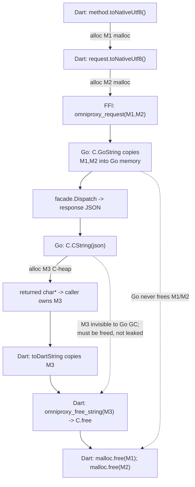
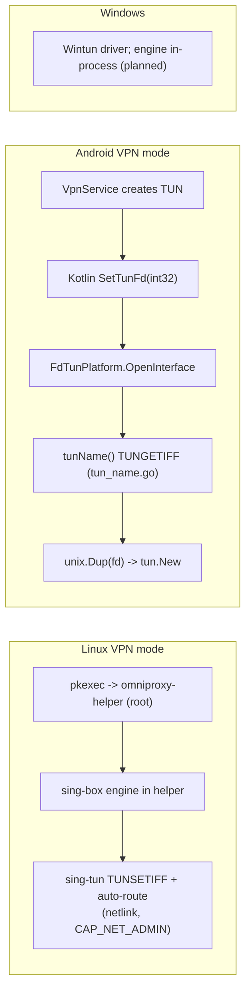
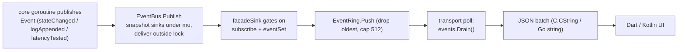

# LOW_LEVEL — Low-Level Touchpoints of the OmniProxy Go Core

## 1. Purpose & scope

This document catalogs every place the OmniProxy Go core (`core/`) and its
engine wrapper (`engine/`) touches something *below* the application layer:
the C ABI (`cgo`), raw `ioctl` syscalls, Unix sockets and privilege
escalation, ring buffers, AES-GCM cryptography, the pure-Go SQLite driver,
regex redaction, and the JSON wire formats. For each touchpoint it records
`file:line`, what it does, and why it is safe (or not).

Scope: `core/**` and `engine/**`. The Flutter side is out of scope (see
`docs/FLUTTER_GO_FFI.md`, `docs/FLUTTER.md`). This document complements:

- `docs/GO_RUNTIME.md` — concurrency model, goroutine lifecycle, GC pressure.
  This doc is about *bytes, syscalls, and lifetimes*; GO_RUNTIME is about
  *threads and ownership*.
- `docs/FLUTTER_GO_FFI.md` — the Dart-side half of the C ABI and its memory
  protocol (§8 there is the canonical statement; this doc summarizes it and
  points back).
- `docs/VPN_INTERNALS.md` — the network/tunnel behavior that motivates the
  ioctls and the helper.

## 2. Inventory of low-level touchpoints

Risk legend: **Crit** = memory/security critical, **High** = security-sensitive
or easily broken, **Med** = moderate, **Low** = benign.

| Location | Subsystem | What it does | Risk |
|---|---|---|---|
| `core/glue/glue.go:19` | CGO | the only `import "C"` in the tree (c-shared ABI) | Crit |
| `core/glue/glue.go:71-112` | CGO | `omniproxy_init` — `C.GoString(configJSON)`, builds facade under `coreMu` | High |
| `core/glue/glue.go:114-130` | CGO | `omniproxy_request` — `C.GoString` ×2, dispatch, `C.CString` reply | Crit |
| `core/glue/glue.go:132-139` | CGO | `omniproxy_poll_events` — drains ring, `C.CString` batch | High |
| `core/glue/glue.go:145-154` | CGO | `omniproxy_shutdown` — close facade, drain ring | Low |
| `core/glue/glue.go:156-161` | CGO | `omniproxy_free_string` — `C.free(unsafe.Pointer(s))` | High |
| `core/glue/glue.go:39-47` | CGO | `coreMu` serialization; `eventRingCap = 512` | High |
| `core/mobile/mobile.go:114-167` | gomobile | `Init` — Android AAR entry; builds facade | Med |
| `core/mobile/mobile.go:183-190, 292-302` | gomobile | `Request`/`PollEvents` — Go-string in/out (no C heap on this path) | Low |
| `core/mobile/mobile.go:65-95` | gomobile | `SecretStore` → Kotlin Keystore adapter; null→`ErrNotFound` remap | Med |
| `core/mobile/mobile.go:171-289` | gomobile | `SetTunFd`/`SetSocketProtector`/`SetDefaultInterface`/`SetNetworkInterfaces` | Med |
| `engine/tun_name.go:12-27` | ioctl | raw `SYS_IOCTL` + `TUNGETIFF` via `unsafe.Pointer` on a stack buffer | High |
| `engine/platform_fd.go:169-190` | ioctl/TUN | Android `OpenInterface` — `unix.Dup(fd)`, `tun.New` | Med |
| `engine/platform.go:22-65` | TUN | `noopPlatform` — Linux/Windows let sing-box create the TUN itself | Low |
| `engine/config.go:228-239, 250-259` | config | TUN vs mixed-inbound sing-box options | Low |
| `engine/engine.go:44-73` | engine | `Start` — sing-box context, platform injection, `box.Start` | Med |
| `core/tunnel/helperhost/helperhost.go:24-65` | socket | `Run` — `MkdirAll(0700)`, `Remove`, `Listen`, `Chmod(0600)`, single `Accept`, Scanner loop | High |
| `core/tunnel/helperhost/helperhost.go:67-174` | socket | `Host` — engine lifecycle over one socket connection | High |
| `core/tunnel/helper_client.go:41-58` | spawn | `pkexec` / `OMNIPROXY_HELPER` spawn strategy | High |
| `core/tunnel/helper_client.go:162-204` | spawn | `ensureHelper` — dial-then-spawn, 200 ms dial retry, 15 s deadline | Med |
| `core/tunnel/helper_client.go:221-311` | socket | `dialHelper`, `readLoop`, seq-correlated `await` | Med |
| `core/tunnel/helper_proto.go:25-35` | socket | socket path under `$XDG_RUNTIME_DIR`, `/tmp` fallback | Med |
| `core/tunnel/helperproto/helperproto.go:15-35` | wire | newline-delimited JSON message types | Low |
| `core/secret/crypto.go:56-83` | crypto | AES-256-GCM `Seal`/`Open`, `nonce‖ciphertext` | Crit |
| `core/secret/crypto.go:19-53` | crypto | data-key generation / `GetOrCreateDataKey` | High |
| `core/secret/keyring.go:16-38` | keyring | Linux Secret Service / Windows Credential Manager via go-keyring | Med |
| `core/config/engine.go:63-90` | fs | atomic `0600` file write (temp + `Sync` + `Rename`) | Med |
| `core/store/store.go:25-42` | sqlite | modernc DSN: `busy_timeout(5000)`, `journal_mode=WAL` | Med |
| `core/store/migrations.go:25-71, 79-128` | sqlite | forward-only schema migrations in a transaction | Low |
| `core/store/rows.go:16-292` | sqlite | canonical 40-column row order, upsert, `secret_refs` | Med |
| `core/store/server_repository.go:241-330` | sqlite | secrets externalized to SecretStore; rows hold empty strings | High |
| `core/internal/ring/ring.go:21-45` | ring | bounded event ring, drop-oldest | Med |
| `core/log/ring.go:28-63` | ring | seq-numbered log ring, `Since` pull | Low |
| `core/log/redactor.go:25-54` | redact | case-insensitive regex redaction | High |
| `core/api/events.go:66-76` | concurrency | `EventBus.Publish` — snapshot sinks, deliver outside lock | Med |
| `core/api/dispatch.go:18-135` | wire | method-name dispatch to contract envelope | Low |
| `core/server/exchange.go:100-144` | wire | import envelope parse, strict format/version | Med |
| `core/models/id.go:9-27` | rand | UUIDv4 from `crypto/rand` | Low |
| `core/core.go:74-149` | wiring | facade assembly (config engine, repo, tunnel, bus) | Low |

## 3. CGO / FFI memory management

`core/glue/glue.go` is the **only** file in the tree that imports `"C"`
(glue.go:19) — verified by a full-tree grep. It is compiled as
`-buildmode=c-shared` → `libomniproxy.so` / `omniproxy.dll` (see the Makefile
`c-shared` targets) and exports five symbols.

### The five exported functions

| Export | Signature | Lines |
|---|---|---|
| `omniproxy_init` | `(*C.char) C.int` | 71-112 |
| `omniproxy_request` | `(*C.char, *C.char) *C.char` | 114-130 |
| `omniproxy_poll_events` | `() *C.char` | 132-139 |
| `omniproxy_shutdown` | `()` | 145-154 |
| `omniproxy_free_string` | `(*C.char)` | 156-161 |

The Go↔C conversions used:

- `C.GoString(configJSON)` — glue.go:75 (`init`), `C.GoString(method)` —
  glue.go:123, `[]byte(C.GoString(requestJSON))` — glue.go:127. All **copy**
  C memory into Go-managed memory before any dispatch; the Dart pointers only
  need to stay valid for the duration of the call.
- `C.CString(s)` via `cString` — glue.go:163. Allocates on the **C heap**,
  invisible to the Go GC.
- `C.free(unsafe.Pointer(s))` — glue.go:159 inside `omniproxy_free_string`,
  nil-guarded (glue.go:157-161).

### The allocation/ownership table (canonical: `FLUTTER_GO_FFI.md:555-572`)

| Allocation | Allocator | Owner after call | Freed by |
|---|---|---|---|
| method string | Dart `toNativeUtf8()` (`bridge_linux.dart:90`) | Dart | `malloc.free` |
| request JSON | Dart `toNativeUtf8()` (`91`) | Dart | `malloc.free` |
| init config JSON | Dart `toNativeUtf8()` (`60`) | Dart | `malloc.free` |
| response / events | Go `C.CString` (glue.go:163) | caller (Dart) | `omniproxy_free_string` → `C.free` |

The ownership transfer is explicit in the ABI: `omniproxy_request` and
`omniproxy_poll_events` return `char*` that the caller must free, and
`omniproxy_free_string` exists specifically so the free goes through the same
allocator that produced the pointer (glue.go:156-161).



Safety properties:

1. **No pointer retention.** Go reads M1/M2 only during the call (C.GoString
   copies), and never touches M3 after returning (glue.go:114-130). There is
   no place where a Go object keeps a C pointer alive, so the GC can never
   race the C heap.
2. **Same-allocator free.** The C heap is owned by the C runtime; freeing
   through `C.free` (glue.go:159) rather than `free` from some other allocator
   is what keeps the ABI safe across platforms.
3. **Reentrancy guard.** `omniproxy_request` and `omniproxy_init` take
   `coreMu` (glue.go:104, 116). `omniproxy_poll_events` deliberately does
   **not** take `coreMu` (glue.go:132-139) — a native callback into the Dart
   isolate would deadlock when the isolate is blocked inside a synchronous
   request that itself publishes an event (glue.go:7-11, `FLUTTER_GO_FFI.md`
   §7). The ring swap (`events.Drain()`, glue.go:134) is the deadlock-free
   rendezvous.
4. **Error path returns JSON, never nil.** `mustJSON` (glue.go:165-170) and
   the "core not initialized" fallback (glue.go:118-120) mean a nil `char*` is
   never returned to Dart.

### The Android path is different — and safer

`core/mobile/mobile.go` is gomobile (`go:build android`). Every exported
function takes/returns **Go strings**, not `char*`; gomobile's generated JNI
layer performs the copy and there is **no `C.CString`/`C.free` anywhere on
this path** (mobile.go:114-314). The one C-like seam is the fd-based TUN
handoff (`SetTunFd`, mobile.go:171-179), which transfers an `int32` fd, not
memory.

The Android path has one subtle memory-adjacent quirk: gomobile proxies a Java
null return as `("", nil)`, so a missing Keystore key must be remapped onto
`secret.ErrNotFound` for the core's sentinel checks (mobile.go:74-87).

## 4. ioctls & the TUN device

### The one raw syscall: `TUNGETIFF` (engine/tun_name.go)

```go
const ifReqSize = unix.IFNAMSIZ + 64      // tun_name.go:12
var ifr [ifReqSize]byte
_, _, errno := unix.Syscall(              // tun_name.go:17-22
    unix.SYS_IOCTL,
    uintptr(fd),
    uintptr(unix.TUNGETIFF),
    uintptr(unsafe.Pointer(&ifr[0])),
)
return unix.ByteSliceToString(ifr[:])     // tun_name.go:26
```

Notes:

- The buffer is a **stack array**; `unsafe.Pointer(&ifr[0])` is only live for
  the duration of the syscall and never escapes, so it is not a GC hazard.
  `ifReqSize = IFNAMSIZ(16) + 64` leaves room for the `struct ifreq` tail
  (`ifr_flags` is a `short` at offset 16) plus padding, matching the kernel
  layout.
- The ioctl *argument* is a pointer, so endianness is not a concern for the
  name bytes; the kernel copies the interface name into the first 16 bytes and
  `ByteSliceToString` reads up to the NUL.
- `TUNGETIFF` only succeeds on a descriptor already opened with
  `IFF_TUN`/`IFF_TAP`. On Android the fd comes from `VpnService` (see below);
  a non-TUN fd returns `EINVAL`, which surfaces as
  `engine: get tun name: ...` (tun_name.go:24).
- Linux/Windows never call this: `noopPlatform` returns `UsePlatformInterface
  == false` (engine/platform.go:31-34), so sing-box opens `/dev/net/tun`
  itself. sing-tun's own ioctls do the same job there: `unix.NewIfreq(name)`
  + `unix.IoctlIfreq(fd, unix.TUNSETIFF, ifr)` (`sing-tun/tun_linux.go:108,118`
  in the pinned modcache), with `TUNGETIFF` variants in `tun_linux_flags.go`.

### The Android fd path (engine/platform_fd.go:169-190)

`FdTunPlatform.OpenInterface` is sing-box's `adapter.PlatformInterface` seam
for VpnService:

1. `tunName(fd)` (platform_fd.go:176) — the `TUNGETIFF` above.
2. `options.Name = name` and `RegisterMyInterface(name)` (platform_fd.go:180-183).
3. `dupFd, err := unix.Dup(fd)` (platform_fd.go:184) — the tun device keeps
   its **own duplicated descriptor**, so closing the engine's copy does not
   yank the VpnService's fd out from under it.
4. `options.FileDescriptor = dupFd; tun.New(*options)` (platform_fd.go:188-189).

The fd is fed in by `core/mobile.SetTunFd(fd int32)` (mobile.go:171-179), and
the Kotlin host also drives `SetSocketProtector` (mobile.go:202-218 →
`VpnService.protect`, breaking the DNS/proxy self-capture loop), and the
interface/default-interface feeds (`SetNetworkInterfaces`, mobile.go:253-289;
`SetDefaultInterface`, mobile.go:226-233). The interface monitor that consumes
those is `platform_monitor.go` (Android only — netlink is forbidden in the app
sandbox; the Java API enumerates interfaces instead, mobile.go:246-252).



## 5. Socket & privilege handling

### Layout of the control plane

- **Protocol:** newline-delimited JSON over a Unix **stream** socket
  (`helperproto.go:1-8`). `ClientMessage` is `{type, seq, options}`
  (`connect|disconnect|ping|quit`, helperproto.go:15-19); `ServerMessage` is
  `{type, seq, ok, state, error, event}` (`response|event`, helperproto.go:22-29);
  `HelperLogEvent` carries one engine log line (helperproto.go:32-35).
- **Path:** `$XDG_RUNTIME_DIR/omniproxy/helper.sock`, falling back to
  `/tmp/omniproxy/helper.sock` when `XDG_RUNTIME_DIR` is unset; the parent dir
  is `MkdirAll(..., 0o700)` by the **unprivileged core** (`helper_proto.go:25-35`).

### Server side — `helperhost.Run` (helperhost.go:24-65)

Sequence: `MkdirAll(dir, 0o700)` (25) → `_ = os.Remove(socketPath)` (28) →
`net.Listen("unix", socketPath)` (29) → `os.Chmod(socketPath, 0o600)` (34) →
single `l.Accept()` (38) → `bufio.Scanner` loop, `json.Unmarshal`, silent
`continue` on parse errors (46-50) → switch on `Type` (51-61) → on `quit`
`StopEngine()` and return (58-60), on EOF also `StopEngine()` (63).

Design intent: **one control connection per helper lifetime**; when the
connection closes the tunnel is torn down and `Run` returns, "so no orphaned
root-owned TUN survives the app" (helperhost.go:20-23). `Host` serializes
engine state with a mutex and socket writes with a separate `wmu`
(helperhost.go:68-73); `Connect` does a double-checked `eng == nil` test to
reject a second tunnel while a start is still in flight (helperhost.go:90-115).

### Client side — `helper_client.go`

- **Spawn:** `NewHelperSpawner` (41-58). `helperPath` set → direct exec;
  else `$OMNIPROXY_HELPER` → direct exec (tests); else `pkexec omniproxy-helper
  --socket <path>` (helper_client.go:56). Authentication to root is delegated
  entirely to pkexec (LINUX.md:336).
- **ensureHelper** (162-204): dial first (a leftover helper from a previous
  run is reused, 175-180); if that fails, spawn (182), `cmd.Start()` (186),
  then poll-dial every 200 ms up to `helperSpawnTimeout = 15 s` (193-203).
  Timeouts: spawn 15 s, connect 30 s, disconnect 5 s (31-35).
- **Correlation:** every request carries a monotonic `seq` (275-280); replies
  are matched through a `pending map[uint64]chan` (216, 291-311). `readLoop`
  (242-273) forwards `event` messages into the core's redacting logger
  (249-253) and on socket close fails all pending waiters
  (`close(false)`, 272; pending drain at 365-367).
- **Close:** sends `quit`, then reaps the process with a 2 s bounded
  `cmd.Wait` → `Kill` fallback (127-159). Entry point is a thin flag wrapper
  (`core/cmd/omniproxy-helper/main.go:17-28`).

### Access control — what is and is not enforced

- The socket is `chmod 0600` after bind (helperhost.go:34), and the parent
  directory is `0700` user-owned (helper_proto.go:31), so path traversal to
  the socket is gated on the invoking user's runtime dir.
- When spawned via pkexec, the helper additionally **hands ownership back** to
  the invoking user and **verifies the peer**: it reads `PKEXEC_UID` and `chown`s
  the socket + parent dir to that uid, then rejects any connecting peer whose
  uid differs via `SO_PEERCRED` (`GetsockoptUcred`) (`helperhost.go:26-52`).
  Direct spawns (tests/dev, no `PKEXEC_UID`) keep ownership as-is, so the
  default path is unchanged. Covered by `TestPkexecInvoker`; the root path
  still needs verification on a real pkexec run (LINUX.md:448).
- Residual (unchanged): **same-uid** processes can connect — Unix socket auth
  cannot distinguish same-user processes without an additional token
  (SECURITY.md §13.1).
- Empirical confirmation of the permission semantics (on-host experiment,
  `net.DialTimeout("unix", ...)`):

  | socket mode | result |
  |---|---|
  | `0444` (owner read-only, no write) | `connect: permission denied` |
  | `0600` (owner rw) | connected |

  i.e. `connect(2)` on a Unix socket requires **write** permission on the
  socket file. Under the strict reading, the unprivileged core cannot connect
  to a root-owned `0600` socket — this must be verified before release; the
  current tests only exercise unprivileged→unprivileged
  (`core/tunnel/helperhost_test.go`). Mitigations are listed in §11.
- A second, smaller gap: `Remove`-then-`Listen` (helperhost.go:28-29) has a
  TOCTOU window and `Chmod` happens **after** `Listen` (helperhost.go:34), so
  the socket briefly exists with the process umask. The `0700` parent dir
  limits the blast radius to the same user. A stale `Remove` could also unlink
  a *live* socket of a previous helper — mitigated because the client spawns
  under the same user.
- **Credentials cross the socket in plaintext.** `ClientMessage.Options` is
  the full `engine.Options` (helperproto.go:18), which includes `Outbound`
  password / UUID / SSH private key (engine/config.go:71-93). This is an
  explicit root-level, 0600-socket trust boundary; nothing redacts the wire.
  Logs are redacted only after they reach the core logger (see §9).

## 6. Buffer management & the event ring

### The bridge event ring (`core/internal/ring/ring.go`)

`EventRing` is a bounded FIFO guarded by a single `sync.Mutex` (ring.go:13-17).
There is **no cond var and no blocking** — the producer never waits; the
transport drains by swapping. Key lines:

- `New(cap)` — default `cap = 512` when `<= 0` (ring.go:21-26).
- `Push` — `append`, and on overflow the *oldest* entries are dropped by
  re-allocating a fresh slice: `append([]api.Event(nil), r.events[len-r.cap:]...)`
  (ring.go:29-36).
- `Drain` — returns the whole batch and sets the backing slice to nil
  (ring.go:39-45).

`512` is shared by both transports: glue.go:47 and mobile.go:44. The rationale
is in glue.go:44-47 — `stateChanged` is frequently superseded, so a small cap
"keeps delivery fresh without loss of context."

Cost note: the overflow path (ring.go:34) allocates a fresh array and copies
the surviving tail on *every* push while the ring is full — O(n) per event
under sustained load, which is GC pressure during a log/event burst
(cross-ref: GO_RUNTIME §6.4 GC-pressure assessment).

### The log ring (`core/log/ring.go`)

Separate buffer for the UI log viewer, keyed by monotonic `seq`:
`Append` assigns `seq++` and drops oldest (ring.go:28-42); `Since(afterSeq,
limit)` serves incremental pulls for `getLogs` (ring.go:45-63). This ring
backs `Facade.GetLogs` (core.go:355-360, limit clamped to 200).

### The event pipeline



`EventBus.Publish` copies the sink list under the lock, then delivers outside
it (events.go:66-76), so a slow sink never holds the bus lock. The gate in
`core.Facade` is `facadeSink.SendEvent` (core.go:407-419), driven by the
`subscribe`/`unsubscribe` state (core.go:381-402).

## 7. Crypto low-levels

### At-rest envelope (`core/secret/crypto.go`)

- `DataKeyName = "omniproxy.atrest.key"` (crypto.go:13).
- `NewDataKey` — 32 bytes from `crypto/rand` (crypto.go:19-25).
- `GetOrCreateDataKey` (crypto.go:29-53): `store.Get` → base64-decode → accept
  iff `len(key) == 32`; on any decode/length failure the stored key is
  deleted (`_ = store.Delete(name)`, crypto.go:39) and a fresh key is minted
  and persisted (45-52). Note the `Delete` error is ignored, and a corrupt key
  silently regenerates — correct recovery but it *destroys* the old key, so
  anything sealed under it (the settings blob) becomes `ErrCorrupt` and is
  recovered as defaults (§8 risk item).
- `Seal` (56-66): AES-256-GCM (`newGCM`, 85-95), random 96-bit nonce,
  returns `nonce ‖ ciphertext` via `gcm.Seal(nonce, nonce, plaintext, nil)`
  (nil AAD).
- `Open` (69-83): rejects anything shorter than the nonce size (→
  `ErrCorrupt`), then `gcm.Open` with nil AAD; any auth failure maps to
  `ErrCorrupt` (tamper or wrong key, crypto.go:16).

The GCM authentication doubles as integrity protection: a modified or
key-mismatched blob fails `Open` before any plaintext is returned, so there is
no need for a separate MAC or constant-time comparison on the plaintext.

### Key storage

- Linux/Windows: `secret.Keyring` wraps `github.com/zalando/go-keyring`
  (keyring.go:6-21), service name `"omniproxy"`. On Linux, go-keyring drives
  **libsecret over D-Bus**: `NewSecretService` → `OpenSession` →
  `Unlock(collection)` → `CreateItem` (pinned modcache `keyring_unix.go`).
  This is blocking session-bus I/O on the request path — a missing/hung dbus
  daemon or a locked Secret Service stalls the first key write (Set is called
  from `GetOrCreateDataKey`, crypto.go:49, and every profile persist,
  server_repository.go:244).
- Android: the Kotlin host's Keystore-backed `SecretStore` (mobile.go:65-110)
  is wired in `core.New` (core.go:85 uses the keyring default; mobile passes
  its own, mobile.go:150-157). Without a registered store the core falls back
  to `secret.NewInMemory` (mobile.go:145-148) — the data key is regenerated
  every process restart and the stored config becomes `ErrCorrupt`
  (documented in the comment at mobile.go:140-144).

### Where the encryption is applied

`core/config/engine.go` — the settings blob only. `saveLocked`
(engine.go:249-268) marshals `configDoc` (version 1, engine.go:105-108),
`secret.Seal`s it, and writes via `FileStore.Save`:

- `MkdirAll(dir, 0o700)` (engine.go:65)
- `os.CreateTemp(dir, ".omniproxy-*.tmp")` (68) — same dir, so `Rename` stays
  on one filesystem
- write (74) → `tmp.Chmod(0o600)` (78) → `tmp.Sync()` (82) → close (86) →
  `os.Rename` (89)

The temp file's `Sync` flushes data+metadata, but the **directory is not
fsynced after rename**, so the rename itself can be lost on a crash
(documented gap, §11).

Server credentials are *not* sealed here: they live directly in the OS secret
store under refs (see §8), so SQLite holds only empty strings.

## 8. SQLite internals

`core/store/store.go` — pure-Go `modernc.org/sqlite` driver (store.go:15), so
there is **no libsqlite3 and no CGO** in this path (GO_RUNTIME §8.1):

- DSN: `file:<path>?_pragma=busy_timeout(5000)&_pragma=journal_mode(WAL)`
  (store.go:26-27).
- `Open`: `sql.Open("sqlite", dsn)` → `db.Ping()` → `migrate()` (28-40);
  caller must `Close` (48-53). `SQLDB()` exposes the `*sql.DB` (store.go:45).

Schema management (`migrations.go`):

- Forward-only, never edited once applied (migrations.go:9-11, 19-22).
- `migrate` builds/reads `schema_migrations` and applies pending versions
  (25-48); `apply` runs each inside a transaction with `defer tx.Rollback()`
  and records `(version, applied_at RFC3339 UTC)` before commit (50-71).
- `migrateV1` (79-128) creates `servers` (40 columns) plus four indexes
  (123-126). Credential columns `password`, `uuid`, `ssh_private_key` are
  `NOT NULL DEFAULT ''` and **always store empty**; the actual secrets live in
  the SecretStore under the refs recorded in the `secret_refs` JSON column
  (migrations.go:73-78).

Row handling (`rows.go`):

- `serverColumnList` (rows.go:16-57) is the canonical 40-column order that
  SELECT/INSERT/UPDATE and `scanServer` all share.
- `scanServer` (73-201) scans in that exact order and decodes the JSON-encoded
  TEXT columns `tls_alpn`, `tags`, `secret_refs`, and RFC3339 timestamps
  (147-200).
- `serverValues` (205-292) serializes back, normalizing `null` → `[]` for the
  JSON columns (206-219).
- The upsert is `INSERT ... ON CONFLICT(id) DO UPDATE SET <updateClause()>`
  with the update clause rebinding every non-id column to the same value list
  (`args := append(vals, vals[1:]...)`, rows.go:255-258, 294-303).

Credential lifecycle (`server_repository.go`):

- Ref constants `password` / `uuid` / `ssh.privatekey` (21-25) and key scheme
  `omniproxy.server.<serverID>.<ref>` (28-30).
- `persist` stores secrets in the SecretStore **first**, then blanks the
  profile copy and writes the row (241-264).
- `restoreSecrets` pulls them back on read, skipping missing keys
  (269-281). Every restored profile re-registers its secrets with the logger
  redactor (283-287).
- `Delete` removes the row and then the stored secrets (164-184).
- Concurrency: "serialized by SQLite's internal locking" (79-81) — one
  connection, WAL, busy_timeout 5 s. `List` builds a dynamic `WHERE ... ORDER
  BY <orderBy>`, with a `created_at ASC` tiebreaker (348-369).

The engine's sing-box cache DB (`cache.db`, core.go:137) is a second,
independent SQLite file owned by the engine module — same modernc driver.

## 9. Redaction internals

`core/log/redactor.go` — one compiled regex per registration set:

- Marker `[REDACTED]` (redactor.go:9).
- `NewRedactor` starts with the never-matching `a^` (20-22) so the empty
  redactor is a no-op.
- `Add(secrets...)` (25-47): trims whitespace, **ignores secrets shorter than
  3 chars** (33-35), dedupes case-insensitively (36-40), `regexp.QuoteMeta`s
  each literal (41), and rebuilds one combined regex
  `(?i)(secret1|secret2|...)` (46). The whole set is recompiled on every Add.
- `Redact(s)` applies it under a read lock (50-54).

Where secrets get registered:

- On every `Get`/`List`/`Create`/`Update`/import restore, via
  `registerRedact` (server_repository.go:283-287) → the redactor sees
  `Password`, `UUID`, `SSH.PrivateKey`.
- Legacy migration: `config.restoreSecrets` also registers them
  (config/engine.go:272-286, `logger.Redactor().Add(...)` at 284).

The pipeline (Linux): helper log line → socket `event` message
(helperhost.go:160-167) → client `readLoop` → `logger.Log(..., "engine", ...)`
(helper_client.go:249-253) → redacted before any sink. The core's own log
sinks publish `logAppended` (core.go:424-426), which is what crosses to Dart.

Known coverage limits (see §11):

- **Not registered:** SSH `HostKey`, Reality `PublicKey`/`ShortID`/`SpiderX`,
  WS transport `Host` header/path, and any free-text field that happens to
  embed a secret (address, name). Only the three canonical credential fields
  are redacted.
- Secrets **shorter than 3 characters** are silently dropped (redactor.go:33).
- The alternation is whole-substring: a secret embedded in a larger token is
  replaced, but a *variant* (different casing of the same bytes is covered by
  `(?i)`; a truncated form is not).

## 10. Encoding & wire formats

### The bridge contract envelope (`core/api`)

- `Response{ok, data, error}` (contract.go:55-60); `Error{code, message}`
  (50-53). Error codes and method names are pinned constants (9-28, 38-47) and
  **every transport implements exactly this contract** (contract.go:1-4).
- `Dispatch` (dispatch.go:18-25) marshals a `Response`; the method switch
  (38-135) decodes the request JSON (empty body tolerated, 28-33) and maps
  unknown methods to `invalid_argument` (134). Domain errors are translated
  via `Facade.MapError` (core.go:178-197).
- Events: `{type, data}` (events.go:6-9), types `stateChanged`,
  `logAppended`, `latencyTested` (contract.go:31-35).

### The helper wire protocol

Newline-delimited JSON (helperproto.go:1-8). One message per line; both sides
use `json.Encoder`/`bufio.Scanner` (helperhost.go:44-46, helper_client.go:226-243).
Parse failures on the server are silently skipped (`continue`,
helperhost.go:48-50), which is a DoS-ish robustness choice: a malformed frame
is dropped rather than killing the connection.

### Import/export interchange (`core/server/exchange.go`)

- `Envelope{format, version, server}`; the format identifier is
  `"onnproxy"` (exchange.go:25; mirrored in `api.ExportFormatEnvelope`,
  contract.go:114) and version is 1 (exchange.go:27).
- `ExportServers` emits a single object for one profile, an array otherwise
  (exchange.go:59-64). `ParseEnvelopes` is strict: it sniffs `[` for array
  form and rejects wrong format/version (`validateEnvelope`, 100-144).
- `ImportServers` resets id/timestamps/latency and forces `enabled = true`
  (79-96). The alternate `links` format is newline-separated native share
  links (`vless://`, `vmess://`, `ss://`, `trojan://`, `socks5://`, `http://`,
  contract.go:112-118).
- New IDs come from `models.NewID` — UUIDv4 built from `crypto/rand` with
  hand-rolled hex formatting (id.go:9-27).

### On-disk config document

`configDoc{version: 1, settings}` (config/engine.go:105-108), encrypted as in
§7. The legacy pre-migration doc also embedded `servers` (113-122) and is read
once by `LoadLegacyServers` (129-163).

## 11. Risks & recommended hardening (prioritized)

| # | Severity | Risk | Evidence | Recommendation |
|---|---|---|---|---|
| 1 | ~~**Crit**~~ | ~~Root-owned `0600` socket not connectable by the unprivileged core; no `SO_PEERCRED`, no `chown`.~~ **RESOLVED** — helper `chown`s socket + parent dir to the pkexec caller (`PKEXEC_UID`) and rejects peers whose uid differs (`SO_PEERCRED`). | helperhost.go:26-52; LINUX.md:448; §5 empirical mode test | Fixed; still verify on a real pkexec run (root path), since the unit tests exercise unprivileged↔unprivileged. |
| 2 | **High** | Credentials (password/UUID/SSH key) cross the helper socket in plaintext JSON. | helperproto.go:18; engine/config.go:71-93 | Encrypt `engine.Options` or move credentials into the SecretStore and send only refs; at minimum document the trust boundary. |
| 3 | **High** | Redaction coverage is incomplete: Reality keys, SSH host key, WS Host/path and other fields are not registered. | server_repository.go:285; redactor.go:25-70 | The **not-additive** failure is fixed (`Redactor.Add` now folds into a master union pattern, `TestRedactorIsAdditive`). Remaining: register every credential-bearing field + add a redaction test per protocol with full profile round-trip. |
| 4 | ~~**Med**~~ | ~~No keepalive `ping` is ever sent; a hung helper is only detected by request timeouts (30 s/5 s).~~ **RESOLVED** — client pings every 15 s (5 s timeout) and drops a non-answering helper. | helper_client.go:36-42,335-378; helperhost.go:56-57 | Keepalive shipped (`TestHelperClientSendsKeepalivePing`, `TestHelperClientDetectsWedgedHelper`); remaining gap is helper *death* not pushed to the state machine (row 5). |
| 5 | **Med** | Helper death while connected is not pushed to the UI state machine. | helper_client.go:272,365-367; LINUX.md:452 | Wire `readLoop` exit into `vpn.Service` (auto-reconnect/`error` state). |
| 6 | **Med** | `C.CString` reply leaked if Dart drops the pointer without `omniproxy_free_string`. | glue.go:156-163; FLUTTER_GO_FFI.md:555-572 | Keep the ABI discipline; add a Dart-side leak guard/test; consider returning length+ptr from a single allocation. |
| 7 | **Med** | Ring overflow re-allocates a fresh slice on every push (GC churn under burst); events are silently dropped. | ring.go:34 | Pre-allocated circular buffer (head/tail indices) instead of `append`-and-copy; add drop counters. |
| 8 | **Med** | D-Bus Secret Service on the request path can stall the first key write (blocking). | crypto.go:49; go-keyring `keyring_unix.go` | Timeout/retry the keyring Set; surface a warning instead of hanging connect/save. |
| 9 | **Low–Med** | Corrupt data key is silently deleted and regenerated, orphaning the sealed settings blob (recovered as defaults). | crypto.go:39; engine.go:232-246 | Preserve the corrupt key as a backup before deletion; log the recovery. |
| 10 | **Low** | `Chmod` after `Listen` and stale `Remove` have small TOCTOU windows; dir fsync missing after rename. | helperhost.go:28-34; engine.go:82-89 | `Chmod`/`fchmod` before `Listen`; `os.Remove` only after confirming staleness; fsync the parent dir after `Rename`. |
| 11 | **Low** | No polkit policy action ships, so every VPN connect prompts (UX). | helper_client.go:56; LINUX.md:456 | Ship a `org.omniproxy.helper.policy` allowing the user's own UID without re-prompt. |
| 12 | **Low** | Two Go runtimes in VPN mode double memory/CPU; helper re-parses the same sing-box config. | helperhost.go:99-100; LINUX.md:460 | Accepted for MVP; revisit a single-process fd-capable design in Phase 2. |

## 12. Related documents

- `docs/FLUTTER_GO_FFI.md` — the Dart-side memory/lifetime protocol (§8),
  poll-vs-push rationale (§7), Linux latency budget.
- `docs/GO_RUNTIME.md` — concurrency spine, poll loop, ring design (§3),
  modernc SQLite pool (§8.1), C-string leak audit (§9.7).
- `docs/LINUX.md` — the helper architecture, §5 (process deep-dive), §6
  (socket protocol), §10 (known gaps; the socket-ownership item is resolved).
- `docs/VPN_INTERNALS.md` — TUN per platform (§3), `FdTunPlatform` (§4),
  Linux helper (§8), security/isolation (§10).
- `docs/ANDROID.md`, `docs/WINDOWS.md` — platform layers for the other two
  targets.
- `docs/ARCHITECTURE.md`, `docs/NETWORK_FLOW.md`, `docs/PROXY_ARCHITECTURE.md`,
  `docs/SINGBOX.md` — system-level context for the engine embedding and the
  data path.
- `docs/api-contract.md` — the canonical method/response contract that every
  transport and every wire format above implements.
- `docs/platform-notes.md` — short-form notes; §Linux covers the helper
  rationale and the rejected fd-passing design.
