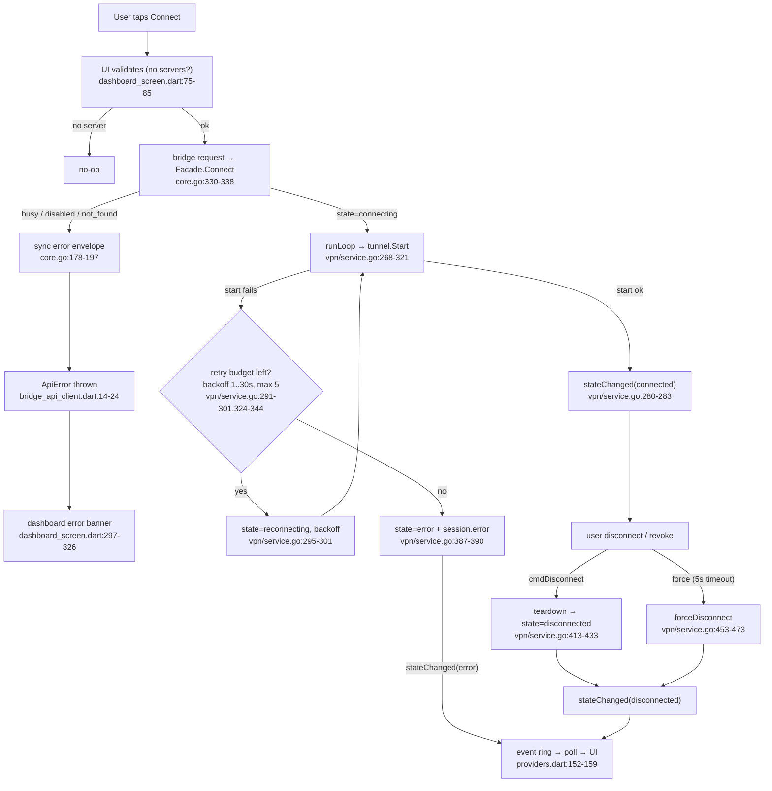

# NETWORK_FLOW — End-to-End Traffic & Control Data Flow

**Scope:** every byte of traffic from a user's app through the OmniProxy stack to
the remote server and back, in both **proxy mode** and **VPN mode**, on Android,
Linux, and (as planned) Windows. Also traces the **control plane** (tap → UI →
bridge → core → engine → event back to UI).

**Relationship to other docs:** this is the *map*. Per-layer detail lives in the
deeper docs — `docs/ARCHITECTURE.md` (component responsibilities, startup/config
generation, event & state flow), `docs/FLUTTER_GO_FFI.md` (transport boundary,
memory & lifetime protocol), `docs/GO_RUNTIME.md` (goroutines, ring, cgo
runtime), `docs/FLUTTER.md` (UI state). This doc shows how those layers connect
into one continuous flow.

**Verification legend.**
- ✅ **verified** — read directly in this repo's source (file:line cited).
- 🔶 **inferred** — the hop happens inside a third-party module (sing-box,
  sing-tun/gVisor, the kernel); the repo wires it up but the internal bytes are
  not readable here. Confidence is noted per hop.

---

## 1. Purpose & scope

This document answers two questions end to end:

1. **What happens when the user taps Connect** — the request chain Dart → FFI /
   MethodChannel → Go core → tunnel manager → engine → remote server, and how the
   `connected` event flows all the way back to the UI state.
2. **Where the traffic bytes actually go** — the data plane for proxy mode
   (local loopback inbound → sing-box router → protocol outbound → remote server)
   and VPN mode (app packets → TUN → gVisor userspace stack → router → outbound →
   remote server → back), including the DNS query path.

The data plane is *end-to-end* only through OmniProxy's own process boundary:
everything on the wire between the client process and the remote server is
protocol work performed by **sing-box** (pinned `v1.13.15`, `core/core.go:30`)
and is not re-implemented anywhere in this repo (AGENTS.md: protocols are always
delegated to the engine). Inside sing-box, this doc marks the routing/stack
internals as **inferred**; what we verify is the *configuration* we hand it and
the *boundaries* around it.

Explicitly **out of scope**: the remote server's own behavior, TLS/protocol
cryptography details, per-protocol wire formats (delegated to sing-box), and
Phase 2 features (chaining, routing rules, stats) — the MVP routing is a single
hard-wired `final: proxy` hop.

---

## 2. Control plane flow — user taps Connect

### 2.1 The request chain (Dart → Go)

1. **UI.** The dashboard's connect button (`app/lib/features/dashboard/dashboard_screen.dart:328-394`)
   calls `_connect` (`dashboard_screen.dart:75-85`), which picks the target
   server (favorite first, else first) and calls
   `ConnectionNotifier.connect` (`app/lib/state/providers.dart:161-165`).
2. **ApiClient.** `BridgeApiClient.connect` frames the contract call
   `{"serverId","mode"}` (`app/lib/core/bridge_api_client.dart:94-99`). The
   mode defaults to the persisted `AppSettings.connectionMode` in the UI
   (`providers.dart:164`).
3. **Transport.** The pure-transport bridge serializes the request and crosses
   into native code:
   - **Linux/Windows:** `LinuxBridge.request` → `dart:ffi` →
     `omniproxy_request(method, requestJson)` (`app/lib/core/bridge/bridge_linux.dart:86-120`).
   - **Android:** `AndroidBridge.request` →
     `MethodChannel("com.omniproxy/bridge").invokeMethod` →
     Kotlin `Bridge.executeRequest` → `Mobile.request`
     (`app/lib/core/bridge/bridge_android.dart:42-74`,
     `app/android/.../Bridge.kt:213-237`, `core/mobile/mobile.go:183-190`).
4. **Dispatch.** Both entry points call the shared facade dispatcher:
   `core/glue/glue.go:115-130` → `facade.Dispatch` → `api.Dispatcher.Dispatch`
   (`core/api/dispatch.go:18-25`), routed by method name
   (`dispatch.go:101-106` for `connect`).
5. **Facade.** `Facade.Connect` defaults an empty mode to
   `settings.connectionMode`, calls `vpn.Connect`, and returns the current state
   snapshot (`core/core.go:330-338`).

### 2.2 The connection state machine (Go)

`vpn.Service.Connect` (`core/vpn/service.go:156-210`):

- Resolves the profile via `Facade.Resolve` (`core/core.go:201-210`) →
  `server.Manager.GetServer` (`core/server/manager.go:55-57`) → SQLite
  repository `Get`, which **restores credentials from the SecretStore** and
  registers them with the logger redactor
  (`core/store/server_repository.go:148-161`, `:269-279`). A disabled profile is
  rejected (`core/core.go:206-208`).
- Rejects a second connect while `connecting/connected/reconnecting`
  (`ErrBusy`, `vpn/service.go:165-169`).
- Creates a `VPNSession`, sets `state = connecting` **synchronously**, publishes
  `stateChanged(connecting)` on the event bus, and starts the `runLoop`
  goroutine (`vpn/service.go:191-209`).

`runLoop` (`vpn/service.go:268-321`) calls `tunnel.Manager.Start`
(`core/tunnel/manager.go:62-78`), which clones the profile, builds
`engine.Options` (`core/tunnel/options.go:16-30`), and hands it to the runner.

### 2.3 Runner → engine

The runner is where platform/mode diverge:

- **Proxy mode (any platform):** in-process —
  `InProcessRunner.Start` → `engine.Engine.Start`
  (`core/tunnel/runner.go:40-43`, `engine/engine.go:44-73`).
- **VPN mode Linux:** `HelperRunner.Start` (`core/tunnel/helper_client.go:83-96`)
  spawns the privileged helper via `pkexec` (`helper_client.go:41-58`,
  `:162-204`), sends `{"type":"connect","options":…}` over a Unix socket
  (`core/tunnel/helper_proto.go:25-35`), and the helper host runs the same
  `engine.Engine.Start` as root (`core/tunnel/helperhost/helperhost.go:90-115`).
- **VPN mode Android:** `InProcessRunner` with the `FdTunPlatform` injected
  (`core/mobile/mobile.go:171-179`, `core/tunnel/runner.go:37`); the TUN fd was
  handed over by the Kotlin VpnService before `connect` ran
  (`app/android/.../OmniProxyVpnService.kt:64-66`).

`engine.Engine.Start` builds the sing-box config from `engine.Options`
(`engine/config.go:170-262`) and constructs + starts the box
(`engine/engine.go:57-72`). On success `runLoop` transitions to `connected` and
publishes `stateChanged(connected)` (`vpn/service.go:280-283`).

### 2.4 The connected event back to the UI

Events are **polled, not pushed** on every transport (contract
`docs/api-contract.md:180-200`, rationale in `docs/FLUTTER_GO_FFI.md` §7):

1. The `vpn.Service` publishes onto `api.EventBus` (`core/api/events.go:66-76`).
2. `facadeSink` gates delivery on `subscribe` state and event type
   (`core/core.go:405-419`; subscribed by the UI at
   `app/lib/state/providers.dart:137`).
3. The transport sink pushes into a bounded **event ring** (cap 512, drop-oldest):
   `core/glue/glue.go:143` (FFI), `core/mobile/mobile.go:165` (mobile);
   `core/internal/ring/ring.go:29-45`.
4. A timer drains the ring:
   - **Linux:** Dart `Timer.periodic(15ms)` → `omniproxy_poll_events`
     (`app/lib/core/bridge/bridge_linux.dart:41,68,122-138`;
     `core/glue/glue.go:133-139`).
   - **Android:** Kotlin `HandlerThread` every **25 ms** → `Mobile.pollEvents`
     → `MethodChannel("com.omniproxy/events")` → Dart
     (`app/android/.../Bridge.kt:31,251-285`; `core/mobile/mobile.go:292-302`;
     `app/lib/core/bridge/bridge_android.dart:76-83`).
5. `ConnectionNotifier._onEvent` updates the UI state
   (`app/lib/state/providers.dart:152-159`). The dashboard re-renders the status
   hero / server card (`dashboard_screen.dart:18-65`).

Log lines follow the same path: `logSink` publishes every redacted entry as a
`logAppended` event (`core/core.go:421-426`), the `logsProvider` appends it and
dedupes by `seq` (`providers.dart:207-214`), and the Logs screen backfills with
`getLogs` (`core/core.go:355-360`, `providers.dart:192-205`).

```mermaid
sequenceDiagram
    autonumber
    participant U as User
    participant D as Dashboard UI
    participant N as ConnectionNotifier (Riverpod)
    participant C as BridgeApiClient
    participant T as LinuxBridge (dart:ffi)
    participant G as libomniproxy.so (glue)
    participant F as core.Facade
    participant V as vpn.Service
    participant M as tunnel.Manager
    participant R as HelperRunner
    participant H as omniproxy-helper (root)
    participant E as engine.Engine (sing-box)
    participant S as EventRing

    U->>D: tap Connect (dashboard_screen.dart:75-85)
    D->>N: connect(serverId, mode) (providers.dart:161-165)
    N->>C: connect() (bridge_api_client.dart:94-99)
    C->>T: request("connect", {serverId, mode}) (bridge_linux.dart:86-120)
    T->>G: omniproxy_request(...) (glue.go:115-130)
    G->>F: Dispatcher.Dispatch (dispatch.go:18-25,101-106)
    F->>V: vpn.Connect (core.go:330-338)
    V->>V: resolve profile; state=connecting (vpn/service.go:156-209)
    V->>S: stateChanged(connecting)
    V-->>V: go runLoop (vpn/service.go:208)
    V->>M: Manager.Start(profile, mode) (manager.go:62-78)
    M->>R: HelperRunner.Start(opts) (helper_client.go:83-96)
    R->>H: pkexec + {"type":"connect","options":...} (helper_client.go:162-326)
    H->>E: engine.Start(opts) (helperhost.go:90-115, engine.go:44-73)
    E-->>H: ok (box.Start) (engine.go:66-72)
    H-->>R: {"ok":true,"state":"connected"} (helperhost.go:114)
    R-->>M: nil
    M-->>V: nil (manager.go:70-77)
    V->>V: state=connected (vpn/service.go:280-283)
    V->>S: stateChanged(connected)
    G-->>T: {"ok":true,"data":{"state":"connecting"}} (core.go:337)
    T-->>C: BridgeResponse.ok
    C-->>N: returns
    rect rgb(240,247,255)
    note over T,S: async: 15ms poll timer drains ring<br/>(glue.go:133-139, bridge_linux.dart:122-138)
    S->>T: stateChanged(connecting/connected) + logAppended
    T-->>N: events stream (bridge_linux.dart:134-137)
    N-->>D: state updated (providers.dart:152-159)
    end
```

---

## 3. Data plane flow — proxy mode

In proxy mode there is no TUN: sing-box exposes a **mixed SOCKS5+HTTP inbound on
`127.0.0.1:1080`** (`engine/config.go:240-259`, defaults at
`engine/config.go:139-153`). The app under the user's control must be configured
to use this local proxy. (Surfacing the address/port in the UI is planned per
`docs/platform-notes.md:16`; the MVP dashboard does not yet render it — verified
gap.)

### 3.1 Inbound → router → outbound

- The mixed inbound listener accepts both SOCKS5 and HTTP CONNECT on one port
  (`engine/config.go:250-259`; protocol registered at
  `engine/registry.go:39`).
- The route table is a single hard-wired hop: `Route.Final = "proxy"`
  (`engine/config.go:191-193`) with **no rules in proxy mode** (rules are added
  only in VPN mode, `engine/config.go:195-217`). So every connection accepted by
  the mixed inbound is dispatched to the `proxy` outbound.
- The outbound is built from the `ServerProfile` by `buildOutbound`
  (`engine/config.go:312-418`): protocol (VLESS/VMess/Trojan/SS/SOCKS/HTTP/SSH),
  optional TLS (`tlsContainer`, `engine/config.go:420-434`), optional WS
  transport (`buildTransport`, `engine/config.go:560-578`). The profile → options
  mapping is `core/tunnel/options.go:45-113`.
- sing-box establishes the connection to the remote server over the physical
  interface, negotiates the protocol, and relays bytes between the inbound
  connection and the outbound connection. 🔶 **inferred**: the exact relay loop
  and buffer sizes live inside sing-box's `router`/protocol packages; the repo's
  verification is the e2e test
  `engine/e2e_test.go:125-171` (SOCKS5 client → mixed inbound → SOCKS5 outbound →
  test server → echo) and `core/tunnel/helperhost_test.go`/`manager_test.go`.

### 3.2 The verified byte path

The e2e test proves the pipeline byte-for-byte: a client dials the mixed inbound
with SOCKS5, sends `omniproxy-engine-roundtrip`, and the echo returns unchanged
(`engine/e2e_test.go:149-170`). That is the contract this repo owns: **protocol
codec is sing-box's; boundary wiring is ours.**

```mermaid
flowchart LR
    A["App (browser/app)<br/>configured for 127.0.0.1:1080"] -->|"TCP, SOCKS5 / HTTP CONNECT"| B["sing-box mixed inbound<br/>127.0.0.1:1080<br/>engine/config.go:240-259"]
    B -->|"connection dispatch"| C["sing-box router<br/>Route.Final = 'proxy', no rules<br/>engine/config.go:191-193"]
    C -->|"dest + stream"| D["proxy outbound<br/>protocol builder<br/>engine/config.go:312-418"]
    D -->|"TLS (optional) + WS transport (optional)<br/>tlsContainer:420-434, buildTransport:560-578"| E["TCP socket to remote server<br/>address:port (options.go:45-113)"]
    E -->|"protocol frames (VLESS/VMess/Trojan/SS/SOCKS/HTTP/SSH)<br/>encrypted + authenticated"| F["remote server"]
    F -->|"response frames"| E
    E -->|"decrypted bytes"| D
    D -->|"relay"| C
    C -->|"relay"| B
    B -->|"TCP reply"| A

    subgraph omni["OmniProxy process (unprivileged)"]
        B
        C
        D
        E
    end
```



**Notes**
- 🔶 The cipher/TLS/WS framing inside `E` is sing-box's (pinned `v1.13.15`); we
  only configure it. ✅ The config that reaches sing-box is built in
  `engine/config.go` and verified by `engine/config_test.go`.
- Logs: every engine line is redacted by the core logger before it reaches any
  sink or the ring (`core/log/logger.go:130-162`, `engine/log.go:48-58`,
  `core/tunnel/runner.go:55-60`) — the data plane never appears in logs.

---

## 4. Data plane flow — VPN mode

In VPN mode the OS routes whole-network traffic into a TUN device; sing-box's
`tun` inbound reads packets from it. The kernel→userspace boundary is provided
per platform (see §5): Android `VpnService` fd, Linux root-helper TUN with
`auto_route`, Windows Wintun (planned).

### 4.1 Inbound setup

- TUN inbound options: interface `omniproxy`, MTU 1500, addresses
  `10.0.0.1/24` + `fd00::1/64`, `auto_route` (or `strict_route`), stack `mixed`
  (`engine/config.go:226-239`, defaults at `:277-310`). The `mixed` stack with
  the `with_gvisor` build tag (build command in `core/mobile/mobile.go:12-15`)
  runs **gVisor in userspace for UDP (and non-TCP), while TCP is serviced by the
  kernel** through a gVisor-reassembled local socket — see `docs/VPN_INTERNALS.md`
  §4 and `docs/PERFORMANCE.md` §3 for the exact split.
- **Android** does not let sing-box create the TUN: the VpnService establishes
  the same address/routes (`app/android/.../OmniProxyVpnService.kt:53-60`) and
  hands the fd through `Mobile.setTunFd` → `FdTunPlatform` → `OpenInterface`,
  which `dup`s the fd and builds the `tun.Tun` from the file descriptor
  (`core/mobile/mobile.go:171-179`; `engine/platform_fd.go:169-190`).
  🔶 sing-tun then drives the fd with the gVisor stack (inferred inside
  `sing-tun`, verified to be configured).
- **Linux** uses the default (`noopPlatform`) behavior, so **sing-box creates the
  TUN itself** with `CAP_NET_ADMIN` in the helper process
  (`engine/platform.go:31-34`; `docs/platform-notes.md:62-67`).

### 4.2 App packet → TUN → outbound

1. The OS sends the app's packets into the TUN (0.0.0.0/0, ::/0 routes).
2. sing-tun/gVisor reassembles packets into transport streams and hands them to
   the `tun` inbound 🔶 (internals of sing-tun not read here).
3. The router dispatches to the `proxy` outbound (`final: proxy`,
   `engine/config.go:191-193`), exactly as in §3.
4. Responses flow back out of the outbound into gVisor, which re-packetizes and
   writes to the TUN fd; the OS delivers the packets to the app.

**Loop protection.** The tunnel's own sockets (the DNS bootstrap resolver and the
connection to the proxy server itself) must **not** re-enter the TUN or traffic
loops back into the tunnel:
- Android: `FdTunPlatform.AutoDetectInterfaceControl` calls
  `VpnService.protect(fd)` (`engine/platform_fd.go:81-96`;
  `app/android/.../OmniProxyVpnService.kt:64`); sing-box routes direct dials
  through it because `UsePlatformAutoDetectInterfaceControl()` is true.
- Linux/others: `Route.AutoDetectInterface = true` lets sing-box bind direct
  dials to the physical default interface (`engine/config.go:210-216`).

### 4.3 DNS queries in VPN mode

Without a DNS module, client DNS would be opaque UDP through the tunnel and
resolved by whatever server upstream forwards to. OmniProxy adds a DNS module and
**hijacks DNS at the router** so queries resolve inside sing-box
(`engine/config.go:195-217`, `buildDNSOptions` `:442-496`):

- **Client queries** (any DNS packet arriving at the TUN) are hijacked
  (`dnsHijackRule`, `engine/config.go:542-554`) into the DNS module → resolved by
  `dns-proxy` (`8.8.8.8`) **through the `proxy` outbound** — DNS travels inside
  the tunnel, so there is no DNS leak, and results are cached
  (`IndependentCache`, `:490-493`).
- **Outbound dialing** (e.g. resolving the proxy server's own hostname) is
  resolved by `dns-local` (`223.5.5.5`) with an **empty-direct dialer** — over
  the real network — breaking the chicken-and-egg loop (`:459-470`). The default
  DNS rule routes *outbound* queries to `dns-local` (`:472-487`).
- **IPv6 mode** maps onto the DNS domain strategy; `disable_ipv6` answers AAAA
  with empty NOERROR and adds a `block` rule for any IPv6 packet that still
  reaches the router (`dnsStrategy` `:502-513`, `blockIPv6Rule` `:525-538`). The
  TUN always keeps its v6 address and `::/0` route so IPv6 never leaks onto the
  physical interface (`docs/platform-notes.md:38-42`).

```mermaid
flowchart LR
    A["App"] -->|"UDP :53 query<br/>(8.8.8.8, 1.1.1.1, ...)"| K["OS routing table<br/>0.0.0.0/0, ::/0"]
    K -->|"TUN device<br/>Android: VpnService fd / Linux: helper auto_route"| B["sing-tun fd<br/>engine/platform_fd.go:169-190"]
    B -->|"packets"| G["gVisor userspace stack<br/>stack='mixed', with_gvisor<br/>engine/config.go:291-296"]
    G -->|"transport streams"| I["tun inbound<br/>engine/config.go:226-239"]
    I -->|"dest = proxy server's hostname"| D1["router → DNS module<br/>hijack-dns rule<br/>engine/config.go:542-554"]
    D1 -->|"dns-local 223.5.5.5<br/>empty-direct dialer"| N1["real network DNS<br/>engine/config.go:459-470"]
    N1 -->|"answer"| O["outbound dial resolved"]
    I -->|"dest = arbitrary host"| D2["router<br/>final: proxy<br/>engine/config.go:191-193"]
    D2 -->|"UDP/TCP to dns-proxy 8.8.8.8"| DNSM["DNS module<br/>dns-proxy via detour: proxy<br/>engine/config.go:445-457"]
    DNSM -->|"DNS answer"| I
    I -->|"answer back"| G
    G -->|"re-packetize"| B
    B -->|"packets"| K
    K -->|"reply"| A
    D2 -->|"app data"| O
    O -->|"protocol outbound + TLS/WS<br/>engine/config.go:312-418"| R["remote server"]

    subgraph omni["sing-box (in-process or in helper)"]
        B
        G
        I
        D2
        D1
        DNSM
        N1
    end
```



**Notes**
- ✅ Verified: the config above is exactly what `buildOptions` produces
  (`engine/config.go:170-262`) and the Android fd hand-off / platform hooks are
  ours (`engine/platform_fd.go`, `platform_monitor.go`).
- 🔶 Inferred: gVisor reassembly/re-packetization internals and sing-box's DNS
  client/server implementation (pin `v1.13.15`; `dns` package registered at
  `engine/registry.go:52-53`).
- The DNS answer logging (`exchanged A … / AAAA …`) and IPv6 block logs come
  from sing-box and surface in the Logs screen (`docs/platform-notes.md:54-60`).

---

## 5. Per-platform differences

| Stage | Android | Linux | Windows |
|---|---|---|---|
| Bridge transport | MethodChannel over gomobile `.aar` (`Bridge.kt:213-237`, `mobile.go:183-190`) | `dart:ffi` into `libomniproxy.so` (`bridge_linux.dart:86-120`) | FFI into `omniproxy.dll` — **code-complete, untested** (`bridge_windows.dart:7-22`; `docs/platform-notes.md:73-80`) |
| TUN ownership | `VpnService` (`OmniProxyVpnService.kt:53-60`); fd handed into core (`:64-66`) | privileged `pkexec` helper hosts engine + TUN (`helper_client.go:41-58`, `helperhost.go:90-115`) | Wintun, in-process (planned; `docs/platform-notes.md:75-76`) |
| Engine location | in-process (foreground `VpnProxyService`) | proxy: in-process; VPN: in helper process | in-process |
| Runner | `InProcessRunner` + `FdTunPlatform` (`mobile.go:137-138`, `runner.go:37`) | `HelperRunner` mode-aware (`helper_client.go:83-96`) | `InProcessRunner` |
| Interface monitor | **passive** — fed by `ConnectivityManager` (`Bridge.kt:81-102`, `platform_monitor.go:95-119`); netlink banned on Android | sing-box netlink monitor (default) | sing-box default (Wintun platform) |
| Direct-socket loop guard | `VpnService.protect(fd)` (`platform_fd.go:81-96`, `OmniProxyVpnService.kt:64`) | auto-detected-interface binding (`config.go:216`) | auto-detect |
| Network-interface list | pushed from Kotlin `java.net.NetworkInterface` (netlink denied) (`Bridge.kt:122-147`, `mobile.go:253-289`) | Go `net.Interfaces()` | Go |
| Credentials | Android Keystore (`KeystoreSecretStore.kt`, `mobile.go:65-110`) | libsecret (`secret/keyring.go`) | Credential Manager/DPAPI (planned) |
| Event polling | Kotlin `HandlerThread`, 25 ms (`Bridge.kt:31,251-285`) | Dart timer, 15 ms (`bridge_linux.dart:41`) | Dart timer (planned) |
| Proxy mode inbound | `127.0.0.1:1080` mixed (`config.go:240-259`) | same | same |
| VPN consent flow | `VpnService.prepare` intent + `onActivityResult` (`MainActivity.kt:48-67,103-115`) | pkexec prompt | Wintun DLL presence |

**Where the byte path differs:** only at the two boundaries — (a) the bridge
(JSON-over-FFI vs JSON-over-MethodChannel vs JSON-over-FFI) and (b) the TUN
ownership (VpnService fd vs helper-created auto_route TUN vs Wintun). From the
mixed inbound / tun inbound through the router and outbound, the byte path is
**identical** because the engine module is shared and the config builder is the
single source of truth (`engine/config.go`).

---

## 6. Latency budget & hops

Every boundary crossing between the app's byte and the wire, with the approximate
cost and why.

| # | Hop | Boundary | Approx. cost | Verified? |
|---|---|---|---|---|
| 1 | Dart ↔ C | `jsonEncode` → `.toNativeUtf8()` → `C.CString` → `C.GoString` (`bridge_linux.dart:60-63,90-97`; `glue.go:115-129,163`) | µs–tens of µs; **one malloc + two string copies** per call + full JSON round-trip | ✅ |
| 2 | Dart ↔ Go (Android) | MethodChannel + JSON string (same-process Binder) + Kotlin `Thread` dispatch (`Bridge.kt:215-223`) | ~100 µs–1 ms; one extra JSON string hop vs FFI | ✅ |
| 3 | C → Go core | `Dispatcher.Dispatch` parses request JSON, handler runs (`dispatch.go:18-25`) | JSON decode cost | ✅ |
| 4 | Go core → engine (proxy / Android VPN) | direct in-process call (`runner.go:40-43`) | ~0 (function call) | ✅ |
| 5 | Go core → engine (Linux VPN) | **Unix socket JSON control round-trip** + pkexec spawn on first connect (`helper_client.go:162-204,313-326`) | spawn 1–3 s (pkexec prompt); socket 50–200 µs; **control-plane only, not per-byte** | ✅ |
| 6 | Engine start | sing-box `box.New` + `Start`: builds router, DNS, outbounds, opens TUN (`engine.go:57-72`) | 10–100 ms | 🔶 order of magnitude |
| 7 | App → TUN (VPN) | kernel packet route + TUN device | ~10–50 µs/packet | 🔶 |
| 8 | TUN fd → gVisor | fd read by sing-tun; gVisor stack reassembly (`platform_fd.go:169-190`; `config.go:291-296`) | 10–100 µs/packet; userspace stack adds CPU, not per-byte RTT | 🔶 |
| 9 | Inbound → router → outbound (sing-box) | relay loop, protocol codec, (TLS/WS) | µs–ms; dominated by TLS + protocol overhead | 🔶 |
| 10 | Socket → wire | TCP/IP stack to remote server | RTT (network) | ✅ conceptual |
| 11 | Event poll (Linux) | Dart `Timer` 15 ms drains ring (`bridge_linux.dart:41`) | **≤15 ms + drain cost** added to every UI state/log update | ✅ |
| 12 | Event poll (Android) | Kotlin 25 ms drain + main-thread channel forward (`Bridge.kt:31,282`) | **≤25 ms + main-thread hop** per event batch | ✅ |

### Control-plane timing numbers to remember

- `helperSpawnTimeout = 15s`, `helperConnectTimeout = 30s`,
  `helperDisconnectTimeout = 5s` (`core/tunnel/helper_client.go:32-35`).
- `disconnectTimeout = 5s` before force-disconnect (`core/vpn/service.go:23`).
- Reconnect backoff 1s, 2s, 4s … capped 30s, up to 5 attempts
  (`core/vpn/service.go:46-58`).
- Latency test timeout 3s (`core/tunnel/latency.go:14`).
- **The poll timers stall during a synchronous bridge request.** On Linux the
  timer runs on the same isolate as the FFI call, so a `connect` that blocks
  seconds (VPN: helper spawn, up to 30 s) freezes the poll loop; events queue in
  the ring (drop-oldest) and flush in a burst when the request returns — the UI
  doesn't lose *state* because the `connect` response itself carries the
  snapshot (`core/core.go:337`; `docs/FLUTTER_GO_FFI.md:525-541`). On Android the
  poller runs on a dedicated Kotlin `HandlerThread` and `Mobile.pollEvents`
  drains the ring without taking the request mutex (`core/mobile/mobile.go:292-302`;
  `docs/FLUTTER_GO_FFI.md` §5), so the Android poll loop keeps draining events even
  while a request is in flight.

---

## 7. Failure & error paths

### 7.1 Error taxonomy

Domain errors map onto the contract's error codes at the facade
(`core/core.go:178-197`) and at the state machine
(`classify`, `core/vpn/service.go:513-526`): `unauthorized` (pkexec cancelled /
TUN permission), `busy`, `connected`, `engine_error`, `not_found`,
`validation_failed`, `internal`.

### 7.2 What happens on each failure

- **Connect refused at UI/facade level** (disabled profile, busy, missing): the
  synchronous response carries `{ok:false, error:{code,message}}`; `BridgeApiClient`
  throws `ApiError` (`app/lib/core/bridge_api_client.dart:14-24`); the dashboard
  surfaces it in the error banner (`dashboard_screen.dart:297-326`).
- **Engine start fails** (bad server, refused port, no TUN permission): `runLoop`
  stops any half-started tunnel (`stopIfActive`, `vpn/service.go:290,402-409`),
  then either retries with backoff (`state = reconnecting`,
  `vpn/service.go:291-301`) or — after `MaxAttempts` — transitions to `error`
  with the session error populated (`transitionError`, `:387-390`). The
  `stateChanged(error)` event reaches the UI on the next poll.
- **pkexec cancelled (Linux VPN):** `ensureHelper` times out with
  "privileged helper: timed out… (pkexec cancelled?)" (`helper_client.go:193-203`),
  which `classify` maps to `unauthorized` (`vpn/service.go:519-520`) and the UI
  shows actionable text.
- **Android consent denied:** `MainActivity.onActivityResult` completes the
  pending `connect` channel with `error("vpn_consent", …)`
  (`MainActivity.kt:103-115`).
- **Android VPN revoked from system UI:** `onRevoke` fires a `disconnect`
  request so the app's state stays consistent (`OmniProxyVpnService.kt:93-101`).
- **User disconnect:** `Disconnect` commands the run loop, which tears down the
  tunnel and emits `stateChanged(disconnected)` (`vpn/service.go:213-238,413-433`);
  `Facade.Close` on shutdown does the same plus runner reap
  (`core/core.go:157-167`).
- **Network drop mid-session:** the interface monitor update fires sing-box's
  default-interface callbacks so the engine re-evaluates its routes 🔶
  (monitor wiring verified at `engine/platform_monitor.go:95-119`;
  engine-internal auto-reconnect is sing-box behavior). Core-level auto-reconnect
  only retries **failed starts**; it does not watch the network itself.



---

## 8. Buffer & memory flow

Who holds the bytes at each stage, and how many copies.

### 8.1 Control plane (requests / events)

| Stage | Buffer | Copy behavior | Verified |
|---|---|---|---|
| Dart request | `jsonEncode` → Dart `String` | — | ✅ |
| Dart → C | `.toNativeUtf8()` → malloc'd C buffer (`bridge_linux.dart:60-63,90-97`) | 1 copy (Dart string → C bytes) | ✅ |
| C → Go | `C.GoString` → Go `string` (`glue.go:125-129`) | 1 copy (C bytes → Go heap) | ✅ |
| Go string → `[]byte` | `[]byte(C.GoString(...))` (`glue.go:127-129`) | string→slice; 0 copies for large non-escaping strings 🔶, 1 otherwise | 🔶 |
| Go response | `json.Marshal` → `[]byte` → `string` (`dispatch.go:18-24`) | 1 | ✅ |
| Go → C | `C.CString` (`glue.go:129,163`) | 1 copy (Go → malloc C) | ✅ |
| C → Dart | `toDartString()` then `omniproxy_free_string` (`bridge_linux.dart:94-96`) | 1 copy (C → Dart heap), then **C memory freed by caller** | ✅ |
| Event ring | `api.Event` structs in `[]api.Event` (`ring.go:29-45`) | Push appends; drop-oldest reallocates the slice; **Drain swaps the slice without copying** | ✅ |
| Event poll JSON | marshal batch → C string → Dart string | 2 copies per batch (like a request) | ✅ |

**Lifetime rule:** C strings returned from `omniproxy_request`/`poll_events` are
freed by the caller with `omniproxy_free_string`; Go never frees them and Dart
never double-frees (`core/glue/glue.go:156-161`; `docs/FLUTTER_GO_FFI.md` §8).

### 8.2 Data plane

| Stage | Buffer | Copy behavior | Verified |
|---|---|---|---|
| Proxy inbound read | sing-box mixed inbound accepts TCP; sing-box internal `bufio`-style buffers | 🔶 internal | 🔶 |
| VPN fd read | sing-tun reads the TUN fd (`platform_fd.go:169-190`); gVisor owns packet buffers | 🔶 internal to sing-tun/gVisor | 🔶 |
| Router relay | sing-box router copies between inbound/outbound conns | 🔶 internal; typically one buffered copy per direction | 🔶 |
| Protocol codec | VLESS/VMess/Trojan/SS frames; TLS records; WS frames (`config.go:312-418`, `:420-434`, `:560-578`) | 🔶 internal; encryption adds a copy | 🔶 |
| Socket → wire | kernel socket buffer | — | ✅ conceptual |
| Android fd | `unix.Dup(fd)` gives sing-tun its own descriptor (`platform_fd.go:184-188`) | fd value copy (no byte copy); both sides own a ref | ✅ |

**Bottom line:** the control plane adds **~3–4 heap copies per request** plus a
JSON round-trip (verified). The data plane adds **1 copy at each boundary we own**
(fd dup is descriptor-level only; TUN reads/writes are kernel→userspace). Every
copy inside sing-box/gVisor is **inferred** — sing-box is pinned (`v1.13.15`) and
treated as a black box; profiling it is a Phase 2 concern.

---

## 9. Reference data flow map

| # | Hop | Component | Direction | Protocol / format | Buffer owner | Ref (file:line) |
|---|---|---|---|---|---|---|
| 1 | UI tap | DashboardScreen | UI → | — | Dart widget state | `app/lib/features/dashboard/dashboard_screen.dart:75-85,328-394` |
| 2 | UI state | ConnectionNotifier | UI → | — | Riverpod provider | `app/lib/state/providers.dart:161-165` |
| 3 | Contract call | BridgeApiClient | Dart → | JSON method `connect` | Dart | `app/lib/core/bridge_api_client.dart:94-99` |
| 4 | Linux transport | LinuxBridge | Dart → C | JSON over `dart:ffi` | C malloc | `app/lib/core/bridge/bridge_linux.dart:86-120` |
| 5 | Android transport | AndroidBridge → Bridge.kt | Dart → Kotlin | JSON over MethodChannel | Kotlin/Dart | `app/lib/core/bridge/bridge_android.dart:42-74`; `app/android/.../Bridge.kt:213-237` |
| 6 | Android Go entry | Mobile.request | Kotlin → Go | JSON string | Go | `core/mobile/mobile.go:183-190` |
| 7 | FFI Go entry | glue `omniproxy_request` | C → Go | JSON string | Go | `core/glue/glue.go:115-130` |
| 8 | Dispatch | `api.Dispatcher` | Go → | method → handler | Go | `core/api/dispatch.go:18-25,101-106` |
| 9 | Facade connect | `Facade.Connect` | Go → | — | Go | `core/core.go:330-338` |
| 10 | Profile resolve | store repo `Get` (restores secrets) | Go → DB/keystore | SQL + SecretStore | Go | `core/store/server_repository.go:148-161,269-279` |
| 11 | State machine | vpn.Service | Go → | state + events | Go | `core/vpn/service.go:156-321` |
| 12 | Tunnel start | tunnel.Manager | Go → | engine.Options | Go | `core/tunnel/manager.go:62-78` |
| 13 | Options build | `BuildEngineOptions` | Go → | profile → Options | Go | `core/tunnel/options.go:16-30` |
| 14 | Runner (proxy/in-proc) | InProcessRunner | Go → | engine.Start | Go | `core/tunnel/runner.go:40-43` |
| 15 | Runner (Linux VPN) | HelperRunner → helper | Go → Go(socket) | JSON over Unix socket | Go (both sides) | `core/tunnel/helper_client.go:83-96,313-326`; `helperhost/helperhost.go:90-115` |
| 16 | Config build | engine `buildOptions` | Go → | Options → sing-box config | Go | `engine/config.go:170-262` |
| 17 | Engine start | `box.New` + `Start` | Go → | sing-box | Go | `engine/engine.go:57-72` |
| 18 | Proxy inbound | mixed (SOCKS5+HTTP) | wire → sing-box | TCP | sing-box | `engine/config.go:240-259`; `registry.go:39` |
| 19 | TUN inbound | tun + gVisor | kernel → sing-box | IP packets | sing-box/gVisor | `engine/config.go:226-239`; `registry.go:38` |
| 20 | Android TUN fd | VpnService → FdTunPlatform | Kotlin → Go → sing-tun | fd (+dup) | kernel/Go | `OmniProxyVpnService.kt:53-66`; `platform_fd.go:169-190` |
| 21 | Router | sing-box router | inbound → outbound | — | sing-box | `engine/config.go:191-193` |
| 22 | Outbound | protocol builder | → wire | VLESS/VMess/Trojan/SS/SOCKS/HTTP/SSH | sing-box | `engine/config.go:312-418`; `registry.go:41-50` |
| 23 | TLS/WS | tlsContainer / buildTransport | → wire | TLS, WebSocket | sing-box | `engine/config.go:420-434,560-578` |
| 24 | DNS (VPN) | DNS module + hijack | TUN → DNS | UDP DNS | sing-box | `engine/config.go:195-217,442-496,542-554` |
| 25 | Loop guard | protect / auto-detect | — | fd control | kernel | `platform_fd.go:81-96`; `config.go:210-216` |
| 26 | Event bus | EventBus + facadeSink | Go → | `stateChanged`/`logAppended` | Go | `core/api/events.go:66-76`; `core/core.go:405-419` |
| 27 | Event ring | EventRing (cap 512) | Go → | events | Go | `core/internal/ring/ring.go:29-45`; `glue.go:143`; `mobile.go:165` |
| 28 | Poll | poll_events / pollEvents | Go → C → Dart | JSON array | Go→C→Dart | `glue.go:133-139`; `mobile.go:292-302`; `bridge_linux.dart:122-138`; `Bridge.kt:266-285` |
| 29 | UI event | ConnectionNotifier/LogsNotifier | Dart → | stateChanged / logAppended | Riverpod | `app/lib/state/providers.dart:152-159,207-214` |
| 30 | Logs | logger ring (1000) + redactor | Go → | getLogs backfill | Go | `core/log/logger.go:126-162`; `core/log/ring.go:28-63`; `core/core.go:355-360` |

---

## 10. Related documents

Existing:
- `docs/ARCHITECTURE.md` — component responsibilities, startup/shutdown sequence, config generation, event & state flow (the structural sibling of this doc).
- `docs/FLUTTER_GO_FFI.md` — the transport boundary deep dive: polling vs push, memory & lifetime protocol, threading.
- `docs/GO_RUNTIME.md` — how the Go core actually runs: goroutines, ring, cgo/FFI runtime, blocking-I/O notes.
- `docs/FLUTTER.md` — the Dart UI: ApiClient abstraction, state management, screens.
- `docs/api-contract.md` — the canonical Flutter ↔ Go contract (method names, schemas, events).
- `docs/platform-notes.md` — per-platform TUN/privileges/native glue.
- `docs/implementation-plan.md` — Phase 1 plan, decisions, milestones.

Detail-layer docs for this map (each deep-dives one hop of the flow):
- `docs/PROXY_ARCHITECTURE.md` — proxy-mode detail: protocols, inbound/outbound wiring.
- `docs/VPN_INTERNALS.md` — VPN-mode / TUN detail: TUN device, gVisor, DNS, state machine.
- `docs/SINGBOX.md` — sing-box integration, config generation, registry, pin policy.
- `docs/ANDROID.md`, `docs/LINUX.md`, `docs/WINDOWS.md` — per-platform deep dives.
