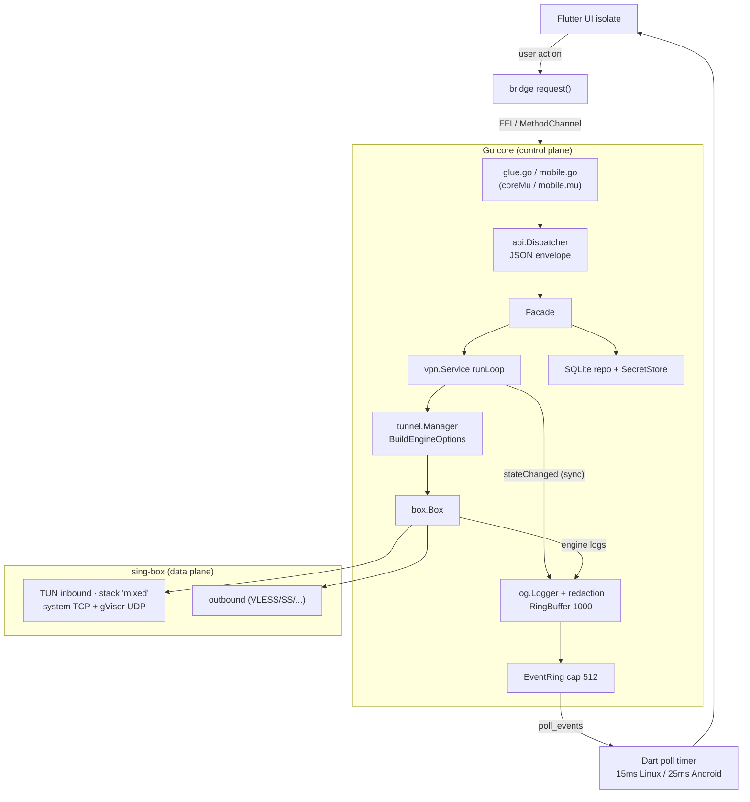

# PERFORMANCE.md

> Performance analysis of the OmniProxy stack (Android / Windows / Linux, Flutter UI + Go core + sing-box engine).
> Every claim below is either **verified in the repo** (cited as `file:line`) or flagged 🔶 as **external knowledge / to be measured**. No performance numbers have been measured yet — the repo contains **no benchmarks** (see §10). Read this doc before making performance-sensitive changes.

## 1. Purpose & scope

This document describes how performance is structured in OmniProxy today: where bytes flow, what runs on which thread, what every control-plane call costs in allocations, and where the realistic bottlenecks are. It is an **analysis**, not a measurement report.

Scope boundaries:

- **Data plane** — packet path through TUN → sing-box → outbound, and what OmniProxy adds to it (nothing at runtime; engine does all of it).
- **Control plane** — every bridge request (JSON encode/decode, FFI/JNI copies, serialized dispatch).
- **Observability** — event ring + log ring (poll-not-push) and the latency added to state notifications.
- **Storage / config** — SQLite and encrypted config file, hit only at CRUD/startup, never per-packet.
- **Android specifics** — gomobile JNI, 25 ms poller, thread-per-request, foreground-service notification behavior.

Explicitly **out of scope** in the MVP: traffic statistics (counters exist but are always 0, `core/models/session.go:63-64`), advanced routing, tunnel chaining, per-second UI updates.

The single most important finding of this review: **the repo has no benchmark suite and no measured performance data.** §10 lists the tests that exist (functional only) and proposes what to add.

## 2. Performance architecture overview

OmniProxy is split into three planes:

| Plane | Code | Where it runs | Cadence |
|---|---|---|---|
| Data plane | sing-box (`engine/`) | engine goroutines, kernel TCP + gVisor UDP | per packet |
| Control plane | `core/` + bridge | one serialized path (mutex) | per user action / connect |
| Observability | `core/log` + `core/internal/ring` + Dart pollers | publisher goroutine → pollers | per event / 15–25 ms poll |

The core design decision is **poll-not-push** for events: the Go core never calls into the host; the host polls an event ring on a timer. The rationale is documented in `core/glue/glue.go:19-31` — a push would deadlock the Dart isolate, which cannot service async callback channels while it is blocked inside a synchronous FFI call. All bridge transports implement this identically (`docs/api-contract.md`).

The control plane is **fully serialized**: Linux holds `coreMu` for every request (`core/glue/glue.go:104,116`), Android holds `mu` in `Mobile.request` (`core/mobile/mobile.go:183-190`). There is no concurrent dispatch and no `sync/atomic` anywhere in `core/` or `engine/` (verified by grep). This is a deliberate thread-safety simplification; it caps request throughput at what a single goroutine can do, which is irrelevant at human frequency but matters for batch operations (e.g. sweeping latency checks, §8).



## 3. Data plane

The data plane is **entirely sing-box**. OmniProxy's only job at connect time is to build a valid config and start the box; after that, packets never touch OmniProxy code.

- TUN inbound: interface `omniproxy`, MTU 1500, addresses `10.0.0.1/24` + `fd00::1/64`, `auto_route` (or `strict_route`), stack `mixed` (`engine/config.go:226-239`, defaults `:277-310`, `defaultStack = "mixed"` at `:144`).
- The `mixed` stack with the `with_gvisor` build tag (`Makefile:25` → `GOMOD_TAGS := with_gvisor`, used by `core/mobile/mobile.go:12-15`):

  - 🔶 Verified in sing-tun source (`stack_mixed.go:1` `//go:build with_gvisor`, `:50` gVisor UDP forwarder, `:234` `processIPv4TCP` → system TCP): **`mixed` = kernel/system TCP + gVisor UDP**, not "gVisor for everything". TCP packets are redirected by gVisor into a local TCP listener handled by the kernel socket stack; UDP (and other protocols) is reassembled in the gVisor userspace stack.
  - This **corrects `docs/NETWORK_FLOW.md:280-282`**, which states the mixed stack means packet handling runs in the gVisor userspace stack. In reality TCP payloads are serviced by the kernel; gVisor handles UDP.
  - gVisor's UDP channel endpoint is sized 1024 packets (`stack_mixed.go` `channel.New(1024, ...)`), and a dedicated `tunLoop`/`packetLoop` pair pumps packets.

- Consequence for real traffic:
  - TCP: kernel stack + socket NAT; the main per-packet costs are gVisor's header inspection and the forwarding between TUN fd and the NAT socket. 🔶 Kernel TCP is generally lower-latency than a userspace stack; this is the reason `mixed` is the recommended stack.
  - UDP: full userspace path — TUN fd read, gVisor reassembly, route, outbound. 🔶 Userspace packet processing costs CPU (syscalls + userspace copies) vs kernel processing; UDP throughput is the area to watch, not TCP.
  - 🔶 The `system` stack (no gVisor at all) exists for platforms/embeds where gVisor is unavailable; OmniProxy is pinned to `mixed`.
- DNS resolution happens inside sing-box's built-in DNS server configured at build time (`engine/config.go:442-496`); it does not round-trip through the control plane.
- Traffic statistics are explicitly **not** collected: `BytesUp`/`BytesDown` exist on `models.VPNSession` (`core/models/session.go:63-64`) but are never incremented, so the MVP avoids per-packet counter overhead at the cost of no stats.
- Engine log volume: sing-box logs (errors/info) flow through `engineLogSink` into the logger (§5). Packet-level logging is not enabled by default (`logLevel: 'info'`, `app/lib/core/bridge/bridge_linux.dart:49`).

Net: OmniProxy adds **zero runtime overhead to the data plane** in the MVP. All data-plane performance is sing-box/gVisor performance.

## 4. Control plane

Every user action crosses the bridge as a JSON request/response pair, fully serialized. The Linux path (`core/glue/glue.go:115-130` + `app/lib/core/bridge/bridge_linux.dart:86-120`):

1. Dart `jsonEncode(request)` → `toNativeUtf8()` (malloc + UTF-8 copy) for method and payload (`bridge_linux.dart:87-88`).
2. FFI `omniproxy_request` → `C.GoString(method)` and `[]byte(C.GoString(requestJSON))` — **two C→Go copies** of the payload (`glue.go:121-128`).
3. `facade.Dispatch` → `json.Unmarshal` the request into a typed struct (`core/api/dispatch.go:27-33`).
4. Handler executes; `json.Marshal` the typed response envelope (`dispatch.go:20`).
5. `string(...)` → `C.CString` (malloc + copy) → Dart `toDartString()` (copy) → `jsonDecode` (`glue.go:129,163`, `bridge_linux.dart:93-95`).
6. `omniproxy_free_string` → `C.free` (`glue.go:157-161`).

Per-call heap/copy cost (best-effort count, verified by reading the code; 🔶 exact alloc counts need a profile run):

| Step | Copy/allocation |
|---|---|
| Dart `jsonEncode` + `jsonDecode` | 2 JSON parses on Dart side |
| `toNativeUtf8` ×2 | 2 mallocs + UTF-8 encode copies |
| `C.GoString` ×2 + `[]byte(...)` | ~3 Go heap copies of the payload |
| `json.Unmarshal` / `json.Marshal` | 2 Go JSON passes (encode + decode) |
| `C.CString` + `toDartString` | 2 more copies (C malloc + Dart) |
| `free_string` | 1 `free` |

So a request carries the payload across the boundary ~3–5 times and is JSON-encoded/decoded twice on the Go side and twice on the Dart side. For a ~200-byte request this is microseconds and irrelevant at human frequency. If OmniProxy ever needs to push events at high rates through this path, the serialization (not the copying) is the ceiling.

Serialization type: dispatch is a plain `switch` on method name into typed structs (`dispatch.go:38+`); **no reflection** beyond `encoding/json`'s internal type caching, no codegen (no `easyjson`/`jsoniter`), no custom pools.

Which calls happen, and when (verified by grep of call sites):

- Startup: `getVersion`, `getSettings`, `getConnectionState`, `listServers`, `getLogs` (seeded once, `app/lib/state/providers.dart:141-148`).
- Connection state changes: **push only** — no polling of `getConnectionState`; the UI is driven by the event stream (`providers.dart:137`, `onEvent` at `:152-159`).
- Every server CRUD mutation: the mutation **plus a full `listServers` refetch** (`app/lib/state/providers.dart:67` `refresh`, invoked from `servers_screen.dart:251`).
- Every latency check: `testServerLatency` plus a `listServers` refetch (§8).

There is **no periodic control-plane traffic** while connected (no state polling, no server-list refresh). The only repeating work while the app is open is the event poller (§5) and, while connected, a purely-local 1 s `Timer` for the HH:MM:SS clock in the dashboard (`dashboard_screen.dart:412` — `setState` only, no bridge call).

**Single-isolate freeze (verified, significant):** `app/lib` contains **no `Isolate`/`compute` usage** (grep across `app/lib` returned nothing), so the synchronous FFI `request()` runs on the Flutter UI isolate. While a request is in flight the entire UI isolate blocks — including the 15 ms poll timer and the 1 s clock. For a connect that takes seconds (helper spawn + dial + sing-box start, up to ~30 s worst case) the dashboard freezes. The response still carries the final connection snapshot (`core/core.go:330-338` returns `ConnectionState()`), so state is never lost, but UI responsiveness during connect is a real, code-verified issue. Mitigation would be moving bridge calls onto a background Dart isolate; not done in the MVP.

## 5. Event delivery latency

Event path: publisher → `EventBus.Publish` → `facadeSink` (`core/core.go:407-419`) → `enqueueEvent` → ring (`core/glue/glue.go:143`) → host poll → JSON → Dart decode → stream → notifier → widget rebuild.

Ring mechanics (`core/internal/ring/ring.go`):

- Capacity 512, drop-oldest (`:21-26`, constants wired in `glue.go:47` and `mobile.go:44`).
- `Push` overflow drops the oldest by reallocating: `r.events = append([]api.Event(nil), r.events[len(r.events)-r.cap:]...)` (`:34`).
- `Drain` transfers the backing slice to the caller and nils the ring (`:39-44`) — poll is an ownership move, not a copy.

Poll cadence (verified):

- **Linux:** 15 ms `Timer.periodic` (`bridge_linux.dart:41,68`). Runs on the same isolate as requests, so it **freezes while a request is in flight**; events queue in the ring and flush in a burst when the request returns.
- **Android:** 25 ms handler on a dedicated `HandlerThread` (`Bridge.kt:31`, `EVENT_POLL_MS = 25L`, poll loop `:251-285`), then forwarded to the Dart main isolate via `MethodChannel` (`bridge_android.dart:18-19`). The poll thread is **independent of requests**.

Correcting a stale doc claim: `docs/NETWORK_FLOW.md:437` says "on Android the poll thread blocks on the same global mutex that `Mobile.request` holds". This is **false** — `Mobile.PollEvents` (`core/mobile/mobile.go:292-302`) drains the ring without taking `mu`; only `Request` (`:183-190`) holds it. Android polls continue during a connect; only Linux freezes, and that freeze comes from the Dart isolate, not the Go mutex.

Every poll, even an empty one, allocates and marshals: `glue.go:133-139` returns `cString("[]")` — a `C.CString` malloc — on the Linux path at 66 polls/s; Dart then does `toDartString()` + `jsonDecode("[]")` (`bridge_linux.dart:124-133`). Same on Android (JNI string round trip, 40 polls/s). This is the highest-frequency repeated allocation in the app; see §11.

Log events share the same ring: `logger` ring (cap 1000, `core/log/logger.go:78`) → EventBus → event ring. Heavy debug logging can evict older events, but `drop-oldest` semantics preserve the newest state events, which is the correct direction.

```mermaid
sequenceDiagram
    participant V as vpn.Service runLoop
    participant B as EventBus → facadeSink
    participant R as EventRing (cap 512)
    participant P as Poller (Dart/Android thread)
    participant U as Flutter UI
    Note over V,U: Normal case (both platforms)
    V->>B: publish stateChanged (sync, service.go:206)
    B->>R: Push (glue.go:143) — never blocks
    R->>P: poll drains at +0..15ms (Linux) / +0..25ms (Android)
    P->>U: JSON → stream → notifier → rebuild
    Note over V,U: Linux worst case: a long blocking request<br/>(e.g. connect) freezes the Dart isolate
    V->>B: stateChanged + logs during request
    B->>R: events queue (bounded 512, drop-oldest)
    Note over R: poll frozen; no drain while request runs
    P->>R: poll resumes after request returns → burst flush
    Note over V,U: Response also carries ConnectionState() snapshot,<br/>so final state is never lost (core.go:330-338)
```

Worst-case notification latency: ≤15 ms (Linux) / ≤25 ms (Android) jitter + FFI/Binder hop + decode — in the low tens of milliseconds during normal operation; on Linux, up to the full duration of a concurrent blocking request. No event is ever blocked in Go; the ring absorb bursts up to 512.

## 6. Memory & GC

All of the following is **verified from code**; absolute byte counts require a profile (§10) and are flagged accordingly.

- **Control-plane churn:** each request allocates on the order of 3–5 Go heap copies plus 2 JSON passes plus C-side mallocs (§4). At human frequency this is negligible; under a latency sweep (§8) it is the main allocator activity.
- **Event ring:** after `Drain` the backing array (up to 512 slots) is released to GC and the next `Push` re-grows from nil (`ring.go:39-44`). Each non-empty poll therefore allocates a fresh backing array plus `json.Marshal` output. Steady state with ~1 event per poll is one small array + one buffer per poll.
- **EventBus:** `Publish` snapshots the sink slice (`make([]EventSink, 0, len(s))`) on every event (`core/api/events.go:66-75`), and each `api.Event.Data any` boxes the payload struct onto the heap.
- **Logging (the real churn source):** every log line, at `info` and especially `debug`, runs the redaction regexp (`core/log/redactor.go`), builds a `LogEntry`, appends to the ring, snapshots sinks, and the console sink does a `json.Marshal` of the context (`core/log/logger.go:49`). Engine lines also cross `engineLogSink`. Under a noisy debug session this is the dominant allocation path; at `info` it is modest.
- **No `sync/atomic` and no shared-memory concurrency** anywhere in `core/`/`engine/` (verified by grep) — zero contention, but a single-threaded control plane by design.
- **gVisor:** its buffers/stack memory is internal to the engine and invisible to the Go core's heap (`channel.New(1024, ...)` fixed-size endpoint, §3). 🔶 gVisor UDP flows carry their own per-packet buffer refcounts.
- **SQLite:** `modernc.org/sqlite` is pure Go (no cgo), so page-cache memory is Go heap but only touched at CRUD time (§7).

The MVP's memory profile is dominated by logging and by the copy-heavy bridge path, not by the ring or the data plane.

## 7. Storage & config paths

SQLite is hit **only** at CRUD, server resolution during connect, and latency persistence — never per-packet, never per-event.

- `core/store/store.go`: `modernc.org/sqlite` in pure Go, **WAL**, `busy_timeout(5000)`, DSN assembled at `:26-27`. WAL gives concurrent readers; writes serialize.
- `core/store/server_repository.go`: `UpdateServer` re-writes the row and secret references (`:129`), `ListServers` builds dynamic SQL per list call (`:187-238`), secrets live only in `secret.Store` (OS-native secure storage), not in the row.
- Connect path: resolve → `GetServer` (one read) + secret-store reads → `BuildEngineOptions` (`core/tunnel/options.go:16-30`) → engine start. One small read per connect.
- Config engine (`core/config/engine.go`): settings load at init; changes go through `FileStore.Save` — temp file + rename + fsync (`:63-90`, `saveLocked` `:249-268`). Config writes happen only on user edits, not on connect/disconnect.
- Latency persistence: each `testServerLatency` does a `GetServer` + `UpdateServer` + secret-store write (`core/server/manager.go:137-157`) — one SQLite write + one secret-store write per latency test.
- `getLogs` is capped (default limit 200, max 500, `core/core.go:355-360`) so the storage/log path can't balloon.

Overall: storage adds negligible latency to the control plane. The one notable cost is the SQLite + secret-store write on **every** latency test (§8).

## 8. Latency checking

`core/tunnel/latency.go`:

- **TCP dial probe**: `DialContext` with `DefaultLatencyTimeout = 3s` (`:14`), measures time-to-dial, closes the connection immediately (`:33-47`), floors the result at 1 ms.
- The Facade wraps each test in a 10 s context (`core/core.go:318-327`), and the manager persists the result (`manager.go:137-157`, emitted as a `latencyTested` event).
- Tests are **serialized** by the transport mutex and the facade: one server at a time. A sweep of N servers costs up to N×3 s sequentially, with the UI isolate blocked per test on Linux (single-isolate freeze, §4) and a `listServers` refetch per test.

Caveat (verified in code): the probe measures only the TCP handshake. It never performs the proxy handshake or TLS/auth, so a server that accepts TCP but rejects the real protocol still "passes" with a low number. There is no parallel testing and no caching dedup (each tap on "test" re-runs the full sweep + persist).

## 9. Android-specific

- **Bridge transport:** gomobile (`core/mobile/mobile.go`) over `MethodChannel`s `com.omniproxy/bridge` and `com.omniproxy/events` (`app/lib/core/bridge/bridge_android.dart:18-19`). Events cross as Java `String`s via the method channel; each hop is a Binder/Parcel marshal. 🔶 Binder hops are typically tens of microseconds to low milliseconds — small versus the 25 ms poll, so the poll cadence dominates, not the Binder.
- **Poller:** dedicated `HandlerThread` at 25 ms (`Bridge.kt:31,251-285`), independent of requests (§5), which keeps events flowing during a long connect. 🔶 A `Looper`-based poll at 40 wakes/s is not a wakelock; as a foreground service the app is exempt from the strictest Doze suspension, so battery impact is minor but nonzero (40 JNI wakes/s).
- **Thread-per-request:** every bridge request spawns a fresh `Thread { ... }.start()` (`Bridge.kt:215,229`). At human frequency this is fine; under a latency sweep of many servers it pays thread-creation cost per test.
- **VpnService:** `startForegroundService` → `establish()` on a fresh thread → `setTunFd` (JNI) → `executeRequest("connect", ...)` (`VpnProxyService.kt`). The TUN fd is opened on the engine side via `OpenInterface` (`core/platform_fd.go`), and the tunnel's own sockets are `protect()`ed so they don't re-enter the TUN (`VpnProxyService.kt:47-50`, `engine/platform_fd.go`). Service is `START_STICKY`.
- **Notification:** built once with text `"Connecting…"` at `startForeground` (`VpnProxyService.kt:25-38`, `Notifications.kt:29-42`), channel `IMPORTANCE_LOW`, ongoing + `setOnlyAlertOnce` (`Notifications.kt:18-24,39-41`). There is **no later `notify()`** (verified by grep of all Kotlin files) — the notification text never updates to "Connected"/"Error". This is a correctness gap, but it also means zero per-second notification churn. Android's own persistent VPN banner is the always-on surface.
- **Interface monitoring:** no netlink on Android; the Kotlin layer reports the default interface (`engine/platform_monitor.go`, `Bridge.kt` `syncDefaultInterface`), avoiding netlink churn on that platform.

## 10. Benchmarks & measurements

**Honest status: there are none.** `rg "func Benchmark"` across `core/` and `engine/` returns nothing. The repo has no measured throughput, latency, or allocation numbers anywhere, and the only "budget" that exists — `docs/NETWORK_FLOW.md:410-421` — is explicitly marked 🔶 as an estimate (e.g. "10–100 µs/packet" for the TUN fd → gVisor step), not a measurement.

What *does* exist (functional tests, not benchmarks):

- `engine/engine_test.go` — `BuildEngineOptions` structural tests and a start/stop smoke test (`engine_test.go:435-464`).
- `engine/e2e_test.go:125-171` — pushes real traffic through a mixed inbound → SOCKS outbound → echo server, **asserting correctness only**, with no timing.
- Dart-side Linux E2E and Android integration tests — correctness with generous timeouts.

### Proposed benchmark suite (next steps)

1. **Go microbenchmarks** (should live in `core/`, run with `go test -bench`):
   - event ring `Push`/`Drain` at cap 512, including overflow eviction;
   - dispatcher request → response JSON envelope round-trip;
   - logger + redaction throughput at `info`/`debug`;
   - `BuildEngineOptions` config build;
   - `FileStore.Save` (temp+rename+fsync) and `UpdateServer` SQLite write;
   - latency probe dial (loopback).
2. **Data-plane benchmarks** (sing-box, via a Linux TUN): TCP and UDP throughput through the `mixed` stack (kernel TCP vs gVisor UDP), per outbound protocol, using iperf/`udp_test` style tools. This is where user-visible throughput actually lives (§3).
3. **Bridge microbench** (Dart): time `request()` round-trip (FFI + JSON) and per-poll cost, including the empty-poll path, to quantify §4/§5 numbers.
4. **E2E event latency**: instrument poll → `_eventsController` → notifier → rebuild with a stopwatch, at 15/25 ms cadences, and under a concurrent blocking request (Linux worst case, §5).
5. **Budget targets** (to be validated, 🔶): control-plane request < 5 ms p99 on a mid-range device; event notification < 50 ms from publish to rebuild in steady state; poll cadence dominates so this is mostly bounded by 15/25 ms + decode.

Until these exist, treat all magnitude claims in this document (and in `NETWORK_FLOW.md` §6) as analysis, not measurement.

## 11. Known bottlenecks

Ranked by expected real-world impact (analysis, not measured):

1. **Data plane = sing-box/gVisor.** OmniProxy adds nothing, so throughput is whatever the pinned sing-box `v1.13.15` + `mixed` stack deliver. Watch gVisor UDP forwarding (§3). 🔶 Expected to be the only place with meaningful byte-rate limits.
2. **Dart isolate freeze during blocking requests (Linux).** No background isolate exists (`app/lib` has zero `Isolate` usage); a multi-second connect blocks UI and the event poller (§4, §5). Highest-impact *architectural* item.
3. **Empty-poll churn.** 66/s (Linux) / 40/s (Android) polls each allocate a `"[]"` string across the boundary and JSON-decode it (§5). Small but the highest-frequency repeated cost; fixable by returning a null/static marker when the ring is empty.
4. **Per-request FFI/JSON copying.** ~3–5 payload copies + 4 JSON passes per request (§4). Irrelevant today; the ceiling if event volume grows.
5. **Serialized control plane.** No parallelism, no atomics (§2). Bounds latency sweeps to N×3 s (§8) and prevents concurrent probes.
6. **Latency probe quality.** TCP-dial only; no proxy-handshake/TLS check, so numbers can look good for broken servers (§8).
7. **SQLite + secret-store write per latency test** (§7, §8) and a full `listServers` refetch per mutation/test (§4).
8. **Android thread-per-request** (`Bridge.kt:215`) and notification never updated past "Connecting…" (`VpnProxyService.kt:25`, §9).
9. **Log volume vs ring capacity.** At `debug`, log lines share the event ring with state events; `drop-oldest` protects new state but old debug context is silently dropped (ring cap 512, `ring.go:34`). Fine at `info`, the default.

## 12. Related documents

- `docs/NETWORK_FLOW.md` — end-to-end byte path and its (🔶 estimated) latency budget table (§6); note the two corrections called out in §3 and §5.
- `docs/GO_RUNTIME.md` — goroutine/thread map of the core and the event bus.
- `docs/FLUTTER_GO_FFI.md` — FFI bridge mechanics and allocation behavior this doc builds on.
- `docs/SINGBOX.md` — engine integration, version pinning, TUN/stack configuration.
- `docs/ARCHITECTURE.md` — top-level layering (app / core / engine) and bridge purity.
- `docs/implementation-plan.md` — MVP scope gate (why stats/routing/chaining are absent).
- `docs/api-contract.md` — canonical bridge contract every transport implements.
- `docs/platform-notes.md` — per-platform TUN/privilege and native-glue constraints.
