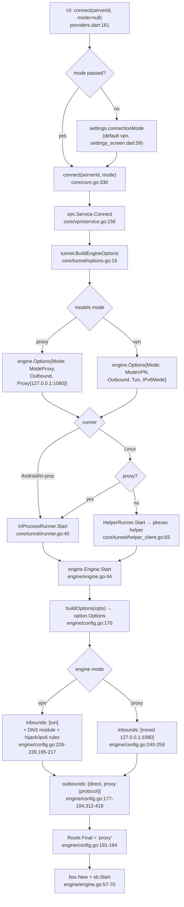
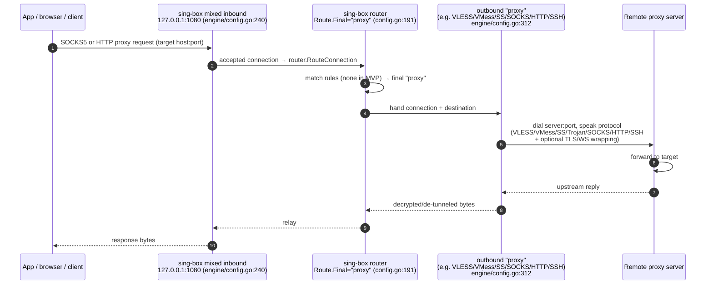

# OmniProxy — Proxy Server Architecture & Protocol Support

**Scope:** how OmniProxy models proxy *servers* (profiles), which proxy *protocols* it supports and how they map onto sing-box outbounds, and how the **proxy** connection mode works end-to-end. VPN/TUN mode is described only where it differs. **Source of truth:** `engine/registry.go` (what is actually wired) · **Companion:** `docs/api-contract.md`, `docs/platform-notes.md`, `docs/ARCHITECTURE.md`.

Every claim cites `file:line`. Protocol names are used exactly as they appear in code.

---

## 1. Purpose & scope

This document explains the proxy side of OmniProxy's three-layer stack (Flutter UI / Go core / pinned sing-box engine):

- The **protocol support matrix** — the exact set of proxy protocols and stream transports that are wired into the engine, and the sing-box types behind them.
- The **two connection modes** (`vpn` | `proxy`) — what changes in the generated sing-box config, and why `proxy` mode needs no privileges.
- The **`ServerProfile` → outbound mapping** — every profile field, where it is read, how it becomes sing-box JSON, and how secrets are resolved from OS secure storage.
- The **local proxy inbound** — the loopback endpoint clients connect to.
- **TLS / WebSocket transport** — the only stream transport wired, and the bypass options that exist.
- The **data path** through the mixed inbound → router → outbound.
- How the **UI** drives all of this, and what is deferred to Phase 2.

Out of scope (handled elsewhere): the Flutter↔Go bridge framing (`docs/FLUTTER_GO_FFI.md`, `docs/api-contract.md`), TUN/VPN plumbing and per-platform privilege model (`docs/platform-notes.md`), the connection state machine (`core/vpn/service.go`), and IPv6 handling (`docs/platform-notes.md` §IPv6).

**Ground rule (from `AGENTS.md` and `PRD.md`):** OmniProxy never implements a proxy protocol. All protocol/transport/TLS/DNS work is delegated to sing-box (`engine/registry.go:29-31`). The core and engine wrapper only *configure* sing-box; the visual UI builders and importers are the only way a `ServerProfile` ever exists, so sing-box JSON is never hand-edited.

---

## 2. Protocol support matrix

The single source of truth for what is wired is `newContext` in `engine/registry.go:31-56`, which builds a **minimal** sing-box context instead of `sing-box/include`. Only the types registered there can be instantiated by `box.New`; anything else fails at Start with `outbound type not found: <type>` (sing-box `adapter/outbound/registry.go:60`).

### 2.1 Registered inbounds (`engine/registry.go:38-39`)

| Inbound | sing-box type (`option.*`) | Registered | Used for |
|---|---|---|---|
| TUN | `tun` (`option.TunInboundOptions`) | yes (`registry.go:38`) | VPN mode |
| Mixed (SOCKS5+HTTP) | `mixed` (`option.HTTPMixedInboundOptions`) | yes (`registry.go:39`) | **proxy mode** |

Note what is *not* registered as an inbound: `http`, `socks`, `shadowsocks`, `vless`, `vmess`, `trojan`, `redirect`, `tunnel` etc. Inbound HTTP and inbound SOCKS are unnecessary because sing-box's `mixed` inbound serves **both** SOCKS5 and HTTP on one listener (`engine/config.go:250-259`).

### 2.2 Registered outbounds (`engine/registry.go:41-50`)

| Protocol (code name) | sing-box outbound type | Registered | Config builder | Wire format | Tested |
|---|---|---|---|---|---|
| VLESS (`vless`) | `vless` (`option.VLESSOutboundOptions`) | yes (`registry.go:42`) | `engine/config.go:315-332` | UUID, flow, packet encoding, TLS, transport | config-level (engine builder tests) |
| VMess (`vmess`) | `vmess` (`option.VMessOutboundOptions`) | yes (`registry.go:43`) | `engine/config.go:333-351` | UUID, security, padding, TLS, transport | config-level |
| Shadowsocks (`shadowsocks`) | `shadowsocks` (`option.ShadowsocksOutboundOptions`) | yes (`registry.go:44`) | `engine/config.go:363-372` | method (cipher) + password | config-level |
| **Trojan (`trojan`)** | `trojan` (`option.TrojanOutboundOptions`) | yes (`registry.go:49`) | `engine/config.go:352-362` | password, TLS, transport | config-level (engine builder tests) + registry start test (`engine/engine_test.go:497-516`) |
| SOCKS (`socks`) | `socks` (`option.SOCKSOutboundOptions`) | yes (`registry.go:45`) | `engine/config.go:373-383` | version 5, user/pass | **e2e** (`engine/e2e_test.go:125-171`, `app/test/e2e_linux_bridge_test.dart:87-103`) |
| HTTP proxy (`http`) | `http` (`option.HTTPOutboundOptions`) | yes (`registry.go:46`) | `engine/config.go:384-394` | user/pass, TLS | config-level |
| SSH tunnel (`ssh`) | `ssh` (`option.SSHOutboundOptions`) | yes (`registry.go:47`) | `engine/config.go:395-414` | user, password and/or private key, host key | config-level |
| Direct / Block | `direct` / `block` | yes (`registry.go:41,50`) | `engine/config.go:177-184, 517-519` | — | internal (used as route fallbacks / IPv6 block) |

The `models` layer names the SOCKS5 protocol `"socks5"` (`core/models/server.go:23`), while the engine's protocol enum names it `"socks"` (`engine/config.go:31`). The tunnel mapping reconciles them: `models.ProtocolSOCKS5 → engine.ProtocolSOCKS` (`core/tunnel/options.go:74-75`). Same wire enum for the UI: `ServerProtocol.socks5('socks5')` (`app/lib/core/models.dart:109`).

### 2.3 Trojan registration (fixed)

- `models` supports it: `ProtocolTrojan` in `SupportedProtocols` (`core/models/server.go:23, 30-38`), validation requires a password (`core/models/server.go:179-182`).
- The config builder renders it: `engine/config.go:352-362` emits `Type: C.TypeTrojan` with password/TLS/transport.
- Share-link import parses `trojan://` (`core/server/links.go:216` test case; contract `docs/api-contract.md:26, 149`).
- The registry registers it: `engine/registry.go` imports `protocol/trojan` and registers `C.TypeTrojan` (`registry.go:49`), so `box.New`/`sb.Start` accepts a Trojan outbound.

History: M9 added `ProtocolTrojan` to the model and the config builder (`docs/implementation-plan.md:99`) but the outbound was **not** registered, so a Trojan profile failed at engine start with `outbound type not found: trojan` (upstream `adapter/outbound/registry.go:62`). Fixed by registering `C.TypeTrojan` in `engine/registry.go`; guarded by `TestEngineStartTrojan` (`engine/engine_test.go:497-516`), which reproduces the failure without the registration.

### 2.4 Stream transports (registered implicitly via outbound constructors)

Transport support is not a registry entry — the V2Ray transport lives *inside* the VLESS/VMess/Trojan outbound constructors. OmniProxy wires **only WebSocket**:

| Transport | Code name | Wired | Builder | Notes |
|---|---|---|---|---|
| Plain TCP | `TransportTCP` (`""`) | yes (default) | `engine/config.go:560-563` | empty value means no `transport` block |
| WebSocket | `TransportWS` (`"ws"`) | yes | `engine/config.go:564-577` | path, Host header, maxEarlyData, earlyDataHeaderName |
| gRPC / HTTPUpgrade / QUIC / H2 | — | **no** | — | rejected at import (`core/server/links.go:419-420`); parser seams only (`engine/config.go:46` comment) |

### 2.5 What sing-box supports but OmniProxy deliberately does not register

The sing-box module ships many more protocols (`protocol/` directory: `hysteria`, `hysteria2`, `tuic`, `wireguard`, `tor`, `shadowtls`, `anytls`, `naive`, `shadowsocksr`, `tailscale`, `dns`, `group`, `redirect`, …). OmniProxy registers a subset by design (`engine/registry.go:29-31`): *"keeps the module lean compared to sing-box/include"* and keeps the attack surface auditable. Specific non-registrations and why:

- **Outbound groups (`url-test` / `selector` / `loadbalance`)** — not registered. They are the sing-box mechanism for automatic server selection/fallback, which is Phase 2 (routing/tunnel chains). Phase 1 is strictly one server at a time (`core/tunnel/manager.go:16-18`, `docs/implementation-plan.md:109-113`). Latency testing is therefore a core TCP dial, not a group `url-test` — `adapter.Outbound` has no `Delay()` in v1.13.15 (`docs/implementation-plan.md:33`; `core/tunnel/latency.go`).
- **VLESS Reality** — not registered, and rejected at the model layer: `RealityConfig` fields are stored for forward compatibility, but `Validate` rejects `Reality.Enabled == true` (`core/models/server.go:80-85, 201-203`); share links with `security=reality` are rejected (`core/server/links.go:139-140, 175-176, 227-228`). Reality needs the `v2ray` real-reality protocol wiring and is explicitly Phase 2 (`docs/api-contract.md:60-65`).
- **Other DNS transports (DoH/DoT/DoQ/TCP)** — only `local` and `UDP` are registered (`engine/registry.go:52-53`); VPN mode uses plain UDP DNS servers (`engine/config.go:442-496`).
- **All other outbound/inbound types** (Hysteria, WireGuard, Tor, etc.) — no product requirement in Phase 1; adding one is a registry line + a profile field, not a protocol reimplementation (the `SupportedProtocols` list is explicitly extensible: `core/models/server.go:28-29`).

---

## 3. Proxy mode vs VPN mode

The mode is a **single enum**, threaded from the UI all the way to the inbound builder. It changes exactly two things in the generated sing-box config: the **inbound** (and, for VPN, the DNS/route additions). The outbound chain is identical in both modes.

Mode definitions:
- `models.ConnectionMode` — `"vpn"` | `"proxy"` (`core/models/session.go:19-41`). Default is `vpn` in `AppSettings` (`core/models/settings.go:96`, `app/lib/core/models.dart:588`).
- `engine.Mode` — `ModeVPN`/`ModeProxy` (`engine/config.go:14-20`), with the rationale inline: VPN needs a privileged TUN, proxy needs nothing.

Mode flow:

1. **UI.** The Settings screen persists the *default* mode (`app/lib/features/settings/settings_screen.dart:59-91`). The dashboard connects via the connection provider, which passes `mode ?? settings.connectionMode` (`app/lib/state/providers.dart:161-165`). `connect` sends `{serverId, mode}` (`core/api/contract.go:170-173`).
2. **Core.** `Facade.Connect` defaults an empty mode from persisted settings (`core/core.go:330-337`); the VPN service `Connect` validates and runs the loop (`core/vpn/service.go:156-210`).
3. **Tunnel.** `BuildEngineOptions` maps the mode (`core/tunnel/options.go:23-28`) and hands `engine.Options` to the runner (`core/tunnel/manager.go:62-78`).
4. **Engine.** `buildOptions` selects the inbound and, for VPN only, the DNS module and route rules (`engine/config.go:170-262`). `Engine.Start` builds the box and starts it (`engine/engine.go:44-73`).

### Config differences (`engine/config.go:226-260`)

| | VPN mode | Proxy mode |
|---|---|---|
| Inbound | `tun` (`TypeTun`, tag `"tun"`), interface `omniproxy`, MTU 1500, `10.0.0.1/24`+`fd00::1/64`, auto-route, `mixed` stack (`engine/config.go:228-239`, defaults `:139-153`) | `mixed` inbound (SOCKS5+HTTP), tag `"mixed"`, loopback `127.0.0.1:1080` default (`engine/config.go:240-259`, defaults `:140-141`) |
| DNS module | yes — `dns-proxy` (through tunnel) + `dns-local` (direct bootstrap) + `hijack-dns` rule + `AutoDetectInterface` (`engine/config.go:195-217, 436-496`) | **none** — no DNS module, no route rules |
| Route | `Final: "proxy"`, plus IPv6/`block` rules in `disable_ipv6` (`engine/config.go:191-210`) | `Final: "proxy"` only (`engine/config.go:191-194`) |
| Privilege | TUN setup + routing need CAP_NET_ADMIN in the engine process (`docs/platform-notes.md:62-66`) | none (`docs/platform-notes.md:67, 88`) |
| Runner (Linux) | privileged `omniproxy-helper` via pkexec hosts the engine over a Unix socket (`core/tunnel/helper_client.go:83-96`) | **in-process** `InProcessRunner` (`core/tunnel/helper_client.go:84-86`) |
| Platform hook | Android `FdTunPlatform` feeds the VpnService fd (`engine/platform_fd.go:16-33, 167-190`); elsewhere `noopPlatform` (`engine/platform.go:18-52`) | never exercised — the mixed inbound is an ordinary loopback listener; no platform hook needed |

**Why proxy mode needs no privileges:** it opens a plain TCP listener on loopback and dials the upstream server as any process could. The VPN/TUN plumbing (privileged helper on Linux, `VpnService` on Android, Wintun on Windows) exists solely to capture and route whole-system traffic; a loopback proxy captures nothing by itself (`docs/platform-notes.md:67`, permission matrix `:82-89`).

**Why VPN mode has a DNS module but proxy mode does not:** TUN traffic is opaque to sing-box — client DNS queries would fall through to the proxy outbound as raw UDP and be answered by whatever resolver the remote forwards to, leaking DNS. So VPN mode adds a DNS module plus a hijack rule (`engine/config.go:195-217`). In proxy mode there is no opaque capture: the mixed inbound sees explicit SOCKS5/HTTP proxy requests whose destinations (often domains) are resolved by the *outbound* path, so no DNS module is needed.

### Mode → config → engine decision path



The same path runs identically in the privileged helper: the helper receives the finished `engine.Options` over the socket and never re-derives config (`core/tunnel/helperhost/helperhost.go:87-115`, `core/tunnel/helperproto/helperproto.go:12-19`). Note the helper can run proxy-mode configs too (`core/tunnel/helperhost_test.go:36`), but the core never asks it to — proxy mode always runs in-process (`core/tunnel/helper_client.go:84-86`).

---

## 4. `ServerProfile` → outbound config mapping

The mapping chain is: `ServerProfile` (`core/models/server.go:91-123`) → `engine.Outbound` via `core/tunnel/options.go:45-88` → sing-box `option.Outbound` via `engine/config.go:312-418`. The profile is cloned on Start so the caller's copy is never mutated (`core/tunnel/manager.go:62-78`).

### 4.1 Why the config engine exists

`PRD`/`AGENTS.md` product rule: *users never hand-edit JSON*; the visual routing/tunnel builders generate the sing-box config automatically. Concretely:

- The only way to produce a sing-box config is a `ServerProfile` from the UI form or importers (`core/server/links.go`), validated at the model layer (`core/models/server.go:155-205`).
- The core (`core/tunnel/options.go`) and engine (`engine/config.go`) are a single, shared builder. The privileged helper on Linux cannot invent config — it receives finished `engine.Options` (`core/tunnel/helperhost/helperhost.go:87-89`).
- Profile-level *structural* validation is deliberately loose in core — "deep protocol validation belongs to the engine, not the core" (`core/models/server.go:152-155`) — because sing-box's own option validator rejects invalid protocol fields at Start. `engine/config.go:264-275` only enforces essentials (valid mode, non-empty address/port).

### 4.2 Field-by-field mapping

Common fields:

| Profile field (`core/models/server.go`) | Where read | Engine field | Rendered in sing-box JSON |
|---|---|---|---|
| `Protocol` (`:94`) | `core/tunnel/options.go:62-86` | `engine.Outbound.Protocol` | selects the outbound `Type` in `buildOutbound` (`engine/config.go:314`) |
| `Address` (`:96`) / `Port` (`:97`) | `core/tunnel/options.go:47-48` | `Address`, `Port` | `option.ServerOptions{Server, ServerPort}` (`engine/config.go:313`) |
| `Username` (`:97`) | `options.go:49` | `Username` | SOCKS/HTTP `Username` (`config.go:380, 390`); SSH `User` (`config.go:398`) |
| `Password` (`:98`) | `options.go:50` | `Password` | SS `Password` (`config.go:370`), Trojan `Password` (`config.go:358`), SOCKS/HTTP `Password` (`config.go:381, 391`), SSH `Password` (`config.go:399`) |
| `Cipher` (`:99`) | `options.go:51` | `Cipher` | SS `Method` (`config.go:369`) |
| `UUID` (`:100`) | `options.go:52` | `UUID` | VLESS/VMess `UUID` (`config.go:326, 343`) |
| `Flow` (`:101`) | `options.go:53` | `Flow` | VLESS `Flow` (`config.go:327`) |
| `Security` (`:102`) | `options.go:54` | `Security` | VMess `Security` (`config.go:344`); default `"auto"` when empty (`config.go:334-337`) |
| `GlobalPadding` (`:106`) / `AuthenticatedLength` (`:108`) / `PacketEncoding` (`:109`) | `options.go:55-60` | same | VMess wire options (`config.go:345-347`); VLESS packet encoding (`config.go:316-320, 328`) |
| `TLS` (`:103`) | `options.go:65, 68, 73, 78` (`tlsIfEnabled`) | `TLS *TLSSettings` | via `tlsContainer` (see §6) |
| `SSH` (`:104`) | `options.go:80-85` | `SSH *SSHSettings` | SSH outbound private key/host key (`config.go:401-409`) |
| `Transport` (`:105`) | `options.go:57, 90-101` | `Transport *TransportSettings` | via `buildTransport` (see §6) |
| `Reality` (`:117`) | — | — | **not mapped**; `Enabled: true` is rejected at validate (`models/server.go:201-203`) |

Per-protocol routes through `buildOutbound` (`core/tunnel/options.go:62-86`):

- **VLESS** → `engine.ProtocolVLESS`, TLS mapped, transport mapped (`options.go:63-65`).
- **VMess** → `engine.ProtocolVMess`, TLS + transport mapped (`options.go:66-68`).
- **Shadowsocks** → `engine.ProtocolShadowsocks`; **no TLS, no transport** — SS takes cipher+password only (`options.go:69-71`; `config.go:363-372`).
- **Trojan** → `engine.ProtocolTrojan`, TLS + transport mapped (`options.go:72-73`); registered in the engine registry (`registry.go:49`, see §2.3).
- **SOCKS5** → `engine.ProtocolSOCKS` (name reconciliation `options.go:74-75`); username/password; **no TLS** (config builder offers none for SOCKS) (`config.go:373-383`).
- **HTTP** → `engine.ProtocolHTTP`; username/password + TLS mapped (`options.go:76-78`; `config.go:384-394`).
- **SSH** → `engine.ProtocolSSH`; `Username` is overwritten from `p.SSH.User`, and the SSH block carries the private key + pinned host key (`options.go:79-85`); password is already on `ob.Password` (`config.go:398-399`). Private key may be empty (password auth) — validation allows either (`models/server.go:187-189`).

### 4.3 How secrets are resolved (never plaintext, never in logs)

Credential fields (`Password`, `UUID`, `SSH.PrivateKey`) are the only secret-bearing fields. The structural guarantee:

1. **Storage.** The SQLite row never contains credential *values* — only secret *references*. `persist` first writes each present secret into `secret.Store` under `omniproxy.server.<id>.<ref>` (`core/store/server_repository.go:22-29, 241-264`) and then sanitizes the row (blanks `Password`/`UUID`/`SSH.PrivateKey`, `:248-249`). Refs present → `SecretRefsFor` (`:292-304`); missing secrets are not round-tripped.
2. **Read-back.** `restoreSecrets` refills the in-memory profile from the OS secure store; missing secrets are skipped (`core/store/server_repository.go:269-281`).
3. **Redaction.** Every restored secret is registered with the logger redactor so it can never appear in logs (`core/store/server_repository.go:283-287`; `core/config/engine.go:284`), and the engine→core log sink runs every engine line through that redactor before it reaches any sink (`core/tunnel/runner.go:53-60`).
4. **Secret store backends.** `secret.Store` interface (`core/secret/store.go:15-24`) implemented by go-keyring (Linux Secret Service, Windows Credential Manager/DPAPI — `core/secret/keyring.go:9-21`) and the Android Keystore bridge; `InMemory` for tests (`core/secret/store.go:28-74`). The at-rest settings blob is additionally AES-256-GCM-sealed under a data key held by the same store (`core/secret/crypto.go:12-53`; `core/config/engine.go:104-108`).
5. **Legacy migration.** `config.LoadLegacyServers` restores credentials from the store for pre-migration blobs before profiles enter the repository (`core/config/engine.go:124-163, 272-297`).

**Why secret refs rather than column-level encryption:** the repository is the single seam for future column-level encryption (`docs/implementation-plan.md:87`); externalizing values keeps secrets out of the DB file entirely (SQLite is not encrypted at rest in MVP), and the OS-native store is the PRD-mandated home for credentials (`docs/implementation-plan.md:104-107`).

---

## 5. The local proxy inbound

In proxy mode the generated sing-box config contains exactly one inbound (`engine/config.go:240-259`):

```go
o.Inbounds = []option.Inbound{{
    Type: C.TypeMixed,                 // "mixed" (SOCKS5 + HTTP on one listener)
    Tag:  "mixed",
    Options: &option.HTTPMixedInboundOptions{
        ListenOptions: option.ListenOptions{
            Listen:     &addr,         // default "127.0.0.1"
            ListenPort: port,          // default 1080
        },
    },
}}
```

Defaults: `defaultProxyListen = "127.0.0.1"`, `defaultProxyPort = 1080` (`engine/config.go:140-141`); `ProxyOptions` may override both (`engine/config.go:96-99`). In the MVP the defaults are what the E2E exercises: the Dart test drives a SOCKS5 client at `127.0.0.1:1080` (`app/test/e2e_linux_bridge_test.dart:97`).

**How clients connect:** any SOCKS5 or HTTP-proxy-aware client can dial `127.0.0.1:1080`. The mixed inbound speaks both protocols on the same socket, so a browser set to `http://127.0.0.1:1080` or a SOCKS5-capable app both work with no extra configuration. No auth is configured on the inbound (Phase 1); it binds loopback only, so exposure is limited to the local machine.

**Full system proxy or app-only?** **App-only.** Proxy mode opens a loopback listener; it does not create a TUN, does not install routes, and does not touch system DNS. Only apps explicitly configured to use the proxy send traffic through it. This is the defining tradeoff vs VPN mode: no privileges and no permission flow (`docs/platform-notes.md:16, 67, 88`), at the cost of no automatic system-wide capture. The permission matrix makes this explicit: `Connect (proxy mode) → none` on every platform (`docs/platform-notes.md:82-89`). On Android the local address/port is surfaced in the UI so the user can configure apps (`docs/platform-notes.md:16`). VPN mode is the default precisely because it is the "protect all traffic" mode (`core/models/settings.go:96`).

**Why `mixed` instead of separate `socks` + `http` inbounds:** one listener serves both protocols (`registry.go:39`), which keeps the config minimal and gives clients a single endpoint to remember. There is no requirement for separate ports in Phase 1.

---

## 6. Stream transports & TLS

### 6.1 WebSocket transport — how and why

WebSocket (WS) is the one stream transport wired in Phase 1. It exists because many VLESS/VMess/Trojan relays (especially CDN-fronted ones, e.g. the Nagwa-style host in the tests) front their protocol behind a WS `path`/`Host` so traffic looks like ordinary HTTPS websocket upgrades (`core/server/links_test.go:92`; `core/server/linkgen_test.go:91`). Only VLESS/VMess/Trojan accept a transport; the UI gates the transport section to those three (`app/lib/features/servers/server_edit_screen.dart:201-204`).

Mapping (`engine/config.go:560-578`): a non-nil `TransportSettings` with `Type == TransportWS` becomes

```go
option.V2RayTransportOptions{
    Type:  C.V2RayTransportTypeWebsocket,
    WebsocketOptions: { Path, MaxEarlyData, EarlyDataHeaderName, Headers: {Host} },
}
```

- `Path` → WS request path (e.g. `/vpnjantit`).
- `Host` → the WS `Host` header, rendered via `badoption.HTTPHeader` (`engine/config.go:569-573`) — this is what makes CDN fronting work.
- `MaxEarlyData` / `EarlyDataHeaderName` → WS early-data length and header name (e.g. `Sec-WebSocket-Protocol`) used for zero-RTT-ish first payloads (`config.go:564-568`; fields in `models` `TransportConfig` `core/models/server.go:51-57`).
- Any other non-empty transport type yields `nil` → plain TCP (`engine/config.go:560-563`); unrecognized transports are surfaced by the core validator, not here (`engine/config.go:556-560`).

At import, share links carrying `net=ws|websocket` map to `TransportWS`; `grpc|h2|http|httpupgrade|quic` are rejected per line with a clear error rather than silently degrading to TCP (`core/server/links.go:406-424`). `tlsFromFields` falls the SNI back to the WS host when no `sni` is present, matching Xray client behavior (`core/server/links.go:426-439`).

### 6.2 TLS

`tlsContainer` (`engine/config.go:420-434`) renders `OutboundTLSOptions{Enabled: true, ServerName, Insecure, ALPN, UTLS{fingerprint}}` for VLESS/VMess/Trojan/HTTP outbounds. Fields come from `TLSConfig` (`core/models/server.go:62-68`):

| Profile field | sing-box option | Notes |
|---|---|---|
| `tls.enabled` | `TLS.Enabled` | gating: `tlsIfEnabled` returns nil when disabled (`core/tunnel/options.go:103-113`) |
| `tls.serverName` | `TLS.ServerName` | SNI |
| `tls.alpn` | `TLS.ALPN` (list) | e.g. `h2`,`http/1.1` |
| `tls.fingerprint` | `TLS.UTLS.Fingerprint` | uTLS fingerprint (e.g. `"chrome"`) — M9 addition (`docs/implementation-plan.md:99`) |
| `tls.allowInsecure` | `TLS.Insecure` | **certificate-validation bypass** (see below) |

**Reality is not wired** (see §2.5) — no `security: reality`, and profiles with `reality.enabled` are rejected (`core/models/server.go:201-203`). The `RealityConfig` fields (`publicKey`, `shortId`, `spiderX`) are stored so Phase 2 wiring lands without a schema change (`core/models/server.go:78-85`).

### 6.3 Bypass options

- **`allowInsecure`** disables certificate validation (`tlsContainer` sets `Insecure`, `engine/config.go:427`). The model comment and contract require it to *never* be on in the default flow: "Certificate validation is on by default; bypass only in Advanced Mode with an explicit user-visible warning (Phase 2)" (`core/models/server.go:59-61`; `docs/api-contract.md:39-40`). In the current UI the toggle exists on the TLS section with a warning subtitle (`app/lib/features/servers/server_edit_screen.dart:458-466`) — Advanced Mode gating itself is Phase 2 (`app/lib/core/models.dart:591`; `docs/implementation-plan.md:107`).
- **Fingerprint** (`uTLS`) is *not* a bypass — it only fingerprints the TLS ClientHello to blend with a real browser; cert validation still runs.
- **Pinned SSH host key**: SSH has its own trust model — an optional pinned `hostKey` (`core/models/server.go:71-75`) is handed to the SSH outbound (`engine/config.go:406-408`).

---

## 7. Data path through the proxy

Everything between the mixed inbound and the outbound is sing-box's **router** (`Route.Final = "proxy"`, `engine/config.go:191-194`). The router sniffs/looks up the destination, applies route rules (none in proxy mode MVP beyond the final default), and hands the connection to the tagged `proxy` outbound. DNS resolution of domain destinations happens on the outbound side (the proxy protocols carry hostnames; there is no DNS module in proxy mode — §3).



Notes:

- **Where DNS happens:** proxy mode has no DNS module, so domain destinations are resolved when the outbound dials — over the real network by the outbound's own dialer, or by the remote server for SOCKS5 domain addresses (SOCKS5 CONNECT carries the hostname to the server; see the minimal test server parsing the domain form, `app/test/e2e_linux_bridge_test.dart:207-218`). This is fine because proxy mode only proxies what the client explicitly sends it — there is no whole-device traffic to leak.
- **Where routing happens:** the router (`sing-box/route`) sits between every inbound and every outbound; rules run only for `ModeVPN` in the MVP (`dnsHijackRule`, `blockIPv6Rule` — `engine/config.go:540-554, 525-538`). The `Final: "proxy"` tag is what binds the single inbound to the single upstream outbound.
- **The direct outbound** (`engine/config.go:177-182`) is always present but unused by proxy mode; in VPN mode it (and `AutoDetectInterface`, `config.go:216`) serves DNS-bootstrap and protect-path dials.

The E2E test exercises this exact chain: Dart SOCKS5 client → engine mixed inbound → router → SOCKS5 outbound → local SOCKS5 test server → echo target → reply back (`engine/e2e_test.go:125-171`; `app/test/e2e_linux_bridge_test.dart:87-103`).

---

## 8. How the UI drives this

- **Protocol selection.** The server form offers all seven protocols in a dropdown; the label strings are `VLESS`, `VMess`, `Shadowsocks`, `Trojan`, `SOCKS5`, `HTTP Proxy`, `SSH Tunnel` (`app/lib/features/servers/server_edit_screen.dart:115-123, 400-408`). The UI enum mirrors the wire strings exactly (`app/lib/core/models.dart:104-123`).
- **Protocol-specific fields** are conditionally shown (`server_edit_screen.dart:206-331`):
  - UUID for VLESS/VMess; Flow for VLESS; VMess Security dropdown (`auto|none|aes-128-gcm|chacha20-poly1305`) + Global padding + Packet encoding (UDP-over-WS).
  - Username/password for SOCKS5/HTTP/SSH; password for SS/Trojan; cipher for SS (default `aes-128-gcm`, `:56`).
  - SSH user + PEM private key for SSH.
- **Transport section** is visible only for VLESS/VMess/Trojan (`_usesTransport`, `:201-204`), offering TCP or WebSocket; WS reveals path + host fields (`:475-543`).
- **TLS section** (toggle + SNI + fingerprint + allow-insecure) applies to the encrypted protocols (`:411-471`).
- **Mode toggle.** Settings → Connection → default mode segmented button VPN/Proxy (`app/lib/features/settings/settings_screen.dart:59-91`), persisted as `AppSettings.connectionMode` and honored at connect time when the caller passes no mode (`core/core.go:330-337`). The dashboard shows a `VPN`/`Proxy` chip on the connected-server card (`app/lib/features/dashboard/dashboard_screen.dart:196-201`).
- **What's hidden in Advanced Mode:** `AppSettings.advancedModeEnabled` exists but is always `false` in the MVP (`app/lib/core/models.dart:591`; `docs/implementation-plan.md:107`); no UI surfaces it yet. Its Phase 2 purpose is gating the cert-bypass warning and the routing/tunnel builders (`core/models/server.go:59-61`; `docs/implementation-plan.md:19`).
- **Import/export** round-trips the same fields: the `.onnproxy` envelope carries the full `ServerProfile` (`docs/api-contract.md:74`), and native share links (`vless://`, `vmess://`, `ss://`, `trojan://`, `socks5://`, `http://`) map onto profiles via `core/server/links.go` — WS-based links included, grpc/reality rejected per line (`core/server/links.go:406-424`; `docs/api-contract.md:76-78`).

---

## 9. Phase 2 scope — seams already present

What Phase 2 will build, and what the code already anticipates:

| Phase 2 feature | Seam in the code today | Missing |
|---|---|---|
| **Routing manager / visual routing builders** | `Route` options + rule builders already exist and are exercised for VPN mode (`engine/config.go:195-217, 525-554`); rule-action-based sniffing is called out as the Phase 2 path (`docs/platform-notes.md:19`); the UI form already produces structured profiles | No user-facing rule model; `Route.Rules` is hard-coded |
| **Tunnel chaining** | `tunnel.Manager` is explicitly single-server with the chain seam noted in the package doc (`core/tunnel/manager.go:1-18`); `TunnelNode`/`TunnelChain` model slots are reserved (`docs/implementation-plan.md:111`); the engine outbound list is a slice, so a chain is just more outbounds + a route | No chain builder, no multi-outbound route |
| **Stats / monitoring** | `VPNSession.BytesUp/BytesDown` exist but are never populated in MVP (`core/models/session.go:57-67`; `docs/api-contract.md:89-90`) | No monitor; `bytesUp`/`bytesDown` stay 0 |
| **Server auto-selection / url-test** | — | Not registered (see §2.5); needs the `group` outbounds + engine wiring |
| **VLESS Reality** | `RealityConfig` schema + storage (`core/models/server.go:78-85`), rejected at validate/import (`:201-203`, `core/server/links.go:227-228`) | Reality protocol registration/wiring |
| **Advanced Mode (cert bypass gating, advanced settings)** | `AppSettings.AdvancedModeEnabled` stored (`core/models/settings.go:86`); allow-insecure flag exists in the model and builder (`engine/config.go:427`) | UI gating + warning dialog |
| **More stream transports (gRPC/HTTPUpgrade/QUIC)** | Parser seam: `TransportSettings` already rejects-but-describes them; `buildTransport` comment names them as seams (`engine/config.go:44-52`) | Builder cases + registration |

---

## 10. Limitations & known gaps

1. **Single server, no chaining** — `tunnel.Manager` is single-server (`core/tunnel/manager.go:16-18`); chains are Phase 2 (`docs/implementation-plan.md:109-113`).
3. **WS-only stream transport** — gRPC/HTTPUpgrade/QUIC/reality are rejected at import and not wired (`core/server/links.go:419-420`; §6.1).
4. **Proxy mode is app-only** — loopback `127.0.0.1:1080`, no TUN, no system DNS, no auto-capture (§5). Only apps explicitly pointed at the proxy benefit; clients must be configured per-app. On Android the address/port is surfaced in the UI (`docs/platform-notes.md:16`).
5. **Fixed proxy endpoint, no inbound auth** — the MVP hard-codes defaults and offers no user/password or ACL on the mixed inbound; the UI never configures the proxy listener (`engine/config.go:96-99, 240-259`). A local attacker process could in principle use the open loopback port.
6. **No DNS module in proxy mode** — domain resolution happens through the outbound/remote; there is no client-side DNS control or caching for proxied traffic (§7).
7. **`allowInsecure` is present but Advanced-Mode-gated only in Phase 2** — the toggle exists in the UI with a warning (`server_edit_screen.dart:458-466`), but the hard gate is not yet implemented (`docs/implementation-plan.md:107`).
8. **Socks/HTTP outbounds lack TLS** — the SOCKS outbound builder has no TLS container at all (`engine/config.go:373-383`); HTTP has one (`:388-393`) but a socks5-to-TLS endpoint is unsupported.
9. **No stats and no auto-connect behavior** — `bytesUp/Down` are always 0, and `autoConnect`/`startWithSystem` are stored but not acted on (`docs/api-contract.md:89-90, 104-107`).
10. **Shadowsocks cipher not enumerated** — validation requires a non-empty cipher but does not verify the method is sing-box-supported until Start (`core/models/server.go:172-178`); a typo surfaces as an engine error rather than a form error.

---

## 11. Related documents

- `docs/api-contract.md` — canonical bridge contract: modes (`:14`), `ServerProfile` schema (`:20-72`), `connect` mode default (`:152`), transports (`:173-201`).
- `docs/ARCHITECTURE.md` — system architecture; config-generation flow (`:320-351`), design decisions (`:392-415`).
- `docs/implementation-plan.md` — Phase 1 plan, decision table (`:21-35`), M9 WS/transport milestone (`:99`), Phase 2 seams (`:109-113`).
- `docs/platform-notes.md` — per-platform TUN/privileges, Android service model, IPv6 mapping, permission matrix (`:82-89`).
- `docs/FLUTTER.md` / `docs/FLUTTER_GO_FFI.md` / `docs/GO_RUNTIME.md` — the Flutter app structure, the bridge transport boundary, and Go runtime behavior.
- Referenced in repo prose but **not present on disk** (per `docs/ARCHITECTURE.md:428`): `docs/SINGBOX.md`, `docs/VPN_INTERNALS.md`, `docs/NETWORK_FLOW.md`, `docs/SECURITY.md`. Their living equivalents are this document, `docs/ARCHITECTURE.md`, and `docs/implementation-plan.md`.
- `PRD.md` / `AGENTS.md` — product source of truth and working rules (protocols never reimplemented; config auto-generated; credentials in OS secure storage).
