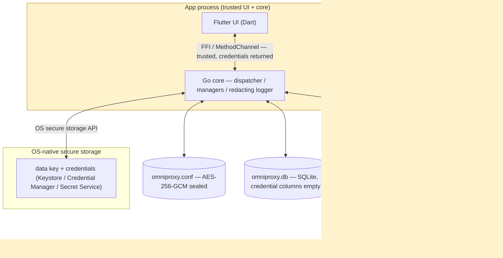
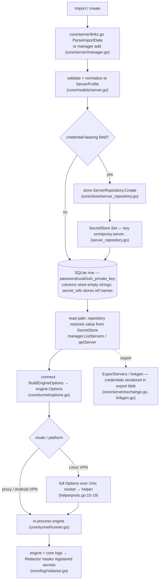

# Security Architecture

**Scope:** how OmniProxy stores, moves, and protects secrets and privileged operations on all three targets (Android, Windows, Linux), and where the remaining risk lives. Companion to `docs/LOW_LEVEL.md` §10–§11 (socket/privilege handling and the prioritized risk table), which this document expands end-to-end.

Every claim below cites the source line it was derived from. Where the engineering docs already document a risk, this document cross-references them instead of duplicating the analysis.

---

## 1. Purpose & scope

OmniProxy is a commercial VPN client: a Flutter UI over a Go core that embeds sing-box as the only networking engine (`docs/SINGBOX.md`, `AGENTS.md`). Security-sensitive areas are:

- Credential storage and at-rest encryption of persisted config.
- Key management in OS-native secure storage.
- Logging/redaction so secrets never reach logs or UI streams.
- TLS/certificate-validation defaults and the Advanced-Mode bypass path.
- The Linux privileged helper (`omniproxy-helper`, root via `pkexec`) that hosts the engine/TUN for VPN mode.
- The FFI/MethodChannel bridge and the Unix-socket control plane between the unprivileged core and the root helper.
- Import/export and share-link interchange, which can carry credentials.

Out of scope: transport protocol security (VLESS/VMess/SS/etc. are delegated to sing-box, `AGENTS.md`), and the TLS *wire* security of the tunnels themselves beyond what sing-box's options expose (`engine/config.go`).

## 2. Security principles → implementation map

Product requirements are `PRD.md:253-259` (§9 Security Requirements) and `PRD.md:311` (conservative defaults). Mapping:

| PRD rule | Implementation | Notes |
|---|---|---|
| Credentials in OS-native secure storage, never plaintext files | `core/secret/store.go` `Store` (Get/Set/Delete), `core/secret/keyring.go` (go-keyring → Android Keystore / Windows Credential Manager / Linux Secret Service), `app/android/app/src/main/kotlin/com/omniproxy/omniproxy/KeystoreSecretStore.kt` | In-memory fallback exists for test environments only. |
| Encrypt locally persisted sensitive config at rest | `core/config/engine.go` — settings blob sealed with AES-256-GCM (`core/secret/crypto.go:55-65`), persisted atomically at `0600` (`core/config/engine.go:63-89`) | See §5. |
| Sound key management | Data key `omniproxy.atrest.key` stored in the OS secure store (`core/secret/crypto.go:12-13`); per-platform: `KeystoreSecretStore.kt` (Android), go-keyring (`keyring.go`) | See §6. |
| Logs never contain credentials / keys / raw traffic | `core/log/redactor.go` masks registered secrets before any sink; `core/log/logger.go`; engine logs re-routed through the redacting core logger (`core/tunnel/runner.go` `engineLogSink`) | Exact-string, case-insensitive, min length 3; registration is **additive** (a union of every `Add` call); coverage is incomplete — see §7. |
| Cert validation on by default; bypass only in Advanced Mode with warning | Default `Insecure = false` (`app/lib/features/servers/server_edit_screen.dart:70`); toggle hidden behind an **Advanced Mode** opt-in and gated with an explicit warning dialog (`server_edit_screen.dart:333-354,458-466`; `settings_screen.dart:129-158`) | Done — see §8. |
| Identical feature set; platform limits surfaced, never silently degraded | Helper launch failure maps to `unauthorized` with actionable UI text (`docs/platform-notes.md:66`, `docs/api-contract.md:161`) | — |
| SQLite never stores credentials | `core/store/server_repository.go` — credential columns hold empty strings; refs live in `secret_refs`, values in SecretStore | See §5. |

## 3. Threat model

Actors:

- **Local same-user process.** On Android the Dart UI and Go core share one app process; on Linux/Windows the FFI link also shares the app process. Any code the app runs (including a compromised Flutter/dart side) can call any `api.Handler` method and read returned credentials — this is an explicit design decision (`docs/api-contract.md:15`: "the bridge is same-process and trusted").
- **Local unprivileged process of the same user (Linux).** Can attempt to reach the helper socket under `$XDG_RUNTIME_DIR/omniproxy` (`core/tunnel/helper_proto.go:25-35`).
- **Root / helper process (Linux VPN).** `pkexec`-spawned root binary that receives full engine options, including credentials, over the socket (`core/tunnel/helperproto/helperproto.go:15-19`).
- **Attacker with the app's data directory or the machine's storage.** Can read `omniproxy.conf` (sealed) and `omniproxy.db` (no credentials) — but not the OS secure store without the OS user's authentication.
- **Off-path network adversary.** Can observe engine traffic; tunnel encryption is delegated to sing-box outbounds.
- **On-path certificate attacker.** Subject to §8.

Assumptions (state explicitly):

1. The OS-native secure store is trusted and is the root of confidentiality for at-rest data.
2. The UI process is trusted and must be able to read credentials to populate edit forms (`docs/api-contract.md:15,30-55`).
3. sing-box's protocol implementations are trusted and not re-validated here (`AGENTS.md`).

Trust boundaries, in increasing trust:

1. **App process ⇄ OS secure storage.** Crosses only via the platform keyring/Keystore API. No plaintext persists here.
2. **App process ⇄ disk.** Sealed blob (`core/config/engine.go`), credential-free SQLite (`core/store/server_repository.go`).
3. **Unprivileged core ⇄ root helper (Linux VPN).** Crossed over a `0600` Unix socket owned by the invoking user; the helper `chown`s the socket to the pkexec caller and verifies the peer via `SO_PEERCRED` (§9). The boundary carries credentials in plaintext (documented) and the client pings the helper to detect hangs — §9 and §13.

## 4. Credential lifecycle

Where each credential (server password, VMess/VLESS UUID, Trojan/SS password, SOCKS5/HTTP password, SSH private key) is created, stored, read, and destroyed:

Notes:

- **At rest:** value lives only in the OS secure store; disk copy of the value never exists. The sealed `omniproxy.conf` holds settings, not server credentials (`core/config/engine.go:5`: "Server profiles are persisted by the store package (SQLite); the encrypted …" — the two stores are separate by design).
- **In motion:** crosses the API boundary in-process (`docs/api-contract.md:15`) and, on Linux VPN, crosses the Unix socket unencrypted (§9, `docs/LOW_LEVEL.md:315-319`).
- **Destruction:** values are deleted on server delete (`Store.Delete`), and the data key is rotated only when corrupt (§6). No key-rotation or value-expiry mechanism exists yet.

## 5. At-rest encryption

- **What is encrypted:** the settings document `configDoc{Version, Settings}` (`core/config/engine.go:104-108`) is sealed with `secret.Seal` before `FileStore.Save` (`core/config/engine.go:260`). Server profiles are *not* in this blob — they live in SQLite with credentials externalized to SecretStore (§4).
- **Algorithm:** AES-256-GCM with a fresh random 12-byte nonce per seal; output is `nonce||ciphertext` (`core/secret/crypto.go:55-65`).
- **Integrity:** GCM authenticates the ciphertext; failed auth returns `ErrCorrupt` ("data corrupt or key mismatch", `crypto.go:15-16,76-80`).
- **File discipline:** atomic write — temp file + `Sync` + `Rename`, mode `0600` (`core/config/engine.go:63-89`, noted in `docs/LOW_LEVEL.md:57`). Note: the parent directory fsync after rename is missing (TOCTOU, `docs/LOW_LEVEL.md:576`).
- **Recovery on corruption:** a sealed blob that fails to open is backed up to a `.bak` (`engine.go:233-235`) and replaced with defaults (`engine.go:242`) — fail-open for availability; the user's prior settings are recoverable only from the backup. Flagged as Med/Low in `docs/LOW_LEVEL.md:575`.
- **SQLite (`omniproxy.db`):** WAL-mode SQLite (`core/store/store.go`); credential columns hold empty strings by construction and `secret_refs` records ref names (`core/store/rows.go`, `core/store/server_repository.go`). No credentials on disk in the DB. (WAL/journal files are not separately encrypted but contain no secrets.)

## 6. Key management & platform secure storage

- **Key hierarchy:** one app-level symmetric data key, 32 bytes (`core/secret/crypto.go:18-25`), held under `omniproxy.atrest.key` in the OS store (`crypto.go:12-13`). It encrypts the settings blob. Server credentials are stored *directly* in the same OS store (not wrapped by the data key) via the `Store` interface (`core/secret/store.go`).
- **Creation / recovery:** `GetOrCreateDataKey` (`crypto.go:27-29`) creates and persists a new key when absent; an *invalid stored key is deleted and regenerated* (`crypto.go:45`), which orphans any data sealed under the old key (`docs/LOW_LEVEL.md:575`).
- **Android (`app/android/.../KeystoreSecretStore.kt`):** Android Keystore AES-GCM with a non-exportable key under `KEY_ALIAS`; ciphertext is stored in private `SharedPreferences`; `setUserAuthenticationRequired(false)` — the key is usable across device lock with no biometric/PIN gate (availability over strength; tradeoff documented in `docs/ANDROID.md`).
- **Windows / Linux desktop:** go-keyring wrapper (`core/secret/keyring.go`) → Windows Credential Manager and Linux Secret Service/libsecret. The Secret Service is on the synchronous save path and can stall the first key write (`docs/LOW_LEVEL.md:574`).
- **Fallback:** `InMemory` store exists purely for tests; production always gets a platform store (`core/core.go:83-89`).

## 7. Logging & redaction

- **Design:** `Redactor` (`core/log/redactor.go`) replaces registered secrets with `[REDACTED]` before any sink or subscriber sees the message (`redactor.go:9-17`). Registration is case-insensitive, skips secrets shorter than 3 chars to avoid mangling common words (`redactor.go:24-47`), and is **additive**: each `Add` folds new secrets into a master pattern so nothing registered earlier stops being masked (`redactor.go:25-47`, `compile` at `:60-70`). Re-registration on each `Get`/`List` is therefore harmless (`core/store/server_repository.go:283-287`).
- **Coverage:** only *explicitly registered* strings are masked; registration happens where credentials enter the system (server repository/manager). Known gaps: Reality keys, SSH host key, and WS Host/path are not registered — see `docs/LOW_LEVEL.md:569` (High).
- **Log pipeline:** core logs pass through the redacting logger (`core/log/logger.go`); engine (sing-box) logs are routed through the core logger via `engineLogSink` in `core/tunnel/runner.go`, and helper log lines arrive over the socket already destined for the redacting logger (`core/tunnel/helper_client.go:249-253`). `models/log.go` `LogEntry` is redacted upstream, so UI log screens never show raw secrets.
- **Contract rule:** `docs/api-contract.md:205` — "Never log request/response payloads containing credential fields."
- **Residual risk:** the *wire* between core and helper is not redacted (§9); and the `RingBuffer`/event ring is a UI-bound channel of already-redacted entries, so no second masking layer exists for safety.

## 8. TLS & certificate validation

- **Model:** `TLSSettings{ServerName, Insecure, ALPN, Fingerprint}` (`engine/config.go:54-59`), mapped to sing-box `tls` outbound options (`engine/config.go:420-431`). `Fingerprint` drives uTLS (`config.go:430-431`).
- **Default:** `Insecure` defaults to `false` in the UI (`app/lib/features/servers/server_edit_screen.dart:70`), and certificate validation is on unless the user flips the toggle.
- **Bypass path:** a SwitchListTile "Allow insecure certificates" in the TLS section (`server_edit_screen.dart:458-466`). PRD requires cert bypass only in Advanced Mode with an explicit user-visible warning (`PRD.md:311`, `AGENTS.md`). **Implemented:** the toggle is **locked when Advanced Mode is off** (subtitle "Requires Advanced Mode"), and enabling it in Advanced Mode shows a confirmation dialog spelling out the MITM risk before it takes effect (`server_edit_screen.dart:333-354`). Advanced Mode itself is an opt-in Settings toggle (`settings_screen.dart:129-158`).
- **ServerName:** derived from the profile's host; no automatic override. Reality is parsed in the model space but is not registered as a supported protocol (`engine/registry.go`; `docs/implementation-plan.md` M9 rejects reality links) — relevant because Reality keys would otherwise sit in the redaction gap (§7).

## 9. Privileged helper attack surface (Linux VPN mode)

The helper exists for exactly one reason: VPN mode needs `CAP_NET_ADMIN`, and the app process must not hold it (`docs/LINUX.md:14`). It is spawned via `pkexec omniproxy-helper --socket <path>` (`core/tunnel/helper_client.go:41-58`); authentication to root is delegated entirely to pkexec (`docs/LINUX.md:336`).

Socket setup (`core/tunnel/helperhost/helperhost.go:24-65`): `MkdirAll(dir, 0o700)` (25) → `os.Remove` (28) → `Listen` (29) → when spawned via pkexec, `chown` the socket + dir to the invoking user (`PKEXEC_UID`) (32-38) → `Chmod 0600` (41) → single `Accept` (44) → `SO_PEERCRED` check that the peer uid matches the invoker (48-52) → newline-delimited JSON loop (59-77); `quit` or EOF calls `StopEngine()` so no orphaned root-owned TUN survives (72-77; intent at 20-23). `Host` serializes engine state with a mutex and socket writes with a separate `wmu`, and double-checks `eng == nil` to reject a second tunnel mid-start (`helperhost.go:83-87,104-129`).

Client side (`core/tunnel/helper_client.go`): dial-first reuses a leftover helper from a previous run (175-180); timeouts are spawn 15 s / connect 30 s / disconnect 5 s (31-35); requests are seq-correlated through a `pending` map and `readLoop` fails all waiters on socket close (216, 291-311). A keepalive goroutine `ping`s the helper every 15 s (5 s timeout) and drops the connection when the helper stops answering, so a hung helper is detected within ~20 s instead of only at the next request (`helper_client.go:36-42,335-378`).

**Vulnerabilities / weaknesses (each already documented in `docs/LOW_LEVEL.md` §10–§11):**

1. **Resolved — socket-ownership wrinkle / no peer auth.** The helper now `chown`s the `0600` socket (and its parent dir) to the pkexec invoking user (`helperhost.go:32-38`, via `PKEXEC_UID`) and rejects any connecting peer whose uid differs (`SO_PEERCRED`, `helperhost.go:48-52`). Still *verify on a real pkexec run before release*. Residual: any **same-uid** process can connect — Unix socket auth cannot distinguish same-user processes without an additional token (§13.1).
2. **High — credentials cross the socket in plaintext.** `ClientMessage.Options` is the full `engine.Options` including password / UUID / SSH key (`helperproto.go:15-19`, `engine/config.go` outbound fields; `docs/LOW_LEVEL.md:315-319,568`). This is an explicit root-level trust boundary; nothing redacts the wire.
3. **Resolved — no keepalive ping.** The client pings every 15 s and drops the connection on a missed answer, so a hung helper surfaces within ~20 s (`helper_client.go:36-42,335-378`; `docs/LOW_LEVEL.md:570`).
4. **Med — helper death while connected isn't pushed to the UI state machine** (`docs/LOW_LEVEL.md:571`).
5. **Low — TOCTOU.** `Remove`-then-`Listen` and `Chmod` after `Listen` (a socket briefly exists with the process umask; a stale `Remove` could unlink a live socket of a previous helper) (`docs/LOW_LEVEL.md:309-314,576`). Parent dir is `0700` user-owned, limiting blast radius.
6. **Low — `/tmp` fallback.** If `XDG_RUNTIME_DIR` is unset the socket falls back to `/tmp/omniproxy/helper.sock` (`helper_proto.go:25-35`); the `0700` parent mitigates but the location is weaker (`docs/LOW_LEVEL.md:247-249`).
7. **Low — no polkit policy ships.** Every VPN connect re-prompts (`docs/LOW_LEVEL.md:577`).
8. **Info — silent parse errors.** Invalid JSON on the helper socket is silently `continue`d (`helperhost.go:46-50`); an unprivileged caller gets no error response. Combined with the no-authz gap above, this is a (low-value) probe surface.
9. **Test seam.** `OMNIPROXY_HELPER` (and a pre-set `helperPath`) spawn the helper *without* pkexec — fine for tests, but it is an environment-variable bypass present in the shipped binary (`core/tunnel/helper_client.go:41-58`; `docs/LOW_LEVEL.md:268-270`).

## 10. FFI / IPC surface

- **C ABI (`core/glue/glue.go`):** `omniproxy_init` / `omniproxy_request` / `omniproxy_poll_events` / `omniproxy_shutdown` / `omniproxy_free_string`. Events are *polled*, never pushed, because a native event callback deadlocks while the Dart isolate is blocked in a synchronous FFI request (`docs/implementation-plan.md` M6; `docs/FLUTTER_GO_FFI.md`). The event ring is bounded at 512 (`glue.go:44-47`, `mobile.go:42-44`).
- **ABI discipline risk:** a `C.CString` reply leaks if Dart drops the pointer without `omniproxy_free_string` (`glue.go:156-163`; `docs/LOW_LEVEL.md:572`). Not a confidentiality issue, but a memory-safety one.
- **gomobile / MethodChannel (Android):** the same contract, transported as a MethodChannel (`Bridge.kt`, channel `com.omniproxy/bridge`, events channel, 25 ms poll). `VpnService` TUN fd is handed into the core via `SetTunFd` → `FdTunPlatform` (`engine/platform_fd.go`; `core/mobile/mobile.go`). The `pendingConnect` ordering guarantees the fd is set before `connect`.
- **Same-process trust:** the bridge is pure transport; both ends are the same trust domain (`docs/api-contract.md:15`). Credential fields are returned to the UI by design; the security boundary is at-rest encryption + log redaction, not the bridge.
- **Loop protection:** the engine's own sockets are `protect`ed through `VpnService` on Android (`docs/SINGBOX.md:446,454`; `docs/platform-notes.md`) and bound to the auto-detected interface on Linux (`docs/LINUX.md`), preventing the tunnel from routing its own traffic in a loop.

## 11. Import/export & share links

- **Import (`core/server/links.go`):** accepts either an `onnproxy` envelope (strict validation of format/version, `core/server/exchange.go:100-144`) or multi-line native share links (`vmess://`, `vless://`, `ss://`, `trojan://`, `socks5://`, `http://`; unsupported schemes like reality/grpc are rejected per line — `docs/implementation-plan.md` M9). Imported profiles are re-keyed and forced enabled (`exchange.go:79-96`); credentials go through SecretStore as usual.
- **Export:** `ExportServers` serializes the full `ServerProfile` — **including credentials in plaintext** — into the export blob (`core/server/exchange.go`), and the `links` format puts passwords/UUIDs directly into the share URLs (`core/server/linkgen.go`). There is no encryption, password, or redaction on exports.
- **UI acknowledgement:** the export dialog explicitly warns: "Credentials are included — share it securely." (`servers_screen.dart:752-754`). The paste-import flow accepts share links (`servers_screen.dart:707`).
- **No share scheme:** there is no `onnproxy://` deep link — grep across `app/lib` finds no handler and `AndroidManifest.xml` has no intent-filter for it. Sharing is file-export or copy-paste only.
- **Risk:** an exported `.onnproxy` blob is a plaintext credential bundle; a leaked export compromises every server in it. The copy-on-clipboard of raw links (and the export dialog's `SelectableText`, `servers_screen.dart:764-768`) also puts plaintext credentials in the system clipboard.

## 12. Compliance & licensing

- sing-box is **GPL-3.0-or-later with a name/association restriction**; embedding it applies that license to the combined binary (`docs/SINGBOX.md:44,534-537`). OmniProxy is a **commercial** product (`PRD.md:12`) — **no decision is recorded** in this repo on how to comply; options include SagerNet's commercial licensing, or a GPLv3-compatible release posture, plus respecting the name-restriction clause (`docs/SINGBOX.md:534-546`).
- **This is an open decision that needs the user's confirmation. This document does not resolve it** (per repo rules: flag, don't decide).
- `engine/registry.go` also registers the `sing-box/experimental/clashapi` package (used solely as a log-observable hook; no `ExternalController` listener is configured). Experimental-package usage should be reviewed against the pinned `v1.13.15` version before release (`core/core.go:30`).

## 13. Recommended hardening (prioritized)

Ordered by impact. Items 1–3 are already the top rows of `docs/LOW_LEVEL.md:565-578`; reproduced here with the full end-to-end context.

| # | Severity | Action | References |
|---|---|---|---|
| 1 | ~~Crit~~ **Done** | ~~Resolve the socket-ownership wrinkle~~ — helper now `chown`s the socket to the pkexec caller and verifies the peer via `SO_PEERCRED`. Remaining: verify on a real pkexec run; a same-uid token if same-user processes must be distinguished. | helperhost.go:32-52; LINUX.md:448; LOW_LEVEL.md:567 |
| 2 | **High** | Stop sending credentials in the clear over the helper socket: encrypt `engine.Options` or send only SecretStore refs and let the helper fetch them. At minimum, document the boundary (done: §9.2). | helperproto.go:18; LOW_LEVEL.md:568 |
| 3 | **High** | Complete redaction coverage: register Reality keys, SSH host key, WS Host/path, and every credential-bearing field; add a per-protocol redaction test with a full profile round-trip. | redactor.go:25-47; LOW_LEVEL.md:569 |
| 4 | ~~High~~ **Done** | ~~Gate the "Allow insecure certificates" toggle behind Advanced Mode with an explicit opt-in warning~~ — toggle locked outside Advanced Mode; confirmation dialog on enable (`server_edit_screen.dart:333-354,458-466`). | PRD.md:311; server_edit_screen.dart:333-354 |
| 5 | **High** | Protect exports: support an optional password/encryption on `.onnproxy` exports, and warn before placing plaintext links on the clipboard. | exchange.go; linkgen.go; servers_screen.dart:752-768 |
| 6 | **Med** | ~~Add periodic `ping` keepalive~~ (done: `helper_client.go:36-42,335-378`). Remaining: push helper death into `vpn.Service` (auto-reconnect/`error`) — a socket close while connected still isn't surfaced to the UI state machine. | LOW_LEVEL.md:570-571 |
| 7 | **Med** | Preserve a corrupt data key as a backup before deleting/regenerating it; log the recovery. | crypto.go:39; engine.go:232-246; LOW_LEVEL.md:575 |
| 8 | **Med** | Timeout/retry the Secret Service Set to avoid blocking connect/save on a stalled D-Bus. | crypto.go:49; LOW_LEVEL.md:574 |
| 9 | **Low** | Fix socket TOCTOU: `fchmod` before `Listen`; confirm staleness before `Remove`; fsync the parent dir after `Rename`. | helperhost.go:28-34; LOW_LEVEL.md:576 |
| 10 | **Low** | Consider gating Android Keystore use behind user authentication (`setUserAuthenticationRequired(true)`) where the product can afford the UX cost. | KeystoreSecretStore.kt |
| 11 | **Low** | Ship a polkit policy so VPN connect doesn't re-prompt every time; add AppArmor/SELinux profiles allowing `/dev/net/tun`, netlink, and the runtime-dir socket. | LOW_LEVEL.md:577; LINUX.md:458 |
| 12 | **Decision** | Resolve the sing-box GPLv3 licensing question and record the decision. | SINGBOX.md:534-546 |

## 14. Related documents

- `docs/LOW_LEVEL.md` — §5 (socket & privilege handling), §9 (log redaction pipeline), §10–§11 (known gaps and the prioritized risk table).
- `docs/LINUX.md` — helper architecture, §5 (process deep-dive), §6 (socket protocol), §10 (known gaps; the socket-ownership item is resolved).
- `docs/SINGBOX.md` — engine embedding, §10 (known gaps incl. the GPLv3 open decision).
- `docs/VPN_INTERNALS.md` — TUN per platform, §8 (Linux helper), §10 (security/isolation).
- `docs/ANDROID.md`, `docs/WINDOWS.md` — platform layers and permission models (Keystore, Credential Manager/DPAPI, VpnService, Wintun).
- `docs/FLUTTER_GO_FFI.md` — Dart↔C memory/lifetime protocol and the poll-vs-push rationale.
- `docs/GO_RUNTIME.md` — concurrency spine, event ring, C-string leak audit.
- `docs/ARCHITECTURE.md`, `docs/NETWORK_FLOW.md`, `docs/PROXY_ARCHITECTURE.md` — system-level context for the data path.
- `docs/api-contract.md` — the canonical method/response contract; §1 (credentials in API responses), error codes (`:161`), logging rule (`:205`).
- `docs/platform-notes.md` — per-platform TUN/privileges; §Linux covers the pkexec-helper engine-hosting model.
- `PRD.md` §9 — the security requirements this document maps to.
