# Sequence Diagrams — OmniProxy Atlas

This document is one of three *atlas* diagrams that consolidate how OmniProxy actually
works end to end. It complements — it does not replace — the engineering docs:

- `docs/implementation-plan.md` — scope and milestones (this doc shows the MVP wiring).
- `docs/api-contract.md` — the canonical Flutter ↔ Go contract (method names and
  request/response schemas that every sequence here carries over the wire).
- `docs/FLOWCHARTS.md` — state machines and decision flows (decisions referenced here).
- `docs/CLASS_DIAGRAMS.md` — static structure of the participants used below.
- `docs/platform-notes.md` — per-platform constraints that shape these flows.

## Reading conventions

- Participants are numbered `[1] … [n]`; the number appears in the participant bar and
  is reused across diagrams so you can follow one role across many flows.
- Every diagram is anchored to the source that implements it (`path:line`). Line numbers
  point at the entry point named in the first message.
- Arrows: solid `->` = synchronous call / return, `->>` = async or cross-thread message,
  `-->>` = callback/event delivery.
- The "Why" paragraph after each diagram explains a design decision or tradeoff that the
  diagram makes visible. Where a decision is explained in another doc, it is referenced
  rather than repeated.

### Roles used across diagrams

| # | Role | Where |
|---|------|-------|
| 1 | UI shell (widgets) | `app/lib/app/app_root.dart` |
| 2 | Riverpod providers / notifiers | `app/lib/state/providers.dart` |
| 3 | `ApiClient` (bridge or mock) | `app/lib/core/api_client.dart`, `app/lib/core/client_factory.dart` |
| 4 | Bridge transport (platform) | `app/lib/core/bridge/bridge_linux.dart`, `bridge_android.dart` |
| 5 | Native glue (c-shared / gomobile) | `core/glue/glue.go`, `core/mobile/mobile.go` |
| 6 | Core `Facade` | `core/core.go` |
| 7 | Core sub-services | `core/vpn`, `core/server`, `core/tunnel`, `core/store`, `core/secret` |
| 8 | sing-box engine | `engine/engine.go` |
| 9 | Android host (Kotlin) | `app/android/.../omniproxy/*.kt` |

---

## 1. App startup — Linux (FFI transport)

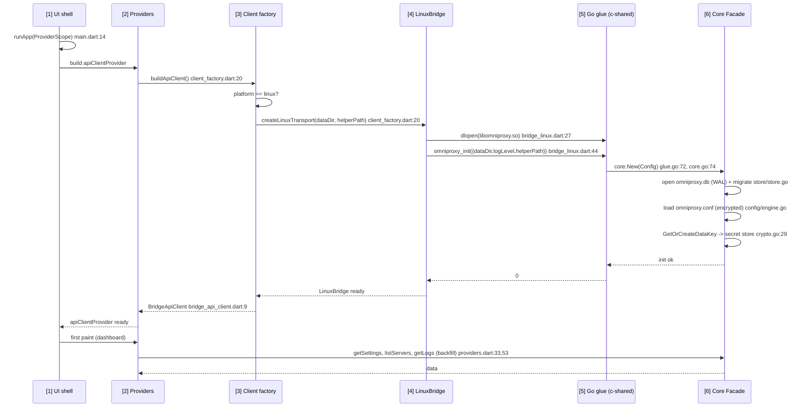

**Why.** The Dart side is pure transport: `client_factory.dart:12` picks a transport by
platform and nothing else (see `docs/FLOWCHARTS.md` § Client factory). Initialization is a
single synchronous C call so the isolate does not race the core; all later calls reuse the
same `Facade`. Data key creation is idempotent (`GetOrCreateDataKey`) so restarting the app
never rotates the at-rest key and existing ciphertext stays decryptable
(`core/secret/crypto.go:29`).

---

## 2. App startup — Android (MethodChannel transport)

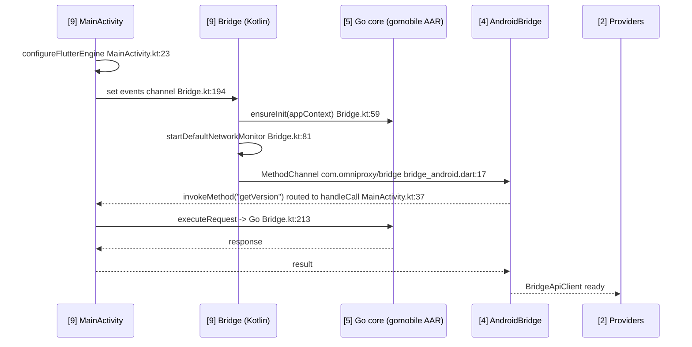

**Why.** On Android the Flutter engine owns the lifecycle, so the bridge is installed from
`configureFlutterEngine` rather than lazily. `Bridge` starts its own `HandlerThread` poller
(`Bridge.kt:251`) that drains Go events every 25 ms and forwards them over the events
channel — the same polled-event model as Linux, because Go cannot safely push into the
Flutter engine thread (see diagram § 6).

---

## 3. VPN connect — Android (consent + TUN fd)

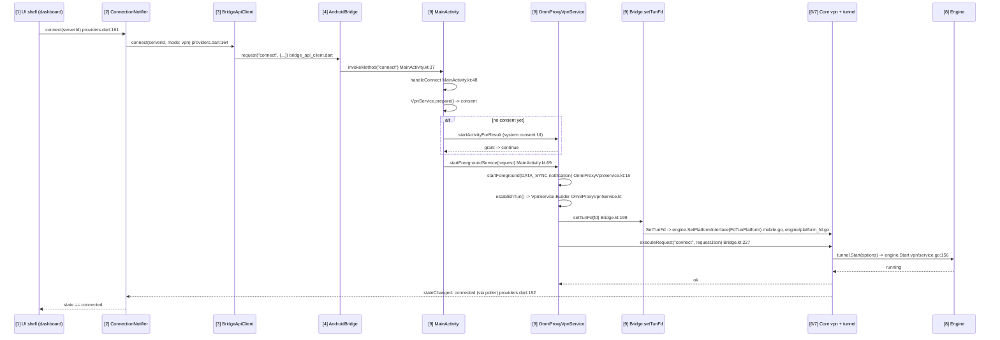

**Why.** The TUN device is created by Android's `VpnService`, not by sing-box: Android
forbids apps from creating raw TUN interfaces, and the system must approve the network via
the consent flow before any traffic can be routed. The file descriptor is handed to Go,
which feeds it to sing-box through `FdTunPlatform` (`engine/platform_fd.go:33`); the engine
never opens its own TUN on this path. The `VpnService` (foreground, persistent
non-dismissible notification per PRD §3.1) also hosts the core for the lifetime of the
tunnel so the tunnel survives screen lock.

---

## 4. VPN connect — Linux (privileged helper)

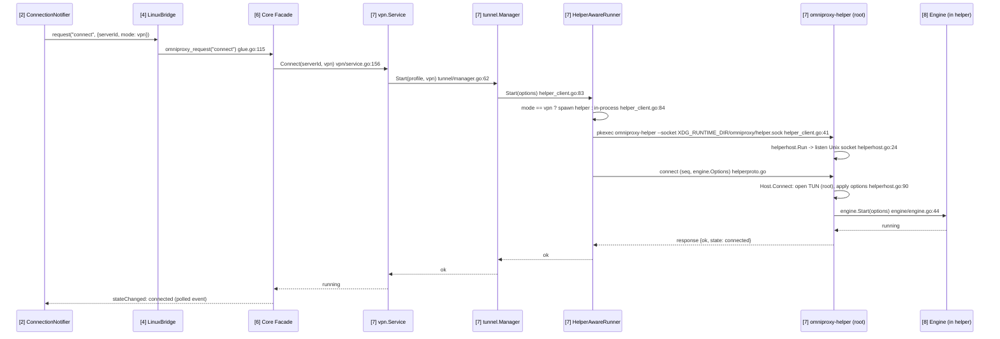

**Why.** Linux TUN creation plus auto-routing needs `CAP_NET_ADMIN`, so the engine runs
inside a short-lived root helper process instead of the app process (this split and its
rationale are specified in `docs/implementation-plan.md` § Linux privileges). The helper is
single-connection: one control socket, one tunnel, clean teardown on socket close or
`quit` so no orphaned root TUN survives a crash (`helperhost.go:146`). Timeouts: spawn 15s,
connect 30s, disconnect 5s (`helper_client.go`). Proxy mode never needs root and stays
in-process (diagram § 5).

---

## 5. Proxy-mode connect — in-process (no root, no helper)

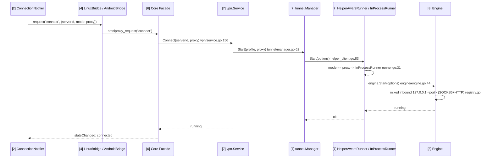

**Why.** Proxy mode exposes a local `mixed` inbound (SOCKS5 + HTTP on one port), so no
privileges, no `VpnService`, and no helper are needed. On Android this still requires a
foreground service to keep the engine alive in background — `VpnProxyService`
(`VpnProxyService.kt:14`), which starts the notification and stays `START_STICKY`. On
Windows this same in-process path is expected to run the engine inside the app
(`docs/platform-notes.md`).

---

## 6. Event delivery — publish to ring to UI

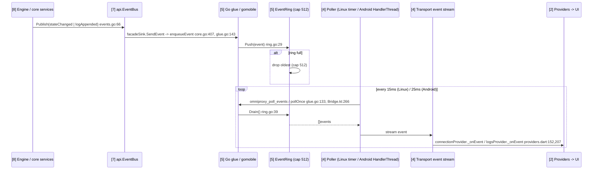

**Why.** Events are **polled, never pushed**. A native callback into Dart can deadlock when
the Flutter isolate is blocked inside a synchronous FFI call that happens to publish an
event — the callback cannot run until the call returns. Polling on a short timer keeps the
C ABI trivially serializable and makes both transports behave identically (Linux poll
every 15 ms, Android every 25 ms). The ring is deliberately small (512) and drops the
oldest on overflow rather than blocking a producer (see `docs/FLOWCHARTS.md` § Event ring).

---

## 7. Disconnect and shutdown

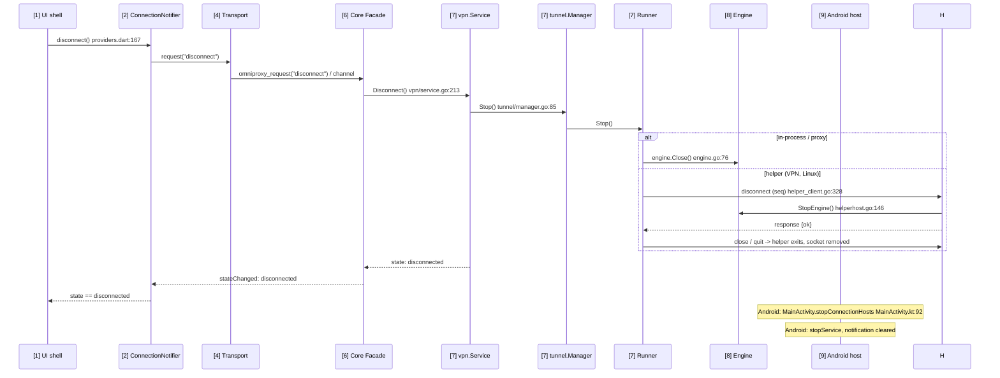

**Why.** Disconnect is a graceful two-phase: the state machine (diagram § 8 of
FLOWCHARTS) moves to `disconnected` only after the runner has fully stopped the engine. On
the helper path, teardown is symmetric to setup — the client sends `disconnect`, then
`quit`, and the helper exits, dropping the TUN. Android additionally tears down the
foreground hosts in `stopConnectionHosts` because the system service (not the core) owns
the process-level lifecycle.

---

## 8. Latency test

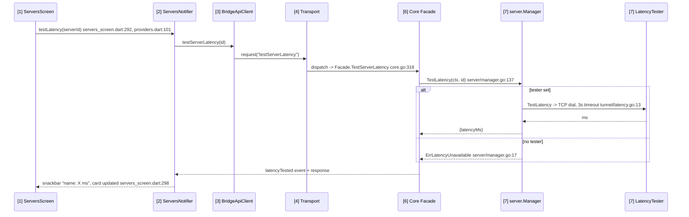

**Why.** Latency testing is an injectable `LatencyTester` (`server/manager.go:24`); the
production implementation is a plain TCP dial with a 3 s timeout (`tunnel/latency.go:13`),
not a sing-box url-test. When no tester is installed the manager reports
`ErrLatencyUnavailable`, which `Facade.MapError` maps to the `engine_error` code
(`core/core.go:178`) instead of silently returning 0 — surfaced in the UI, never silently
degraded.

---

## 9. Server save — CRUD + encrypted secret storage

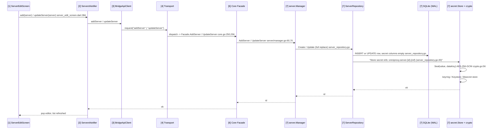

**Why.** Credentials never touch SQLite: the row stores empty strings for secret columns
and the real values live in OS-native secure storage keyed by
`omniproxy.server.<id>.<ref>` (`server_repository.go:20`), encrypted with the at-rest data
key (`crypto.go:56`). The Dart editor never round-trips secrets on edit — it sends the
profile and the core reconciles stored credentials by ref. On Android the store is
`KeystoreSecretStore` (AES-256 non-exportable key in Android Keystore, ciphertext in
private SharedPreferences) because a previous in-memory store silently corrupted stored
config on process restart (see `KeystoreSecretStore.kt`).

---

## 10. Import / export / share

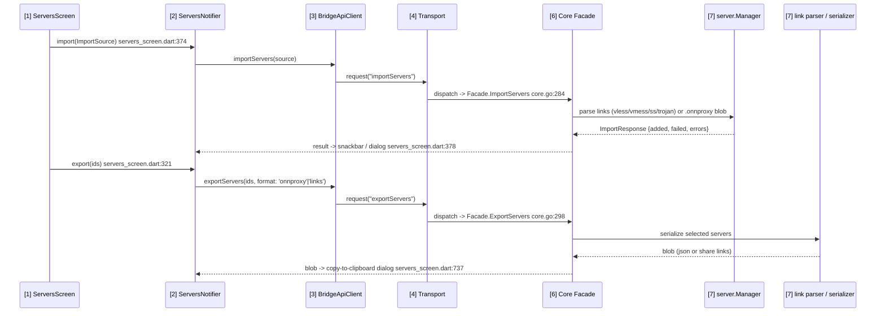

**Why.** Export/import is fully delegated to core so every platform produces byte-identical
output (shared `.onnproxy` config format — PRD rule). Share-link generation mirrors
`core/server/linkgen.go`; the Dart mirror in `app/lib/core/share_links.dart:11` exists only
so the **mock** transport's `exportServers(format: 'links')` output matches the real core —
the bridge path always delegates to core. `shareLinkFor` returns `null` for `ssh`
(no share-link representation), which is surfaced rather than faked.

---

## 11. Error / reconnect path

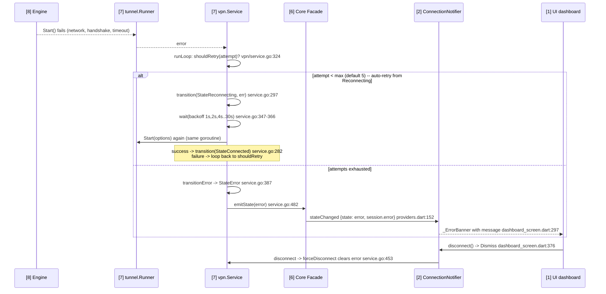

**Why.** Errors funnel through the same state machine as successful transitions so the UI
only ever reacts to `stateChanged` events (single source of truth). A failed `Start` with
retry budget left transitions straight to `StateReconnecting` and stays there across the
exponential backoff (`service.go:297`, default 1s..30s cap, 5 attempts — `DefaultRetryPolicy`
`service.go:46`) — it never emits `error` first; `StateError` is reached only when retries
are exhausted (`transitionError`, `service.go:387`). The retry is an in-loop loop, not a
re-entrant command, so a user-initiated `cmdDisconnect` during backoff cancels it cleanly
(`wait`, `service.go:347-366`). On Android, network changes are reported by the host's
`DefaultNetworkMonitor` (ConnectivityManager) into `FdTunPlatform`; sing-box re-evaluates
routes from there (`engine/platform_monitor.go`).
