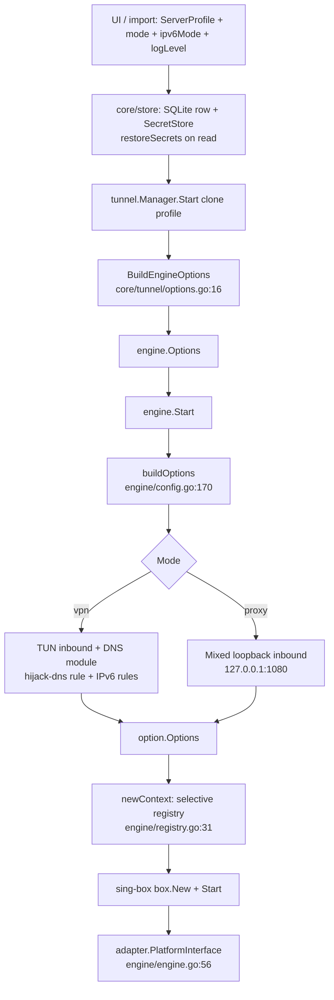

# sing-box Engine Integration

How OmniProxy embeds and drives `sing-box` (the networking engine). Covers the
`engine/` Go module (wrapper, config generation, selective registry, platform
adapter), routing/DNS behavior, version pinning, and the licensing question.

Companions: `docs/ARCHITECTURE.md` (§4.10), `docs/platform-notes.md`,
`docs/GO_RUNTIME.md`, `docs/api-contract.md`.

## 1. Purpose & scope

`engine/` is a thin Go wrapper around a pinned `sing-box` version. It is the
only place in the codebase that touches sing-box types; everything above it
(`core/` and the Flutter UI) deals with OmniProxy's own models and never with
sing-box JSON. This keeps the engine swappable (the project rule is "integrate
a proven engine, never reimplement protocols" — `PRD.md`, `AGENTS.md`).

Scope boundaries (Phase 1, per `docs/implementation-plan.md`):

- One inbound per run: either a TUN (VPN mode) or a loopback SOCKS5+HTTP
  "mixed" inbound (proxy mode). `engine/config.go:14-20`.
- One outbound per run (the single upstream server). No chaining, no
  selector/urltest groups — those are Phase 2 seams.
- Exactly the sing-box protocols OmniProxy needs are registered at runtime
  (`engine/registry.go`) — not the full set sing-box ships (`include/`).

## 2. Why embed sing-box

- **Never reimplement protocols.** VLESS, VMess, Shadowsocks, Trojan, SOCKS5,
  HTTP, SSH, TLS, and DNS are all sing-box features (`PRD.md`; `AGENTS.md`
  "Networking & VPN rules"). OmniProxy builds *configurations* and delegates
  all wire work to the engine.
- **One engine for all three inbounds/outbounds** across Android, Linux, and
  Windows — the same Go module, compiled natively per platform
  (`docs/implementation-plan.md:13`).
- **Embedded as a Go module, never shelled out.** No sing-box CLI binary, no
  separate process to babysit (except the privileged Linux helper that *hosts*
  the same embedded module — `docs/platform-notes.md:63`).
- **Control.** Embedding gives us: programmatic config (no user-facing JSON —
  `AGENTS.md` "Users never hand-edit JSON"), runtime logging through our own
  log sink (`engine/log.go`), platform hooks for Android TUN fd + protected
  sockets (`engine/platform_fd.go`), and a single process lifecycle owned by
  `core/tunnel`.
- **Cost.** Embedding means the GPLv3 license of sing-box applies to the
  linked product. See §10 (open decision — needs user confirmation).

## 3. Engine wrapper

`engine/` is a standalone Go module (`engine/go.mod`, `go 1.26.4`) in the same
`go.work` workspace as `core/`.

```
engine/
├── go.mod               # module omniproxy/engine; sing-box v1.13.15 pinned
├── engine.go            # Engine: New / Start / Close, single-instance guard
├── config.go            # typed Options -> sing-box option.Options (TUN | mixed)
├── registry.go          # minimal runtime protocol registrations
├── platform.go          # noop PlatformInterface (Linux/Windows proxy mode)
├── platform_fd.go       # //go:build linux || android — Android VpnService TUN fd
├── platform_monitor.go  # //go:build linux || android — passive default-interface monitor
├── tun_name.go          # //go:build linux || android — TUNGETIFF name ioctl
├── log.go               # Level + LogSink -> sing-box PlatformWriter
├── errors.go            # sentinel errors surfaced to core
├── engine_test.go       # config-generation unit tests
└── e2e_test.go          # proxy-mode E2E through a local SOCKS5 test server
```

### 3.1 `Engine` type and lifecycle

`engine.Engine` (engine/engine.go:13-20) wraps one `box.Box` at a time:

```go
type Engine struct {
    mu   sync.Mutex
    box  *box.Box
    logSink LogSink
    cancel context.CancelFunc
    platform adapter.PlatformInterface
}
```

Lifecycle contract (engine/engine.go):

1. `New(logSink)` — create the engine; nothing starts yet (engine.go:23-25).
2. `SetPlatformInterface(adapter.PlatformInterface)` — must be called *before*
   `Start`; on Android the `FdTunPlatform` is injected here by `core/mobile`
   via `PlatformSetter` (engine.go:29-33; core/tunnel/runner.go).
3. `Start(opts Options)` — build the sing-box `option.Options`, create the box
   with the selective-registry context, and call `box.Start`:
   - guarded by `e.mu`; returns `errAlreadyRunning` if a box already exists
     (engine.go:44-48);
   - calls `buildOptions` (engine/config.go:170) — the single point where
     typed options become sing-box options;
   - builds the runtime context with `newContext(ctx)` and injects the platform
     interface through `service.ContextWith` (engine.go:54-56);
   - `box.New(box.Options{..., Context, PlatformLogWriter})` (engine.go:57);
   - `sb.Start()` — this is where the TUN/mixed listener comes up and
     outbounds validate (engine.go:66); any failure cancels the context so no
     goroutines leak (engine.go:67-71).
4. `Close()` — idempotent `box.Close` + `cancel()`; safe to call after a
   failed start (engine.go:76-88).
5. `Running() bool` (engine.go:91-95).

### 3.2 Who owns the process

Two topologies, selected by `tunnel.Manager` at connect time
(`core/tunnel/helper_client.go`):

- **In-process (proxy mode everywhere; VPN mode on Android):** `Runner` wraps
  `engine.Engine` directly (`core/tunnel/runner.go` — `InProcessRunner`).
- **Linux VPN mode:** the unprivileged core cannot create a TUN or run
  `auto_route` (needs `CAP_NET_ADMIN` in the engine process —
  `docs/platform-notes.md:63-64`). A privileged helper binary (same workspace,
  same `engine` module) is launched via `pkexec` and hosts the full engine
  lifecycle; core is a JSON-over-Unix-socket client
  (`core/tunnel/helperhost/helperhost.go`; `docs/implementation-plan.md:26`).
  This is still "embedded sing-box" — the helper links the module; it is not
  the sing-box CLI.

```mermaid
sequenceDiagram
    autonumber
    participant UI as Flutter UI
    participant M as tunnel.Manager
    participant R as Runner
    participant E as engine.Engine
    participant B as sing-box box.Box
    participant H as helperhost (Linux VPN only)

    UI->>M: connect {serverId, mode}
    M->>M: clone profile; build engine.Options (manager.go, options.go)
    M->>R: Runner.Start(opts)
    alt proxy mode / Android VPN
        R->>E: InProcessRunner: eng.Start(opts) (core/tunnel/runner.go)
    else Linux VPN mode
        R->>H: connect {opts} over Unix socket (pkexec)
        H->>E: eng.Start(opts) (helperhost)
    end
    E->>E: validate mode/address/port (engine/config.go:264)
    E->>E: buildOptions -> option.Options (engine/config.go:170)
    E->>E: inject PlatformInterface (engine/engine.go:54-56)
    E->>B: box.New (engine/engine.go:57)
    B->>B: outbounds + DNS module + cache + log observable
    E->>B: box.Start (engine/engine.go:66)
    B-->>E: ok
    E-->>R: nil
    R-->>M: nil
    M-->>UI: stateChanged=Connected

    UI->>M: disconnect
    M->>R: Runner.Stop()
    R->>E: eng.Close() (engine/engine.go:76)
    E->>B: box.Close() (engine/engine.go:80)
    E->>E: cancel() (engine/engine.go:82-84)
    E-->>R: nil
```

### 3.3 Logging

`engine/log.go` maps sing-box levels 1:1 onto `Level` (a `LevelTrace..LevelPanic`
enum whose `String()` matches the config names sing-box expects) and exposes a
`LogSink` interface. `platformLogWriter` adapts a `LogSink` to sing-box's
`log.PlatformWriter` (engine/log.go). Two important couplings follow:

- `box.New` enables the **cache file** whenever `PlatformLogWriter != nil` even
  if the config sets none (`box.go:134`), and
- it enables the **clash API / log observable** whenever `PlatformLogWriter !=
  nil` even without `ExternalController` (`box.go:139`). The observable is what
  feeds our log sink; no listener is opened without an ExternalController.
  That is why `registry.go` imports `experimental/clashapi` for its side effect
  (see §5).

`core/tunnel/runner.go` adapts our `LogSink` onto `core/log` (leveled, redacted)
so sing-box lines reach the app Logs screen with credentials scrubbed
(`docs/platform-notes.md:10`).

### 3.4 Errors

Sentinel errors in `engine/errors.go`: `errAlreadyRunning`, `errEmptyServerAddress`,
`errEmptyServerPort`, `errInvalidMode`. Structural validation of a profile
(name/address/port/protocol-specific fields) happens earlier, in
`models.ServerProfile.Validate` (core/models/server.go:155-205); the engine
only checks what it needs to build a config (engine/config.go:264-275).

## 4. Config generation

### 4.1 The three layers

No hand-edited JSON anywhere. The pipeline is:

1. **UI / import** produces a `models.ServerProfile` (+ `ConnectionMode`,
   `IPv6Mode`, `LogLevel`). The profile carries protocol/transport/TLS fields;
   credential values (`Password`, `UUID`, `SSH.PrivateKey`) are *never* in the
   row — they live in OS secure storage (`SecretStore`) and are restored on
   read by the repository (`core/store/server_repository.go:266-276`).
2. **`tunnel.BuildEngineOptions`** (core/tunnel/options.go:16-30) maps the
   profile onto `engine.Options` (mode, outbound, IPv6 mode, log level, cache
   path). `buildOutbound` (options.go:45-88) and `tlsIfEnabled`/`transportIfEnabled`
   (options.go:90-113) translate every supported protocol/transport/TLS field,
   including the WS early-data options and uTLS fingerprint.
3. **`engine.buildOptions`** (engine/config.go:170-262) produces the sing-box
   `option.Options` struct — the true config. It is exercised directly by
   `engine_test.go` (`TestBuildProxyConfig`, `TestBuildVPNConfig`).

The "Config Engine" name in `core/config/engine.go` is the *settings* engine
(PRD §7.1) — it validates/persists `AppSettings` encrypted at rest
(AES-256-GCM under a data key in `SecretStore`), and one-time migrates legacy
profiles out of a pre-migration blob (core/config/engine.go:129-163). It does
**not** generate sing-box JSON; sing-box config is always produced from
`engine.Options` at Start time.



### 4.2 Common options

Every run produces (engine/config.go:177-194):

- `log.level` from `opts.LogLevel` (engine/log.go) with `timestamp: true`;
- two outbounds: `direct` (tag `direct`, empty `DirectOutboundOptions`) and the
  configured server (tag `proxy`);
- `route.final: "proxy"` — all traffic to the tunnel/mixed inbound goes to the
  server outbound;
- `experimental.cache_file` only when `CacheFilePath != ""` (engine/config.go:218-225).

### 4.3 Annotated example — VPN mode (VLESS + WebSocket)

Input: `ModeVPN`, `IPv6ModePreferIPv4`, VLESS+WS server, cache file enabled.
Result of `buildOptions` (engine/config.go) serialized as JSON:

```jsonc
{
  "log": { "level": "info", "timestamp": true },          // engine/config.go:186-189

  "inbounds": [                                            // ModeVPN branch, :226-239
    {
      "type": "tun",
      "tag": "tun",
      "interface_name": "omniproxy",                      // default, :232
      "mtu": 1500,                                         // default, :233
      "address": ["10.0.0.1/24", "fd00::1/64"],           // defaults, :302-310
      "auto_route": true,                                  // autoRoute(): true unless StrictRoute, :298-300
      "stack": "mixed",                                    // default; gvisor under the hood, :291-296
      "strict_route": false
    }
  ],

  "outbounds": [
    { "type": "direct", "tag": "direct" },                 // always first, :177-182
    {
      "type": "vless", "tag": "proxy",                     // ProtocolVLESS, :314-332
      "server": "edge.example.com",
      "server_port": 443,
      "uuid": "11111111-2222-3333-4444-555555555555",      // from SecretStore via repo
      "tls": {                                             // tlsContainer(), :420-434
        "enabled": true,
        "server_name": "edge.example.com",
        "alpn": ["h2", "http/1.1"],
        "utls": { "fingerprint": "chrome" }                // only when set, :430-432
      },
      "transport": {                                       // buildTransport(), :560-578
        "type": "ws",
        "path": "/vpnjantit",
        "headers": { "Host": ["edge.example.com"] }
      }
      // NOTE: "flow" is omitted here — xtls-rprx-vision requires a plain TCP
      // stream and would be rejected combined with ws by sing-box.
    }
  ],

  "route": {
    "final": "proxy",                                      // :191-193
    "auto_detect_interface": true,                         // VPN mode only, :216
    "rules": [
      { "protocol": ["dns"], "action": "hijack-dns" }      // dnsHijackRule(), :542-554
      // disable_ipv6 would append { "ip_version": 6, "action": "route", "outbound": "block" } :203-209
    ]
  },

  "dns": {                                                 // buildDNSOptions(), :442-496
    "servers": [
      { "type": "udp", "tag": "dns-proxy", "server": "8.8.8.8",
        "detour": "proxy" },                               // client queries via tunnel, :447-457
      { "type": "udp", "tag": "dns-local", "server": "223.5.5.5" }  // outbound-dialing only, :459-470
    ],
    "rules": [
      { "outbound": ["any"], "action": "route", "server": "dns-local" }  // :472-487
    ],
    "final": "dns-proxy",
    "strategy": "prefer_ipv4",                             // dnsStrategy(PreferIPv4), :502-513
    "independent_cache": true,
    "reverse_mapping": true                                // PTR answers for tunneled addrs, :489
  },

  "experimental": {
    "cache_file": { "enabled": true, "path": "/data/user/0/com.omniproxy/cache/cache.db" }  // :218-225
  }
}
```

**Why the DNS module exists at all (VPN mode only):** TUN traffic is opaque —
without a DNS module, client DNS queries would traverse the tunnel as raw UDP
and get answered by whatever resolver the server forwards them to
(engine/config.go:195-201). With it, queries are answered locally through the
tunnel and the domain cache keeps repeated lookups off the wire. The
`hijack-dns` route rule diverts port-53 traffic at the router to that module
(`dnsHijackRule`, engine/config.go:540-554).

**Why two DNS servers:** `dns-proxy` resolves client queries through the tunnel
(no DNS leak, sing-box `dns/client.go` semantics). But the *proxy server's own
hostname* must be resolved before the tunnel exists — resolving it through the
tunnel would loop. `dns-local` has no detour, so sing-box's empty-direct dialer
resolves it over the real network (engine/config.go:459-463).

**Why `auto_detect_interface`:** the engine's own sockets (the proxy-server
connection, the `dns-local` bootstrap) must not loop back into the TUN. On
Android the platform hook protects them via `VpnService.protect()`
(engine/config.go:211-216; §7).

### 4.4 Annotated example — proxy mode (same VLESS + WebSocket server)

Input: `ModeProxy` with defaults (`127.0.0.1:1080`). The *same server profile*
produces a much smaller config — no DNS module, no rules, no
`auto_detect_interface`, no cache file (engine/config.go:240-259):

```jsonc
{
  "log": { "level": "info", "timestamp": true },

  "inbounds": [                                            // ModeProxy branch, :240-259
    {
      "type": "mixed",                                     // SOCKS5 + HTTP on one port
      "tag": "mixed",
      "listen": "127.0.0.1",                               // defaults, :140-144
      "listen_port": 1080
    }
  ],

  "outbounds": [
    { "type": "direct", "tag": "direct" },
    { "type": "vless", "tag": "proxy", "server": "edge.example.com", "server_port": 443,
      "uuid": "11111111-2222-3333-4444-555555555555",
      "tls": { "enabled": true, "server_name": "edge.example.com" },
      "transport": { "type": "ws", "path": "/vpnjantit",
        "headers": { "Host": ["edge.example.com"] } }
    }
  ],

  "route": { "final": "proxy" }                            // nothing else, :191-193
}
```

The mixed inbound is how the OS/app dials: apps set a system proxy to
`127.0.0.1:1080` (Android proxy mode surfaces this address in the UI —
`docs/platform-notes.md:16`). The `e2e_test.go` drives exactly this shape: a
real SOCKS5 CONNECT through the mixed inbound → `proxy` outbound → local test
server → echo.

## 5. Selective registry

`newContext` (engine/registry.go:31-55) builds a sing-box runtime context
containing **only** the protocols OmniProxy uses, instead of
`sing-box/include`'s full set. Registered types:

| Kind | Types | Where |
|---|---|---|
| Inbound | `tun` (`TunInboundOptions`), `mixed` (`HTTPMixedInboundOptions`) | registry.go:38-39 |
| Outbound | `direct`, `vless`, `vmess`, `shadowsocks`, `socks`, `http`, `ssh`, `block` | registry.go:41-50 |
| DNS transport | `local`, `udp` | registry.go:52-53 |
| Services / endpoints | *(none)* | registry.go:34-36 |
| Experimental (side effect) | `clashapi` server constructor | registry.go:15 |

Notably **absent** vs. `include/registry.go` (which registers tun, redirect,
tproxy, direct, block, dns, socks, http, mixed, shadowsocks, vmess, trojan,
naive, wireguard, hysteria, tor, ssh, shadowtls, shadowsocksr, vless, tuic,
hysteria2, anytls, tailscale, groups selector/urltest, clashapi/v2rayapi, …):

- no **`trojan`** outbound — despite `ProtocolTrojan` being modeled and mapped
  (see §10);
- no selector/urltest **group outbounds** (chaining/auto-select are Phase 2);
- no `fakeip`, `tcp`, `tls`, `https`, `quic`, `hosts` DNS transports;
- no inbound types other than tun/mixed (no `http` inbound — the mixed inbound
  already covers SOCKS5+HTTP on the client side).

Why this matters for **correctness, not just size**: `registry.go` registers
the `tun` inbound and the outbounds, so a config referencing a type not
registered fails at `box.Start` with `outbound type not found: <type>`
(sing-box `adapter/outbound/registry.go:62`) — an explicit, early failure
rather than a silent misbuild.

Why the `clashapi` import is there: `box.New` enables the log observable when
`PlatformLogWriter != nil` (`box.go:139`), which requires the clash-server
constructor to be registered. The comment at registry.go:15 spells this out:
*"registers the clash server (log observable); no listener without
ExternalController"* — OmniProxy never opens the Clash REST API.

## 6. Routing & DNS

- **Default route:** `final: "proxy"` always (engine/config.go:191-193). There
  are no domain/IP/geosite rules in Phase 1; the routing builder is a Phase 2
  feature (`AGENTS.md`; `docs/implementation-plan.md:19`).
- **`hijack-dns` rule** (VPN mode): any `protocol: dns` packet is diverted to
  the DNS module (`dnsHijackRule`, engine/config.go:542-554) using
  `RuleActionTypeHijackDNS` (`constant/rule.go`).
- **DNS client behavior** (engine/config.go:442-496):
  - client queries → `dns-proxy` (via the tunnel, `detour: proxy`);
  - outbound dialing → `dns-local` (empty-direct dialer, no loop);
  - `reverse_mapping: true` so PTR lookups for tunneled addresses resolve;
  - `independent_cache: true` keeps client vs. outbound caches apart.
- **IPv6 handling** is decided entirely in `engine/config.go`
  (`IPv6Mode`, :117-127; `dnsStrategy`, :502-513; `blockIPv6Rule`, :525-538)
  and is therefore identical on every platform
  (`docs/platform-notes.md:26-60`):

| Mode | DNS strategy | Route rules |
|---|---|---|
| `auto` | as-is | — |
| `prefer_ipv4` (default) | `prefer_ipv4` | — |
| `disable_ipv6` | `ipv4_only` (AAAA → empty NOERROR) | `ip_version: 6` → `block` outbound |
| `enable_ipv6` | `prefer_ipv6` | — |

  The TUN always keeps `fd00::1/64` and `::/0`, so even `disable_ipv6` never
  *leaks* IPv6 onto the physical interface — it only stops it being used.
  `block` is the registered `block.New` outbound (registry.go:50) that logs
  each dropped destination — an explicit leak-detection tripwire
  (engine/config.go:515-519).

## 7. TUN platform adapter

sing-box's TUN/`route` stack needs a `PlatformInterface` on Android (for the
`VpnService` fd and socket protection) and, whenever one is present, a
**non-nil** default-interface monitor (`route/network.go`).

- **`noopPlatform`** (engine/platform.go:18-52): all methods no-op; used when no
  platform hook applies (proxy mode everywhere, Linux/Windows VPN in-process).
- **`FdTunPlatform`** (engine/platform_fd.go, `//go:build linux || android`):
  - `SetTunFd` feeds the Android `VpnService` TUN fd into sing-tun;
  - duplicates the fd (`dup`) so the engine owns its copy;
  - `protect` routes sockets through `VpnService.protect()` so the engine's
    own connections bypass the TUN (they must — see §4.3);
  - serves `NetworkInterfaces`/default-interface data to the dialer.
- **`platformInterfaceMonitor`** (engine/platform_monitor.go, `//go:build
  linux || android`): a **passive** `tun.DefaultInterfaceMonitor`. Netlink
  monitors are banned on Android (`sing-tun: netlink is banned by google`);
  the VpnService owns the TUN and its routing, so the monitor never reports a
  default interface. Without it sing-box nil-derefs at start
  (`docs/platform-notes.md:18`). Kotlin's `Bridge.DefaultNetworkMonitor` feeds
  physical-interface updates via `UpdateDefaultInterface`.
- **`tunName`** (engine/tun_name.go): reads the interface name via the
  `TUNGETIFF` ioctl.

Windows cross-compilation is why those three files carry `//go:build linux ||
android` (Linux-only ioctls/syscalls); the core DLL still builds from the
Linux host (`docs/implementation-plan.md:98`; Makefile `windows-core`).

The platform comparison is summarized in `docs/ARCHITECTURE.md` (§4.10) and
`docs/platform-notes.md:82-89` (permission matrix).

## 8. Outbound composition for the future (seams)

Phase 2 plans chaining and routing (`docs/implementation-plan.md:19`,
`docs/ARCHITECTURE.md`). The seams already exist:

- sing-box outbound options support `detour` (`option/outbound.go:68`) — the
  chaining hook, unused today.
- `engine.Outbound` (engine/config.go:72-93) is a single server; chained
  tunnels will compose multiple outbounds.
- Groups (`selector`/`urltest`) are intentionally **not** registered
  (registry.go) — they'd fail at start today. Latency selection stays in core
  (TCP-dial) until Phase 2 (`docs/implementation-plan.md:33`).
- The routing builder (visual, never hand-edited JSON) is a Phase 2 feature.

## 9. Version pinning & upgrade path

- `engine/go.mod` pins `github.com/sagernet/sing-box v1.13.15` (plus pinned
  `sing`, `sing-tun`, `gvisor`, `utls`, `sing-mux`, `sing-vmess`,
  `sing-shadowsocks`). The released app reports the same version via
  `EngineVersion` (`core/core.go:30`), surfaced by `getVersion`
  (`core/api/contract.go`).
- sing-box is upstream-active with breaking changes; the pin is deliberate
  (`docs/implementation-plan.md:30`). Upgrade = bump the go.mod pin, then run
  the engine suites (`engine_test.go`, `e2e_test.go`) plus the Linux/Android
  bridge E2Es before shipping.
- **Behavioral couplings that a version bump can break** (documented in
  §3.3/§4): the cache-file and clash-API enablement tied to
  `PlatformLogWriter` (`box.go:134,139`); `io.Discard` default log writer when
  a platform interface is present (`box.go:144`); the default `cache.db`
  working-directory path (`experimental/cachefile/cache.go:69`);
  legacy-inbound-field rejection (e.g. `sniff` removed in 1.13 —
  `docs/platform-notes.md:19`); deprecated outbound-DNS-rule items (deprecated
  1.12, removed 1.14 — prefer the domain-resolver style already used here).
- Building TUN on Android/Linux requires the `with_gvisor` tag (Makefile:
  `GOMOD_TAGS := with_gvisor`; `core/mobile` gomobile bind command for the
  Android AAR; the Linux `omniproxy-helper` is built `-tags with_gvisor` by
  `make linux-core` → `tools/build_linux.sh:16-24`). gvisor
  forwarding happens inside sing-box, not core (`docs/GO_RUNTIME.md:277-283`).

## 10. Known gaps & limitations (and one open decision)

1. **Trojan registered (fixed).** `ProtocolTrojan` passes validation
   (core/models/server.go:22, :179-182), maps to a `trojan` outbound
   (engine/config.go:352-362), and is registered in `engine/registry.go`
   (`registry.go:49`). A Trojan profile now starts successfully. Guarded by
   `TestEngineStartTrojan` (`engine/engine_test.go:497-516`), which reproduces
   the earlier `outbound type not found: trojan` failure without the registration.
2. **Reality rejected.** `RealityConfig` fields are stored for schema
   stability, but `Validate` rejects `Enabled=true` (core/models/server.go:80-85,
   :201-203). The engine has no Reality wiring yet (Phase 2).
3. **Transports:** only `ws` is wired (`TransportWS`); gRPC/HTTPUpgrade are
   explicitly "parser seams" only (engine/config.go:45-46, :560-578). Unknown
   transports are rejected at validation (core/models/server.go:194-200).
4. **Single outbound, no chaining** — enforced by the config shape (§5) and by
   `tunnel.Manager` (single-server; delete/update of the connected profile is
   rejected). Phase 2.
5. **Cache file & clash-API coupling** to `PlatformLogWriter` (§3.3): today the
   observable is *required* for log streaming, so the extra registration stays.
6. **No sniff/content filtering:** TUN inbound uses none of the legacy inbound
   fields (removed in 1.13) — rule-based actions are the Phase 2 route.
7. **GPLv3 — open licensing decision, needs user confirmation.** sing-box is
   licensed **GPL-3.0-or-later** plus a name/association restriction (its
   `LICENSE`; Alpine packages it as "GPL-3.0-or-later with name use or
   association addition"). OmniProxy is a *commercial* product (`PRD.md`,
   `AGENTS.md`), and `AGENTS.md` demands dependencies with "compatible
   licenses". **No document in this repo records a decision on how the GPLv3
   obligations are handled for distribution.** This document does not resolve
   the question; options include (a) SagerNet's commercial licensing for
   embedding sing-box in a closed-source product — verify current terms and
   availability with the vendor before relying on it, (b) a GPLv3-compatible
   distribution posture for the whole product, or (c) a different engine.
   Consequences if ignored: distributing linked binaries without addressing
   copyleft could violate the license. The name-restriction clause also means
   the product must not use the sing-box/SagerNet names or imply association.

## 11. Related documents

- `docs/ARCHITECTURE.md` — §4.10 Engine module (wrapper, config builder, platform
  table at the end).
- `docs/implementation-plan.md` — decisions (Linux helper, engine pin), M3
  (engine module + DNS/hijack), M7/M8 (platform build tags, passive monitor).
- `docs/platform-notes.md` — per-platform TUN/privileges, IPv6 table, helper
  design, permission matrix.
- `docs/GO_RUNTIME.md` — gvisor forwarding and runtime memory (VPN session).
- `docs/api-contract.md` — bridge contract (`getVersion` reports the pinned
  engine version; `connect` carries mode/ipv6Mode/logLevel).
- `docs/SECURITY.md`, `docs/PERFORMANCE.md`, `docs/PROXY_ARCHITECTURE.md` —
  security posture (redaction, secrets, TLS defaults) and performance notes.
