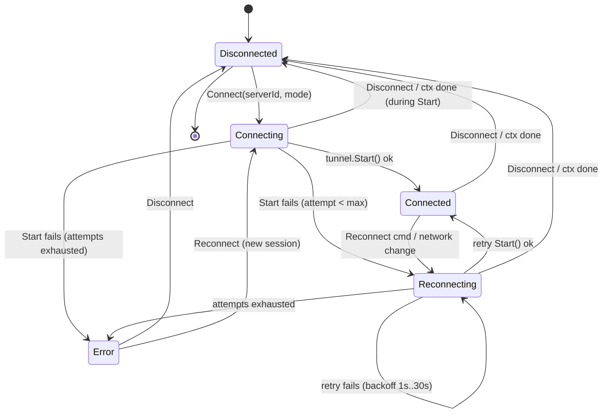
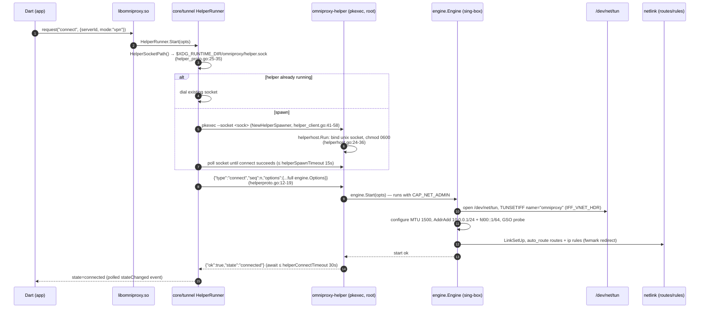

# OmniProxy — VPN / Tunnel Internals

**Scope:** how VPN mode works end-to-end: the OS TUN device, packet flow, MTU,
IPv6, DNS, and the interplay between the OS network stack, the sing-box TUN
inbound, and the proxy outbound.

**Source of truth:** code in `engine/`, `core/tunnel/`, `core/vpn/`, and the
Android Kotlin glue. Companion docs: `docs/platform-notes.md`,
`docs/api-contract.md`, `docs/implementation-plan.md`, `docs/ARCHITECTURE.md`.
Pinned engine: `github.com/sagernet/sing-box v1.13.15`
(`core/go.mod:7`, `engine/go.mod`).

---

## 1. Purpose & scope

OmniProxy has two connection modes (`core/models/session.go:19-27`):

- **`vpn`** — a network-layer tunnel. The OS creates a TUN device; raw IP
  packets from every app enter it and are fed to the sing-box **TUN inbound**,
  which hands them to a userspace network stack. sing-box's router then sends
  them out through the configured proxy outbound to the remote server.
- **`proxy`** — a loopback SOCKS5+HTTP mixed inbound on `127.0.0.1:<port>`; no
  TUN, no privileges. Not covered here except as the contrast point.

This document is about the **`vpn` mode data path**. It explains:

- what a TUN device is and who creates it on each platform (§3),
- how the file descriptor becomes a packet source/sink in sing-box (§4),
- the addressing, MTU, and route model (§5),
- how DNS is hijacked and resolved so nothing leaks and nothing loops (§6),
- the connection state machine and reconnection behavior (§7),
- the Linux privileged helper that owns the engine process (§8),
- Android's VpnService flow and its platform constraints (§9),
- security and isolation notes (§10),
- known gaps and limitations (§11).

Phase 1 is strictly **single-server, no chaining** (`core/tunnel/manager.go:16-18`);
the routing engine is `sing-box`, never reimplemented (AGENTS.md "Networking &
VPN rules"). No protocol, DNS, or crypto logic lives in OmniProxy code.

---

## 2. VPN mode overview — network-layer tunneling

A TUN device is a virtual point-to-point network interface in the kernel. It
has no physical link; instead, **the kernel hands raw IP packets (IP headers
included) to whichever process holds the interface's file descriptor**, and
accepts raw IP packets written back to that fd as if they arrived from the
network. The OS treats it like any interface: the routing table can point
`0.0.0.0/0` and `::/0` at it, so **all** of the device's traffic flows through
the fd, and the process on the other end of the fd can do anything with the
packets — here, forward them into the sing-box TUN inbound.

The full data path, from an app's socket to the remote VPN server:

```mermaid
flowchart LR
    subgraph AppProc["App process"]
        A["App socket() / connect()<br/>dest = 8.8.8.8:53 or 1.2.3.4:443"]
    end
    subgraph Kernel["OS kernel"]
        R["Routing table / VpnService policy<br/>0.0.0.0/0 and ::/0 → tun interface"]
        T["TUN device (no physical link)<br/>kernel ↔ fd I/O"]
    end
    subgraph Engine["sing-box engine (engine/)"]
        FD["FdTunPlatform.OpenInterface<br/>dup(fd) → tun.Tun<br/>engine/platform_fd.go:167"]
        STACK["Userspace network stack<br/>Stack \"mixed\": gVisor (UDP) + system (TCP)<br/>engine/config.go:144"]
        ROUTER["Router (route.Router)<br/>rules: hijack-dns, block v6<br/>Final → proxy outbound"]
        DNS["DNS module<br/>dns-proxy (8.8.8.8 via tunnel)<br/>dns-local (223.5.5.5 direct)"]
        OUT["Outbound \"proxy\"<br/>VLESS/VMess/SS/Trojan/SOCKS/HTTP/SSH"]
    end
    subgraph Remote["Remote"]
        SRV["VPN server"]
    end
    A -->|"kernel routes the socket"| R
    R -->|"raw IP packet written into fd"| T
    T -->|"fd read"| FD
    FD --> STACK
    STACK -->|"connection events (TCP)/packets (UDP)"| ROUTER
    ROUTER -->|"protocol=dns → hijack_dns"| DNS
    DNS -->|"Detour: \"proxy\""| OUT
    ROUTER -->|"Final"| OUT
    OUT -->|"encrypted tunnel stream"| SRV
```

Why the engine runs its own network stack (gVisor) instead of passing the TUN
packets straight to a socket: the router needs to see **connections**, not just
packets. App TCP connections arrive as raw IP packets; a userspace stack
reassembles them into socket-like connections the router can inspect (metadata:
protocol, source/destination, and — after DNS hijack — the domain), then
re-emits outgoing bytes over the proxy stream. sing-box's TUN inbound uses
`sing-tun`'s stacks (`github.com/sagernet/sing-tun`), which is exactly this.

**Stack selection.** `TunOptions.Stack` defaults to `"mixed"`
(`engine/config.go:107`, `:144`, `:291-296`). In `sing-tun`, `"mixed"` runs
**gVisor for UDP and the system stack for TCP** (`stack_mixed.go`: wraps
`NewSystem` and adds a gVisor TCP/IP stack with a UDP forwarder registered on
`udp.ProtocolNumber`). The gVisor code is compiled in via the `with_gvisor`
build tag — `GOMOD_TAGS := with_gvisor` in `Makefile:25`; without it `NewMixed`
fails with "gVisor is not included in this build" (`stack_gvisor_stub.go`). So
"the gVisor stack" is accurate for UDP and for the overall userspace-stack
architecture, but TCP rides the kernel netstack inside the engine process.

### 2.1 Why "network-layer" and not "transport-layer" proxy mode

Proxy mode exposes a SOCKS5/HTTP endpoint that apps must be configured to use.
VPN mode hijacks the whole network namespace so **every** app is tunneled with
zero per-app configuration, at the cost of needing kernel privileges to own a
TUN and route traffic into it. That privilege cost is the reason for the whole
platform-specific plumbing in §3 and §8.

---

## 3. The TUN device per platform

Who creates the TUN, and how the fd reaches the engine, differs per platform.
The engine always ends up with a `tun.Tun` (an fd-backed packet source/sink);
only the *origin* of the fd changes.

| Platform | Creator | Privilege | How it reaches the engine |
|---|---|---|---|
| Android | `android.net.VpnService` | user consent (system dialog) | fd via `Mobile.SetTunFd` → `FdTunPlatform` |
| Linux | sing-tun itself, inside the privileged helper | root / `CAP_NET_ADMIN` | none — the engine process creates it |
| Windows | Wintun driver, in-process DLL (planned) | elevated install | in-process (M8 placeholder, untested) |

### 3.1 Android — `VpnService`

The Kotlin `OmniProxyVpnService` (`app/android/.../OmniProxyVpnService.kt`)
builds the TUN through the `VpnService.Builder` API:

```kotlin
val builder = Builder()
    .setSession("omniproxy")
    .setMtu(1500)
    .addAddress("10.0.0.1", 24)
    .addRoute("0.0.0.0", 0)
    .addAddress("fd00::1", 64)
    .addRoute("::", 0)
val pfd = builder.establish()          // OmniProxyVpnService.kt:53-60
Bridge.setSocketProtector(this)
Bridge.setTunFd(pfd.fd)                // OmniProxyVpnService.kt:64-65
Bridge.executeRequest("connect", requestJson) { ... }   // :66
```

`establish()` returns a `ParcelFileDescriptor`; its fd is handed into Go via
`Mobile.setTunFd(fd)` (`Bridge.kt:198-200`), which stores it on the engine's
platform hook and points the runner at the fd platform
(`core/mobile/mobile.go:171-179`). From then on the Go engine reads/writes that
fd. The system additionally renders the persistent non-dismissible "VPN is on"
banner once `establish()` succeeds (`OmniProxyVpnService.kt:26-29`). Consent is
described in §9.1.

### 3.2 Linux — created by sing-tun inside the privileged helper

On Linux the engine runs **inside a root helper process** (§8). Because the
engine there uses the default `noopPlatform` (`engine/platform.go:16-22` —
"sing-box creates the TUN device itself"), `sing-tun` opens `/dev/net/tun` and
issues `TUNSETIFF` itself:

- `tun_linux.go:New` → `open(name, vnetHdr)`: `unix.Open("/dev/net/tun", …)`,
  then `TUNSETIFF` with `IFF_TUN | IFF_NO_PI | IFF_VNET_HDR`
- then `configure`: `LinkSetMTU(1500)`, `AddrAdd` for `10.0.0.1/24` and
  `fd00::1/64`, GSO probing
- then `start()`: `LinkSetUp`, `setRoute` (netlink routes into a random
  per-run table), `setRules` (ip rules with `AutoRedirectOutputMark` for
  fwmark-redirect), and `setSearchDomainForSystemdResolved`

All of that is netlink/ioctl work needing `CAP_NET_ADMIN` in the *engine
process*.

**Why a helper process at all (and why it hosts the engine, not just the fd).**
The unprivileged app process cannot create a TUN or configure routing. An early
design considered a helper that only *created* the TUN fd and passed it to the
unprivileged core over a Unix socket via `SCM_RIGHTS`; it was rejected because
sing-box's TUN setup — addresses, `auto_route` netlink routes and ip rules,
systemd-resolved search domains — **also needs `CAP_NET_ADMIN` in the process
that runs the engine** (`docs/platform-notes.md:63-64`). So the helper embeds
the same `engine` module and runs the sing-box tunnel itself; the unprivileged
core is a JSON-over-socket client. There is no fd-passing in the Linux path —
only the helper spawns the helper's own socket.

### 3.3 Windows — Wintun (planned)

`tun_windows.go:New` uses the Wintun driver; `wintun.dll` is bundled next to
the binary (`docs/platform-notes.md:75-76`). The Windows build is code-complete
but **not testable on the Linux dev host** (`docs/platform-notes.md:80`);
`engine/platform_fd.go`, `platform_monitor.go`, and `tun_name.go` are tagged
`//go:build linux || android` because they use Linux-only ioctls/syscalls, so
they are excluded from the Windows cross-build (`docs/implementation-plan.md:98`).

### 3.4 Device naming — `tun_name.go`

When a TUN fd is **provided** (Android), sing-box doesn't know the interface
name, and it needs one (to register with the interface monitor as "my
interface"). `tunName(fd)` (`engine/tun_name.go:15-27`) recovers it with the
`TUNGETIFF` ioctl: the kernel copies the `struct ifreq` (which contains
`ifr_name`) back into the buffer, and the name is read off it. On Linux the
helper path doesn't need this — sing-tun set the name itself from
`TunOptions.InterfaceName` (default `"omniproxy"`, `engine/config.go:142`).

`FdTunPlatform.OpenInterface` (Android) uses the recovered name to
`RegisterMyInterface(name)` on the platform monitor before handing sing-tun the
fd (`engine/platform_fd.go:176-183`), so the TUN is never treated as a dial
candidate for the tunnel's own sockets.

---

## 4. gVisor stack & `FdTunPlatform` — how the fd becomes the tunnel

sing-box exposes a `PlatformInterface` hook (`adapter.PlatformInterface`). The
engine injects it into the sing-box context before `box.New`:

```go
ctx = service.ContextWith[adapter.PlatformInterface](ctx, e.currentPlatform())  // engine/engine.go:56
```

- **Default / Linux helper:** `noopPlatform` opts out of every hook, so sing-box
  calls `sing-tun`'s `tun.New` with no `FileDescriptor` and sing-tun creates
  and configures the device itself (§3.2).
- **Android:** `FdTunPlatform` (a `noopPlatform` subclass,
  `engine/platform_fd.go:16-33`) supplies the fd. The key hook is
  `OpenInterface` (`engine/platform_fd.go:167-190`):

  1. read the stored fd (set earlier by `SetTunFd`),
  2. recover the device name via `TUNGETIFF` (`tunName`),
  3. `RegisterMyInterface(name)` on the platform monitor,
  4. **`unix.Dup(fd)`** — the tun device keeps its own descriptor, so closing
     the engine doesn't invalidate the VpnService's `ParcelFileDescriptor`,
  5. `options.FileDescriptor = dupFd` and `tun.New(*options)`.

  When `FileDescriptor > 0`, `sing-tun`'s `tun_linux.go:New` skips
  `open`/`configure` and just wraps the fd; route/rule/address mutations are
  additionally skipped for provided fds (`UpdateRouteOptions`,
  `unsetRoute`, `unsetRules`, `unsetAddresses` all return early when
  `options.FileDescriptor > 0`). This is exactly right on Android: the
  `VpnService.Builder` owns addressing and routing, and the app process lacks
  `CAP_NET_ADMIN` anyway.

**Packet read/write loop.** `sing-tun`'s `Mixed` stack runs two goroutines
(`stack_mixed.go:Start`): `tunLoop` reads raw packets from the fd
(`tun.Read`) and feeds the system stack / gVisor UDP forwarder; `packetLoop`
reads packets out of the gVisor endpoint and `tun.Write`s them back into the
fd (`stack_mixed.go:70-105`). Outgoing responses follow the reverse path: stack
→ fd → kernel → app socket. On Linux the reads use `BatchRead`/`BatchWrite`
(packet batching for throughput, `stack_mixed.go:139-161`).

**Events from the platform side.** sing-box requires a non-nil
`DefaultInterfaceMonitor` whenever a platform interface exists (it nil-derefs
otherwise), and netlink monitors are banned on Android (`sing-tun: netlink is
banned by google`). So `FdTunPlatform` supplies a **passive** monitor
(`platform_monitor.go:16-38`) that the Kotlin host feeds:

- `Mobile.setDefaultInterface(name, index)` → `FdTunPlatform.UpdateDefaultInterface`
  → `platformInterfaceMonitor.UpdateDefaultInterface`
  (`engine/platform_monitor.go:95-119`): stores the default interface and fires
  sing-box's registered callbacks, so sing-box re-evaluates its routes on
  network change.
- `Mobile.setNetworkInterfaces(json)` → `SetNetworkInterfaces`
  (`engine/platform_fd.go:129-137`): feeds the network-manager interface list,
  which `Route.AutoDetectInterface`'s default dialer reads to pick the physical
  interface for the tunnel's own sockets — without it the dialer fails with
  "no available network interface" (`platform_monitor.go:25-30`). The Kotlin
  host enumerates interfaces with `java.net.NetworkInterface`, never netlink,
  because Go's `net.Interfaces()` opens a `NETLINK_ROUTE` socket the app
  sandbox denies on some devices (`core/mobile/mobile.go:246-252`).

Both values are pushed **before** `establish()` so they're cached before the
engine starts (`OmniProxyVpnService.kt:52`, `Bridge.kt:104-110`).

---

## 5. TUN addressing & MTU

### 5.1 Engine-side options

`TunOptions` (`engine/config.go:101-109`) with defaults (`engine/config.go:139-153`):

| Field | Default | Notes |
|---|---|---|
| `InterfaceName` | `"omniproxy"` | the Linux TUN device name |
| `MTU` | `1500` | see §5.2 |
| `Address` | `10.0.0.1/24` + `fd00::1/64` | `engine/config.go:302-310` |
| `AutoRoute` | `true` | `autoRoute()` returns `AutoRoute \|\| !StrictRoute` (`engine/config.go:298-300`) — an explicit `StrictRoute: false` also means "auto-route". |
| `Stack` | `"mixed"` | §2 |
| `StrictRoute` | `false` | full-tunnel vs split-tunnel toggle; see §5.3 |

These map onto the sing-box TUN inbound (`option.TunInboundOptions`) in
`buildOptions` (`engine/config.go:226-239`): `InterfaceName`, `MTU`,
`Address`, `AutoRoute`, `Stack`, `StrictRoute`. `engine_test.go:79-90` pins the
defaults (name `omniproxy`, MTU 1500, AutoRoute true, two addresses).

### 5.2 MTU — why 1500

Both the Android `Builder.setMtu(1500)` and the engine `defaultMTU = 1500` use
Ethernet's classic 1500-byte MTU. The TUN carries raw IP packets, so the MTU
governs how large an IP packet the kernel will send into the fd (larger packets
are fragmented or elicit ICMP "fragmentation needed"). Keeping 1500 matches the
physical LAN default so an end-to-end path MTU of 1500 still works through the
tunnel without fragmentation, and matches sing-box's own recommendation for
typical deployments. The gVisor stack additionally supports jumbo MTUs, but
there is no user-facing MTU setting in Phase 1 — it is a constant on every
platform so behavior is identical (engine `Address` defaults too).

### 5.3 auto_route / strict_route / split vs full tunnel

With `AutoRoute` on a **Linux self-created TUN**, sing-tun installs netlink
routes for `0.0.0.0/0` and `::/0` (minus excluded ranges) into a fresh
random-table and ip rules with fwmark redirect, so all traffic enters the TUN
(`tun_linux.go` `routes`/`rules`/`setRules`, using `AutoRedirectOutputMark`).
That is **full tunnel**: everything routes into the engine and out the proxy.

`StrictRoute` is the split-tunnel control. sing-box's model: with
`strict_route` **off** (default here), on Linux a per-app "bypass" exists via
interface rules; with `strict_route` on, the default route is fully removed
from the main table and only the TUN table serves it. OmniProxy does not yet
expose split-tunnel policy to users; the engine keeps sing-box's defaults
(`AutoRoute` true, `StrictRoute` false). On **Android** the routing is not
sing-tun's at all — it is the `VpnService.Builder` policy (`0.0.0.0/0` +
`::/0` routes), which is inherently full-tunnel, and sing-tun's route code is
inert for provided fds (§4).

### 5.4 IPv6 mode (`AppSettings.ipv6Mode`) and its effect

IPv6 handling is decided at the engine layer so behavior is identical on every
platform (`docs/platform-notes.md:26-28`). `AppSettings.IPv6Mode`
(`core/models/settings.go:49-66`, default `prefer_ipv4`, `:93-101`) flows:
`tunnel.BuildEngineOptions` → `ipv6ModeFor` (`core/tunnel/options.go:32-43`) →
`engine.IPv6Mode` (`engine/config.go:115-127`) → DNS strategy + route rules.

| Mode | DNS `Strategy` (in `DNSClientOptions`) | Route rules |
|---|---|---|
| `auto` | `DomainStrategyAsIS` | — |
| `prefer_ipv4` (default) | `prefer_ipv4` | — |
| `disable_ipv6` | `ipv4_only` | `ip_version: 6` → route to `block` outbound |
| `enable_ipv6` | `prefer_ipv6` | — |

(`dnsStrategy`, `engine/config.go:502-513`; `blockIPv6Rule`, `:521-538`; the
`block` outbound is registered in `engine/registry.go:50`.)

**The TUN always keeps its IPv6 address and `::/0` capture.** The engine's
default addresses always include `fd00::1/64` (`engine/config.go:302-310`),
and Android always adds `fd00::1/64` + `::/0` (`OmniProxyVpnService.kt:58-59`).
`disable_ipv6` therefore never removes IPv6 from the tunnel — it stops IPv6
being *used*: AAAA queries get an empty NOERROR answer (`ipv4_only` domain
strategy), and any literal IPv6 packet that still reaches the router is refused
by the `block` outbound and logged ("blocked packet connection to …",
`platform-notes.md:59-60`). IPv6 can never *leak* onto the physical interface.

**Why `prefer_ipv4` is the default:** with the as-is strategy, apps receive
AAAA answers and dial IPv6 first; when the upstream path to IPv6 is slow or
broken (a common cause of stalled `fast.com` tests through a v4-only relay),
connections hang. `prefer_ipv4` keeps IPv6 captured and usable for v6-only
sites while preferring the working IPv4 path (`docs/platform-notes.md:43-48`;
commit `8209ae2`).

### 5.5 How the Android `Builder` matches the engine

Android's Builder routes/subnets are the *kernel's* policy and must agree with
what the engine expects to receive:

- `10.0.0.1/24` is both the engine default v4 address and the Builder address —
  packets addressed to `10.0.0.0/24` loop within the tunnel.
- `0.0.0.0/0` and `::/0` routes capture everything.
- MTU 1500 on both sides.

The engine's own TUN options on Android are effectively a **description of the
device the fd points at**; the actual interface config was done by the Builder.
They stay consistent because both sides hard-code the same constants.

---

## 6. DNS handling

### 6.1 Why a DNS module at all

TUN traffic is opaque to sing-box without a DNS module: raw client DNS
queries (UDP/53, TCP/53) would otherwise be forwarded as ordinary UDP through
the proxy and answered by whatever resolver the server's network forwards them
to. Worse, the outbound itself needs to resolve the proxy server's hostname
*through* something, and that resolution must not re-enter the tunnel. VPN
mode therefore configures a DNS module and **hijacks DNS at the router**
(`engine/config.go:195-217`; commit `8374a66`).

### 6.2 The exact configuration (`buildDNSOptions`, `engine/config.go:436-496`)

Two UDP DNS servers:

- **`dns-proxy`** — `8.8.8.8` with `DialerOptions{Detour: "proxy"}`
  (`dnsRemoteAddress`, `engine/config.go:149-152`, `:446-457`). Client queries
  resolve **through the tunnel**, so DNS never leaks to the physical network.
- **`dns-local`** — `223.5.5.5` with **no detour** (`:458-470`). sing-box v1.12+
  semantics: a DNS server without a detour uses the empty-direct default dialer,
  so this resolves **over the real network**. An explicit detour to the empty
  `direct` outbound is rejected by sing-box (`engine_test.go:100-113`). This is
  the bootstrap path for dialing the proxy server's own domain — otherwise
  resolving `proxy.example.com` would need the proxy, which needs the
  resolution: a chicken-and-egg loop.

Routing:

- One DNS rule (`DNSRules`): a default rule with `Outbound: ["any"]` that
  routes matching queries to `dns-local` (`:472-486`). The `outbound` item
  matches on the connection's metadata outbound; `"any"` is a reserved keyword
  matching *any* named outbound (`sing-box route/rule/rule_item_outbound.go:29-35`:
  `matchAny` ⇔ `metadata.Outbound != ""`). Client queries that arrive at the
  TUN are hijacked **before** DNS routing and carry no outbound metadata, so
  they do not match this rule.
- **`Final: "dns-proxy"`** — everything else (i.e. hijacked client queries)
  resolves through the tunnel.
- `ReverseMapping: true` — the router keeps a reverse map so **PTR lookups** for
  tunneled addresses (e.g. `10.0.0.x` reverse DNS) resolve back to the original
  domain (`:489`).
- `DNSClientOptions{Strategy: <ipv6 mode>, IndependentCache: true}`
  (`:490-493`) — strategy per §5.4; independent cache so client-facing and
  outbound-dial lookups don't poison each other.

### 6.3 The hijack rule (`dnsHijackRule`, `engine/config.go:540-554`)

A default route rule matching `Protocol: [dns]` (port-53 UDP/TCP) with
`Action: hijack_dns`. It is prepended before other rules
(`o.Route.Rules = append(rules, o.Route.Rules...)`, `engine/config.go:210`), so
DNS is always intercepted first. Hijacked queries are answered by the DNS
module's router, which selects a transport via the rules/final above.

### 6.4 How a query travels (and what "redir-host vs fakeip" means here)

This setup is the **redir-host** model, not fakeip:

1. App sends `example.com A` to its configured resolver. On Android that is
   the VpnService DNS servers / system resolver; the packet enters the TUN
   (`0.0.0.0/0` route), the router sees `protocol=dns`, and `hijack_dns`
   diverts it into the DNS module.
2. The DNS router matches no `outbound:any` rule (client query), so
   `Final: dns-proxy` answers it: `8.8.8.8` **through the proxy outbound**.
3. The answer (a real, public IP) returns to the app. There is **no fakeip**
   pool — the client learns the true destination IP. Connections are then
   dialed by that IP through the TUN; the outbound receives the resolved IP
   and carries the stream to the server.
4. When the outbound itself must resolve a domain while dialing, that query
   carries outbound metadata, matches `outbound:any`, and resolves via
   `dns-local` (direct).

fakeip would only be needed for Phase 2 domain-based routing rules (routing on
a domain after the IP is already known); nothing in the current config uses it.

### 6.5 The loop problem (why both the hijack and the split exist)

Without hijack, client DNS would ride raw UDP to the proxy server's resolver
(potentially leaking or being filtered). Without `dns-local`, resolving the
proxy server's hostname would loop: dial proxy → resolve host → through proxy
→ resolve host → … The two-server split breaks exactly this cycle while keeping
client DNS leak-free (`engine/config.go:146-153`; `docs/ARCHITECTURE.md:410`).

### 6.6 Android socket protect (the same loop at the socket level)

On Android the VpnService routes the **app process's own sockets** into the TUN
too — including the tunnel's sockets. Without protection, the dns-local direct
socket is captured by the TUN, hijacked into the proxy, which needs the same
domain… `VpnService.protect(fd)` marks a socket so its traffic goes over the
physical network, breaking the loop (`engine/platform_fd.go:64-96`;
`Bridge.setSocketProtector` → `Mobile.setSocketProtector`,
`core/mobile/mobile.go:192-218`). `FdTunPlatform` advertises
`UsePlatformAutoDetectInterfaceControl() == true` once a protect func is
registered, so sing-box routes direct dials through `AutoDetectInterfaceControl`
(which calls `protect`) instead of binding to an auto-detected interface its
passive monitor can't provide (`engine/platform_fd.go:77-96`).

On Linux, `Route.AutoDetectInterface = true` (`engine/config.go:216`) makes
sing-box bind direct dials to the default interface so the tunnel's own sockets
don't loop into the TUN (`engine_test.go:123-125` asserts this).

---

## 7. Lifecycle & state machine

### 7.1 States

`core/models/session.go:8-17`: `disconnected | connecting | connected |
reconnecting | error` — exactly the PRD connection states and the bridge
contract's `ConnectionState` (`docs/api-contract.md:13`).

### 7.2 The service and its run loop

`vpn.Service` (`core/vpn/service.go`) is the state machine. Key mechanisms:

- **Per-connect run loop.** `Connect` resolves the profile, rejects with
  `ErrBusy` when already connecting/connected/reconnecting, sets `connecting`,
  and spawns a goroutine run loop threading its own `runState` (ctx, cmds
  channel, done channel, session) (`core/vpn/service.go:70-76`, `:156-210`).
  Threading the session through the loop — rather than reading shared state —
  lets a new connect cleanly replace a stale loop that is blocked inside
  `Start` (`:170-209`).
- **The loop.** Calls `tunnel.Start`; on success transitions to `connected`;
  on failure it **stops the tunnel before retrying** (a failed Start can leave a
  half-started engine, and a retry must never hit "already running", nor keep
  routing under a `reconnecting` UI), then backs off (`:268-321`).
- **Backoff / retry policy.** `RetryPolicy` (`:36-40`); default is 1s, 2s, 4s…
  capped at 30s, max 5 attempts (`DefaultRetryPolicy`, `:42-58`). Retries are
  gated by `SetAutoReconnect` (`:107-112`).
- **Disconnect.** Sends `cmdDisconnect`, waits up to `disconnectTimeout`
  (5s, test-shrinkable `:23`) for the loop to finish, else `forceDisconnect`
  (`:213-238`, `:453-473`).
- **Reconnect.** Allowed while connected/reconnecting, or from Error (starts a
  fresh session) (`:242-263`). The VPN service itself is *driver* for
  reconnect-on-network-change; the actual trigger on Android comes from the
  platform (§9.4).
- **Error classification.** `classify` maps permission errors to the
  `unauthorized` contract code (e.g. cancelled pkexec, PRD §3.3), "already
  running" to `busy`, else `engine_error` (`:513-526`).



### 7.3 The tunnel manager

`tunnel.Manager` (`core/tunnel/manager.go`) is the "Tunneler" the service
drives. `Start` clones the profile, builds `engine.Options`, and delegates to
the **runner**; a second start fails with `ErrAlreadyRunning` (`:62-78`).
`Stop` always stops the runner even with no tracked profile, guaranteeing a
half-started engine can never keep routing under a Disconnected/Error session
(`:80-92`). `Manager.Start` logs the applied IPv6 mode at `info`
(`started vpn tunnel to <addr>:<port> (ipv6 mode <mode>)`, `:76`).

**Runners** (`core/tunnel/runner.go:11-22`):

- `InProcessRunner` — engine runs in this process (`:25-49`); used everywhere
  except Linux VPN mode.
- `HelperRunner` (Linux) — proxy mode in-process, VPN mode via the helper
  socket client (`core/tunnel/helper_client.go:63-124`).
- `PlatformSetter` — the seam through which Android injects `FdTunPlatform`
  before a VPN-mode start (`core/mobile/mobile.go:177-179`).

---

## 8. The Linux helper deep-dive

### 8.1 Why it exists

§3.2. Creating the TUN **and** configuring routing/DNS (netlink auto-route, ip
rules, systemd-resolved) needs `CAP_NET_ADMIN` in the engine's process. The
core runs unprivileged; a small Go helper — same workspace, embedding the same
`engine` module — is launched via `pkexec` and **hosts the sing-box tunnel**
for VPN mode (`docs/platform-notes.md:63`). It is "embedded sing-box, never
shelled out" — it is not the sing-box CLI (`core/tunnel/helperhost/helperhost.go:1-6`).

### 8.2 Privileges

`pkexec` runs the helper as root, giving it the full capability set the engine
needs (`CAP_NET_ADMIN` for TUN + netlink; nothing else is used — there are **no
iptables/nftables rules** anywhere in the helper; routing is done by sing-tun's
netlink auto-route, `tun_linux.go`). Scope is deliberately minimal: the helper
only authenticates (pkexec), owns the engine lifecycle, and serves one control
client. No tunnel-protocol logic lives in the helper beyond the shared `engine`
module (`docs/platform-notes.md:65`).

### 8.3 Spawning and the socket protocol



Key details:

- **Socket path:** `$XDG_RUNTIME_DIR/omniproxy/helper.sock`, falling back to
  `/tmp/omniproxy/helper.sock`; parent dir `0700` (`core/tunnel/helper_proto.go:25-35`).
- **Spawner:** `pkexec omniproxy-helper --socket <path>`; when
  `OMNIPROXY_HELPER` is set, the helper is launched directly (no pkexec) so
  tests can exercise the protocol unprivileged (`core/tunnel/helper_client.go:41-58`).
- **Server:** `helperhost.Run` accepts **one control connection per helper
  lifetime**; when it closes (app exit, crash, explicit `quit`), the tunnel is
  torn down and `Run` returns — no orphaned root-owned TUN survives the app
  (`helperhost.go:20-23`, `:38-64`).
- **Options transport:** the full `engine.Options` is serialized in the
  `connect` message, so the helper never re-derives engine config — the shared
  `engine` module is the single builder (`helperproto.go:12-19`;
  `helperhost.go:87-89`).
- **Messages:** newline-delimited JSON over a Unix stream socket; `connect |
  disconnect | ping | quit` client-side, `response | event` server-side
  (`helperproto.go:15-29`). The client correlates by `seq` and streams engine
  log lines back to the core's redacting logger as `event` messages
  (`helper_client.go:242-273`; `helperhost.go:156-167`).
- **Ping/keepalive:** `ping` reports engine state (`connected | disconnected`)
  and is used by the client's `alive()` check and by tests (`helperhost.go:135-143`).
- **Timeouts** (`core/tunnel/helper_client.go:31-35`):
  - `helperSpawnTimeout = 15s` — poll for the socket after spawning; the error
    message hints at pkexec cancellation (`:193-203`).
  - `helperConnectTimeout = 30s` — await the `connect` response (engine start
    can be slow: TUN creation, routing, outbound dial).
  - `helperDisconnectTimeout = 5s` — await `disconnect`.
- **Quit / reaping:** `HelperRunner.Close` sends `quit`, waits up to 2s, then
  `Kill` (`helper_client.go:127-159`).
- **Cancel button:** if the user cancels the pkexec dialog, the socket never
  appears and the core reports `unauthorized` with actionable UI text
  (`docs/platform-notes.md:66`; `core/vpn/service.go:513-526` classifies it).

**Why the helper is separate from the core** beyond privileges: the engine
lifetime is tied to the privileged context. The core could start/stop it at any
time; keeping the engine inside the helper means a crash of the unprivileged
UI process never orphans a live root-routed tunnel, and the helper's
one-connection lifecycle guarantees teardown when the app dies.

---

## 9. Android specifics

### 9.1 Consent flow

`MainActivity.handleConnect` (`app/android/.../MainActivity.kt:48-67`): for
`mode == "vpn"`, calls `VpnService.prepare(this)`. If it returns a non-null
`Intent`, the system consent dialog is launched via `startActivityForResult`;
on `RESULT_OK` (or if consent was already granted) the VPN host service is
started. Denial surfaces `vpn_consent` ("VPN permission denied") to the bridge
(`:103-115`). This maps to the contract's `unauthorized` error code
(`docs/api-contract.md:161`).

### 9.2 Foreground service & persistent notification

VPN-mode connect goes through `startForegroundService` → `OmniProxyVpnService`
which must call `startForeground` promptly or the system throws
`ForegroundServiceDidNotStartInTimeException` (`OmniProxyVpnService.kt:26-39`).
The notification is built in `Notifications.kt` — `setOngoing(true)`,
`IMPORTANCE_LOW`, `CATEGORY_SERVICE`, badge suppressed — persistent and
non-dismissible while connected (PRD §3.1; `Notifications.kt:28-43`). The
system additionally renders the non-dismissible VPN banner once `establish()`
succeeds. Proxy mode uses the same foreground pattern in `VpnProxyService.kt`
with no TUN.

### 9.3 Battery / doze / background execution

PRD requires auto-reconnect on network change/drop, doze-mode/battery guidance,
and background-execution handling tested across OEM skins
(`docs/platform-notes.md:21`). The **foreground service + data-sync type** is
the structural mitigation: a foreground service with
`FOREGROUND_SERVICE_TYPE_DATA_SYNC` is exempted from most background limits
(AndroidManifest declares `FOREGROUND_SERVICE` + `FOREGROUND_SERVICE_DATA_SYNC`,
`app/android/app/src/main/AndroidManifest.xml:4-5`). Auto-reconnect logic itself
is the `vpn.Service` retry policy (§7.2); the platform trigger on network
change is the interface monitor (§9.4).

### 9.4 Auto-reconnect on network change

The VpnService owns the TUN and its routing, and Android forbids netlink
monitors, so the **Kotlin host** watches the physical network with
`ConnectivityManager` (`Bridge.kt:81-102`) and pushes the default interface +
interface list into the engine (`Mobile.setDefaultInterface` /
`setNetworkInterfaces`, `Bridge.kt:149-192`). Inside sing-box, the passive
monitor's `UpdateDefaultInterface` fires the registered callbacks
(`engine/platform_monitor.go:95-119`) so the tunnel re-evaluates its routes.
Note the current monitor never *emits* an Android-VPN update flag
(`AndroidVPNEnabled() == false`, `platform_monitor.go:121-123`), so the 
sing-tun `routeUpdate` re-route path (`FlagAndroidVPNUpdate`) is not engaged;
the network-change signal is consumed at the platform/dialer level
(interface list refresh) and the connection-level retry lives in `vpn.Service`.

### 9.5 `onRevoke`

If the user revokes the VPN grant from system UI, `onRevoke` issues a
disconnect round-trip and stops the service so the app state stays consistent
(`OmniProxyVpnService.kt:93-101`).

---

## 10. Security & isolation notes

- **TUN traffic is encrypted by construction.** App packets enter the TUN and
  are forwarded by the router to the proxy outbound, which wraps them in the
  chosen protocol (VLESS/VMess/Shadowsocks/Trojan/TLS/SSH, `engine/config.go:312-418`)
  to the remote server. Cleartext app payloads never appear on a physical
  interface; only the tunnel stream exits.
- **Socket protect (`protect`/`mark`).** On Android, `VpnService.protect(fd)`
  marks the tunnel's own sockets (DNS bootstrap, the proxy server connection)
  so the system sends them over the physical network instead of back into the
  TUN (`engine/platform_fd.go:64-96`; `Bridge.kt:202-209`). This is both a
  correctness requirement (loop avoidance) and an isolation one: the tunnel's
  control traffic is never routed through itself.
- **No DNS leaks.** Client queries are hijacked (`hijack_dns`) and answered via
  `dns-proxy` **through the tunnel**; the only direct resolution is
  `dns-local`, used strictly for outbound dialing bootstrap (§6). With
  `disable_ipv6`, AAAA is answered with empty NOERROR and IPv6 packets are
  blocked at the router — never leaked (§5.4).
- **Log hygiene.** Engine log lines from both the in-process runner and the
  helper flow into the core's redacting logger before any sink
  (`core/tunnel/runner.go:51-60`; `helperhost.go:156-167`); credentials, keys,
  and raw traffic never reach the ring (`docs/platform-notes.md:10`).
- **Helper boundary.** The Linux helper runs as root but only serves one
  authenticated pkexec client on a `0600` Unix socket and owns the engine
  lifecycle; there is no network exposure, no iptables manipulation beyond
  sing-tun's netlink auto-route, and teardown on disconnect/quit (§8.3).
- **TLS validation.** Certificate validation is on by default
  (`tlsContainer`, `engine/config.go:420-434`); `allowInsecure` is never set in
  the default flow and is gated behind Advanced Mode (Phase 2)
  (`docs/api-contract.md:40`).

---

## 11. Known gaps & limitations

- **Windows is unimplemented in practice.** Code-complete but untested on this
  host; the FFI transport throws `UnsupportedError` and the client falls back
  to the mock (`app/lib/core/bridge/bridge_windows.dart:7-22`;
  `docs/platform-notes.md:80`). Wintun, in-process.
- **`AutoRoute`/`StrictRoute` are not user-exposed.** Split-tunnel policy is
  not surfaced in the UI; the engine keeps sing-box defaults. `StrictRoute` is
  carried through `TunOptions` but never set from settings
  (`core/tunnel/options.go:16-30`).
- **MTU is a constant.** No user MTU control; 1500 everywhere.
- **IPv6 edge cases.** `disable_ipv6` relies on clients honoring the empty
  NOERROR answer; an app that force-dials a literal IPv6 address still gets the
  block outbound (correctly, but with no fallback to v4). Android's Builder
  always captures `::/0` even when the physical network is v4-only.
- **DNS is "redir-host", no fakeip.** Domain-based routing rules (Phase 2)
  will require fakeip or sniff-based metadata; today routing is by
  connection metadata only (`engine/config.go:540-554`).
- **No chain support.** Single server, single hop; chaining is a Phase 2 seam
  (`core/tunnel/manager.go:16-18`).
- **One control client per helper.** If the app restarts, the helper process is
  reaped (or its socket replaced) before a fresh spawn; two cores can never
  share one helper (`helperhost.go:38-42`).
- **Desktop DNS integration** (NetworkManager/systemd-resolved) is deferred;
  Phase 1 keeps sing-box defaults (`docs/platform-notes.md:71`).
- **No stats.** `VPNSession.bytesUp/bytesDown` are 0 in MVP
  (`core/models/session.go:56-67`).

---

## 12. Related documents

Existing, on disk:

- `docs/platform-notes.md` — per-platform TUN/privileges, IPv6 mapping table, permission matrix (the primary companion to this document).
- `docs/ARCHITECTURE.md` — three-layer architecture, config generation flow, platform differences, design decisions & tradeoffs.
- `docs/api-contract.md` — the canonical Flutter↔Go bridge contract (states, `AppSettings.ipv6Mode`, transports).
- `docs/implementation-plan.md` — Phase 1 plan, decision table (incl. the rejected fd-passing design), milestones, build/test commands.
- `docs/FLUTTER_GO_FFI.md`, `docs/FLUTTER.md`, `docs/GO_RUNTIME.md` — FFI bridge, Flutter shell, and Go runtime notes.

Sibling docs covering the same flow from other angles:

- `docs/ANDROID.md` — Android platform layer: VpnService, gomobile bridge, notifications, keystore.
- `docs/LINUX.md` — Linux platform layer: libomniproxy.so, the privileged helper, Unix socket protocol.
- `docs/WINDOWS.md` — Windows platform layer: DLL bridge, wintun (M8, planned).
- `docs/SINGBOX.md` — sing-box integration: config generation, selective registry, routing/DNS.
- `docs/NETWORK_FLOW.md` — the end-to-end control/data flow atlas for both modes.
- `docs/PROXY_ARCHITECTURE.md` — proxy-mode protocol and outbound/inbound wiring.
- `docs/SECURITY.md` — threat model, credential lifecycle, redaction, TLS.
