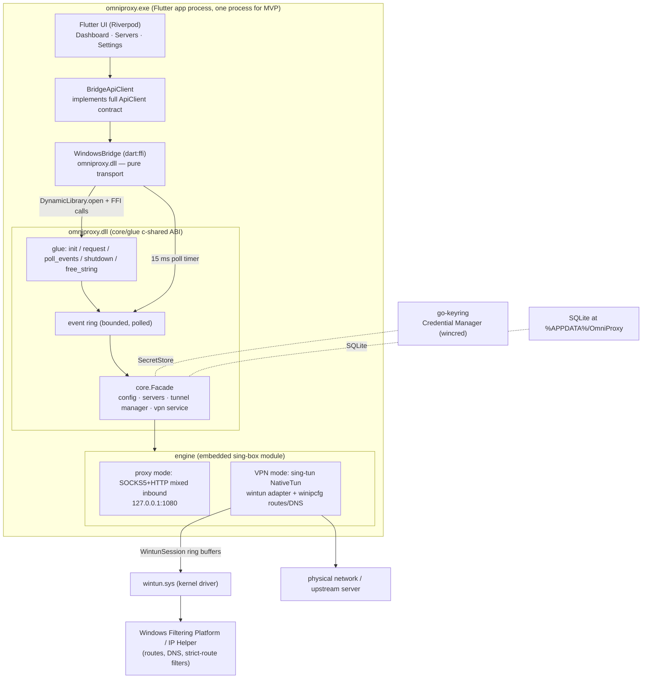

# WINDOWS — Platform Layer Deep Dive

**Status:** Windows is the least-implemented platform in Phase 1. The core DLL
cross-compiles and wintun is bundled, but the Flutter transport is a stub, the
client falls back to the mock, and the Go glue still hardcodes Linux behavior.
Everything marked **[plan]** is intended architecture, not code that runs today.
Everything else is verified against the tree at commit `716eb93`.

## 1. Purpose & scope

This document covers the Windows platform layer of OmniProxy:

- **Current state** — what exists today (DLL cross-compile, wintun bundling,
  Flutter stub, mock fallback) and what the user actually experiences.
- **Intended architecture** — `omniproxy.dll` (same c-shared ABI as Linux via
  `core/glue`) loaded through `dart:ffi`, wintun for VPN mode, in-process proxy
  mode, Windows Credential Manager/DPAPI for secrets.
- **The bridge on Windows** — how `bridge_windows.dart` must implement
  `BridgeTransport` by mirroring the Linux FFI transport.
- **wintun & VPN mode** — what wintun provides, how the adapter reaches the
  engine (ring API, not POSIX fds), TUN addressing/routes/IPv6, and the
  elevation question.
- **The engine on Windows** — build tags, what sing-tun already does, what
  still needs Windows implementations.
- **Secrets, porting risks, M8 scope, and a recommended implementation order.**

In scope of Phase 1 MVP: app shell, server CRUD/import/export, single-server
connect/disconnect, embedded sing-box, Dashboard. Out of scope (Phase 1.5+ per
`docs/platform-notes.md:77`): the background Windows *service* from
`PRD.md:68` — MVP runs the core in-process inside the app process.

## 2. Current state — what exists today

Windows is **not implemented**. It is the M8 placeholder: the DLL build
artifacts exist, but no Windows bridge transport runs, and the app boots
against the in-memory mock.

### 2.1 The Flutter transport is a stub

`app/lib/core/bridge/bridge_windows.dart:7-22` defines `WindowsBridge implements
BridgeTransport`, but:

- `request()` throws `UnsupportedError('WindowsBridge lands in M8')`
  (`bridge_windows.dart:10`).
- the `events` getter throws the same `UnsupportedError`
  (`bridge_windows.dart:15`).
- `start()`/`stop()` are no-ops (`bridge_windows.dart:18-21`).

The class doc comment (`bridge_windows.dart:6`) describes it as "code-complete
in M8; documented untested on the Linux host" — i.e. the class exists to pin
down the intended ABI, not to function.

### 2.2 The client factory never constructs it — the app runs on the mock

`app/lib/core/client_factory.dart:20-28`:

- `Platform.isAndroid` → `BridgeApiClient(AndroidBridge())` (`:21-23`)
- `Platform.isLinux` → `BridgeApiClient(createLinuxTransport())` (`:24-26`)
- everything else, including Windows → `MockApiClient()` (`:27`)

So on a Windows build today the user sees the full UI shell (Dashboard, Server
Manager, Settings) running against `MockApiClient` — a faithful in-memory
implementation of the contract (per `docs/FLUTTER.md:249`) — with seeded servers
and simulated connect/latency delays. **No real connection is possible, no
network traffic is tunneled, and nothing reaches the Go core at all.** The
Windows Bridge is never constructed, so its `UnsupportedError` is effectively
dead code unless a future test constructs it directly. This is the explicit M8
placeholder, not a silent half-transport (`docs/ARCHITECTURE.md:388`).

### 2.3 The Go core DLL cross-compiles (the one M8 piece that is real)

`core/out/omniproxy.dll` (43 MB) exists in the tree, and a fresh cross-compile
from the Linux host was verified clean:

```bash
cd core && CGO_ENABLED=1 GOOS=windows GOARCH=amd64 \
  CC=x86_64-w64-mingw32-gcc go build -buildmode=c-shared -o out.dll ./glue
```

The `windows-core` Makefile target does exactly this (`Makefile:128-137`) and
requires `x86_64-w64-mingw32-gcc` (`Makefile:29,129-132`). `core/out/wintun.dll`
(427,552 bytes, built 2021) was fetched by the `wintun` target
(`Makefile:140-153`).

**But the DLL that compiles is still Linux-shaped at runtime.** Three
Linux-flavored assumptions are compiled into `core/glue/glue.go` (see §4.4) —
they do not break the *build*, but they will misbehave on a Windows host.

### 2.4 The Windows Flutter runner is stock

`app/windows/` is the standard `flutter create` scaffold: `CMakeLists.txt` +
`runner/` (`flutter_window.cpp`, `win32_window.cpp`, `main.cpp`, `Runner.rc`,
`runner.exe.manifest`). Unlike `app/linux/CMakeLists.txt:115-128`, which installs
`libomniproxy.so` and `omniproxy-helper` into the bundle, **the Windows CMake
has no OmniProxy glue** — no DLL install step, no wintun bundling
(verified: the only matches for `dll`/`wintun`/`core/out` in
`app/windows/CMakeLists.txt` are the `BINARY_NAME "omniproxy"` at `:7` and the
project name at `:3`). `flutter-windows` refuses to run on a Linux host
(`Makefile:156-160`), so the app bundle must be produced on Windows or CI.

### 2.5 What the user experiences today

On a Windows machine, `flutter build windows --release` would produce a working
Flutter shell whose every screen talks to the in-memory mock. Connect buttons
animate through simulated states; no OS integration, no wintun, no VPN, no
secure storage. There is no UI surfacing "this is a mock" — the limitation is
documented (`docs/platform-notes.md:80` says Windows is "code-complete only;
verify on a Windows machine or CI before release") but not yet surfaced in the
app itself.

## 3. Intended architecture

**[plan]** The Windows build follows the Linux two-process-free model but
in-process: there is no helper process and no separate service in MVP. One
process — the Flutter app — hosts everything:

1. **`omniproxy.dll`** — the c-shared build of `core/glue` exposing the same
   five-function ABI as Linux (`omniproxy_init/request/poll_events/shutdown/
   free_string`), documented in `docs/api-contract.md` §5.2 (`:184-201`).
2. **`dart:ffi`** — `bridge_windows.dart` binds the DLL, exactly as
   `bridge_linux.dart:27-193` binds `libomniproxy.so`.
3. **Proxy mode** runs entirely in the app process: the engine opens a
   SOCKS5+HTTP mixed inbound on loopback (`engine/config.go:240-259`) — no
   privileges needed (`docs/PROXY_ARCHITECTURE.md:111`).
4. **VPN mode** runs in the same process: sing-box creates a wintun adapter
   itself via sing-tun (no fd hand-off — see §5). Elevated rights are needed to
   install the wintun kernel driver; per `docs/platform-notes.md:76`,
   "elevated privileges for interface creation are handled per sing-box's
   Windows model; the FFI process is the app process."
5. **Secrets** go through `go-keyring`, which on Windows talks to the
   Credential Manager (`core/secret/keyring.go:9-42`; wincred backend in
   `core/go.mod:18`).
6. **Config dir** is `%APPDATA%\OmniProxy` (`docs/platform-notes.md:79`).



Rationale for "no helper process" and "in-process":

- **Linux needs a helper because TUN setup + auto-route + DNS need
  `CAP_NET_ADMIN` in the engine process** (`docs/platform-notes.md:64`); the
  pkexec helper *hosts the engine* and the core talks to it over a Unix socket.
- **Windows has no equivalent constraint.** wintun's model is exactly "load
  wintun.dll in your process, call `WintunCreateAdapter`". sing-tun's Windows
  implementation creates the adapter, assigns addresses/routes/DNS, and reads
  the ring in-process (`sing-tun/tun_windows.go`). So the helper pattern is
  both unnecessary and unbuildable here (it depends on `net.Dial("unix", …)` and
  `pkexec`, see §4.4). This is why the plan keeps Windows "in-process DLL + FFI"
  (`docs/platform-notes.md:77`).
- **The PRD's "background Windows service for tunnel management independent of
  the UI process" (`PRD.md:68`) is explicitly deferred to Phase 1.5+**
  (`docs/platform-notes.md:77`): "note the limitation in the UI if applicable."
  Same for "start with system" — the setting is stored in MVP
  (`docs/api-contract.md:105`) but behavior is a later phase.

## 4. The bridge on Windows

### 4.1 What `bridge_windows.dart` must do

`BridgeTransport` requires four members (`bridge_transport.dart:24-37`):
`request(method, requestJson)`, `events`, `start()`, `stop()`. The Windows
implementation should be a near-clone of `bridge_linux.dart`:

- **`start()`** — `DynamicLibrary.open(...)`, look up the five exported symbols,
  call `omniproxy_init` with a JSON config `{dataDir, logLevel}`, then start a
  periodic poll timer (`bridge_linux.dart:47-70`). The Linux poll interval is
  `Duration(milliseconds: 15)` (`bridge_linux.dart:41`).
- **`request()`** — encode `{method, requestJson}` to UTF-8, call
  `omniproxy_request`, decode the returned JSON, `omniproxy_free_string` the
  result (`bridge_linux.dart:86-120`).
- **`events`** — a broadcast `StreamController` fed by the poll timer draining
  `omniproxy_poll_events` (`bridge_linux.dart:122-138`).
- **`stop()`** — cancel the timer, call `omniproxy_shutdown`
  (`bridge_linux.dart:73-83`).
- The FFI `typedef`s (`bridge_linux.dart:178-193`) are identical — the ABI is
  shared (`docs/api-contract.md` §5.2).

### 4.2 The polled-event design (not Windows-specific, but load-bearing)

Events are polled, never pushed: the core buffers them in a bounded ring
(`core/glue/glue.go:41-47`, `eventRingCap = 512`) and Dart drains on a timer. A
native callback into the Dart isolate would deadlock when a synchronous request
like `connect` itself publishes an event while the isolate is blocked inside the
FFI call (`glue.go:7-11`, `bridge_linux.dart:23-26`, `docs/api-contract.md:199`).
This reasoning is identical on Windows; reuse it wholesale. See
`docs/FLUTTER_GO_FFI.md` §7 for the deep dive.

### 4.3 What differs from Linux in the transport

- **Library path** — `omniproxy.dll` (Windows) vs `libomniproxy.so` (Linux).
  `DynamicLibrary.open` works the same on both; on Windows the DLL must be in
  the search path (next to `omniproxy.exe`, or via an absolute path
  `%APPDATA%`/install dir). `bridge_linux.dart:148-156` reads an
  `OMNIPROXY_LIB` override — keep the same knob for Windows.
- **Default data dir** — Linux computes `~/.config/omniproxy`
  (`bridge_linux.dart:158-163`); Windows must pass `%APPDATA%\OmniProxy`
  (`docs/platform-notes.md:79`). `dart:io` `Platform.environment['APPDATA']`.
  The Windows bridge should always pass `dataDir` explicitly, because the
  glue's own fallback is Linux-only (§4.4).
- **No `helperPath`** — Linux passes the `omniproxy-helper` binary path
  (`bridge_linux.dart:165-175`); Windows has no helper, so the key is omitted.
- **`client_factory.dart:20-28`** must be extended to route `Platform.isWindows`
  to `BridgeApiClient(WindowsBridge(...))` instead of `MockApiClient()`.

### 4.4 The glue must stop being Linux-flavored before it ships

These are real gaps in `core/glue/glue.go` — they compile for Windows but are
wrong at runtime:

1. **Hardcoded platform string.** `glue.go:94` passes `Platform: "linux"` to
   `core.New`. The facade reports it verbatim in `getVersion`
   (`core/core.go:216`), so a Windows build would answer
   `platform: "linux"` (`docs/api-contract.md:142`). Fix: parameterize the
   platform (build tag, or a field in the init `config_json`) and pass
   `"windows"`. Android's gomobile entry does exactly this with a hardcoded
   `Platform: "android"` (`core/mobile/mobile.go:151`).
2. **The Linux helper runner is wired unconditionally.** `glue.go:92` builds
   `tunnel.NewHelperAwareRunner(logger, tunnel.NewHelperSpawner(cfg.HelperPath))`.
   In VPN mode this runner spawns `pkexec` (`core/tunnel/helper_client.go:56`),
   dials a Unix socket (`helper_client.go:222`), and computes the socket path
   from `$XDG_RUNTIME_DIR` or `/tmp` (`core/tunnel/helper_proto.go:25-35`).
   None of that exists on Windows; a VPN connect would fail instead of using
   wintun. Windows must use `tunnel.NewInProcessRunner` for **both** modes —
   the same choice the Android entry makes (`core/mobile/mobile.go:137`), where
   wintun would be created by the engine in-process. This is the single most
   important change the M8 "code-complete" claim overlooks.
3. **`defaultDataDir` is XDG-shaped.** `glue.go:59-69` falls back to
   `$XDG_CONFIG_HOME/omniproxy` / `~/.config/omniproxy`. On Windows it should be
   `%APPDATA%` (`os.UserConfigDir()` already returns the right dir per platform,
   as used by `core/mobile/mobile.go:129-133`). The Dart bridge passing
   `dataDir` explicitly mitigates this, but the fallback is still wrong.

These are **[plan]** fixes with an open question on how to parameterize (build
tag vs init-config field) — see §10.

## 5. wintun & VPN mode

### 5.1 What wintun is

[**plan / engine-verified**] wintun is WireGuard's layer-3 TUN driver for
Windows. The runtime artifact is **`wintun.dll`**, which is not a Go library —
it is the driver-loader DLL. It ships the `wintun.sys` kernel driver and, when
loaded by an elevated process, installs it and creates the adapter via the
`WintunCreateAdapter` / `WintunStartSession` API. The engine does **not** talk
to the driver directly; sing-tun wraps wintun.

### 5.2 The fd-vs-handle design question — largely resolved by sing-tun

The task brief correctly flags this as a real design question: Android and the
Linux helper pass the TUN into sing-box as a **POSIX file descriptor**, but
wintun has no fd — it exposes a **session with ring buffers** and a Windows
event handle for readiness. The resolution is: **do nothing — sing-box's own
Windows TUN path handles it.**

- sing-tun's `NativeTun` (`internal/wintun` + `tun_windows.go`) rejects the fd
  path outright: `New(options)` returns `os.ErrInvalid` when
  `options.FileDescriptor != 0` (`tun_windows.go:41-42`).
- It creates the adapter itself: `wintun.CreateAdapter(options.Name, TunnelType,
  generateGUIDByDeviceName(...))` (`tun_windows.go:44-57`), opening an existing
  adapter deterministically by name via `wintun.OpenAdapter`
  (`tun_windows.go:50-53`).
- It starts a session (`adapter.StartSession(0x800000)`, `tun_windows.go:59-64`)
  and reads/writes the **ring buffers**, waiting on a Windows event
  (`session.ReadWaitEvent()`, `tun_windows.go:64-65`). There is no fd anywhere.
- It configures the interface through **winipcfg** (Windows IP Helper):
  `SetIPAddressesForFamily(AF_INET/INET6)` (`tun_windows.go:80-118`), `SetDNS`,
  per-interface options (`tun_windows.go:74-173`), route list via
  `addRouteList` and resolver-cache flush in `Start` (`tun_windows.go:185-189`).
  Strict-route mode opens a **Windows Filtering Platform** session
  (`FwpmEngineOpen0`, `tun_windows.go:203-209`) for DNS hijack filters.

**Consequence for OmniProxy:** the engine's `noopPlatform` is exactly right for
Windows. `engine/platform.go:18-52` returns `nil` from `OpenInterface`
(`platform.go:32-34`), which makes sing-box create the TUN itself — on Windows
that is sing-tun's wintun path (the comment at `platform.go:19-21` already names
"Windows Wintun"). The Android `FdTunPlatform` (`engine/platform_fd.go`,
`//go:build linux || android`) is correctly excluded from the Windows build and
must never be used there.

There is **no engineering decision to make about adapter-vs-fd hand-off**: the
engine owns the adapter handle, the ring session, and the winipcfg
configuration internally. The real open decisions are about *elevation and
packaging* (§5.4) and *whether any part of the Windows TUN setup needs to live
outside the engine* (e.g. pre-registering the adapter GUID / firewall rules) —
see §8.

### 5.3 TUN addressing, routes, IPv6 on Windows

The engine's TUN options are platform-neutral and already produce what wintun
needs:

- Default addresses `10.0.0.1/24` (v4) + `fd00::1/64` (v6)
  (`engine/config.go:306-309`), MTU 1500, interface name `omniproxy`
  (`engine/config.go:142-144`), `AutoRoute` defaulting true
  (`engine/config.go:298-300`).
- IPv6 handling is decided entirely at the engine layer
  (`engine/config.go:111-137`, `docs/platform-notes.md` §IPv6): the TUN always
  keeps its v6 address and `::/0` capture so IPv6 can never leak onto the
  physical interface, and `disable_ipv6` only drops it at the router. On
  Windows this maps onto sing-tun setting the v6 address + routes via
  winipcfg (`tun_windows.go:103-118`) and the engine's `blockIPv6Rule`
  (`engine/config.go:525-538`). **No Windows-specific IPv6 work is required** —
  that guarantee holds as long as `ipv6Mode` is honored by the engine, which it
  is today.

### 5.4 The open questions (require user decision)

**[open]** These are not resolved in the repo and cannot be inferred from the
plan:

1. **Elevation.** Loading wintun.dll installs `wintun.sys`, which needs
   administrator rights on the first run (and the driver service must persist).
   `docs/platform-notes.md:76` says only "handled per sing-box's Windows model;
   the FFI process is the app process" — but the *who-elevates* question is
   unanswered. Options:
   - **Per-connect UAC prompt** from the app process (simplest; jarring UX).
   - **Elevated installer/companion** that installs `wintun.sys` at setup time
     (matches how WireGuard and most VPN clients ship); then connect runs
     unelevated.
   - **Deferred Windows service** (Phase 1.5+) hosting the tunnel elevated.
   The PRD's "TUN permissions … fail gracefully with actionable messaging"
   (`PRD.md:308`) applies: `connect` must return the `unauthorized` error code
   (`core/core.go:192`, `docs/api-contract.md:161`) when elevation was denied.
2. **Driver state machine.** wintun adapters persist across reboots; reconnects
   `OpenAdapter` by name (`tun_windows.go:50-53`). Whether to delete/repair the
   adapter between sessions and how to react to a missing driver service is an
   operational decision not yet made.
3. **`wintun.dll` bundling is redundant today.** `make windows-core` downloads
   `wintun-0.14.1.zip` (`Makefile:145-147`), and `core/out/wintun.dll` is
   **byte-identical** (sha256 `e5da8447…`) to the `//go:embed amd64/wintun.dll`
   that sing-tun compiles into the binary and loads from memory via `memmod`
   (`sing-tun/internal/wintun/dll_windows_amd64.go:12`,
   `dll_windows.go:100-114`). So the engine never reads the on-disk copy. Keep
   bundling (harmless, matches `docs/platform-notes.md:75`) or drop it — the
   decision is documentation-vs-cleanliness, not functionality.

## 6. The engine on Windows

### 6.1 It already cross-compiles

A Windows `GOOS=windows` build of the glue (which transitively builds the
engine module) succeeds (verified §2.3), which is the strongest signal that the
engine builds for Windows today. The engine's own files are either
platform-neutral or build-tagged:

| File | Build tag | Content |
|---|---|---|
| `engine/platform.go` | none | `noopPlatform` (compiles everywhere; on Windows it hands TUN creation to sing-tun/wintun) |
| `engine/platform_fd.go` | `//go:build linux \|\| android` (`:1`) | Android `FdTunPlatform` — uses `golang.org/x/sys/unix` (`:13`), excluded on Windows |
| `engine/platform_monitor.go` | `//go:build linux \|\| android` (`:1`) | passive default-interface monitor (Android) |
| `engine/platform_monitor_test.go` | `//go:build linux \|\| android` (`:1`) | tests for the above |
| `engine/tun_name.go` | `//go:build linux \|\| android` (`:1`) | Linux ioctl name lookup |

These tags were added specifically so the Windows cross-build excludes
Linux-only syscalls (`docs/implementation-plan.md:98`,
`docs/SINGBOX.md:467-469`). `core/mobile` is `//go:build android`
(`core/mobile/mobile.go:1`), so gomobile's Android entry also stays out of the
DLL.

### 6.2 What sing-box/sing-tun already supply on Windows

The pinned engine (`github.com/sagernet/sing-box v1.13.15`, `core/go.mod:7`)
and sing-tun (both in `core/go.mod` and `engine/go.mod`) are upstream
cross-platform projects. On Windows they bring, at no extra cost to us:

- wintun TUN creation + ring I/O (`sing-tun/tun_windows.go`, embedded
  `wintun.dll`).
- winipcfg address/DNS/route configuration and a Windows interface monitor
  (`sing-tun/monitor_windows.go`).
- The `mixed` inbound and all outbound protocols (VLESS/VMess/SS/Trojan/SOCKS/
  HTTP/SSH) are pure Go and platform-neutral.

### 6.3 What still needs Windows implementations (from our side)

**[plan]** Nothing in the *engine module* needs Windows code — the noop platform
is the correct Windows platform interface. What needs Windows work lives in
`core/glue` (runner + platform string, §4.4) and the Flutter transport (§4.1),
plus verification that sing-box's own Windows behaviors (default interface
monitor, auto-detect interface for direct dials, `AutoDetectInterface = true`
at `engine/config.go:216`) behave in the FFI process. Notably:

- The tunnel's own sockets (DNS bootstrap, the proxy-server connection) must
  bypass the wintun adapter. On Android that's `VpnService.protect`
  (`engine/config.go:213-214`); on Windows sing-box relies on
  `AutoDetectInterfaceControl` binding direct dials to the default interface —
  the comment at `engine/config.go:211-215` says "on other platforms sing-box
  binds direct dials to the default interface." Whether that holds with wintun
  `auto_route` capturing `0.0.0.0/0` is **untested and a key verification item**.

## 7. Secrets on Windows

Per PRD, credentials go to OS-native secure storage — "Windows Credential
Manager/DPAPI" (`PRD.md:255`). The mechanism is already in place and
platform-selected by the core:

- `core/secret/store.go:17-24` defines `Store { Get, Set, Delete }`; the
  facade defaults to `secret.NewKeyring("omniproxy")` when no store is injected
  (`core/core.go:83-86`).
- `core/secret/keyring.go:9-42` wraps `github.com/zalando/go-keyring`
  (`core/go.mod:8`). go-keyring's Windows backend is wincred
  (`github.com/danieljoos/wincred v1.2.3`, `core/go.mod:18`) — Credential
  Manager, which under the hood is DPAPI-protected. Linux Secret Service and
  Windows Credential Manager are the same code path (`core/secret/keyring.go:9-21`),
  so no Windows-specific store implementation is needed in our code.
- Secrets are externalized from SQLite under per-server keys
  (`omniproxy.server.<id>.<ref>`) and the at-rest data key is stored under
  `omniproxy.atrest.key` (`core/secret/crypto.go`, per `docs/ARCHITECTURE.md:182`).
- Android is the odd one out: the Keystore-backed store is injected by the
  Kotlin host (`core/mobile/mobile.go:102-110`); Windows uses the go-keyring
  default with zero extra code.

**Why Credential Manager/DPAPI:** the store holds the data key that AES-256-GCM
seals persisted config at rest (`docs/implementation-plan.md:105`), so a
compromised key store means a compromised config. Credential Manager entries
are user-scoped and DPAPI-encrypted; this satisfies "never plaintext on disk"
(`docs/api-contract.md:15`) and the "no plaintext credential storage" risk
mitigation (`PRD.md:311`).

One operational caveat: wincred keys are stored **per Windows user account** and
survive only on that account's profile. If the DLL later runs under a service
account (Phase 1.5 service), the credential scope must be revisited — **[open]**.

## 8. Porting risks & gaps

| Risk | Detail | Status / mitigation |
|---|---|---|
| **`x/sys/unix` in engine** | Only used behind `linux \|\| android` tags (`engine/platform_fd.go:13`, `engine/go.mod:10`). Cross-compile succeeds (verified). | Closed — build tags are the mitigation. |
| **Syscall differences** | The glue's helper path uses Unix-domain sockets (`helper_client.go:222`) and `pkexec` (`helper_client.go:56`); `HelperSocketPath` reads `$XDG_RUNTIME_DIR`/`/tmp` (`helper_proto.go:25-35`). None exist on Windows. | **Open** — glue must switch to `InProcessRunner` for Windows (§4.4). |
| **No `/proc`, no netlink** | Core doesn't read `/proc`; `go-keyring` and `sqlite` (modernc) are pure-Go/Windows-capable. The engine avoids netlink on Windows via noopPlatform (sing-tun's `monitor_windows.go`). | Low risk; needs runtime verification. |
| **wintun driver licensing/installation** | wintun is BSD-3-clause; the driver must be installed, requiring elevation (§5.4). Without it, `connect` fails at TUN creation. | **Open decision** (UAC-per-connect vs elevated installer vs service). |
| **Elevation & `unauthorized` mapping** | `core/vpn/service.go:513-525` maps `permission denied`-style errors to `ErrCodeUnauthorized`; the UI shows actionable text. Must hold when wintun returns access-denied. | Verify on a real host. |
| **DLL side-by-side issues** | `omniproxy.dll` (mingw-built, c-shared) and the Flutter exe must sit together; `DynamicLibrary.open` search-path behavior, plus Flutter's native-assets install (already in `app/windows/CMakeLists.txt:90-94`). | Low; standard bundling. |
| **Defender Firewall prompts** | First outbound tunnel connection and the loopback mixed inbound may trigger SmartScreen/Firewall prompts for `omniproxy.exe`; wintun adapter traffic can be flagged on non-domain networks. | UX + install docs; not code. |
| **IPv6 on Windows networking** | IPv6 handling is engine-level and platform-neutral (`engine/config.go:111-137`); winipcfg applies the v6 address. Windows IPv6 dual-stack behavior under wintun is unverified. | Verify; no code expected. |
| **Two wintun.dll copies** | Bundled `core/out/wintun.dll` is byte-identical to sing-tun's embedded copy (verified §5.4). No conflict, but redundant. | Decide whether to keep bundling. |
| **Platform string wrong** | `getVersion` would report `linux` on Windows (`glue.go:94` → `core/core.go:216`). | Must fix with the runner fix. |
| **Mock on Windows** | The whole app runs against `MockApiClient` (`client_factory.dart:27`); no real connect possible, and no UI surfacing that it's a mock. | Fix is `client_factory` + `WindowsBridge` (§4.1/§4.3). |
| **Untestable on Linux host** | `flutter-windows` refuses to run off Windows (`Makefile:156-160`); `flutter build windows` needs a Windows host/CI. | Plan for a Windows CI runner for M8 verification. |
| **Background service / start-with-system** | Deferred to Phase 1.5+ (`docs/platform-notes.md:77`); `startWithSystem` stored only (`docs/api-contract.md:105`). | Surface limitation in UI per `docs/platform-notes.md:77`. |

## 9. Milestone M8 scope

Per `docs/implementation-plan.md:98`, M8 is **"Windows bridge — code-complete
FFI + Wintun bundling; documented untested."** The confirmed deliverable is the
**build validation**: `engine/tun_name.go`, `platform_fd.go`,
`platform_monitor.go` gained `//go:build linux || android`, `core/mobile` is
`//go:build android`, and `make windows-core` produces `omniproxy.dll` +
`wintun.dll` via mingw-w64. The Flutter Windows app bundle still requires a
Windows host/CI.

**What M8 does NOT include** (gaps against "Windows bridge"):
- `bridge_windows.dart` still throws `UnsupportedError` (§2.1).
- `client_factory` still falls back to the mock (§2.2).
- The glue still hardcodes `Platform: "linux"` and the Linux helper runner
  (§4.4) — so even a working DLL could not run VPN mode on Windows.
- No Windows CMake install of `omniproxy.dll`/`wintun.dll` (§2.4).
- No runtime verification on a Windows host (documented untested,
  `docs/platform-notes.md:80`).

"Code-complete" is therefore accurate only for the *build artifacts*; the
*transport* is a stub and the *glue* is Linux-flavored. This doc's §10 is the
work to close that gap.

## 10. Recommended implementation order

Concrete sequence of work items, each independently verifiable on a Linux host
until the last:

1. **Parameterize the glue** — make `Platform` and the runner selectable in
   `core/glue/glue.go` (build tag or init-config field); use
   `Platform: "windows"` + `tunnel.NewInProcessRunner` for Windows
   (fixes §4.4 items 1–2). Add a `go build` for `GOOS=windows` to `make check`
   so regressions are caught on Linux. *Verifiable: DLL still cross-compiles;
   a `GOOS=windows` unit build of glue is green.*
2. **Fix the data-dir fallback** in `glue.go` (`os.UserConfigDir()`, §4.4 item 3)
   so an empty `dataDir` lands in `%APPDATA%\OmniProxy`.
3. **Write `bridge_windows.dart`** by cloning `bridge_linux.dart` (§4.1/§4.3):
   `omniproxy.dll` path resolution, `%APPDATA%\OmniProxy` default, no
   `helperPath`. Unit-testable on Linux with a mock library path override
   (`bridge_linux.dart:148-156` pattern).
4. **Wire `client_factory.dart`** — route `Platform.isWindows` to
   `BridgeApiClient(WindowsBridge(...))` (`client_factory.dart:20-28`).
5. **Add the Windows bundle step** to `app/windows/CMakeLists.txt` — install
   `omniproxy.dll` (and decide whether to keep installing `wintun.dll`, §5.4.3)
   next to the exe, mirroring `app/linux/CMakeLists.txt:115-128`.
6. **Windows host/CI verification** — `flutter build windows --release`,
   then on a real Windows machine: proxy-mode connect, VPN-mode connect
   (elevation path TBD per §5.4.1), reconnect after network switch, IPv6
   behavior, firewall prompts, Credential Manager round-trip, and the
   tunnel-socket-bypass check from §6.3.
7. **Decide the elevation + driver-lifecycle model** (§5.4.1/§5.4.2) and the
   service/start-with-system stance (`docs/platform-notes.md:77`), surfacing
   limitations in the UI.

## 11. Related documents

- `docs/ARCHITECTURE.md` — layered architecture; platform differences (§8),
  transport comparison table (`ARCHITECTURE.md:377-388`).
- `docs/FLUTTER_GO_FFI.md` — the FFI transport boundary in depth; §6 "Windows
  bridge — current placeholder", §7 polling-vs-push.
- `docs/VPN_INTERNALS.md` — the TUN device per platform (§3), gVisor /
  `FdTunPlatform` (§4 — Android-only; Windows uses sing-tun's wintun path
  instead), DNS handling (§6).
- `docs/SINGBOX.md` — engine integration; build-tag rationale
  (`SINGBOX.md:467-469`).
- `docs/NETWORK_FLOW.md` — per-platform data/control flow comparison
  (`NETWORK_FLOW.md:380-392`).
- `docs/PROXY_ARCHITECTURE.md` — proxy-mode data path, why it needs no
  privileges.
- `docs/GO_RUNTIME.md` — CGO/FFI runtime behavior (§7), the poll loop.
- `docs/FLUTTER.md` — app-side architecture; §10 documents the Windows mock
  fallback.
- `docs/platform-notes.md` §Windows (`:73-80`) and the permission matrix
  (`:82-89`) — the canonical per-platform notes.
- `docs/api-contract.md` §5.2 (`:184-201`) — the C ABI Windows implements;
  §2.3 `AppSettings.startWithSystem`.
- `docs/ANDROID.md` — Android platform layer: VpnService deep-dive, gomobile
  bridge, Keystore-backed store, lifecycle & rotation.
- `docs/LINUX.md` — Linux platform layer: shared library, privileged helper,
  Unix socket protocol (`helperproto`); the FFI + polled-events bridge pattern
  this document shares (§4).
- `docs/implementation-plan.md` — M8 milestone note (`:98`), confirmed
  decisions (`:25,34`).
- `PRD.md` — §3.2 Windows requirements (`:64-71`), §9 security
  (`:255-260`), §12 risks (`:306-311`).

Note: `docs/SECURITY.md` is the only planned doc still missing from `docs/`;
security content lives in `PRD.md` §9 (`:255-260`),
`docs/implementation-plan.md` §6, and `docs/api-contract.md:15,203-207`.
